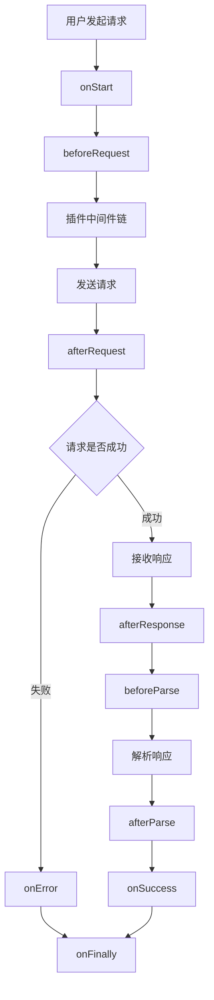

# @okutils/fetch 设计文档

## 1. 项目概述

### 1.1 项目简介

`@okutils/fetch` 是一个基于原生 Fetch API 的现代化 HTTP 客户端库。它提供了类型安全、生命周期钩子、插件系统等高级功能，同时保持轻量和高性能。

项目对标 `axios` 和 `ky` 的设计理念，力求融合两者的优点。`axios` 的易用性和强大的功能集是其广受欢迎的原因，而 `ky` 则以其现代化和简洁著称。`@okutils/fetch` 试图在两者之间找到一个平衡点：提供完整的生命周期和插件生态系统，类似于 `axios`；同时保持 API 的现代化和轻量化，类似于 `ky`。

### 1.2 设计理念

- **现代化优先**：充分利用现代 JavaScript/TypeScript 特性，不为过时的环境做妥协
- **类型安全**：提供完整的 TypeScript 类型定义，实现编译时类型检查
- **插件化架构**：核心功能精简，通过插件扩展功能
- **同构设计**：支持浏览器和 Node.js 环境，为未来的 SSR 支持做准备
- **开发者友好**：直观的 API 设计，详细的错误信息，完善的文档

### 1.3 核心特性

- 基于原生 Fetch API，本项目只官方支持在原生支持 Fetch API （新的浏览器和 Node.js 18+），用户可以自己通过 polyfill 的方式在浏览器中添加 fetch 甚至对这个库已经 hack，以支持旧环境，但是因此出现的 bug 不在官方的修复范畴。
- 完整的生命周期钩子系统
- 灵活的插件机制
- 严格的 TypeScript 类型支持
- 自动的请求/响应转换
- 统一的错误处理
- 支持请求取消和超时控制
- 实例化和单例模式并存

### 1.4 技术栈

- **开发语言**：TypeScript
- **构建工具**：Rollup + TypeScript Compiler (tsc)
- **包管理**：pnpm
- **工具库**：@okutils/core (radash fork)
- **最低运行环境**：支持原生 Fetch API 的环境

## 2. 核心架构设计

### 2.1 整体架构

`@okutils/fetch` 采用分层架构设计，从底层到顶层依次为：

1. **基础层**：封装原生 Fetch API，提供基本的请求能力
2. **核心层**：实现配置管理、生命周期、错误处理等核心功能
3. **插件层**：通过插件扩展功能，如缓存、重试、进度等
4. **接口层**：对外暴露的 API 接口

### 2.2 模块划分

```
@okutils/fetch/
├── index.ts
├── core/              # 核心功能
│   ├── request.ts     # 请求处理
│   ├── response.ts    # 响应处理
│   ├── error.ts       # 错误处理
│   ├── config.ts      # 配置管理
|   ├── index.ts
│   └── hooks.ts       # 生命周期钩子
├── instance/          # 实例管理
│   ├── create.ts      # 创建实例
|   ├── index.ts
│   └── default.ts     # 默认实例
├── types/             # 类型定义
│   ├── config.ts      # 配置类型
│   ├── hooks.ts       # 钩子类型
|   ├── index.ts
│   └── plugin.ts      # 插件类型
└── utils/             # 工具函数
    ├── headers.ts     # Headers 处理
    ├── index.ts
    └── url.ts         # URL 处理
```

### 2.3 数据流

请求的完整生命周期数据流如下：

1. 用户发起请求 → 2. 触发 `onStart` 钩子 → 3. 执行 `beforeRequest` 钩子 → 4. 插件中间件处理 → 5. 发送实际请求 → 6. 触发 `afterRequest` 钩子 → 7. 接收响应 → 8. 触发 `afterResponse` 钩子 → 9. 解析响应 → 10. 触发 `beforeParse` 和 `afterParse` 钩子 → 11. 成功则触发 `onSuccess`，失败则触发 `onError` → 12. 最终触发 `onFinally`

## 3. API 规范

### 3.1 实例创建

```typescript
import { createFetch } from "@okutils/fetch";

// 创建自定义实例
const customFetch = createFetch({
  baseURL: "https://api.example.com",
  timeout: 30000,
  headers: {
    "Content-Type": "application/json"
  }
});

// 使用默认实例
import fetch from "@okutils/fetch";
```

### 3.2 请求方法

#### 3.2.1 核心请求方法

```typescript
interface IFetchInstance {
  request<T = any>(url: string, options?: IRequestOptions): Promise<T>;
  request<T = any>(options: IRequestOptions & { url: string }): Promise<T>;
}
```

#### 3.2.2 便捷方法

```typescript
interface IFetchInstance {
  get<T = any>(url: string, options?: IRequestOptions): Promise<T>;
  post<T = any>(url: string, body?: any, options?: IRequestOptions): Promise<T>;
  put<T = any>(url: string, body?: any, options?: IRequestOptions): Promise<T>;
  patch<T = any>(
    url: string,
    body?: any,
    options?: IRequestOptions
  ): Promise<T>;
  delete<T = any>(url: string, options?: IRequestOptions): Promise<T>;
  head<T = any>(url: string, options?: IRequestOptions): Promise<T>;
  options<T = any>(url: string, options?: IRequestOptions): Promise<T>;
}
```

### 3.3 请求配置

```typescript
interface IRequestOptions {
  // 基础配置
  method?: THttpMethod;
  headers?: HeadersInit | Record<string, string | undefined>;
  body?: any;

  // URL 相关
  baseURL?: string;
  params?: Record<string, any>; // Query 参数

  // 超时和取消
  timeout?: number;
  signal?: AbortSignal;

  // 响应处理
  responseType?: TResponseType; // 'json' | 'text' | 'blob' | 'arrayBuffer' | 'formData'
  validateStatus?: (status: number) => boolean;

  // 序列化
  serializer?: ISerializer;

  // CSRF
  csrf?: ICSRFConfig | boolean;

  // 钩子
  hooks?: Partial<ICoreHooks>;

  // 插件
  plugins?: IPluginConfig[];

  // 其他 Fetch 选项
  mode?: RequestMode;
  credentials?: RequestCredentials;
  cache?: RequestCache;
  redirect?: RequestRedirect;
  referrer?: string;
  referrerPolicy?: ReferrerPolicy;
  integrity?: string;
  keepalive?: boolean;
}
```

### 3.4 响应结构

```typescript
interface IFetchResponse<T = any> {
  data: T;
  status: number;
  statusText: string;
  headers: Headers;
  config: IRequestOptions;
  request: Request;
}
```

## 4. 插件系统设计

### 4.1 插件接口定义

```typescript
interface IPlugin<TOptions = any> {
  name: string;
  version: string;
  create: (options?: TOptions) => IPluginInstance;
}

interface IPluginInstance {
  middleware: TMiddleware;
  hooks?: Partial<ICoreHooks> & Record<string, any>;
}

interface IRequestContext {
  request: Request;
  options: IRequestOptions;
  url: URL;
  startTime: number;
  abortController: AbortController;
  // 附加元数据，插件可以在此存储状态
  meta: Record<string, any>;
}

type TMiddleware = (
  context: IRequestContext,
  next: () => Promise<Response>
) => Promise<Response>;
```

### 4.2 插件注册机制

插件通过显式导入并在配置中注册：

```typescript
import { createFetch } from "@okutils/fetch";
import cachePlugin from "@okutils/fetch-plugin-cache";
import retryPlugin from "@okutils/fetch-plugin-retry";

const fetch = createFetch({
  plugins: [
    cachePlugin({
      maxAge: 60000,
      maxSize: 100
    }),
    retryPlugin({
      maxRetries: 3,
      retryDelay: 1000
    })
  ]
});
```

#### 4.2.1 插件包标准导出实例

```typescript
// @okutils/fetch-plugin-cache/index.ts
const cachePlugin: IPlugin<ICachePluginOptions> = {
  name: "@okutils/fetch-plugin-cache",
  version: "1.0.0",
  create: (options?: ICachePluginOptions) => ({
    middleware: async (context, next) => {
      // 缓存逻辑
      return next();
    },
    hooks: {
      // 插件特定钩子
    }
  })
};

// 导出一个工厂函数，返回插件实例
export default (options?: ICachePluginOptions): IPluginInstance => {
  return cachePlugin.create(options);
};
```

### 4.3 插件配置扩展

```typescript
// 直接使用 IPluginInstance
interface IRequestOptions {
  // ... 其他配置
  plugins?: IPluginInstance[];
}
```

### 4.4 官方插件列表

#### 4.4.1 缓存插件 (@okutils/fetch-plugin-cache)

提供请求缓存功能，支持内存缓存和持久化缓存：

```typescript
interface ICachePluginOptions {
  maxAge?: number; // 缓存有效期
  maxSize?: number; // 最大缓存数
  exclude?: RegExp[]; // 排除的 URL 模式
  keyGenerator?: (options: IRequestOptions) => string;
  storage?: "memory" | "localStorage" | "sessionStorage";
}
```

#### 4.4.2 去重插件 (@okutils/fetch-plugin-dedup)

提供请求去重和节流功能：

```typescript
interface IDedupPluginOptions {
  dedupingInterval?: number; // 去重时间窗口
  throttleInterval?: number; // 节流间隔
  keyGenerator?: (options: IRequestOptions) => string;
}
```

#### 4.4.3 重试插件 (@okutils/fetch-plugin-retry)

提供请求重试功能：

```typescript
interface IRetryPluginOptions {
  maxRetries?: number; // 最大重试次数
  retryDelay?: number | ((attempt: number) => number); // 重试延迟
  retryCondition?: (error: Error) => boolean; // 重试条件
  exponentialBackoff?: boolean; // 指数退避
  hooks?: {
    beforeRetry?: (error: Error, retryCount: number) => void;
  };
}
```

#### 4.4.4 进度插件 (@okutils/fetch-plugin-progress)

提供上传和下载进度监控：

```typescript
interface IProgressPluginOptions {
  onUploadProgress?: (progress: IProgressEvent) => void;
  onDownloadProgress?: (progress: IProgressEvent) => void;
}

interface IProgressEvent {
  loaded: number;
  total?: number;
  percentage?: number;
  rate?: number; // 速率 (bytes/sec)
  estimated?: number; // 预计剩余时间 (ms)
}
```

#### 4.4.5 并发控制插件 (@okutils/fetch-plugin-concurrent)

控制并发请求数量：

```typescript
interface IConcurrentPluginOptions {
  maxConcurrent?: number; // 最大并发数
  queue?: "fifo" | "lifo"; // 队列策略
  onQueueUpdate?: (size: number) => void;
}
```

## 5. 类型系统设计

### 5.1 核心类型定义

```typescript
// HTTP 方法类型
type THttpMethod =
  | "GET"
  | "POST"
  | "PUT"
  | "PATCH"
  | "DELETE"
  | "HEAD"
  | "OPTIONS";

// 响应类型
type TResponseType =
  | "json"
  | "text"
  | "blob"
  | "arrayBuffer"
  | "formData"
  | "stream";

// 序列化器接口
interface ISerializer {
  stringify: (data: any) => string;
  parse: (text: string) => any;
  contentType: string;
}

// CSRF 配置
interface ICSRFConfig {
  auto?: boolean; // 自动从 cookie 读取
  tokenKey?: string; // Header key
  cookieKey?: string; // Cookie key
  token?: string; // 手动设置的 token
}
```

### 5.2 生命周期钩子类型

```typescript
interface ICoreHooks {
  // 请求开始时
  onStart?: (options: IRequestOptions) => void | Promise<void>;

  // 请求前
  beforeRequest?: (
    options: IRequestOptions
  ) => IRequestOptions | Promise<IRequestOptions>;

  // 请求发送后，响应前
  afterRequest?: (request: Request) => void | Promise<void>;

  // 响应接收后
  afterResponse?: (
    response: Response,
    request: Request
  ) => Response | Promise<Response>;

  // 响应解析前
  beforeParse?: (response: Response) => Response | Promise<Response>;

  // 响应解析后
  afterParse?: (data: any, response: Response) => any | Promise<any>;

  // 请求成功时
  onSuccess?: (data: any, response: Response) => void | Promise<void>;

  // 错误发生时
  onError?: (error: FetchError) => void | Promise<void>;

  // 请求完成（无论成功失败）
  onFinally?: () => void | Promise<void>;
}
```

### 5.3 错误类型定义

```typescript
// 基础错误类
class FetchError extends Error {
  name: string = "FetchError";
  request: Request;
  response?: Response;
  options: IRequestOptions;

  constructor(
    message: string,
    request: Request,
    response?: Response,
    options?: IRequestOptions
  );
}

// HTTP 错误
class HTTPError extends FetchError {
  name: string = "HTTPError";
  response: Response;
  status: number;
  statusText: string;
}

// 超时错误
class TimeoutError extends FetchError {
  name: string = "TimeoutError";
  timeout: number;
}

// 网络错误
class NetworkError extends FetchError {
  name: string = "NetworkError";
  originalError?: Error;
}

// 解析错误
class ParseError extends FetchError {
  name: string = "ParseError";
  responseText?: string;
}
```

### 5.4 泛型约束

```typescript
// URL 参数类型安全
interface ITypedRequestOptions<
  TParams extends Record<string, any> = Record<string, any>,
  TBody = any,
  TResponse = any
> extends IRequestOptions {
  params?: TParams;
  body?: TBody;
}

// 使用示例
interface IUserParams {
  id: number;
  include?: string[];
}

interface IUser {
  id: number;
  name: string;
  email: string;
}

const user = await fetch.get<IUser>("/users/:id", {
  params: { id: 1, include: ["posts"] } as IUserParams
});
```

## 6. 错误处理机制

### 6.1 错误分类与处理

系统将错误分为四大类，每类都有明确的处理策略：

1. **网络错误**：请求无法发送或连接失败
2. **HTTP 错误**：服务器返回 4xx 或 5xx 状态码
3. **超时错误**：请求超过设定的超时时间
4. **解析错误**：响应数据无法按预期格式解析

### 6.2 错误捕获机制

```typescript
try {
  const data = await fetch.get("/api/users");
  // 处理成功响应
} catch (error) {
  if (error instanceof HTTPError) {
    // 处理 HTTP 错误
    console.error(`HTTP ${error.status}: ${error.statusText}`);
  } else if (error instanceof TimeoutError) {
    // 处理超时
    console.error("请求超时");
  } else if (error instanceof NetworkError) {
    // 处理网络错误
    console.error("网络连接失败");
  } else if (error instanceof ParseError) {
    // 处理解析错误
    console.error("响应解析失败");
  }
}
```

### 6.3 全局错误处理

通过配置全局 `onError` 钩子统一处理错误：

```typescript
const fetch = createFetch({
  hooks: {
    onError: async (error) => {
      // 统一错误上报
      await reportError(error);

      // 统一用户提示
      if (error instanceof HTTPError && error.status === 401) {
        // 跳转登录
        redirectToLogin();
      }
    }
  }
});
```

### 6.4 错误恢复策略

系统提供多种错误恢复机制：

- **自动重试**：通过重试插件实现，支持指数退避
- **降级处理**：在 `onError` 钩子中返回降级数据
- **断路器模式**：通过插件实现，避免雪崩效应

## 7. 配置系统

### 7.1 配置优先级

配置采用三级优先级系统，从高到低为：

1. **请求级配置**：单次请求时传入的配置
2. **实例级配置**：创建实例时的配置
3. **默认配置**：系统提供的默认值

### 7.2 配置合并策略

#### 7.2.1 基础配置合并

简单类型配置采用覆盖策略：

```typescript
// 实例配置
const instance = createFetch({
  timeout: 10000,
  responseType: "json"
});

// 请求配置覆盖实例配置
const response = await instance.get("/api", {
  timeout: 5000 // 覆盖实例的 timeout
  // responseType 继承实例配置
});
```

#### 7.2.2 Headers 深度合并

Headers 采用深度合并策略：

```typescript
// 实例配置
const instance = createFetch({
  headers: {
    Authorization: "Bearer token",
    "Content-Type": "application/json"
  }
});

// 请求配置
await instance.post("/api", data, {
  headers: {
    "Content-Type": "multipart/form-data", // 覆盖
    "X-Custom": "value" // 新增
  }
});

// 最终 headers:
// {
//   'Authorization': 'Bearer token',        // 保留
//   'Content-Type': 'multipart/form-data',  // 覆盖
//   'X-Custom': 'value'                     // 新增
// }
```

#### 7.2.3 钩子函数合并

钩子函数采用组合执行策略：

```typescript
// 实例钩子
const instance = createFetch({
  hooks: {
    beforeRequest: async (options) => {
      console.log("实例钩子");
      return options;
    }
  }
});

// 请求钩子
await instance.get("/api", {
  hooks: {
    beforeRequest: async (options) => {
      console.log("请求钩子");
      return options;
    }
  }
});

// 执行顺序：实例钩子 → 请求钩子
```

### 7.3 默认配置

```typescript
const defaultConfig: IRequestOptions = {
  method: "GET",
  timeout: 30000,
  responseType: "json",
  validateStatus: (status) => status >= 200 && status < 300,
  headers: {
    "Content-Type": "application/json"
  },
  csrf: {
    auto: false,
    tokenKey: "X-CSRF-Token",
    cookieKey: "csrf_token"
  }
};
```

## 8. 生命周期详解

### 8.1 完整生命周期流程



### 8.2 钩子执行时机与作用

#### 8.2.1 onStart

- **执行时机**：请求开始时，所有处理之前
- **作用**：初始化操作，如显示加载状态
- **特点**：只能读取配置，不能修改

#### 8.2.2 beforeRequest

- **执行时机**：请求发送前
- **作用**：修改请求配置，如添加认证信息、序列化数据
- **特点**：可以修改并返回新的配置

#### 8.2.3 afterRequest

- **执行时机**：请求已发送，等待响应时
- **作用**：记录请求日志、性能监控
- **特点**：异步执行，不阻塞响应

#### 8.2.4 afterResponse

- **执行时机**：收到响应后，解析前
- **作用**：响应预处理，如统一错误码处理
- **特点**：可以修改响应对象

#### 8.2.5 beforeParse 和 afterParse

- **执行时机**：解析响应数据前后
- **作用**：自定义解析逻辑、数据转换
- **特点**：支持不同响应类型的处理

#### 8.2.6 onSuccess 和 onError

- **执行时机**：请求成功或失败时
- **作用**：业务逻辑处理、错误恢复
- **特点**：互斥执行

#### 8.2.7 onFinally

- **执行时机**：请求结束时，无论成功失败
- **作用**：清理操作，如隐藏加载状态
- **特点**：总是最后执行

### 8.3 钩子的异步处理

所有钩子都支持异步操作：

```typescript
{
  beforeRequest: async (options) => {
    // 异步获取 token
    const token = await getAuthToken();
    return {
      ...options,
      headers: {
        ...options.headers,
        Authorization: `Bearer ${token}`
      }
    };
  };
}
```

## 9. 实现路线图

### 9.1 第一阶段：核心功能

- [x] 基础请求功能封装
- [x] 实例创建与管理
- [x] 配置系统实现
- [x] 生命周期钩子
- [x] 错误处理系统
- [x] TypeScript 类型定义
- [x] 自动序列化与解析
- [x] 请求取消与超时

### 9.2 第二阶段：插件系统

- [ ] 插件接口定义
- [ ] 插件注册机制
- [ ] 中间件系统
- [ ] 官方插件：缓存
- [ ] 官方插件：去重
- [ ] 官方插件：重试
- [ ] 官方插件：进度

### 9.3 第三阶段：高级功能

- [ ] 官方插件：并发控制
- [ ] 流式响应支持
- [ ] WebSocket 集成
- [ ] GraphQL 支持插件
- [ ] 请求模拟与测试工具

### 9.4 第四阶段：生态建设

- [ ] 完善的文档网站
- [ ] 交互式 Playground
- [ ] 迁移工具（从 axios/ky）
- [ ] 社区插件模板
- [ ] 性能基准测试

## 10. 使用示例

### 10.1 基础使用

```typescript
import fetch from "@okutils/fetch";

// GET 请求
const users = await fetch.get("/api/users", {
  params: { page: 1, limit: 10 }
});

// POST 请求
const newUser = await fetch.post("/api/users", {
  name: "Alice",
  email: "alice@example.com"
});

// 使用 request 方法
const data = await fetch.request({
  url: "/api/users",
  method: "GET",
  params: { id: 1 }
});
```

### 10.2 创建实例

```typescript
import { createFetch } from "@okutils/fetch";

const apiClient = createFetch({
  baseURL: "https://api.example.com",
  timeout: 10000,
  headers: {
    "API-Key": "your-api-key"
  },
  hooks: {
    beforeRequest: async (options) => {
      const token = await getAuthToken();
      options.headers["Authorization"] = `Bearer ${token}`;
      return options;
    },
    onError: (error) => {
      if (error instanceof HTTPError && error.status === 401) {
        // 刷新 token 或跳转登录
        refreshToken();
      }
    }
  }
});

// 使用自定义实例
const userData = await apiClient.get("/user/profile");
```

### 10.3 使用插件

```typescript
import { createFetch } from "@okutils/fetch";
import cachePlugin from "@okutils/fetch-plugin-cache";
import retryPlugin from "@okutils/fetch-plugin-retry";
import dedupPlugin from "@okutils/fetch-plugin-dedup";

const fetch = createFetch({
  plugins: [
    cachePlugin({
      maxAge: 5 * 60 * 1000, // 5 分钟
      storage: "memory"
    }),
    retryPlugin({
      maxRetries: 3,
      exponentialBackoff: true,
      retryDelay: 1000,
      retryCondition: (error) => {
        // 只在网络错误或 5xx 错误时重试
        return (
          error instanceof NetworkError ||
          (error instanceof HTTPError && error.status >= 500)
        );
      },
      hooks: {
        beforeRetry: (error, retryCount) => {
          console.log(`第 ${retryCount} 次重试，错误：${error.message}`);
          // 可以在这里更新 UI，显示重试状态
          updateRetryStatus(retryCount);
        }
      }
    }),
    dedupPlugin({
      dedupingInterval: 1000 // 1 秒内去重
    })
  ]
});

// 也可以在单个请求中添加插件
import progressPlugin from "@okutils/fetch-plugin-progress";

await fetch.get("/api/large-file", {
  plugins: [
    progressPlugin({
      onDownloadProgress: (progress) => {
        console.log(`进度: ${progress.percentage}%`);
      }
    })
  ]
});
```

### 10.4 错误处理

```typescript
import fetch, { HTTPError, TimeoutError } from "@okutils/fetch";

async function fetchUserData(userId: number) {
  try {
    const user = await fetch.get(`/api/users/${userId}`, {
      timeout: 5000
    });
    return user;
  } catch (error) {
    if (error instanceof HTTPError) {
      switch (error.status) {
        case 404:
          console.error("用户不存在");
          return null;
        case 403:
          console.error("没有权限");
          throw error;
        default:
          console.error(`服务器错误: ${error.status}`);
          throw error;
      }
    } else if (error instanceof TimeoutError) {
      console.error("请求超时，请检查网络连接");
      // 可以在这里触发重试
      throw error;
    } else {
      console.error("未知错误", error);
      throw error;
    }
  }
}
```

### 10.5 类型安全的请求

```typescript
interface IUser {
  id: number;
  name: string;
  email: string;
}

interface ICreateUserDto {
  name: string;
  email: string;
  password: string;
}

interface IPaginationParams {
  page: number;
  limit: number;
  sort?: "asc" | "desc";
}

// 带类型的 GET 请求
const users = await fetch.get<IUser[]>("/api/users", {
  params: {
    page: 1,
    limit: 10,
    sort: "asc"
  } as IPaginationParams
});

// 带类型的 POST 请求
const newUser = await fetch.post<IUser, ICreateUserDto>("/api/users", {
  name: "Bob",
  email: "bob@example.com",
  password: "secure123"
});

// TypeScript 会自动推导 users 的类型为 IUser[]
// TypeScript 会自动推导 newUser 的类型为 IUser
```

### 10.6 请求取消

```typescript
// 使用 AbortController
const controller = new AbortController();

// 发起请求
const promise = fetch.get("/api/large-data", {
  signal: controller.signal
});

// 取消请求
setTimeout(() => {
  controller.abort();
}, 1000);

try {
  const data = await promise;
} catch (error) {
  if (error.name === "AbortError") {
    console.log("请求已取消");
  }
}
```

### 10.7 进度监控

```typescript
import progressPlugin from "@okutils/fetch-plugin-progress";

const fetch = createFetch({
  plugins: [
    progressPlugin({
      onDownloadProgress: (progress) => {
        console.log(`下载进度: ${progress.percentage}%`);
        console.log(`速率: ${progress.rate} bytes/sec`);
        console.log(`预计剩余: ${progress.estimated}ms`);
      },
      onUploadProgress: (progress) => {
        console.log(`上传进度: ${progress.percentage}%`);
      }
    })
  ]
});

// 上传大文件
const formData = new FormData();
formData.append("file", largeFile);

await fetch.post("/api/upload", formData);
```

## 11. 附录

### 11.1 命名规范

本项目遵循统一的命名规范，详见：[https://narukeu.github.io/articles/frontend-naming-conventions.html](https://narukeu.github.io/articles/frontend-naming-conventions.html)

### 11.2 兼容性说明

- 浏览器：支持所有现代浏览器（Chrome 85+, Firefox 80+, Safari 14+, Edge 85+）
- Node.js：18.0.0+
- TypeScript：5.0+

### 11.3 许可证

MIT License
