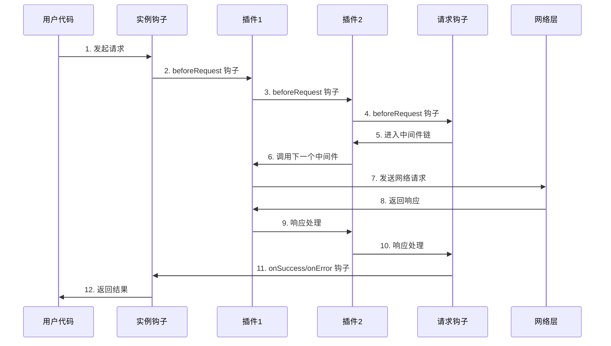
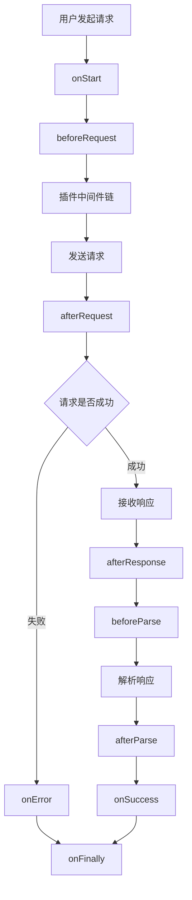

# @okutils/fetch 设计文档

## 1. 项目概述

### 1.1 项目简介

`@okutils/fetch` 是一个基于原生 Fetch API 的现代化 HTTP 客户端库。它提供了类型安全、生命周期钩子、插件系统等高级功能，同时保持轻量和高性能。

项目对标 `axios` 和 `ky` 的设计理念，力求融合两者的优点。`axios` 的易用性和强大的功能集是其广受欢迎的原因，而 `ky` 则以其现代化和简洁著称。`@okutils/fetch` 试图在两者之间找到一个平衡点：提供完整的生命周期和插件生态系统，类似于 `axios`；同时保持 API 的现代化和轻量化，类似于 `ky`。

### 1.2 Monorepo 架构设计

本项目采用基于 pnpm workspace 的 monorepo 设计，提供统一的开发、构建、发布和维护流程。

#### 1.2.1 包结构设计

```
@okutils/fetch-monorepo/                 # Workspace Root
├── packages/
│   ├── core/                           # @okutils/fetch-core (核心包)
│   └── plugins/                        # 插件目录 (非包，仅用于组织)
│       ├── cache/                      # @okutils/fetch-plugin-cache
│       ├── retry/                      # @okutils/fetch-plugin-retry
│       ├── dedup/                      # @okutils/fetch-plugin-dedup
│       ├── progress/                   # @okutils/fetch-plugin-progress
│       └── concurrent/                 # @okutils/fetch-plugin-concurrent
├── shared/                             # 共享配置目录 (非包)
│   ├── tsconfig.base.json              # TypeScript 基础配置
│   └── rollup.config.base.mjs          # Rollup 构建配置
├── package.json                        # Workspace root configuration
├── pnpm-workspace.yaml                 # pnpm workspace configuration
└── shared configs...                   # 其他共享配置文件
```

#### 1.2.2 包依赖关系

- **@okutils/fetch-monorepo**: Workspace root，不发布，仅用于开发和构建协调
- **@okutils/fetch-core**: 核心功能包，提供主要的 API 和功能
- **shared/**: 共享配置目录，包含 TypeScript、Rollup 等构建配置，通过文件引用的方式被各包使用
- **@okutils/fetch-plugin-\***: 各种插件包，依赖核心包并扩展功能

### 1.3 设计理念

- **现代化优先**：充分利用现代 JavaScript/TypeScript 特性，不为过时的环境做妥协
- **类型安全优先**：启用最严格的 TypeScript 配置，包括 `exactOptionalPropertyTypes`，确保编译时发现潜在问题
- **插件化架构**：核心功能精简，通过插件扩展功能
- **同构设计**：支持浏览器和 Node.js 环境，为未来的 SSR 支持做准备
- **开发者友好**：直观的 API 设计，详细的错误信息，完善的文档
- **Monorepo 优势**：统一开发体验，原子化版本控制，共享配置和工具链

### 1.4 核心特性

- 基于原生 Fetch API，本项目只官方支持在原生支持 Fetch API （新的浏览器和 Node.js 18+），用户可以自己通过 polyfill 的方式在浏览器中添加 fetch 甚至对这个库已经 hack，以支持旧环境，但是因此出现的 bug 不在官方的修复范畴。
- 完整的生命周期钩子系统
- 灵活的插件机制
- **严格的 TypeScript 类型安全**：启用 `exactOptionalPropertyTypes` 等严格配置，提供编译时类型保障
- 自动的请求/响应转换
- 统一的错误处理
- 支持请求取消和超时控制
- 实例化和单例模式并存

### 1.5 技术栈

- **开发语言**：TypeScript
- **包管理工具**：pnpm (支持 workspace)
- **构建工具**：Rollup + 原生 TypeScript 编译器
- **代码规范**：ESLint + Prettier
- **工具库**：radash（以后会使用 `@okutils/core`，这个是和 radash 的 fork 但是暂未发布，等发布之后替换）
- **最低运行环境**：支持原生 Fetch API 的环境
- **暂时不考虑测试套件**

## 2. Monorepo 配置与最佳实践

### 2.1 Workspace Root 配置

#### package.json

```json
{
  "name": "@okutils/fetch-monorepo",
  "version": "1.0.0",
  "description": "Modern HTTP client library based on native Fetch API with full TypeScript support",
  "type": "module",
  "private": true,
  "exports": {
    "types": "./packages/core/dist/types/index.d.ts",
    "import": "./packages/core/dist/esm/index.mjs",
    "require": "./packages/core/dist/cjs/index.cjs"
  },
  "scripts": {
    "build": "pnpm -r build",
    "build:core": "pnpm --filter @okutils/fetch-core build",
    "build:plugins": "pnpm --filter '@okutils/fetch-plugin-*' build",
    "dev": "pnpm -r --parallel dev",
    "clean": "pnpm -r clean && rm -rf dist",
    "lint": "eslint .",
    "lint:fix": "eslint . --fix",
    "format": "prettier --write .",
    "format:check": "prettier --check .",
    "type-check": "pnpm -r type-check",
    "changeset": "changeset",
    "version": "changeset version",
    "release": "pnpm build && pnpm type-check && changeset publish"
  },
  "keywords": [
    "fetch",
    "http",
    "request",
    "typescript",
    "browser",
    "nodejs",
    "modern",
    "plugins"
  ],
  "author": "OkUtils Team",
  "license": "MIT",
  "packageManager": "pnpm@10.15.0",
  "engines": {
    "node": ">=18.0.0",
    "pnpm": ">=8.0.0"
  },
  "devDependencies": {
    "@changesets/cli": "^2.27.9",
    "@eslint/js": "^9.34.0",
    "@types/node": "^24.3.0",
    "eslint": "^9.34.0",
    "eslint-import-resolver-typescript": "^4.4.4",
    "eslint-plugin-import-x": "^4.16.1",
    "eslint-plugin-prettier": "^5.5.4",
    "eslint-plugin-tsdoc": "^0.4.0",
    "globals": "^16.3.0",
    "prettier": "^3.6.2",
    "rollup": "4.48.1",
    "rollup-plugin-dts": "^6.2.3",
    "typescript": "5.9.2",
    "typescript-eslint": "^8.41.0"
  },
  "dependencies": {
    "radash": "^12.1.1"
  }
}
```

#### pnpm-workspace.yaml

```yaml
packages:
  - "packages/*"
  - "packages/plugins/*"
```

#### .gitignore

```
# Windows thumbnail cache files

Thumbs.db
Thumbs.db:encryptable
ehthumbs.db
ehthumbs_vista.db

# Dump file

\*.stackdump

# Folder config file

[Dd]esktop.ini

# Recycle Bin used on file shares

$RECYCLE.BIN/

# Windows Installer files

_.cab
_.msi
_.msix
_.msm
\*.msp

# Windows shortcuts

\*.lnk

# General

.DS_Store
\_\_MACOSX/
.AppleDouble
.LSOverride
Icon[
]

# Thumbnails

.\_\*

# Files that might appear in the root of a volume

.DocumentRevisions-V100
.fseventsd
.Spotlight-V100
.TemporaryItems
.Trashes
.VolumeIcon.icns
.com.apple.timemachine.donotpresent

# Directories potentially created on remote AFP share

.AppleDB
.AppleDesktop
Network Trash Folder
Temporary Items
.apdisk

\*~

# temporary files which can be created if a process still has a handle open of a deleted file

.fuse_hidden\*

# Metadata left by Dolphin file manager, which comes with KDE Plasma

.directory

# Linux trash folder which might appear on any partition or disk

.Trash-\*

# .nfs files are created when an open file is removed but is still being accessed

.nfs\*

# Log files created by default by the nohup command

nohup.out

.vscode/_
!.vscode/settings.json
!.vscode/tasks.json
!.vscode/launch.json
!.vscode/extensions.json
!.vscode/_.code-snippets
!\*.code-workspace

# Built Visual Studio Code Extensions

\*.vsix

# Covers JetBrains IDEs: IntelliJ, GoLand, RubyMine, PhpStorm, AppCode, PyCharm, CLion, Android Studio, WebStorm and Rider

# Reference: https://intellij-support.jetbrains.com/hc/en-us/articles/206544839

# User-specific stuff

.idea/**/workspace.xml
.idea/**/tasks.xml
.idea/**/usage.statistics.xml
.idea/**/dictionaries
.idea/\*\*/shelf

# AWS User-specific

.idea/\*\*/aws.xml

# Generated files

.idea/\*\*/contentModel.xml

# Sensitive or high-churn files

.idea/**/dataSources/
.idea/**/dataSources.ids
.idea/**/dataSources.local.xml
.idea/**/sqlDataSources.xml
.idea/**/dynamic.xml
.idea/**/uiDesigner.xml
.idea/\*\*/dbnavigator.xml

# Gradle

.idea/**/gradle.xml
.idea/**/libraries

# Gradle and Maven with auto-import

# When using Gradle or Maven with auto-import, you should exclude module files,

# since they will be recreated, and may cause churn. Uncomment if using

# auto-import.

# .idea/artifacts

# .idea/compiler.xml

# .idea/jarRepositories.xml

# .idea/modules.xml

# .idea/\*.iml

# .idea/modules

# \*.iml

# \*.ipr

# CMake

cmake-build-\*/

# Mongo Explorer plugin

.idea/\*\*/mongoSettings.xml

# File-based project format

\*.iws

# IntelliJ

out/

# mpeltonen/sbt-idea plugin

.idea_modules/

# JIRA plugin

atlassian-ide-plugin.xml

# Cursive Clojure plugin

.idea/replstate.xml

# SonarLint plugin

.idea/sonarlint/
.idea/sonarlint.xml # see https://community.sonarsource.com/t/is-the-file-idea-idea-idea-sonarlint-xml-intended-to-be-under-source-control/121119

# Crashlytics plugin (for Android Studio and IntelliJ)

com_crashlytics_export_strings.xml
crashlytics.properties
crashlytics-build.properties
fabric.properties

# Editor-based HTTP Client

.idea/httpRequests
http-client.private.env.json

# Android studio 3.1+ serialized cache file

.idea/caches/build_file_checksums.ser

# Apifox Helper cache

.idea/.cache/.Apifox_Helper
.idea/ApifoxUploaderProjectSetting.xml

# Cursor AI

.cursorignore
.cursorindexingignore

# Logs

logs
_.log
npm-debug.log_
yarn-debug.log*
yarn-error.log*
lerna-debug.log\*

# Diagnostic reports (https://nodejs.org/api/report.html)

report.[0-9]_.[0-9]_.[0-9]_.[0-9]_.json

# Runtime data

pids
_.pid
_.seed
\*.pid.lock

# Directory for instrumented libs generated by jscoverage/JSCover

lib-cov

# Coverage directory used by tools like istanbul

coverage
\*.lcov

# nyc test coverage

.nyc_output

# Grunt intermediate storage (https://gruntjs.com/creating-plugins#storing-task-files)

.grunt

# Bower dependency directory (https://bower.io/)

bower_components

# node-waf configuration

.lock-wscript

# Compiled binary addons (https://nodejs.org/api/addons.html)

build/Release

# Dependency directories

node_modules/
jspm_packages/

# Snowpack dependency directory (https://snowpack.dev/)

web_modules/

# TypeScript cache

\*.tsbuildinfo

# Optional npm cache directory

.npm

# Optional eslint cache

.eslintcache

# Optional stylelint cache

.stylelintcache

# Optional REPL history

.node_repl_history

# Output of 'npm pack'

\*.tgz

# Yarn Integrity file

.yarn-integrity

# dotenv environment variable files

.env
.env.\*
!.env.example

# parcel-bundler cache (https://parceljs.org/)

.cache
.parcel-cache

# Next.js build output

.next
out

# Nuxt.js build / generate output

.nuxt
dist
.output

# Gatsby files

.cache/

# Comment in the public line in if your project uses Gatsby and not Next.js

# https://nextjs.org/blog/next-9-1#public-directory-support

# public

# vuepress build output

.vuepress/dist

# vuepress v2.x temp and cache directory

.temp
.cache

# Sveltekit cache directory

.svelte-kit/

# vitepress build output

\*\*/.vitepress/dist

# vitepress cache directory

\*\*/.vitepress/cache

# Docusaurus cache and generated files

.docusaurus

# Serverless directories

.serverless/

# FuseBox cache

.fusebox/

# DynamoDB Local files

.dynamodb/

# Firebase cache directory

.firebase/

# TernJS port file

.tern-port

# Stores VSCode versions used for testing VSCode extensions

.vscode-test

# yarn v3

.pnp._
.yarn/_
!.yarn/patches
!.yarn/plugins
!.yarn/releases
!.yarn/sdks
!.yarn/versions

# Vite logs files

vite.config.js.timestamp-_
vite.config.ts.timestamp-_

```

### 2.2 共享配置文件

#### ESLint 配置 (eslint.config.mjs)

```javascript
import js from "@eslint/js";
import { createTypeScriptImportResolver } from "eslint-import-resolver-typescript";
import * as importX from "eslint-plugin-import-x";
import prettierRecommend from "eslint-plugin-prettier/recommended";
import tsdoc from "eslint-plugin-tsdoc";
import globals from "globals";
import tseslint from "typescript-eslint";

export default tseslint.config(
  js.configs.recommended,
  tseslint.configs.recommended,
  prettierRecommend,
  importX.flatConfigs.recommended,
  importX.flatConfigs.typescript,
  {
    files: ["packages/*/src/**/*.{js,mjs,cjs,ts,mts,cts}"],
    languageOptions: {
      ecmaVersion: 2023,
      globals: { ...globals.browser, ...globals.node },
      parser: tseslint.parser,
      parserOptions: {
        project: "./tsconfig.json",
        tsconfigRootDir: import.meta.dirname,
        projectService: true
      }
    },
    plugins: {
      tsdoc,
      "@typescript-eslint": tseslint.plugin,
      "import-x": importX
    },
    rules: {
      "tsdoc/syntax": "warn",
      "prefer-const": "warn",
      "@typescript-eslint/no-unused-vars": [
        "warn",
        {
          argsIgnorePattern: "^_",
          varsIgnorePattern: "^_"
        }
      ],
      "@typescript-eslint/no-explicit-any": "warn",
      "@typescript-eslint/no-unsafe-assignment": "warn",
      "import-x/order": [
        "warn",
        {
          groups: [
            "builtin",
            "external",
            "internal",
            "unknown",
            "parent",
            "sibling",
            "index",
            "object",
            "type"
          ],
          alphabetize: {
            order: "asc",
            caseInsensitive: false
          }
        }
      ]
    },
    settings: {
      "import/resolver-next": [
        createTypeScriptImportResolver({
          alwaysTryTypes: true,
          extensions: [
            ".js",
            ".mjs",
            ".jsx",
            ".ts",
            ".cjs",
            ".cts",
            ".mts",
            ".tsx",
            ".json"
          ]
        })
      ]
    }
  },
  {
    // Configuration files
    files: ["**/*.config.{js,mjs,ts}", "**/rollup.config.{js,mjs,ts}"],
    rules: {
      "@typescript-eslint/no-unused-vars": "off"
    }
  }
);
```

#### Prettier 配置 (.prettierrc.json)

```json
{
  "$schema": "https://json.schemastore.org/prettierrc",
  "semi": true,
  "tabWidth": 2,
  "singleQuote": false,
  "printWidth": 80,
  "trailingComma": "none"
}
```

#### TypeScript 配置 (tsconfig.json)

```json
{
  "$schema": "https://json.schemastore.org/tsconfig",
  "compilerOptions": {
    // ===========================================
    // 语言和环境配置 (Language and Environment)
    // ===========================================

    /**
     * ECMAScript 目标版本
     * ES2022 提供了更好的现代 JavaScript 特性支持，包括 top-level await
     * 适合 Node.js 18+ 和现代浏览器环境
     */
    "target": "ES2022",

    /**
     * 包含的类型库
     * ES2022: 现代 JavaScript 运行时特性
     * DOM: 浏览器环境 API （用于同构支持）
     * DOM.Iterable: DOM 集合的迭代器支持
     * ES2022.Intl: 国际化 API
     */
    "lib": ["ES2022", "DOM", "DOM.Iterable", "ES2022.Intl"],

    /**
     * 模块检测策略
     * auto: 自动检测模块类型，支持 ESM/CommonJS 混合环境
     */
    "moduleDetection": "auto",

    // ===========================================
    // 模块系统配置 (Modules)
    // ===========================================

    /**
     * 模块系统类型
     * ESNext: 使用最新的 ES 模块语法，适合现代构建工具
     */
    "module": "ESNext",

    /**
     * 模块解析策略
     * bundler: 专为打包工具设计，支持 package.json exports/imports
     * 提供更好的 Rollup/Vite 兼容性
     */
    "moduleResolution": "bundler",

    /**
     * 基础 URL，用于非相对模块名称解析
     */
    "baseUrl": "./",

    /**
     * 解析 JSON 模块
     * 允许导入 .json 文件并获得类型推断
     */
    "resolveJsonModule": true,

    /**
     * 支持 package.json exports 字段
     * 现代包管理器和构建工具的标准
     */
    "resolvePackageJsonExports": true,

    /**
     * 支持 package.json imports 字段
     * 用于包内部模块解析
     */
    "resolvePackageJsonImports": true,

    /**
     * 允许从没有默认导出的模块中导入默认值
     * 提高与 CommonJS 模块的互操作性
     */
    "allowSyntheticDefaultImports": true,

    /**
     * Node.js 类型定义
     * 提供 Node.js 内置模块的类型支持
     */
    "types": ["node"],

    // ===========================================
    // 输出配置 (Emit)
    // ===========================================

    /**
     * 输出目录
     */
    "outDir": "./dist",

    /**
     * 生成声明文件 (.d.ts)
     * 为库的使用者提供类型信息
     */
    "declaration": true,

    /**
     * 生成声明文件的 source map
     * 改善类型错误的调试体验
     */
    "declarationMap": true,

    /**
     * 生成源码映射文件
     * 用于调试时映射到原始 TypeScript 源码
     */
    "sourceMap": true,

    /**
     * 移除注释
     * 减小输出文件体积，生产环境推荐
     */
    "removeComments": true,

    /**
     * 导入辅助函数
     * 从 tslib 导入辅助函数而不是内联，减小输出体积
     */
    "importHelpers": true,

    /**
     * 下级迭代
     * 为旧版本 JavaScript 提供更准确的迭代器支持
     */
    "downlevelIteration": true,

    // ===========================================
    // 互操作约束 (Interop Constraints)
    // ===========================================

    /**
     * ES 模块互操作
     * 改善 ES 模块和 CommonJS 模块之间的互操作性
     * 推荐用于现代项目
     */
    "esModuleInterop": true,

    /**
     * 强制文件名大小写一致性
     * 避免不同操作系统间的文件系统差异问题
     */
    "forceConsistentCasingInFileNames": true,

    /**
     * 隔离模块
     * 确保每个文件可以独立编译，提高构建工具兼容性
     */
    "isolatedModules": true,

    /**
     * 逐字模块语法
     * 确保导入/导出语法的一致性，避免模块系统混淆
     */
    "verbatimModuleSyntax": true,

    // ===========================================
    // 类型检查配置 (Type Checking)
    // ===========================================

    /**
     * 启用所有严格类型检查选项
     * 包括 noImplicitAny、strictNullChecks 等
     */
    "strict": true,

    /**
     * 精确的可选属性类型
     * 区分 undefined 和未定义的属性，提供更准确的类型检查
     */
    "exactOptionalPropertyTypes": true,

    /**
     * 检查函数中的所有代码路径是否都有返回值
     */
    "noImplicitReturns": true,

    /**
     * 检查 switch 语句中是否有 fallthrough 情况
     */
    "noFallthroughCasesInSwitch": true,

    /**
     * 检查未使用的局部变量
     * 帮助发现代码中的潜在问题
     */
    "noUnusedLocals": true,

    /**
     * 检查未使用的参数
     * 提高代码质量
     */
    "noUnusedParameters": true,

    /**
     * 要求 override 关键字
     * 明确标识覆盖的类成员，避免意外覆盖
     */
    "noImplicitOverride": true,

    /**
     * 检查未经检查的索引访问
     * 为索引签名访问添加 undefined 检查，提高类型安全性
     */
    "noUncheckedIndexedAccess": true,

    /**
     * 在 catch 子句中使用 unknown 类型
     * 现代错误处理的最佳实践
     */
    "useUnknownInCatchVariables": true,

    // ===========================================
    // 项目配置 (Projects)
    // ===========================================

    /**
     * 复合项目
     * 启用项目引用功能
     */
    "composite": true,

    // ===========================================
    // 完整性检查 (Completeness)
    // ===========================================

    /**
     * 跳过库文件的类型检查
     * 提高编译性能，推荐用于生产环境
     */
    "skipLibCheck": true,

    // ===========================================
    // 编译器诊断 (Compiler Diagnostics)
    // ===========================================

    /**
     * 不截断错误信息
     * 显示完整的类型错误信息，便于调试
     */
    "noErrorTruncation": true
  }
}
```

### 2.3 共享配置管理

#### 2.3.1 共享配置设计理念

本项目采用**文件引用**而非**包依赖**的方式管理共享配置，这种方案有以下优势：

- **避免循环依赖**：共享配置不再是可发布的包，避免了构建工具依赖共享配置，而共享配置又需要构建工具的问题
- **简化依赖管理**：各个包不需要在 `package.json` 中声明对共享配置的依赖
- **更符合最佳实践**：参考 Rush Stack、Lerna 等成熟 monorepo 项目的做法
- **降低维护成本**：不需要单独管理共享配置的版本和发布

#### 2.3.2 共享 TypeScript 配置

#### shared/tsconfig.base.json

```json
{
  "$schema": "https://json.schemastore.org/tsconfig",
  "compilerOptions": {
    // ===========================================
    // 语言和环境配置 (Language and Environment)
    // ===========================================

    /**
     * ECMAScript 目标版本
     * ES2022 提供了更好的现代 JavaScript 特性支持，包括 top-level await
     * 适合 Node.js 18+ 和现代浏览器环境
     */
    "target": "ES2022",

    /**
     * 包含的类型库
     * ES2022: 现代 JavaScript 运行时特性
     * DOM: 浏览器环境 API （用于同构支持）
     * DOM.Iterable: DOM 集合的迭代器支持
     * ES2022.Intl: 国际化 API
     */
    "lib": ["ES2022", "DOM", "DOM.Iterable", "ES2022.Intl"],

    /**
     * 模块检测策略
     * auto: 自动检测模块类型，支持 ESM/CommonJS 混合环境
     */
    "moduleDetection": "auto",

    // ===========================================
    // 模块系统配置 (Modules)
    // ===========================================

    /**
     * 模块系统类型
     * ESNext: 使用最新的 ES 模块语法，适合现代构建工具
     */
    "module": "ESNext",

    /**
     * 模块解析策略
     * bundler: 专为打包工具设计，支持 package.json exports/imports
     * 提供更好的 Rollup/Vite 兼容性
     */
    "moduleResolution": "bundler",

    /**
     * 基础 URL，用于非相对模块名称解析
     */
    "baseUrl": "./",

    /**
     * 解析 JSON 模块
     * 允许导入 .json 文件并获得类型推断
     */
    "resolveJsonModule": true,

    /**
     * 支持 package.json exports 字段
     * 现代包管理器和构建工具的标准
     */
    "resolvePackageJsonExports": true,

    /**
     * 支持 package.json imports 字段
     * 用于包内部模块解析
     */
    "resolvePackageJsonImports": true,

    /**
     * 允许从没有默认导出的模块中导入默认值
     * 提高与 CommonJS 模块的互操作性
     */
    "allowSyntheticDefaultImports": true,

    /**
     * Node.js 类型定义
     * 提供 Node.js 内置模块的类型支持
     */
    "types": ["node"],

    // ===========================================
    // 输出配置 (Emit)
    // ===========================================

    /**
     * 输出目录
     */
    "outDir": "./dist",

    /**
     * 生成声明文件 (.d.ts)
     * 为库的使用者提供类型信息
     */
    "declaration": true,

    /**
     * 生成声明文件的 source map
     * 改善类型错误的调试体验
     */
    "declarationMap": true,

    /**
     * 生成源码映射文件
     * 用于调试时映射到原始 TypeScript 源码
     */
    "sourceMap": true,

    /**
     * 移除注释
     * 减小输出文件体积，生产环境推荐
     */
    "removeComments": true,

    /**
     * 导入辅助函数
     * 从 tslib 导入辅助函数而不是内联，减小输出体积
     */
    "importHelpers": true,

    /**
     * 下级迭代
     * 为旧版本 JavaScript 提供更准确的迭代器支持
     */
    "downlevelIteration": true,

    // ===========================================
    // 互操作约束 (Interop Constraints)
    // ===========================================

    /**
     * ES 模块互操作
     * 改善 ES 模块和 CommonJS 模块之间的互操作性
     * 推荐用于现代项目
     */
    "esModuleInterop": true,

    /**
     * 强制文件名大小写一致性
     * 避免不同操作系统间的文件系统差异问题
     */
    "forceConsistentCasingInFileNames": true,

    /**
     * 隔离模块
     * 确保每个文件可以独立编译，提高构建工具兼容性
     */
    "isolatedModules": true,

    /**
     * 逐字模块语法
     * 确保导入/导出语法的一致性，避免模块系统混淆
     */
    "verbatimModuleSyntax": true,

    // ===========================================
    // 类型检查配置 (Type Checking)
    // ===========================================

    /**
     * 启用所有严格类型检查选项
     * 包括 noImplicitAny、strictNullChecks 等
     */
    "strict": true,

    /**
     * 精确的可选属性类型
     * 区分 undefined 和未定义的属性，提供更准确的类型检查
     */
    "exactOptionalPropertyTypes": true,

    /**
     * 检查函数中的所有代码路径是否都有返回值
     */
    "noImplicitReturns": true,

    /**
     * 检查 switch 语句中是否有 fallthrough 情况
     */
    "noFallthroughCasesInSwitch": true,

    /**
     * 检查未使用的局部变量
     * 帮助发现代码中的潜在问题
     */
    "noUnusedLocals": true,

    /**
     * 检查未使用的参数
     * 提高代码质量
     */
    "noUnusedParameters": true,

    /**
     * 要求 override 关键字
     * 明确标识覆盖的类成员，避免意外覆盖
     */
    "noImplicitOverride": true,

    /**
     * 检查未经检查的索引访问
     * 为索引签名访问添加 undefined 检查，提高类型安全性
     */
    "noUncheckedIndexedAccess": true,

    /**
     * 在 catch 子句中使用 unknown 类型
     * 现代错误处理的最佳实践
     */
    "useUnknownInCatchVariables": true,

    // ===========================================
    // 项目配置 (Projects)
    // ===========================================

    /**
     * 复合项目
     * 启用项目引用和增量构建
     */
    "composite": true,

    /**
     * 增量编译
     * 提高大型项目的编译性能
     */
    "incremental": true,

    // ===========================================
    // 完整性检查 (Completeness)
    // ===========================================

    /**
     * 跳过库文件的类型检查
     * 提高编译性能，推荐用于生产环境
     */
    "skipLibCheck": true,

    // ===========================================
    // 编译器诊断 (Compiler Diagnostics)
    // ===========================================

    /**
     * 不截断错误信息
     * 显示完整的类型错误信息，便于调试
     */
    "noErrorTruncation": true
  }
}
```

各包通过相对路径引用：

```json
{
  "extends": "../../shared/tsconfig.base.json",
  "compilerOptions": {
    "rootDir": "./src",
    "outDir": "./dist"
  }
}
```

#### 2.3.3 共享 Rollup 配置

#### shared/rollup.config.base.mjs

```javascript
import { readFileSync } from "fs";
import { resolve } from "path";
import typescript from "@rollup/plugin-typescript";
import dts from "rollup-plugin-dts";

/**
 * 创建基础的 Rollup 配置
 * @param {string} packageDir - 包目录路径
 * @param {object} options - 配置选项
 * @returns {Array} Rollup 配置数组
 */
export function createRollupConfig(packageDir, options = {}) {
  const pkg = JSON.parse(
    readFileSync(resolve(packageDir, "package.json"), "utf-8")
  );

  const {
    external = [],
    plugins = [],
    input = "src/index.ts",
    formats = ["esm", "cjs"],
    generateDts = true,
    skipDtsForUtility = false
  } = options;

  // 基础外部依赖
  const baseExternal = [
    ...Object.keys(pkg.dependencies || {}),
    ...Object.keys(pkg.peerDependencies || {}),
    "radash",
    // Node.js 内置模块
    "fs",
    "path",
    "url",
    "util"
  ];

  const configs = [];

  // 主要构建配置
  if (formats.includes("esm") || formats.includes("cjs")) {
    configs.push({
      input: resolve(packageDir, input),
      external: (id) => {
        if (
          baseExternal.some((ext) => id === ext || id.startsWith(ext + "/"))
        ) {
          return true;
        }
        return external.some((ext) => id === ext || id.startsWith(ext + "/"));
      },
      plugins: [
        typescript({
          tsconfig: resolve(packageDir, "tsconfig.json"),
          declaration: false,
          declarationMap: false,
          compilerOptions: {
            declaration: false,
            declarationMap: false,
            composite: false
          }
        }),
        ...plugins
      ],
      output: [
        formats.includes("esm") && {
          file: resolve(packageDir, "dist/esm/index.mjs"),
          format: "es",
          sourcemap: true
        },
        formats.includes("cjs") && {
          file: resolve(packageDir, "dist/cjs/index.cjs"),
          format: "cjs",
          sourcemap: true,
          exports: "named"
        }
      ].filter(Boolean)
    });
  }

  // TypeScript 声明文件配置
  if (generateDts && !skipDtsForUtility) {
    configs.push({
      input: resolve(packageDir, input),
      external: (id) => {
        if (
          baseExternal.some((ext) => id === ext || id.startsWith(ext + "/"))
        ) {
          return true;
        }
        return external.some((ext) => id === ext || id.startsWith(ext + "/"));
      },
      plugins: [dts()],
      output: {
        file: resolve(packageDir, "dist/types/index.d.ts"),
        format: "es"
      }
    });
  }

  return configs;
}
```

各包通过相对路径引用：

```javascript
// packages/core/rollup.config.mjs
import { createRollupConfig } from "../../shared/rollup.config.base.mjs";

export default createRollupConfig(import.meta.dirname);
```

## 3. 核心架构设计

### 3.1 整体架构

`@okutils/fetch-core` 采用分层架构设计，从底层到顶层依次为：

1. **基础层**：封装原生 Fetch API，提供基本的请求能力
2. **核心层**：实现配置管理、生命周期、错误处理等核心功能
3. **插件层**：通过插件扩展功能，如缓存、重试、进度等
4. **接口层**：对外暴露的 API 接口

### 3.2 模块划分

```
packages/
├── core/                               # @okutils/fetch-core
│   ├── src/
│   │   ├── index.ts                   # 主入口文件
│   │   ├── core/                      # 核心功能
│   │   │   ├── request.ts             # 请求处理
│   │   │   ├── response.ts            # 响应处理
│   │   │   ├── error.ts               # 错误处理
│   │   │   ├── config.ts              # 配置管理
│   │   │   ├── index.ts
│   │   │   └── hooks.ts               # 生命周期钩子
│   │   ├── instance/                  # 实例管理
│   │   │   ├── create.ts              # 创建实例
│   │   │   ├── index.ts
│   │   │   └── default.ts             # 默认实例
│   │   ├── types/                     # 类型定义
│   │   │   ├── config.ts              # 配置类型
│   │   │   ├── hooks.ts               # 钩子类型
│   │   │   ├── index.ts
│   │   │   └── plugin.ts              # 插件类型
│   │   └── utils/                     # 工具函数
│   │       ├── headers.ts             # Headers 处理
│   │       ├── index.ts
│   │       └── url.ts                 # URL 处理
│   ├── package.json
│   ├── tsconfig.json
│   └── rollup.config.mjs
└── plugins/                           # 插件目录 (非包)
    ├── cache/                         # @okutils/fetch-plugin-cache
    ├── retry/                         # @okutils/fetch-plugin-retry
    ├── dedup/                         # @okutils/fetch-plugin-dedup
    ├── progress/                      # @okutils/fetch-plugin-progress
    └── concurrent/                    # @okutils/fetch-plugin-concurrent
```

### 3.3 数据流

请求的完整生命周期数据流如下：

1. 用户发起请求 → 2. 触发 `onStart` 钩子 → 3. 执行 `beforeRequest` 钩子 → 4. 插件中间件处理 → 5. 发送实际请求 → 6. 触发 `afterRequest` 钩子 → 7. 接收响应 → 8. 触发 `afterResponse` 钩子 → 9. 解析响应 → 10. 触发 `beforeParse` 和 `afterParse` 钩子 → 11. 成功则触发 `onSuccess`，失败则触发 `onError` → 12. 最终触发 `onFinally`

## 4. API 规范

### 4.1 实例创建

```typescript
import { createFetch } from "@okutils/fetch-core";

// 创建自定义实例
const customFetch = createFetch({
  baseURL: "https://api.example.com",
  timeout: 30000,
  headers: {
    "Content-Type": "application/json"
  }
});

// 使用默认实例
import fetch from "@okutils/fetch-core";
```

### 4.2 请求方法

### 4.2 便捷方法

```typescript
interface IFetchInstance {
  request<T = any>(url: string, options?: IRequestOptions): Promise<T>;
  request<T = any>(options: IRequestOptions & { url: string }): Promise<T>;
}
```

### 4.3 请求配置

```typescript
interface IFetchInstance {
  get<T = any>(url: string, options?: IRequestOptions): Promise<T>;
  post<T = any>(url: string, body?: any, options?: IRequestOptions): Promise<T>;
  put<T = any>(url: string, body?: any, options?: IRequestOptions): Promise<T>;
  patch<T = any>(
    url: string,
    body?: any,
    options?: IRequestOptions
  ): Promise<T>;
  delete<T = any>(url: string, options?: IRequestOptions): Promise<T>;
  head<T = any>(url: string, options?: IRequestOptions): Promise<T>;
  options<T = any>(url: string, options?: IRequestOptions): Promise<T>;
}
```

### 4.4 响应结构

```typescript
interface IRequestOptions {
  // 基础配置
  method?: THttpMethod;
  headers?: HeadersInit | Record<string, string | undefined>;
  body?: any;

  // URL 相关
  baseURL?: string;
  params?: Record<string, any>; // Query 参数

  // 超时和取消
  timeout?: number;
  signal?: AbortSignal;

  // 超时和取消配置说明：
  // 1. timeout：超时时间（毫秒），内部会创建一个 AbortSignal
  // 2. signal：外部传入的取消信号，与 timeout 组合使用
  // 3. 优先级规则：
  //    - 如果同时提供 timeout 和 signal，会创建一个组合信号
  //    - 任一信号触发都会取消请求
  //    - timeout 触发抛出 TimeoutError
  //    - 外部 signal 触发抛出 AbortError

  // 响应处理
  responseType?: TResponseType; // 'json' | 'text' | 'blob' | 'arrayBuffer' | 'formData'
  validateStatus?: (status: number) => boolean;

  // 序列化
  serializer?: ISerializer;

  // CSRF
  csrf?: ICSRFConfig | boolean;

  // 钩子
  hooks?: Partial<ICoreHooks>;

  // 插件
  plugins?: IPluginConfig[];

  // 其他 Fetch 选项
  mode?: RequestMode;
  credentials?: RequestCredentials;
  cache?: RequestCache;
  redirect?: RequestRedirect;
  referrer?: string;
  referrerPolicy?: ReferrerPolicy;
  integrity?: string;
  keepalive?: boolean;
}
```

## 5. 插件系统设计

### 5.1 插件系统执行模型

`@okutils/fetch-core` 采用基于中间件的插件架构，结合生命周期钩子提供强大的扩展能力。

```typescript
interface IFetchResponse<T = any> {
  data: T;
  status: number;
  statusText: string;
  headers: Headers;
  config: IRequestOptions;
  request: Request;
}
```

#### 5.1.1 双重执行机制

插件通过两种机制影响请求处理：

1. **中间件机制**：包装整个请求/响应流程，支持请求拦截、响应处理、错误恢复等
2. **钩子机制**：在特定生命周期节点执行，用于日志记录、状态通知、数据转换等

#### 5.1.2 执行时序图



#### 5.1.3 冲突避免原则

- **职责分离**：中间件处理请求流程，钩子处理副作用
- **数据不变性**：钩子不应修改已确定的响应数据
- **错误隔离**：单个插件的错误不应影响其他插件

### 5.2 插件接口定义

```typescript
interface IPlugin<TOptions = any> {
  name: string;
  version: string;
  create: (options?: TOptions) => IPluginInstance;
}

interface IPluginInstance {
  middleware: TMiddleware;
  hooks?: Partial<ICoreHooks> & Record<string, any>;
}

interface IRequestContext {
  request: Request;
  options: IRequestOptions;
  url: URL;
  startTime: number;
  abortController: AbortController;
  // 附加元数据，插件可以在此存储状态
  meta: Record<string, any>;
}

type TMiddleware = (
  context: IRequestContext,
  next: () => Promise<Response>
) => Promise<Response>;
```

#### 5.2.1 插件钩子优先级

当插件定义了与用户相同的生命周期钩子时，执行顺序为：

```typescript
interface IPluginInstance {
  middleware: TMiddleware;
  hooks?: Partial<ICoreHooks> & Record<string, any>;
  // 新增：钩子优先级配置
  hookPriority?: number; // 默认值：0，数值越小优先级越高
}
```

**钩子执行顺序（以 beforeRequest 为例）**：

1. 实例级钩子（用户在 createFetch 时配置）
2. 插件钩子（按 hookPriority 排序，相同优先级按插件注册顺序）
3. 请求级钩子（单次请求时配置）

```typescript
// 示例：实际执行顺序
instanceConfig.hooks.beforeRequest()
  → pluginA.hooks.beforeRequest() // priority: -1
  → pluginB.hooks.beforeRequest() // priority: 0
  → requestConfig.hooks.beforeRequest()
```

### 5.3 插件注册机制

插件通过显式导入并在配置中注册：

```typescript
import { createFetch } from "@okutils/fetch-core";
import cachePlugin from "@okutils/fetch-plugin-cache";
import retryPlugin from "@okutils/fetch-plugin-retry";

const fetch = createFetch({
  plugins: [
    cachePlugin({
      maxAge: 60000,
      maxSize: 100
    }),
    retryPlugin({
      maxRetries: 3,
      retryDelay: 1000
    })
  ]
});
```

#### 5.3.1 插件包标准导出实例

```typescript
// @okutils/fetch-plugin-cache/index.ts
const cachePlugin: IPlugin<ICachePluginOptions> = {
  name: "@okutils/fetch-plugin-cache",
  version: "1.0.0",
  create: (options?: ICachePluginOptions) => ({
    middleware: async (context, next) => {
      // 缓存逻辑
      return next();
    },
    hooks: {
      // 插件特定钩子
    }
  })
};

// 导出一个工厂函数，返回插件实例
export default (options?: ICachePluginOptions): IPluginInstance => {
  return cachePlugin.create(options);
};
```

#### 5.3.2 插件执行顺序

插件按照在 `plugins` 数组中的声明顺序执行：

```typescript
const fetch = createFetch({
  plugins: [
    cachePlugin(), // 第1个执行
    retryPlugin(), // 第2个执行
    dedupPlugin() // 第3个执行
  ]
});
```

**中间件执行顺序**：

- **请求阶段**：按数组顺序执行（cachePlugin → retryPlugin → dedupPlugin）
- **响应阶段**：按数组逆序执行（dedupPlugin → retryPlugin → cachePlugin）

这种"洋葱模型"确保了插件能够正确地包装和处理请求/响应：

```typescript
// 执行流程示意
cachePlugin.middleware(context, () =>
  retryPlugin.middleware(context, () =>
    dedupPlugin.middleware(context, () =>
      // 实际 fetch 请求
      actualFetch()
    )
  )
);
```

### 5.4 插件配置扩展

```typescript
// 直接使用 IPluginInstance
interface IRequestOptions {
  // ... 其他配置
  plugins?: IPluginInstance[];
}
```

### 5.5 官方插件列表

#### 5.5.1 缓存插件 (@okutils/fetch-plugin-cache)

提供请求缓存功能，支持内存缓存和持久化缓存：

```typescript
interface ICachePluginOptions {
  maxAge?: number; // 缓存有效期
  maxSize?: number; // 最大缓存数
  exclude?: RegExp[]; // 排除的 URL 模式
  keyGenerator?: (options: IRequestOptions) => string;
  storage?: "memory" | "localStorage" | "sessionStorage";
}
```

#### 5.5.2 去重插件 (@okutils/fetch-plugin-dedup)

提供请求去重和节流功能：

```typescript
interface IDedupPluginOptions {
  dedupingInterval?: number; // 去重时间窗口
  throttleInterval?: number; // 节流间隔
  keyGenerator?: (options: IRequestOptions) => string;
}
```

#### 5.5.3 重试插件 (@okutils/fetch-plugin-retry)

提供请求重试功能：

```typescript
interface IRetryPluginOptions {
  maxRetries?: number; // 最大重试次数
  retryDelay?: number | ((attempt: number) => number); // 重试延迟
  retryCondition?: (error: Error) => boolean; // 重试条件
  exponentialBackoff?: boolean; // 指数退避
  hooks?: {
    beforeRetry?: (error: Error, retryCount: number) => void;
  };
}
```

#### 5.5.4 进度插件 (@okutils/fetch-plugin-progress)

提供上传和下载进度监控：

```typescript
interface IProgressPluginOptions {
  onUploadProgress?: (progress: IProgressEvent) => void;
  onDownloadProgress?: (progress: IProgressEvent) => void;
}

interface IProgressEvent {
  loaded: number;
  total?: number;
  percentage?: number;
  rate?: number; // 速率 (bytes/sec)
  estimated?: number; // 预计剩余时间 (ms)
}
```

#### 5.5.5 并发控制插件 (@okutils/fetch-plugin-concurrent)

控制并发请求数量：

```typescript
interface IConcurrentPluginOptions {
  maxConcurrent?: number; // 最大并发数
  queue?: "fifo" | "lifo"; // 队列策略
  onQueueUpdate?: (size: number) => void;
}
```

## 6. 类型系统设计

### 6.1 核心类型定义

```typescript
// HTTP 方法类型
type THttpMethod =
  | "GET"
  | "POST"
  | "PUT"
  | "PATCH"
  | "DELETE"
  | "HEAD"
  | "OPTIONS";

// 响应类型
type TResponseType =
  | "json"
  | "text"
  | "blob"
  | "arrayBuffer"
  | "formData"
  | "stream";

// 序列化器接口
interface ISerializer {
  stringify: (data: any) => string;
  parse: (text: string) => any;
  contentType: string;
}

// CSRF 配置
interface ICSRFConfig {
  auto?: boolean; // 自动从 cookie 读取
  tokenKey?: string; // Header key
  cookieKey?: string; // Cookie key
  token?: string; // 手动设置的 token
}
```

### 6.2 生命周期钩子类型

```typescript
interface ICoreHooks {
  // 请求开始时
  onStart?: (options: IRequestOptions) => void | Promise<void>;

  // 请求前
  beforeRequest?: (
    options: IRequestOptions
  ) => IRequestOptions | Promise<IRequestOptions>;

  // 请求发送后，响应前
  afterRequest?: (request: Request) => void | Promise<void>;

  // 响应接收后
  afterResponse?: (
    response: Response,
    request: Request
  ) => Response | Promise<Response>;

  // 响应解析前
  beforeParse?: (response: Response) => Response | Promise<Response>;

  // 响应解析后
  afterParse?: (data: any, response: Response) => any | Promise<any>;

  // 请求成功时
  onSuccess?: (data: any, response: Response) => void | Promise<void>;

  // 错误发生时
  onError?: (error: FetchError) => void | Promise<void>;

  // 请求完成（无论成功失败）
  onFinally?: () => void | Promise<void>;
}
```

### 6.3 错误类型定义

```typescript
// 基础错误类
class FetchError extends Error {
  override name: string = "FetchError";
  request: Request;
  response?: Response | undefined;
  options: IRequestOptions;

  constructor(
    message: string,
    request: Request,
    response?: Response | undefined,
    options?: IRequestOptions
  ) {
    super(message);
    this.request = request;
    this.response = response;
    this.options = options || {};
  }
}

// HTTP 错误
class HTTPError extends FetchError {
  override name: string = "HTTPError";
  override response: Response;
  status: number;
  statusText: string;

  constructor(
    message: string,
    request: Request,
    response: Response,
    options?: IRequestOptions
  ) {
    super(message, request, response, options);
    this.response = response;
    this.status = response.status;
    this.statusText = response.statusText;
  }
}

// 超时错误
class TimeoutError extends FetchError {
  override name: string = "TimeoutError";
  timeout: number;

  constructor(
    message: string,
    request: Request,
    timeout: number,
    options?: IRequestOptions
  ) {
    super(message, request, undefined, options);
    this.timeout = timeout;
  }
}

// 网络错误
class NetworkError extends FetchError {
  override name: string = "NetworkError";
  originalError?: Error | undefined;

  constructor(
    message: string,
    request: Request,
    response?: Response,
    options?: IRequestOptions,
    originalError?: Error | undefined
  ) {
    super(message, request, response, options);
    this.originalError = originalError;
  }
}

// 解析错误
class ParseError extends FetchError {
  override name: string = "ParseError";
  responseText?: string | undefined;

  constructor(
    message: string,
    request: Request,
    response?: Response,
    options?: IRequestOptions,
    responseText?: string | undefined
  ) {
    super(message, request, response, options);
    this.responseText = responseText;
  }
}

// 请求取消错误
class AbortError extends FetchError {
  override name: string = "AbortError";
  signal?: AbortSignal | undefined;
  originalError?: DOMException | undefined;

  constructor(
    message: string,
    request: Request,
    signal?: AbortSignal | undefined,
    options?: IRequestOptions,
    originalError?: DOMException | undefined
  ) {
    super(message, request, undefined, options);
    this.signal = signal;
    this.originalError = originalError;
  }
}
```

### 6.4 泛型约束

```typescript
// URL 参数类型安全
interface ITypedRequestOptions<
  TParams extends Record<string, any> = Record<string, any>,
  TBody = any,
  TResponse = any
> extends IRequestOptions {
  params?: TParams;
  body?: TBody;
}

// 使用示例
interface IUserParams {
  id: number;
  include?: string[];
}

interface IUser {
  id: number;
  name: string;
  email: string;
}

const user = await fetch.get<IUser>("/users/:id", {
  params: { id: 1, include: ["posts"] } as IUserParams
});
```

### 6.5 类型安全最佳实践

#### 6.5.1 exactOptionalPropertyTypes 配置的影响

当启用 `exactOptionalPropertyTypes: true` 配置时，TypeScript 会对可选属性进行更严格的类型检查：

```typescript
// ❌ 错误：不能将 undefined 赋值给不接受 undefined 的类型
interface IConfig {
  timeout?: number;
}

const config: IConfig = {
  timeout: undefined // 错误！
};

// ✅ 正确：明确声明可选属性类型包含 undefined
interface IConfig {
  timeout?: number | undefined;
}

const config: IConfig = {
  timeout: undefined // 正确
};
```

#### 6.5.2 错误类继承规范

在错误类的继承中，必须使用 `override` 修饰符明确标记重写的属性：

```typescript
// ✅ 正确的错误类定义
export class HTTPError extends FetchError {
  override name: string = "HTTPError"; // 必须使用 override
  override response: Response; // 重新定义父类的可选属性为必需
  status: number;
  statusText: string;
}
```

#### 6.5.3 Request/Response 对象类型处理

在处理原生 Request 对象时，需要注意类型转换：

```typescript
// ❌ 错误：Request 构造函数不接受 undefined body
const request = new Request(url, {
  method: "POST",
  body: bodyData // 如果 bodyData 是 BodyInit | undefined，会报错
});

// ✅ 正确：使用空值合并操作符转换
const request = new Request(url, {
  method: "POST",
  body: bodyData ?? null // 将 undefined 转换为 null
});
```

#### 6.5.4 数组访问的安全性检查

在插件开发中，对数组元素的访问需要进行空值检查：

```typescript
// ❌ 错误：可能访问到 undefined
const processQueue = () => {
  for (let i = queue.length - 1; i >= 0; i--) {
    const item = queue[i];
    if (Date.now() - item.timestamp > timeout) {
      // item 可能是 undefined
      // ...
    }
  }
};

// ✅ 正确：添加空值检查
const processQueue = () => {
  for (let i = queue.length - 1; i >= 0; i--) {
    const item = queue[i];
    if (item && Date.now() - item.timestamp > timeout) {
      // 安全的访问
      // ...
    }
  }
};
```

#### 6.5.5 插件开发类型安全规范

1. **空值检查**：对所有可能为 `undefined` 的值进行检查
2. **明确类型声明**：可选属性类型必须包含 `| undefined`
3. **使用类型守卫**：在复杂的类型判断中使用类型守卫函数
4. **避免类型断言**：尽量使用类型检查而非强制类型断言

```typescript
// ✅ 推荐的插件接口定义
interface IPluginOptions {
  enabled?: boolean | undefined;
  config?: Record<string, any> | undefined;
  onError?: ((error: Error) => void) | undefined;
}
```

## 7. 错误处理机制

### 7.1 错误分类与处理

系统将错误分为五大类，每类都有明确的处理策略：

1. **网络错误**：请求无法发送或连接失败
2. **HTTP 错误**：服务器返回 4xx 或 5xx 状态码
3. **超时错误**：请求超过设定的超时时间
4. **解析错误**：响应数据无法按预期格式解析
5. **取消错误**：请求被用户或系统主动取消

#### 7.1.1 取消错误的特殊性

- 取消错误不代表请求失败，而是用户的主动行为
- 在统计和错误上报中应区别对待
- 通常不需要重试或错误提示

### 7.2 错误捕获机制

```typescript
try {
  const data = await fetch.get("/api/users");
  // 处理成功响应
} catch (error) {
  if (error instanceof HTTPError) {
    // 处理 HTTP 错误
    console.error(`HTTP ${error.status}: ${error.statusText}`);
  } else if (error instanceof TimeoutError) {
    // 处理超时
    console.error("请求超时");
  } else if (error instanceof NetworkError) {
    // 处理网络错误
    console.error("网络连接失败");
  } else if (error instanceof ParseError) {
    // 处理解析错误
    console.error("响应解析失败");
  } else if (error instanceof AbortError) {
    // 处理请求取消
    console.log("请求已被取消");
    // 通常不需要错误提示，可能需要清理UI状态
  }
}
```

### 7.3 全局错误处理

通过配置全局 `onError` 钩子统一处理错误：

```typescript
const fetch = createFetch({
  hooks: {
    onError: async (error) => {
      // 取消错误通常不需要上报和用户提示
      if (error instanceof AbortError) {
        console.log("请求被取消:", error.request.url);
        // 可以在这里清理相关的UI状态
        cleanupPendingUI(error.request.url);
        return; // 提前返回，不执行后续错误处理
      }

      // 统一错误上报
      await reportError(error);

      // 统一用户提示
      if (error instanceof HTTPError && error.status === 401) {
        // 跳转登录
        redirectToLogin();
      }
    }
  }
});
```

### 7.4 错误恢复策略

系统提供多种错误恢复机制：

- **自动重试**：通过重试插件实现，支持指数退避
- **降级处理**：在 `onError` 钩子中返回降级数据
- **断路器模式**：通过插件实现，避免雪崩效应

### 7.5 错误转换机制

为了保持错误处理的一致性，系统会将原生错误转换为统一的错误类型：

```typescript
// 错误转换示例
const transformNativeError = (
  nativeError: Error,
  request: Request,
  response?: Response,
  options?: IRequestOptions
): FetchError => {
  // AbortController 取消请求时的原生错误转换
  if (nativeError.name === "AbortError") {
    return new AbortError(
      "请求已被取消",
      request,
      options?.signal,
      options,
      nativeError as DOMException
    );
  }

  // TypeError 通常表示网络错误
  if (nativeError instanceof TypeError) {
    return new NetworkError(
      "网络请求失败",
      request,
      response,
      options,
      nativeError
    );
  }

  // 其他未知错误的降级处理
  return new FetchError(
    nativeError.message || "未知请求错误",
    request,
    response,
    options
  );
};
```

**转换原则**：

- 保持错误的原始信息不丢失
- 提供统一的错误接口和属性
- 便于错误分类和处理逻辑

## 8. 配置系统

### 8.1 配置优先级

配置采用三级优先级系统，从高到低为：

1. **请求级配置**：单次请求时传入的配置
2. **实例级配置**：创建实例时的配置
3. **默认配置**：系统提供的默认值

### 8.2 配置合并策略

#### 8.2.1 基础配置合并

简单类型配置采用覆盖策略：

```typescript
// 实例配置
const instance = createFetch({
  timeout: 10000,
  responseType: "json"
});

// 请求配置覆盖实例配置
const response = await instance.get("/api", {
  timeout: 5000 // 覆盖实例的 timeout
  // responseType 继承实例配置
});
```

#### 8.2.2 Headers 深度合并

Headers 采用深度合并策略：

```typescript
// 实例配置
const instance = createFetch({
  headers: {
    Authorization: "Bearer token",
    "Content-Type": "application/json"
  }
});

// 请求配置
await instance.post("/api", data, {
  headers: {
    "Content-Type": "multipart/form-data", // 覆盖
    "X-Custom": "value" // 新增
  }
});

// 最终 headers:
// {
//   'Authorization': 'Bearer token',        // 保留
//   'Content-Type': 'multipart/form-data',  // 覆盖
//   'X-Custom': 'value'                     // 新增
// }
```

#### 8.2.3 钩子函数合并

钩子函数采用组合执行策略：

```typescript
// 实例钩子
const instance = createFetch({
  hooks: {
    beforeRequest: async (options) => {
      console.log("实例钩子");
      return options;
    }
  }
});

// 请求钩子
await instance.get("/api", {
  hooks: {
    beforeRequest: async (options) => {
      console.log("请求钩子");
      return options;
    }
  }
});

// 执行顺序：实例钩子 → 请求钩子
```

**钩子冲突处理策略**：

- **转换型钩子**（如 beforeRequest、afterParse）：后执行的钩子接收前一个钩子的返回值
- **通知型钩子**（如 onStart、onSuccess、onError、onFinally）：所有钩子都会执行，不影响数据流
- **异常处理**：任一钩子抛出异常将中断后续钩子执行

```typescript
// 转换型钩子示例
let modifiedOptions = originalOptions;
modifiedOptions = await instanceHook(modifiedOptions);
modifiedOptions = await pluginHook(modifiedOptions);
modifiedOptions = await requestHook(modifiedOptions);
```

### 8.3 默认配置

```typescript
const defaultConfig: IRequestOptions = {
  method: "GET",
  timeout: 30000,
  responseType: "json",
  validateStatus: (status) => status >= 200 && status < 300,
  headers: {
    "Content-Type": "application/json"
  },
  csrf: {
    auto: false,
    tokenKey: "X-CSRF-Token",
    cookieKey: "csrf_token"
  }
};
```

## 9. 生命周期详解

### 9.1 完整生命周期流程



### 9.2 钩子执行时机与作用

#### 9.2.0 钩子的执行顺序

实例钩子 → 插件钩子（按优先级）→ 请求钩子

#### 9.2.1 onStart

- **执行时机**：请求开始时，所有处理之前
- **作用**：初始化操作，如显示加载状态
- **特点**：只能读取配置，不能修改

#### 9.2.2 beforeRequest

- **执行时机**：请求发送前
- **作用**：修改请求配置，如添加认证信息、序列化数据
- **特点**：可以修改并返回新的配置

```typescript
// 完整的执行示例
let options: IRequestOptions = originalOptions;

// 1. 实例级钩子
if (instanceHooks.beforeRequest) {
  options = await instanceHooks.beforeRequest(options);
}

// 2. 插件钩子（按优先级排序）
for (const plugin of sortedPlugins) {
  if (plugin.hooks?.beforeRequest) {
    options = await plugin.hooks.beforeRequest(options);
  }
}

// 3. 请求级钩子
if (requestHooks.beforeRequest) {
  options = await requestHooks.beforeRequest(options);
}

// 使用最终的 options 创建请求
const request = new Request(url, options);
```

#### 9.2.3 afterRequest

- **执行时机**：请求已发送，等待响应时
- **作用**：记录请求日志、性能监控
- **特点**：异步执行，不阻塞响应

#### 9.2.4 afterResponse

- **执行时机**：收到响应后，解析前
- **作用**：响应预处理，如统一错误码处理
- **特点**：可以修改响应对象

#### 9.2.5 beforeParse 和 afterParse

- **执行时机**：解析响应数据前后
- **作用**：自定义解析逻辑、数据转换
- **特点**：支持不同响应类型的处理

#### 9.2.6 onSuccess 和 onError

- **执行时机**：请求成功或失败时
- **作用**：业务逻辑处理、错误恢复
- **特点**：互斥执行

**取消请求的特殊处理**：
取消请求（AbortError）会触发 `onError` 钩子，但在业务逻辑中通常需要区别对待：

```typescript
{
  onError: (error) => {
    if (error instanceof AbortError) {
      // 取消请求的处理：通常只需要清理状态，不显示错误信息
      hideLoadingIndicator();
      logUserAction("request_cancelled", { url: error.request.url });
    } else {
      // 真正的错误：显示错误信息，可能需要重试
      showErrorMessage(error.message);
      reportErrorToService(error);
    }
  };
}
```

#### 9.2.7 onFinally

- **执行时机**：请求结束时，无论成功失败
- **作用**：清理操作，如隐藏加载状态
- **特点**：总是最后执行

### 9.3 钩子的异步处理

所有钩子都支持异步操作：

```typescript
{
  beforeRequest: async (options) => {
    // 异步获取 token
    const token = await getAuthToken();
    return {
      ...options,
      headers: {
        ...options.headers,
        Authorization: `Bearer ${token}`
      }
    };
  };
}
```

## 10. 实现路线图

### 10.1 第一阶段：核心功能

- 基础请求功能封装
- 实例创建与管理
- 配置系统实现
- 生命周期钩子
- 错误处理系统
- TypeScript 类型定义
- 自动序列化与解析
- 请求取消与超时
- 插件接口定义
- 插件注册机制
- 中间件系统

### 10.2 第二阶段：插件系统

- 官方插件：缓存
- 官方插件：去重
- 官方插件：重试
- 官方插件：并发控制

### 10.3 第三阶段：高级功能

- 官方插件：进度
- 流式响应支持
- WebSocket 集成
- GraphQL 支持插件
- 请求模拟与测试工具

### 10.4 第四阶段：生态建设

- 完善的文档网站
- 交互式 Playground
- 迁移工具（从 axios/ky）
- 社区插件模板
- 性能基准测试

## 11. 使用示例

### 11.1 基础使用

```typescript
import fetch from "@okutils/fetch-core";

// GET 请求
const users = await fetch.get("/api/users", {
  params: { page: 1, limit: 10 }
});

// POST 请求
const newUser = await fetch.post("/api/users", {
  name: "Alice",
  email: "alice@example.com"
});

// 使用 request 方法
const data = await fetch.request({
  url: "/api/users",
  method: "GET",
  params: { id: 1 }
});
```

### 11.2 创建实例

```typescript
import { createFetch } from "@okutils/fetch-core";

const apiClient = createFetch({
  baseURL: "https://api.example.com",
  timeout: 10000,
  headers: {
    "API-Key": "your-api-key"
  },
  hooks: {
    beforeRequest: async (options) => {
      const token = await getAuthToken();
      options.headers["Authorization"] = `Bearer ${token}`;
      return options;
    },
    onError: (error) => {
      if (error instanceof HTTPError && error.status === 401) {
        // 刷新 token 或跳转登录
        refreshToken();
      }
    }
  }
});

// 使用自定义实例
const userData = await apiClient.get("/user/profile");
```

### 11.3 使用插件

```typescript
import { createFetch } from "@okutils/fetch-core";
import cachePlugin from "@okutils/fetch-plugin-cache";
import retryPlugin from "@okutils/fetch-plugin-retry";
import dedupPlugin from "@okutils/fetch-plugin-dedup";

const fetch = createFetch({
  plugins: [
    cachePlugin({
      maxAge: 5 * 60 * 1000, // 5 分钟
      storage: "memory"
    }),
    retryPlugin({
      maxRetries: 3,
      exponentialBackoff: true,
      retryDelay: 1000,
      retryCondition: (error) => {
        // 只在网络错误或 5xx 错误时重试
        return (
          error instanceof NetworkError ||
          (error instanceof HTTPError && error.status >= 500)
        );
      },
      hooks: {
        beforeRetry: (error, retryCount) => {
          console.log(`第 ${retryCount} 次重试，错误：${error.message}`);
          // 可以在这里更新 UI，显示重试状态
          updateRetryStatus(retryCount);
        }
      }
    }),
    dedupPlugin({
      dedupingInterval: 1000 // 1 秒内去重
    })
  ]
});

// 也可以在单个请求中添加插件
import progressPlugin from "@okutils/fetch-plugin-progress";

await fetch.get("/api/large-file", {
  plugins: [
    progressPlugin({
      onDownloadProgress: (progress) => {
        console.log(`进度: ${progress.percentage}%`);
      }
    })
  ]
});
```

#### 插件执行顺序示例

```typescript
const fetch = createFetch({
  hooks: {
    beforeRequest: (options) => {
      console.log("1. 实例级 beforeRequest");
      return options;
    },
    onSuccess: (data) => {
      console.log("4. 实例级 onSuccess");
    }
  },
  plugins: [
    {
      middleware: async (context, next) => {
        console.log("2. 缓存插件中间件开始");
        const response = await next();
        console.log("3. 缓存插件中间件结束");
        return response;
      },
      hooks: {
        beforeRequest: (options) => {
          console.log("2. 缓存插件 beforeRequest");
          return options;
        },
        onSuccess: (data) => {
          console.log("5. 缓存插件 onSuccess");
        }
      }
    }
  ]
});

await fetch.get("/api/data", {
  hooks: {
    beforeRequest: (options) => {
      console.log("3. 请求级 beforeRequest");
      return options;
    },
    onSuccess: (data) => {
      console.log("6. 请求级 onSuccess");
    }
  }
});

// 执行输出：
// 1. 实例级 beforeRequest
// 2. 缓存插件 beforeRequest
// 3. 请求级 beforeRequest
// 4. 缓存插件中间件开始    // 进入中间件链
// 5. 实际网络请求          // 在中间件链最深处
// 6. 缓存插件中间件结束    // 从中间件链返回
// 7. 实例级 onSuccess      // 成功钩子开始执行
// 8. 缓存插件 onSuccess
// 9. 请求级 onSuccess
```

### 11.4 错误处理

```typescript
import fetch, { HTTPError, TimeoutError } from "@okutils/fetch-core";

async function fetchUserData(userId: number) {
  try {
    const user = await fetch.get(`/api/users/${userId}`, {
      timeout: 5000
    });
    return user;
  } catch (error) {
    if (error instanceof HTTPError) {
      switch (error.status) {
        case 404:
          console.error("用户不存在");
          return null;
        case 403:
          console.error("没有权限");
          throw error;
        default:
          console.error(`服务器错误: ${error.status}`);
          throw error;
      }
    } else if (error instanceof TimeoutError) {
      console.error("请求超时，请检查网络连接");
      // 可以在这里触发重试
      throw error;
    } else {
      console.error("未知错误", error);
      throw error;
    }
  }
}
```

### 11.5 类型安全的请求

```typescript
interface IUser {
  id: number;
  name: string;
  email: string;
}

interface ICreateUserDto {
  name: string;
  email: string;
  password: string;
}

interface IPaginationParams {
  page: number;
  limit: number;
  sort?: "asc" | "desc";
}

// 带类型的 GET 请求
const users = await fetch.get<IUser[]>("/api/users", {
  params: {
    page: 1,
    limit: 10,
    sort: "asc"
  } as IPaginationParams
});

// 带类型的 POST 请求
const newUser = await fetch.post<IUser, ICreateUserDto>("/api/users", {
  name: "Bob",
  email: "bob@example.com",
  password: "secure123"
});

// TypeScript 会自动推导 users 的类型为 IUser[]
// TypeScript 会自动推导 newUser 的类型为 IUser
```

### 11.6 请求取消

```typescript
// 使用 AbortController
const controller = new AbortController();

// 发起请求
const promise = fetch.get("/api/large-data", {
  signal: controller.signal
});

// 取消请求
setTimeout(() => {
  controller.abort();
}, 1000);

try {
  const data = await promise;
  console.log("请求成功:", data);
} catch (error) {
  if (error instanceof AbortError) {
    console.log("请求已取消");
    // 访问原生错误信息（如需要）
    console.log("原生错误:", error.originalError);
    // 访问取消的信号
    console.log("信号状态:", error.signal?.aborted);
  } else {
    console.error("其他错误:", error);
  }
}

// 高级用法：批量取消
class RequestManager {
  private controllers = new Map<string, AbortController>();

  async get<T>(id: string, url: string, options?: IRequestOptions): Promise<T> {
    // 取消同ID的之前请求
    this.cancel(id);

    const controller = new AbortController();
    this.controllers.set(id, controller);

    try {
      return await fetch.get<T>(url, {
        ...options,
        signal: controller.signal
      });
    } catch (error) {
      if (error instanceof AbortError) {
        console.log(`请求 ${id} 已被取消`);
      }
      throw error;
    } finally {
      this.controllers.delete(id);
    }
  }

  cancel(id: string): void {
    const controller = this.controllers.get(id);
    if (controller) {
      controller.abort();
      this.controllers.delete(id);
    }
  }

  cancelAll(): void {
    for (const controller of this.controllers.values()) {
      controller.abort();
    }
    this.controllers.clear();
  }
}
```

### 11.7 进度监控

```typescript
import progressPlugin from "@okutils/fetch-plugin-progress";

const fetch = createFetch({
  plugins: [
    progressPlugin({
      onDownloadProgress: (progress) => {
        console.log(`下载进度: ${progress.percentage}%`);
        console.log(`速率: ${progress.rate} bytes/sec`);
        console.log(`预计剩余: ${progress.estimated}ms`);
      },
      onUploadProgress: (progress) => {
        console.log(`上传进度: ${progress.percentage}%`);
      }
    })
  ]
});

// 上传大文件
const formData = new FormData();
formData.append("file", largeFile);

await fetch.post("/api/upload", formData);
```

## 12. 附录

### 12.1 兼容性说明

- 浏览器：支持所有现代浏览器
- Node.js：20.0 +
- TypeScript：5.0+

### 12.2 Monorepo 工作流程

#### 12.2.0 共享配置管理最佳实践

**设计变更说明**：原设计文档中提出了 `@okutils/fetch-shared` 可发布包的概念，但在实际实现中发现这种方案存在以下问题：

1. **循环依赖风险**：共享包需要构建工具，但构建工具又依赖共享配置
2. **过度工程**：为简单的配置文件创建可发布包增加了不必要的复杂性
3. **维护负担**：需要单独管理共享包的版本和发布

**当前最佳实践方案**：

- 将共享配置放在 `shared/` 目录（非包）
- 各包通过相对路径引用共享配置
- 符合 Rush Stack、Lerna 等成熟 monorepo 项目的做法
- 简化依赖管理，提高开发效率

#### 12.2.1 开发流程

```bash
# 安装依赖
pnpm install

# 开发模式 (所有包并行开发)
pnpm dev

# 构建所有包
pnpm build

# 仅构建核心包
pnpm build:core

# 仅构建插件包
pnpm build:plugins

# 代码检查
pnpm lint
pnpm format

# 类型检查
pnpm type-check

# 清理构建产物
pnpm clean
```

#### 12.2.2 发布流程

```bash
# 使用 Changesets 管理版本
pnpm changeset

# 生成版本和 CHANGELOG
pnpm version

# 发布到 npm
pnpm release
```

### 12.3 额外 GitHub 仓库

#### 12.3.1 规范

- `https://github.com/tc39/ecma262`
- `https://github.com/tc39/ecma402`
- `https://github.com/whatwg/fetch`
- `https://github.com/whatwg/streams`

#### 12.3.2 TypeScript

- `https://www.typescriptlang.org/docs/handbook/intro.html`
- `https://github.com/microsoft/tsdoc`

#### 12.3.3 构建工具

- `https://github.com/rollup/rollup`

### 12.4 开发规范

- 详见[Node.js 项目开发规范](https://narukeu.github.io/articles/frontend-naming-conventions)

### 12.5 类型安全开发流程

#### 12.5.1 开发前检查

1. **确保 TypeScript 配置正确**：检查 `exactOptionalPropertyTypes` 等严格选项已启用
2. **理解类型要求**：明确可选属性必须显式声明 `| undefined`
3. **准备类型守卫**：对于复杂类型判断，准备好类型守卫函数

#### 12.5.2 编码规范

1. **错误类继承**：使用 `override` 修饰符标记重写的属性
2. **空值处理**：使用 `??` 操作符处理 `undefined` 到其他类型的转换
3. **数组访问**：对数组元素访问进行空值检查
4. **插件开发**：严格遵循类型安全规范

#### 12.5.3 验证流程

1. **本地类型检查**：`pnpm type-check` 验证所有包的类型正确性
2. **构建验证**：`pnpm build` 确保代码能够正确编译
3. **持续集成**：在 CI 流程中强制执行类型检查
