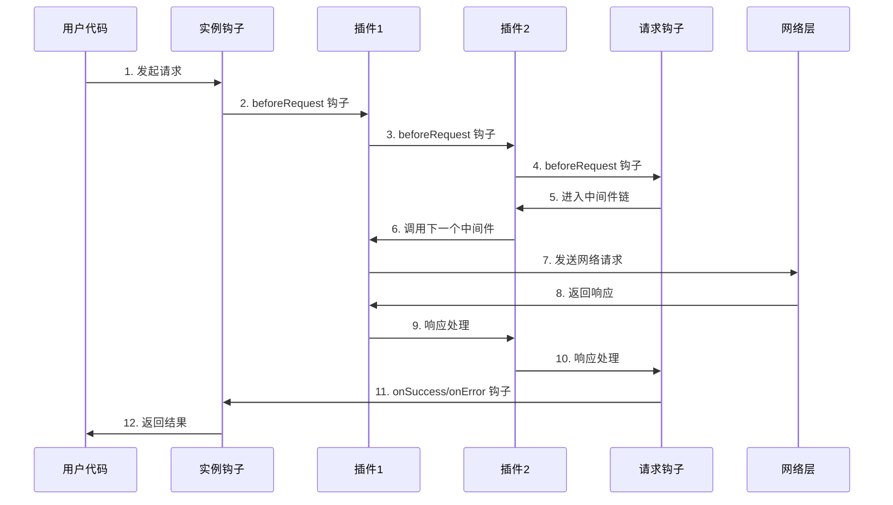
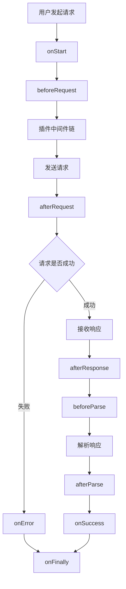

# @okutils/fetch 设计文档

## 1. 项目概述

### 1.1 项目简介

`@okutils/fetch` 是一个基于原生 Fetch API 的现代化 HTTP 客户端库。它提供了类型安全、生命周期钩子、插件系统等高级功能，同时保持轻量和高性能。

项目对标 `axios` 和 `ky` 的设计理念，力求融合两者的优点。`axios` 的易用性和强大的功能集是其广受欢迎的原因，而 `ky` 则以其现代化和简洁著称。`@okutils/fetch` 试图在两者之间找到一个平衡点：提供完整的生命周期和插件生态系统，类似于 `axios`；同时保持 API 的现代化和轻量化，类似于 `ky`。

### 1.2 Monorepo 架构设计

本项目采用基于 pnpm workspace 的 monorepo 设计，提供统一的开发、构建、发布和维护流程。

#### 1.2.1 包结构设计

```
@okutils/fetch-monorepo/                 # Workspace Root
├── packages/
│   ├── core/                           # @okutils/fetch-core (核心包)
│   └── plugins/                        # 插件目录 (非包，仅用于组织)
│       ├── cache/                      # @okutils/fetch-plugin-cache
│       ├── retry/                      # @okutils/fetch-plugin-retry
│       ├── dedup/                      # @okutils/fetch-plugin-dedup
│       ├── progress/                   # @okutils/fetch-plugin-progress
│       └── concurrent/                 # @okutils/fetch-plugin-concurrent
├── shared/                             # 共享配置目录 (非包)
│   ├── tsconfig.base.json              # TypeScript 基础配置
│   └── rollup.config.base.mjs          # Rollup 构建配置
├── package.json                        # Workspace root configuration
├── pnpm-workspace.yaml                 # pnpm workspace configuration
└── shared configs...                   # 其他共享配置文件
```

#### 1.2.2 包依赖关系

- **@okutils/fetch-monorepo**: Workspace root，不发布，仅用于开发和构建协调
- **@okutils/fetch-core**: 核心功能包，提供主要的 API 和功能
- **shared/**: 共享配置目录，包含 TypeScript、Rollup 等构建配置，通过文件引用的方式被各包使用
- **@okutils/fetch-plugin-\***: 各种插件包，依赖核心包并扩展功能

### 1.3 设计理念

- **现代化优先**：充分利用现代 JavaScript/TypeScript 特性，不为过时的环境做妥协
- **类型安全优先**：启用最严格的 TypeScript 配置，包括 `exactOptionalPropertyTypes`，确保编译时发现潜在问题
- **插件化架构**：核心功能精简，通过插件扩展功能
- **同构设计**：支持浏览器和 Node.js 环境，为未来的 SSR 支持做准备
- **开发者友好**：直观的 API 设计，详细的错误信息，完善的文档
- **Monorepo 优势**：统一开发体验，原子化版本控制，共享配置和工具链

### 1.3.1 同构环境适配策略

**环境检测与适配：**

```typescript
/**
 * 环境类型
 * @internal
 */
type TEnvironment = "browser" | "node" | "worker" | "unknown";

/**
 * 环境检测器
 * @internal
 */
const detectEnvironment = (): TEnvironment => {
  // 检测 Node.js 环境
  if (typeof process !== "undefined" && process.versions?.node) {
    return "node";
  }

  // 检测 Web Worker 环境
  if (
    typeof WorkerGlobalScope !== "undefined" &&
    self instanceof WorkerGlobalScope
  ) {
    return "worker";
  }

  // 检测浏览器环境
  if (typeof window !== "undefined" && typeof document !== "undefined") {
    return "browser";
  }

  return "unknown";
};

/**
 * 环境特定的适配器
 * @internal
 */
interface IEnvironmentAdapter {
  /** 获取全局 fetch 函数 */
  getFetch: () => typeof fetch;

  /** 获取 Headers 构造函数 */
  getHeaders: () => typeof Headers;

  /** 获取 Request 构造函数 */
  getRequest: () => typeof Request;

  /** 获取 Response 构造函数 */
  getResponse: () => typeof Response;

  /** 获取 AbortController 构造函数 */
  getAbortController: () => typeof AbortController;

  /** 获取 URL 构造函数 */
  getURL: () => typeof URL;

  /** 是否支持 Streams API */
  hasStreamsSupport: () => boolean;

  /** 获取用户代理字符串 */
  getUserAgent: () => string;

  /** 获取当前 URL（如果适用） */
  getCurrentURL: () => string | null;
}

/**
 * 浏览器环境适配器
 * @internal
 */
const createBrowserAdapter = (): IEnvironmentAdapter => ({
  getFetch: () => globalThis.fetch,
  getHeaders: () => globalThis.Headers,
  getRequest: () => globalThis.Request,
  getResponse: () => globalThis.Response,
  getAbortController: () => globalThis.AbortController,
  getURL: () => globalThis.URL,
  hasStreamsSupport: () =>
    typeof ReadableStream !== "undefined" &&
    typeof TransformStream !== "undefined",
  getUserAgent: () => navigator.userAgent,
  getCurrentURL: () => window.location.href
});

/**
 * Node.js 环境适配器
 * @internal
 */
const createNodeAdapter = (): IEnvironmentAdapter => ({
  getFetch: () => globalThis.fetch, // Node.js 18+ 原生支持
  getHeaders: () => globalThis.Headers,
  getRequest: () => globalThis.Request,
  getResponse: () => globalThis.Response,
  getAbortController: () => globalThis.AbortController,
  getURL: () => globalThis.URL,
  hasStreamsSupport: () => true, // Node.js 原生支持 Streams
  getUserAgent: () => `Node.js/${process.version}`,
  getCurrentURL: () => null
});

/**
 * 环境适配器工厂
 * @internal
 */
const createEnvironmentAdapter = (): IEnvironmentAdapter => {
  const env = detectEnvironment();

  switch (env) {
    case "browser":
    case "worker":
      return createBrowserAdapter();
    case "node":
      return createNodeAdapter();
    default:
      throw new Error(`Unsupported environment: ${env}`);
  }
};
```

**环境差异处理：**

```typescript
/**
 * 同构请求处理器
 * @internal
 */
const createIsomorphicFetcher = (adapter: IEnvironmentAdapter) => {
  const fetch = adapter.getFetch();
  const Headers = adapter.getHeaders();
  const Request = adapter.getRequest();

  return async (
    url: string | URL,
    options: IRequestOptions = {}
  ): Promise<Response> => {
    // 环境特定的 Headers 处理
    const headers = new Headers(options.headers);

    // 在 Node.js 环境中添加 User-Agent
    if (detectEnvironment() === "node" && !headers.has("User-Agent")) {
      headers.set("User-Agent", adapter.getUserAgent());
    }

    // 环境特定的 URL 处理
    let finalUrl: string;
    if (url instanceof URL) {
      finalUrl = url.toString();
    } else if (options.baseURL) {
      finalUrl = new URL(url, options.baseURL).toString();
    } else {
      finalUrl = url;
    }

    // 创建请求对象
    const request = new Request(finalUrl, {
      method: options.method || "GET",
      headers,
      body: options.body ?? null,
      signal: options.signal,
      mode: options.mode,
      credentials: options.credentials,
      cache: options.cache,
      redirect: options.redirect,
      referrer: options.referrer,
      referrerPolicy: options.referrerPolicy,
      integrity: options.integrity,
      keepalive: options.keepalive
    });

    return fetch(request);
  };
};
```

### 1.3.2 大型响应处理与内存管理

**流式响应处理策略：**

```typescript
/**
 * 大型响应处理配置
 * @public
 */
interface ILargeResponseConfig {
  /** 响应大小阈值（字节），超过此值将使用流式处理 */
  sizeThreshold?: number | undefined; // 默认 10MB

  /** 是否启用流式处理 */
  isStreamingEnabled?: boolean | undefined;

  /** 内存使用限制（字节） */
  memoryLimit?: number | undefined; // 默认 100MB

  /** 背压处理策略 */
  backpressureStrategy?: "buffer" | "drop" | "error" | undefined;

  /** 分块处理大小（字节） */
  chunkSize?: number | undefined; // 默认 64KB
}

/**
 * 流式响应处理器
 * @internal
 */
const createStreamingResponseHandler = (config: ILargeResponseConfig = {}) => {
  const DEFAULT_SIZE_THRESHOLD = 10 * 1024 * 1024; // 10MB
  const DEFAULT_MEMORY_LIMIT = 100 * 1024 * 1024; // 100MB
  const DEFAULT_CHUNK_SIZE = 64 * 1024; // 64KB

  const {
    sizeThreshold = DEFAULT_SIZE_THRESHOLD,
    memoryLimit = DEFAULT_MEMORY_LIMIT,
    chunkSize = DEFAULT_CHUNK_SIZE,
    backpressureStrategy = "buffer",
    isStreamingEnabled = true
  } = config;

  return {
    /**
     * 检查是否应该使用流式处理
     */
    shouldUseStreaming: (response: Response): boolean => {
      if (!isStreamingEnabled) return false;

      const contentLength = response.headers.get("content-length");
      if (contentLength) {
        const size = parseInt(contentLength, 10);
        return size > sizeThreshold;
      }

      // 如果没有 Content-Length，默认使用流式处理以防万一
      return true;
    },

    /**
     * 创建内存感知的读取流
     */
    createMemoryAwareStream: (
      response: Response
    ): ReadableStream<Uint8Array> => {
      if (!response.body) {
        throw new Error("Response body is null");
      }

      let totalSize = 0;

      return new ReadableStream({
        start(controller) {
          if (!response.body) {
            controller.close();
            return;
          }

          const reader = response.body.getReader();

          const pump = async (): Promise<void> => {
            try {
              const { done, value } = await reader.read();

              if (done) {
                controller.close();
                return;
              }

              totalSize += value.byteLength;

              // 检查内存限制
              if (totalSize > memoryLimit) {
                controller.error(
                  new Error(
                    `Response too large: ${totalSize} bytes exceeds limit of ${memoryLimit} bytes`
                  )
                );
                return;
              }

              // 处理背压
              try {
                controller.enqueue(value);
              } catch (error) {
                if (
                  error instanceof Error &&
                  error.name === "QuotaExceededError"
                ) {
                  switch (backpressureStrategy) {
                    case "drop":
                      console.warn("Dropping chunk due to backpressure");
                      break;
                    case "error":
                      controller.error(
                        new Error("Backpressure limit exceeded")
                      );
                      return;
                    case "buffer":
                    default:
                      // 等待一段时间再重试
                      await new Promise((resolve) => setTimeout(resolve, 10));
                      controller.enqueue(value);
                      break;
                  }
                }
              }

              pump();
            } catch (error) {
              controller.error(error);
            }
          };

          pump();
        },

        cancel() {
          // 清理资源
          totalSize = 0;
        }
      });
    },

    /**
     * 处理分块读取
     */
    processInChunks: async function* (
      stream: ReadableStream<Uint8Array>
    ): AsyncGenerator<Uint8Array, void, unknown> {
      const reader = stream.getReader();

      try {
        while (true) {
          const { done, value } = await reader.read();

          if (done) break;

          // 如果块太大，进一步分割
          if (value.byteLength > chunkSize) {
            for (let i = 0; i < value.byteLength; i += chunkSize) {
              const chunk = value.slice(i, i + chunkSize);
              yield chunk;
            }
          } else {
            yield value;
          }
        }
      } finally {
        reader.releaseLock();
      }
    },

    /**
     * 监控内存使用情况
     */
    createMemoryMonitor: () => {
      let peakMemoryUsage = 0;
      let currentMemoryUsage = 0;

      return {
        track: (bytes: number) => {
          currentMemoryUsage += bytes;
          peakMemoryUsage = Math.max(peakMemoryUsage, currentMemoryUsage);
        },

        release: (bytes: number) => {
          currentMemoryUsage = Math.max(0, currentMemoryUsage - bytes);
        },

        getStats: () => ({
          current: currentMemoryUsage,
          peak: peakMemoryUsage,
          remaining: memoryLimit - currentMemoryUsage
        })
      };
    }
  };
};

/**
 * Request/Response 对象的一次性消费处理
 * @internal
 */
const createResponseCloner = () => {
  const clonedResponses = new WeakSet<Response>();

  return {
    /**
     * 安全地克隆响应对象
     * @remarks Response 对象只能被消费一次，此方法确保可以多次访问响应内容
     */
    safeClone: (response: Response): Response => {
      if (clonedResponses.has(response)) {
        throw new Error("Response has already been cloned");
      }

      const cloned = response.clone();
      clonedResponses.add(response);
      clonedResponses.add(cloned);

      return cloned;
    },

    /**
     * 检查响应是否已被消费
     */
    isConsumed: (response: Response): boolean => {
      return response.bodyUsed;
    },

    /**
     * 创建响应的多个副本
     */
    createMultipleCopies: (response: Response, count: number): Response[] => {
      const copies: Response[] = [];
      let current = response;

      for (let i = 0; i < count - 1; i++) {
        const cloned = current.clone();
        copies.push(cloned);
        current = cloned;
      }

      copies.push(current);
      return copies;
    }
  };
};
```

### 1.4 核心特性

- 基于原生 Fetch API，本项目只官方支持在原生支持 Fetch API （新的浏览器和 Node.js 18+），用户可以自己通过 polyfill 的方式在浏览器中添加 fetch 甚至对这个库已经 hack，以支持旧环境，但是因此出现的 bug 不在官方的修复范畴。
- 完整的生命周期钩子系统
- 灵活的插件机制
- **严格的 TypeScript 类型安全**：启用 `exactOptionalPropertyTypes` 等严格配置，提供编译时类型保障
- 自动的请求/响应转换
- 统一的错误处理
- 支持请求取消和超时控制
- 实例化和单例模式并存：

```typescript
import fetch from "@okutils/fetch-core"; // 默认单例
import { createFetch } from "@okutils/fetch-core"; // 创建新实例
```

### 1.5 技术栈

- **开发语言**：TypeScript
- **包管理工具**：pnpm (支持 workspace)
- **构建工具**：Rollup + 原生 TypeScript 编译器
- **代码规范**：ESLint + Prettier
- **工具库**：radash（以后会使用 `@okutils/core`，这个是和 radash 的 fork 但是暂未发布，等发布之后替换）
- **最低运行环境**：支持原生 Fetch API 的环境
- **测试策略**：完整的单元测试和集成测试套件，确保库的可靠性和稳定性

## 2. Monorepo 配置与最佳实践

### 2.1 Workspace Root 配置

#### package.json

```json
{
  "name": "@okutils/fetch-monorepo",
  "version": "1.0.0",
  "description": "Modern HTTP client library based on native Fetch API with full TypeScript support",
  "type": "module",
  "private": true,
  "exports": {
    "types": "./packages/core/dist/types/index.d.ts",
    "import": "./packages/core/dist/esm/index.mjs",
    "require": "./packages/core/dist/cjs/index.cjs"
  },
  "scripts": {
    "build": "pnpm -r build",
    "build:core": "pnpm --filter @okutils/fetch-core build",
    "build:plugins": "pnpm --filter '@okutils/fetch-plugin-*' build",
    "dev": "pnpm -r --parallel dev",
    "clean": "pnpm -r clean && rm -rf dist",
    "lint": "eslint .",
    "lint:fix": "eslint . --fix",
    "format": "prettier --write .",
    "format:check": "prettier --check .",
    "type-check": "pnpm -r type-check",
    "changeset": "changeset",
    "version": "changeset version",
    "release": "pnpm build && pnpm type-check && changeset publish"
  },
  "keywords": [
    "fetch",
    "http",
    "request",
    "typescript",
    "browser",
    "nodejs",
    "modern",
    "plugins"
  ],
  "author": "OkUtils Team",
  "license": "MIT",
  "packageManager": "pnpm@10.15.0",
  "engines": {
    "node": ">=18.0.0",
    "pnpm": ">=8.0.0"
  },
  "devDependencies": {
    "@changesets/cli": "^2.27.9",
    "@eslint/js": "^9.34.0",
    "@types/node": "^24.3.0",
    "eslint": "^9.34.0",
    "eslint-import-resolver-typescript": "^4.4.4",
    "eslint-plugin-import-x": "^4.16.1",
    "eslint-plugin-prettier": "^5.5.4",
    "eslint-plugin-tsdoc": "^0.4.0",
    "globals": "^16.3.0",
    "prettier": "^3.6.2",
    "rollup": "4.48.1",
    "rollup-plugin-dts": "^6.2.3",
    "typescript": "5.9.2",
    "typescript-eslint": "^8.41.0"
  },
  "dependencies": {
    "radash": "^12.1.1"
  }
}
```

#### pnpm-workspace.yaml

```yaml
packages:
  - "packages/core"
  - "packages/plugins/*"
  - "!**/test/**"
  - "!**/dist/**"
```

#### .gitignore

```
# Windows thumbnail cache files

Thumbs.db
Thumbs.db:encryptable
ehthumbs.db
ehthumbs_vista.db

# Dump file

\*.stackdump

# Folder config file

[Dd]esktop.ini

# Recycle Bin used on file shares

$RECYCLE.BIN/

# Windows Installer files

_.cab
_.msi
_.msix
_.msm
\*.msp

# Windows shortcuts

\*.lnk

# General

.DS_Store
\_\_MACOSX/
.AppleDouble
.LSOverride
Icon[
]

# Thumbnails

.\_\*

# Files that might appear in the root of a volume

.DocumentRevisions-V100
.fseventsd
.Spotlight-V100
.TemporaryItems
.Trashes
.VolumeIcon.icns
.com.apple.timemachine.donotpresent

# Directories potentially created on remote AFP share

.AppleDB
.AppleDesktop
Network Trash Folder
Temporary Items
.apdisk

\*~

# temporary files which can be created if a process still has a handle open of a deleted file

.fuse_hidden\*

# Metadata left by Dolphin file manager, which comes with KDE Plasma

.directory

# Linux trash folder which might appear on any partition or disk

.Trash-\*

# .nfs files are created when an open file is removed but is still being accessed

.nfs\*

# Log files created by default by the nohup command

nohup.out

.vscode/_
!.vscode/settings.json
!.vscode/tasks.json
!.vscode/launch.json
!.vscode/extensions.json
!.vscode/_.code-snippets
!\*.code-workspace

# Built Visual Studio Code Extensions

\*.vsix

# Covers JetBrains IDEs: IntelliJ, GoLand, RubyMine, PhpStorm, AppCode, PyCharm, CLion, Android Studio, WebStorm and Rider

# Reference: https://intellij-support.jetbrains.com/hc/en-us/articles/206544839

# User-specific stuff

.idea/**/workspace.xml
.idea/**/tasks.xml
.idea/**/usage.statistics.xml
.idea/**/dictionaries
.idea/\*\*/shelf

# AWS User-specific

.idea/\*\*/aws.xml

# Generated files

.idea/\*\*/contentModel.xml

# Sensitive or high-churn files

.idea/**/dataSources/
.idea/**/dataSources.ids
.idea/**/dataSources.local.xml
.idea/**/sqlDataSources.xml
.idea/**/dynamic.xml
.idea/**/uiDesigner.xml
.idea/\*\*/dbnavigator.xml

# Gradle

.idea/**/gradle.xml
.idea/**/libraries

# Gradle and Maven with auto-import

# When using Gradle or Maven with auto-import, you should exclude module files,

# since they will be recreated, and may cause churn. Uncomment if using

# auto-import.

# .idea/artifacts

# .idea/compiler.xml

# .idea/jarRepositories.xml

# .idea/modules.xml

# .idea/\*.iml

# .idea/modules

# \*.iml

# \*.ipr

# CMake

cmake-build-\*/

# Mongo Explorer plugin

.idea/\*\*/mongoSettings.xml

# File-based project format

\*.iws

# IntelliJ

out/

# mpeltonen/sbt-idea plugin

.idea_modules/

# JIRA plugin

atlassian-ide-plugin.xml

# Cursive Clojure plugin

.idea/replstate.xml

# SonarLint plugin

.idea/sonarlint/
.idea/sonarlint.xml # see https://community.sonarsource.com/t/is-the-file-idea-idea-idea-sonarlint-xml-intended-to-be-under-source-control/121119

# Crashlytics plugin (for Android Studio and IntelliJ)

com_crashlytics_export_strings.xml
crashlytics.properties
crashlytics-build.properties
fabric.properties

# Editor-based HTTP Client

.idea/httpRequests
http-client.private.env.json

# Android studio 3.1+ serialized cache file

.idea/caches/build_file_checksums.ser

# Apifox Helper cache

.idea/.cache/.Apifox_Helper
.idea/ApifoxUploaderProjectSetting.xml

# Cursor AI

.cursorignore
.cursorindexingignore

# Logs

logs
_.log
npm-debug.log_
yarn-debug.log*
yarn-error.log*
lerna-debug.log\*

# Diagnostic reports (https://nodejs.org/api/report.html)

report.[0-9]_.[0-9]_.[0-9]_.[0-9]_.json

# Runtime data

pids
_.pid
_.seed
\*.pid.lock

# Directory for instrumented libs generated by jscoverage/JSCover

lib-cov

# Coverage directory used by tools like istanbul

coverage
\*.lcov

# nyc test coverage

.nyc_output

# Grunt intermediate storage (https://gruntjs.com/creating-plugins#storing-task-files)

.grunt

# Bower dependency directory (https://bower.io/)

bower_components

# node-waf configuration

.lock-wscript

# Compiled binary addons (https://nodejs.org/api/addons.html)

build/Release

# Dependency directories

node_modules/
jspm_packages/

# Snowpack dependency directory (https://snowpack.dev/)

web_modules/

# TypeScript cache

\*.tsbuildinfo

# Optional npm cache directory

.npm

# Optional eslint cache

.eslintcache

# Optional stylelint cache

.stylelintcache

# Optional REPL history

.node_repl_history

# Output of 'npm pack'

\*.tgz

# Yarn Integrity file

.yarn-integrity

# dotenv environment variable files

.env
.env.\*
!.env.example

# parcel-bundler cache (https://parceljs.org/)

.cache
.parcel-cache

# Next.js build output

.next
out

# Nuxt.js build / generate output

.nuxt
dist
.output

# Gatsby files

.cache/

# Comment in the public line in if your project uses Gatsby and not Next.js

# https://nextjs.org/blog/next-9-1#public-directory-support

# public

# vuepress build output

.vuepress/dist

# vuepress v2.x temp and cache directory

.temp
.cache

# Sveltekit cache directory

.svelte-kit/

# vitepress build output

\*\*/.vitepress/dist

# vitepress cache directory

\*\*/.vitepress/cache

# Docusaurus cache and generated files

.docusaurus

# Serverless directories

.serverless/

# FuseBox cache

.fusebox/

# DynamoDB Local files

.dynamodb/

# Firebase cache directory

.firebase/

# TernJS port file

.tern-port

# Stores VSCode versions used for testing VSCode extensions

.vscode-test

# yarn v3

.pnp._
.yarn/_
!.yarn/patches
!.yarn/plugins
!.yarn/releases
!.yarn/sdks
!.yarn/versions

# Vite logs files

vite.config.js.timestamp-_
vite.config.ts.timestamp-_

```

### 2.2 共享配置文件

#### ESLint 配置 (eslint.config.mjs)

```javascript
import js from "@eslint/js";
import { createTypeScriptImportResolver } from "eslint-import-resolver-typescript";
import * as importX from "eslint-plugin-import-x";
import prettierRecommend from "eslint-plugin-prettier/recommended";
import tsdoc from "eslint-plugin-tsdoc";
import globals from "globals";
import tseslint from "typescript-eslint";

export default tseslint.config(
  js.configs.recommended,
  tseslint.configs.recommended,
  prettierRecommend,
  importX.flatConfigs.recommended,
  importX.flatConfigs.typescript,
  {
    files: ["packages/*/src/**/*.{js,mjs,cjs,ts,mts,cts}"],
    languageOptions: {
      ecmaVersion: 2023,
      globals: { ...globals.browser, ...globals.node },
      parser: tseslint.parser,
      parserOptions: {
        project: "./tsconfig.json",
        tsconfigRootDir: import.meta.dirname,
        projectService: true
      }
    },
    plugins: {
      tsdoc,
      "@typescript-eslint": tseslint.plugin,
      "import-x": importX
    },
    rules: {
      "tsdoc/syntax": "warn",
      "prefer-const": "warn",
      "@typescript-eslint/no-unused-vars": [
        "warn",
        {
          argsIgnorePattern: "^_",
          varsIgnorePattern: "^_"
        }
      ],
      "@typescript-eslint/no-explicit-any": "warn",
      "@typescript-eslint/no-unsafe-assignment": "warn",
      "import-x/order": [
        "warn",
        {
          groups: [
            "builtin",
            "external",
            "internal",
            "unknown",
            "parent",
            "sibling",
            "index",
            "object",
            "type"
          ],
          alphabetize: {
            order: "asc",
            caseInsensitive: false
          }
        }
      ]
    },
    settings: {
      "import/resolver-next": [
        createTypeScriptImportResolver({
          alwaysTryTypes: true,
          extensions: [
            ".js",
            ".mjs",
            ".jsx",
            ".ts",
            ".cjs",
            ".cts",
            ".mts",
            ".tsx",
            ".json"
          ]
        })
      ]
    }
  },
  {
    // Configuration files
    files: ["**/*.config.{js,mjs,ts}", "**/rollup.config.{js,mjs,ts}"],
    rules: {
      "@typescript-eslint/no-unused-vars": "off"
    }
  }
);
```

#### Prettier 配置 (.prettierrc.json)

```json
{
  "$schema": "https://json.schemastore.org/prettierrc",
  "semi": true,
  "tabWidth": 2,
  "singleQuote": false,
  "printWidth": 80,
  "trailingComma": "none"
}
```

#### TypeScript 配置 (tsconfig.json)

```json
{
  "$schema": "https://json.schemastore.org/tsconfig",
  "compilerOptions": {
    // ===========================================
    // 语言和环境配置 (Language and Environment)
    // ===========================================

    /**
     * ECMAScript 目标版本
     * ES2022 提供了更好的现代 JavaScript 特性支持，包括 top-level await
     * 适合 Node.js 18+ 和现代浏览器环境
     */
    "target": "ES2022",

    /**
     * 包含的类型库
     * ES2022: 现代 JavaScript 运行时特性
     * DOM: 浏览器环境 API （用于同构支持）
     * DOM.Iterable: DOM 集合的迭代器支持
     * ES2022.Intl: 国际化 API
     */
    "lib": ["ES2022", "DOM", "DOM.Iterable", "ES2022.Intl"],

    /**
     * 模块检测策略
     * auto: 自动检测模块类型，支持 ESM/CommonJS 混合环境
     */
    "moduleDetection": "auto",

    // ===========================================
    // 模块系统配置 (Modules)
    // ===========================================

    /**
     * 模块系统类型
     * ESNext: 使用最新的 ES 模块语法，适合现代构建工具
     */
    "module": "ESNext",

    /**
     * 模块解析策略
     * bundler: 专为打包工具设计，支持 package.json exports/imports
     * 提供更好的 Rollup/Vite 兼容性
     */
    "moduleResolution": "bundler",

    /**
     * 基础 URL，用于非相对模块名称解析
     */
    "baseUrl": "./",

    /**
     * 解析 JSON 模块
     * 允许导入 .json 文件并获得类型推断
     */
    "resolveJsonModule": true,

    /**
     * 支持 package.json exports 字段
     * 现代包管理器和构建工具的标准
     */
    "resolvePackageJsonExports": true,

    /**
     * 支持 package.json imports 字段
     * 用于包内部模块解析
     */
    "resolvePackageJsonImports": true,

    /**
     * 允许从没有默认导出的模块中导入默认值
     * 提高与 CommonJS 模块的互操作性
     */
    "allowSyntheticDefaultImports": true,

    /**
     * Node.js 类型定义
     * 提供 Node.js 内置模块的类型支持
     */
    "types": ["node"],

    // ===========================================
    // 输出配置 (Emit)
    // ===========================================

    /**
     * 输出目录
     */
    "outDir": "./dist",

    /**
     * 生成声明文件 (.d.ts)
     * 为库的使用者提供类型信息
     */
    "declaration": true,

    /**
     * 生成声明文件的 source map
     * 改善类型错误的调试体验
     */
    "declarationMap": true,

    /**
     * 生成源码映射文件
     * 用于调试时映射到原始 TypeScript 源码
     */
    "sourceMap": true,

    /**
     * 移除注释
     * 减小输出文件体积，生产环境推荐
     */
    "removeComments": true,

    /**
     * 导入辅助函数
     * 从 tslib 导入辅助函数而不是内联，减小输出体积
     */
    "importHelpers": true,

    /**
     * 下级迭代
     * 为旧版本 JavaScript 提供更准确的迭代器支持
     */
    "downlevelIteration": true,

    // ===========================================
    // 互操作约束 (Interop Constraints)
    // ===========================================

    /**
     * ES 模块互操作
     * 改善 ES 模块和 CommonJS 模块之间的互操作性
     * 推荐用于现代项目
     */
    "esModuleInterop": true,

    /**
     * 强制文件名大小写一致性
     * 避免不同操作系统间的文件系统差异问题
     */
    "forceConsistentCasingInFileNames": true,

    /**
     * 隔离模块
     * 确保每个文件可以独立编译，提高构建工具兼容性
     */
    "isolatedModules": true,

    /**
     * 逐字模块语法
     * 确保导入/导出语法的一致性，避免模块系统混淆
     */
    "verbatimModuleSyntax": true,

    // ===========================================
    // 类型检查配置 (Type Checking)
    // ===========================================

    /**
     * 启用所有严格类型检查选项
     * 包括 noImplicitAny、strictNullChecks 等
     */
    "strict": true,

    /**
     * 精确的可选属性类型
     * 区分 undefined 和未定义的属性，提供更准确的类型检查
     */
    "exactOptionalPropertyTypes": true,

    /**
     * 检查函数中的所有代码路径是否都有返回值
     */
    "noImplicitReturns": true,

    /**
     * 检查 switch 语句中是否有 fallthrough 情况
     */
    "noFallthroughCasesInSwitch": true,

    /**
     * 检查未使用的局部变量
     * 帮助发现代码中的潜在问题
     */
    "noUnusedLocals": true,

    /**
     * 检查未使用的参数
     * 提高代码质量
     */
    "noUnusedParameters": true,

    /**
     * 要求 override 关键字
     * 明确标识覆盖的类成员，避免意外覆盖
     */
    "noImplicitOverride": true,

    /**
     * 检查未经检查的索引访问
     * 为索引签名访问添加 undefined 检查，提高类型安全性
     */
    "noUncheckedIndexedAccess": true,

    /**
     * 在 catch 子句中使用 unknown 类型
     * 现代错误处理的最佳实践
     */
    "useUnknownInCatchVariables": true,

    // ===========================================
    // 项目配置 (Projects)
    // ===========================================

    /**
     * 复合项目
     * 启用项目引用功能
     */
    "composite": true,

    // ===========================================
    // 完整性检查 (Completeness)
    // ===========================================

    /**
     * 跳过库文件的类型检查
     * 提高编译性能，推荐用于生产环境
     */
    "skipLibCheck": true,

    // ===========================================
    // 编译器诊断 (Compiler Diagnostics)
    // ===========================================

    /**
     * 不截断错误信息
     * 显示完整的类型错误信息，便于调试
     */
    "noErrorTruncation": true
  }
}
```

### 2.3 共享配置管理

#### 2.3.1 共享配置设计理念

本项目采用**文件引用**而非**包依赖**的方式管理共享配置，这种方案有以下优势：

- **避免循环依赖**：共享配置不再是可发布的包，避免了构建工具依赖共享配置，而共享配置又需要构建工具的问题
- **简化依赖管理**：各个包不需要在 `package.json` 中声明对共享配置的依赖
- **更符合最佳实践**：参考 Rush Stack、Lerna 等成熟 monorepo 项目的做法
- **降低维护成本**：不需要单独管理共享配置的版本和发布

#### 2.3.2 共享 TypeScript 配置

#### shared/tsconfig.base.json

```json
{
  "$schema": "https://json.schemastore.org/tsconfig",
  "compilerOptions": {
    // ===========================================
    // 语言和环境配置 (Language and Environment)
    // ===========================================

    /**
     * ECMAScript 目标版本
     * ES2022 提供了更好的现代 JavaScript 特性支持，包括 top-level await
     * 适合 Node.js 18+ 和现代浏览器环境
     */
    "target": "ES2022",

    /**
     * 包含的类型库
     * ES2022: 现代 JavaScript 运行时特性
     * DOM: 浏览器环境 API （用于同构支持）
     * DOM.Iterable: DOM 集合的迭代器支持
     * ES2022.Intl: 国际化 API
     */
    "lib": ["ES2022", "DOM", "DOM.Iterable", "ES2022.Intl"],

    /**
     * 模块检测策略
     * auto: 自动检测模块类型，支持 ESM/CommonJS 混合环境
     */
    "moduleDetection": "auto",

    // ===========================================
    // 模块系统配置 (Modules)
    // ===========================================

    /**
     * 模块系统类型
     * ESNext: 使用最新的 ES 模块语法，适合现代构建工具
     */
    "module": "ESNext",

    /**
     * 模块解析策略
     * bundler: 专为打包工具设计，支持 package.json exports/imports
     * 提供更好的 Rollup/Vite 兼容性
     */
    "moduleResolution": "bundler",

    /**
     * 基础 URL，用于非相对模块名称解析
     */
    "baseUrl": "./",

    /**
     * 解析 JSON 模块
     * 允许导入 .json 文件并获得类型推断
     */
    "resolveJsonModule": true,

    /**
     * 支持 package.json exports 字段
     * 现代包管理器和构建工具的标准
     */
    "resolvePackageJsonExports": true,

    /**
     * 支持 package.json imports 字段
     * 用于包内部模块解析
     */
    "resolvePackageJsonImports": true,

    /**
     * 允许从没有默认导出的模块中导入默认值
     * 提高与 CommonJS 模块的互操作性
     */
    "allowSyntheticDefaultImports": true,

    /**
     * Node.js 类型定义
     * 提供 Node.js 内置模块的类型支持
     */
    "types": ["node"],

    // ===========================================
    // 输出配置 (Emit)
    // ===========================================

    /**
     * 输出目录
     */
    "outDir": "./dist",

    /**
     * 生成声明文件 (.d.ts)
     * 为库的使用者提供类型信息
     */
    "declaration": true,

    /**
     * 生成声明文件的 source map
     * 改善类型错误的调试体验
     */
    "declarationMap": true,

    /**
     * 生成源码映射文件
     * 用于调试时映射到原始 TypeScript 源码
     */
    "sourceMap": true,

    /**
     * 移除注释
     * 减小输出文件体积，生产环境推荐
     */
    "removeComments": true,

    /**
     * 导入辅助函数
     * 从 tslib 导入辅助函数而不是内联，减小输出体积
     */
    "importHelpers": true,

    /**
     * 下级迭代
     * 为旧版本 JavaScript 提供更准确的迭代器支持
     */
    "downlevelIteration": true,

    // ===========================================
    // 互操作约束 (Interop Constraints)
    // ===========================================

    /**
     * ES 模块互操作
     * 改善 ES 模块和 CommonJS 模块之间的互操作性
     * 推荐用于现代项目
     */
    "esModuleInterop": true,

    /**
     * 强制文件名大小写一致性
     * 避免不同操作系统间的文件系统差异问题
     */
    "forceConsistentCasingInFileNames": true,

    /**
     * 隔离模块
     * 确保每个文件可以独立编译，提高构建工具兼容性
     */
    "isolatedModules": true,

    /**
     * 逐字模块语法
     * 确保导入/导出语法的一致性，避免模块系统混淆
     */
    "verbatimModuleSyntax": true,

    // ===========================================
    // 类型检查配置 (Type Checking)
    // ===========================================

    /**
     * 启用所有严格类型检查选项
     * 包括 noImplicitAny、strictNullChecks 等
     */
    "strict": true,

    /**
     * 精确的可选属性类型
     * 区分 undefined 和未定义的属性，提供更准确的类型检查
     */
    "exactOptionalPropertyTypes": true,

    /**
     * 检查函数中的所有代码路径是否都有返回值
     */
    "noImplicitReturns": true,

    /**
     * 检查 switch 语句中是否有 fallthrough 情况
     */
    "noFallthroughCasesInSwitch": true,

    /**
     * 检查未使用的局部变量
     * 帮助发现代码中的潜在问题
     */
    "noUnusedLocals": true,

    /**
     * 检查未使用的参数
     * 提高代码质量
     */
    "noUnusedParameters": true,

    /**
     * 要求 override 关键字
     * 明确标识覆盖的类成员，避免意外覆盖
     */
    "noImplicitOverride": true,

    /**
     * 检查未经检查的索引访问
     * 为索引签名访问添加 undefined 检查，提高类型安全性
     */
    "noUncheckedIndexedAccess": true,

    /**
     * 在 catch 子句中使用 unknown 类型
     * 现代错误处理的最佳实践
     */
    "useUnknownInCatchVariables": true,

    // ===========================================
    // 项目配置 (Projects)
    // ===========================================

    /**
     * 复合项目
     * 启用项目引用和增量构建
     */
    "composite": true,

    /**
     * 增量编译
     * 提高大型项目的编译性能，但是启用了 composite 就不再需要这个
     */
    "incremental": false,

    // ===========================================
    // 完整性检查 (Completeness)
    // ===========================================

    /**
     * 跳过库文件的类型检查
     * 提高编译性能，推荐用于生产环境
     */
    "skipLibCheck": true,

    // ===========================================
    // 编译器诊断 (Compiler Diagnostics)
    // ===========================================

    /**
     * 不截断错误信息
     * 显示完整的类型错误信息，便于调试
     */
    "noErrorTruncation": true
  }
}
```

各包通过相对路径引用：

```json
{
  "extends": "../../shared/tsconfig.base.json",
  "compilerOptions": {
    "rootDir": "./src",
    "outDir": "./dist"
  }
}
```

#### 2.3.3 共享 Rollup 配置

#### shared/rollup.config.base.mjs

```typescript
import { readFileSync } from "fs";
import { resolve } from "path";
import typescript from "@rollup/plugin-typescript";
import dts from "rollup-plugin-dts";

/**
 * 创建基础的 Rollup 配置
 * @param packageDir - 包目录路径
 * @param options - 配置选项
 * @returns Rollup 配置数组
 */
export const createRollupConfig = (packageDir: string, options: any = {}) => {
  const pkg = JSON.parse(
    readFileSync(resolve(packageDir, "package.json"), "utf-8")
  );

  const {
    external = [],
    plugins = [],
    input = "src/index.ts",
    formats = ["esm", "cjs"],
    shouldGenerateDts = true,
    shouldSkipDtsForUtility = false
  } = options;

  // 基础外部依赖
  const baseExternal = [
    ...Object.keys(pkg.dependencies || {}),
    ...Object.keys(pkg.peerDependencies || {}),
    "radash",
    // Node.js 内置模块
    "fs",
    "path",
    "url",
    "util"
  ];

  const configs = [];

  // 主要构建配置
  if (formats.includes("esm") || formats.includes("cjs")) {
    configs.push({
      input: resolve(packageDir, input),
      external: (id: string) => {
        if (
          baseExternal.some((ext) => id === ext || id.startsWith(ext + "/"))
        ) {
          return true;
        }
        return external.some(
          (ext: string) => id === ext || id.startsWith(ext + "/")
        );
      },
      plugins: [
        typescript({
          tsconfig: resolve(packageDir, "tsconfig.json"),
          declaration: false,
          declarationMap: false,
          compilerOptions: {
            declaration: false,
            declarationMap: false,
            composite: false
          }
        }),
        ...plugins
      ],
      output: [
        formats.includes("esm") && {
          file: resolve(packageDir, "dist/esm/index.mjs"),
          format: "es",
          sourcemap: true
        },
        formats.includes("cjs") && {
          file: resolve(packageDir, "dist/cjs/index.cjs"),
          format: "cjs",
          sourcemap: true,
          exports: "named"
        }
      ].filter(Boolean)
    });
  }

  // TypeScript 声明文件配置
  if (shouldGenerateDts && !shouldSkipDtsForUtility) {
    configs.push({
      input: resolve(packageDir, input),
      external: (id: string) => {
        if (
          baseExternal.some((ext) => id === ext || id.startsWith(ext + "/"))
        ) {
          return true;
        }
        return external.some(
          (ext: string) => id === ext || id.startsWith(ext + "/")
        );
      },
      plugins: [dts()],
      output: {
        file: resolve(packageDir, "dist/types/index.d.ts"),
        format: "es"
      }
    });
  }

  return configs;
};
```

各包通过相对路径引用：

```typescript
// packages/core/rollup.config.mjs
import { createRollupConfig } from "../../shared/rollup.config.base.mjs";

export default createRollupConfig(import.meta.dirname);
```

## 3. 核心架构设计

### 3.1 整体架构

`@okutils/fetch-core` 采用分层架构设计，从底层到顶层依次为：

1. **基础层**：封装原生 Fetch API，提供基本的请求能力
2. **核心层**：实现配置管理、生命周期、错误处理等核心功能
3. **插件层**：通过插件扩展功能，如缓存、重试、进度等
4. **接口层**：对外暴露的 API 接口

### 3.2 模块划分

```
packages/
├── core/                               # @okutils/fetch-core
│   ├── src/
│   │   ├── index.ts                   # 主入口文件
│   │   ├── core/                      # 核心功能
│   │   │   ├── request.ts             # 请求处理
│   │   │   ├── response.ts            # 响应处理
│   │   │   ├── error.ts               # 错误处理
│   │   │   ├── config.ts              # 配置管理
│   │   │   ├── index.ts
│   │   │   └── hooks.ts               # 生命周期钩子
│   │   ├── instance/                  # 实例管理
│   │   │   ├── create.ts              # 创建实例
│   │   │   ├── index.ts
│   │   │   └── default.ts             # 默认实例
│   │   ├── types/                     # 类型定义
│   │   │   ├── config.ts              # 配置类型
│   │   │   ├── hooks.ts               # 钩子类型
│   │   │   ├── index.ts
│   │   │   └── plugin.ts              # 插件类型
│   │   └── utils/                     # 工具函数
│   │       ├── headers.ts             # Headers 处理
│   │       ├── index.ts
│   │       └── url.ts                 # URL 处理
│   ├── package.json
│   ├── tsconfig.json
│   └── rollup.config.mjs
└── plugins/                           # 插件目录 (非包)
    ├── cache/                         # @okutils/fetch-plugin-cache
    ├── retry/                         # @okutils/fetch-plugin-retry
    ├── dedup/                         # @okutils/fetch-plugin-dedup
    ├── progress/                      # @okutils/fetch-plugin-progress
    └── concurrent/                    # @okutils/fetch-plugin-concurrent
```

### 3.3 数据流

请求的完整生命周期数据流如下：

1. 用户发起请求 → 2. 触发 `onStart` 钩子 → 3. 执行 `beforeRequest` 钩子 → 4. 插件中间件处理 → 5. 发送实际请求 → 6. 触发 `afterRequest` 钩子 → 7. 接收响应 → 8. 触发 `afterResponse` 钩子 → 9. 解析响应 → 10. 触发 `beforeParse` 和 `afterParse` 钩子 → 11. 成功则触发 `onSuccess`，失败则触发 `onError` → 12. 最终触发 `onFinally`

## 4. API 规范

### 4.1 实例创建

```typescript
import { createFetch } from "@okutils/fetch-core";

// 创建自定义实例
const customFetch = createFetch({
  baseURL: "https://api.example.com",
  timeout: 30000,
  headers: {
    "Content-Type": "application/json"
  }
});

// 使用默认实例
import fetch from "@okutils/fetch-core";
```

### 4.2 请求方法

### 4.2 便捷方法

```typescript
interface IFetchInstance {
  request<T = any>(
    url: string,
    options?: IRequestOptions | undefined
  ): Promise<T>;
  request<T = any>(options: IRequestOptions & { url: string }): Promise<T>;
}
```

### 4.3 请求配置

```typescript
interface IFetchInstance {
  get<T = any>(url: string, options?: IRequestOptions | undefined): Promise<T>;
  post<T = any>(
    url: string,
    body?: any,
    options?: IRequestOptions | undefined
  ): Promise<T>;
  put<T = any>(
    url: string,
    body?: any,
    options?: IRequestOptions | undefined
  ): Promise<T>;
  patch<T = any>(
    url: string,
    body?: any,
    options?: IRequestOptions | undefined
  ): Promise<T>;
  delete<T = any>(
    url: string,
    options?: IRequestOptions | undefined
  ): Promise<T>;
  head<T = any>(url: string, options?: IRequestOptions | undefined): Promise<T>;
  options<T = any>(
    url: string,
    options?: IRequestOptions | undefined
  ): Promise<T>;
}
```

### 4.4 响应结构

```typescript
interface IRequestOptions {
  // 基础配置
  method?: THttpMethod | undefined;
  headers?: HeadersInit | Record<string, string | undefined> | undefined;
  body?: any;

  // URL 相关
  baseURL?: string | undefined;
  params?: Record<string, any> | undefined; // Query 参数

  // 超时和取消
  timeout?: number | undefined;
  signal?: AbortSignal | undefined;

  // 超时和取消配置说明：
  // 1. timeout：超时时间（毫秒），内部会创建一个 AbortSignal
  // 2. signal：外部传入的取消信号，与 timeout 组合使用
  // 3. 优先级规则：
  //    - 如果同时提供 timeout 和 signal，会使用 AbortSignal.any() 创建组合信号
  //    - 任一信号触发都会取消请求
  //    - timeout 触发抛出 TimeoutError
  //    - 外部 signal 触发抛出 AbortError
  // 4. 兼容性：在不支持 AbortSignal.any() 的环境中会降级到监听模式

  // 响应处理
  responseType?: TResponseType | undefined; // 'json' | 'text' | 'blob' | 'arrayBuffer' | 'formData'
  validateStatus?: ((status: number) => boolean) | undefined;

  // 序列化
  serializer?: ISerializer | undefined;

  // CSRF
  csrf?: ICSRFConfig | boolean | undefined;

  // 钩子
  hooks?: Partial<ICoreHooks> | undefined;

  // 插件
  plugins?: IPluginConfig[] | undefined;

  // 配置验证
  validation?: IConfigValidation | undefined;

  // 其他 Fetch 选项
  mode?: RequestMode | undefined;
  credentials?: RequestCredentials | undefined;
  cache?: RequestCache | undefined;
  redirect?: RequestRedirect | undefined;
  referrer?: string | undefined;
  referrerPolicy?: ReferrerPolicy | undefined;
  integrity?: string | undefined;
  keepalive?: boolean | undefined;
}
```

## 5. 插件系统设计

### 5.1 插件系统执行模型

`@okutils/fetch-core` 采用基于中间件的插件架构，结合生命周期钩子提供强大的扩展能力。

```typescript
interface IFetchResponse<T = any> {
  data: T;
  status: number;
  statusText: string;
  headers: Headers;
  config: IRequestOptions;
  request: Request;
}
```

#### 5.1.1 双重执行机制

插件通过两种机制影响请求处理：

1. **中间件机制**：包装整个请求/响应流程，支持请求拦截、响应处理、错误恢复等
2. **钩子机制**：在特定生命周期节点执行，用于日志记录、状态通知、数据转换等

#### 5.1.2 执行时序图



#### 5.1.3 冲突避免原则

- **职责分离**：中间件处理请求流程，钩子处理副作用
- **数据不变性**：钩子不应修改已确定的响应数据
- **错误隔离**：单个插件的错误不应影响其他插件

### 5.2 插件接口定义

```typescript
/**
 * 插件依赖配置
 * @public
 */
interface IPluginDependency {
  /** 依赖的插件名称 */
  name: string;

  /** 依赖的版本范围（SemVer 格式） */
  version?: string | undefined;

  /** 是否为可选依赖 */
  isOptional?: boolean | undefined;

  /** 依赖不满足时的处理策略 */
  onMissing?: "error" | "warn" | "ignore" | undefined;
}

interface IPlugin<TOptions = any> {
  name: string;
  version: string;
  create: (options?: TOptions) => IPluginInstance;
}

interface IPluginInstance {
  name: string; // 增加名称用于冲突检测
  version: string; // 版本信息
  middleware: TMiddleware;
  hooks?: Partial<ICoreHooks>;
  hookPriority?: number;

  // 插件间依赖管理
  dependencies?: IPluginDependency[] | undefined; // 依赖的插件列表
  conflicts?: string[] | undefined; // 不兼容的插件列表
  provides?: string[] | undefined; // 提供的功能标识
  requires?: string[] | undefined; // 必需的功能标识
}

/**
 * 插件管理器
 * @internal
 */
class PluginManager {
  private plugins: Map<string, IPluginInstance> = new Map();
  private dependencyGraph: Map<string, Set<string>> = new Map();
  private capabilityProviders: Map<string, string> = new Map();

  /**
   * 注册插件
   * @param plugin - 插件实例
   */
  register(plugin: IPluginInstance): void {
    // 检查插件冲突
    this.checkConflicts(plugin);

    // 验证依赖
    this.validateDependencies(plugin);

    // 注册插件
    this.plugins.set(plugin.name, plugin);

    // 更新依赖图
    this.updateDependencyGraph(plugin);

    // 注册提供的功能
    if (plugin.provides) {
      for (const capability of plugin.provides) {
        if (this.capabilityProviders.has(capability)) {
          throw new Error(
            `Capability '${capability}' is already provided by plugin '${this.capabilityProviders.get(capability)}'`
          );
        }
        this.capabilityProviders.set(capability, plugin.name);
      }
    }
  }

  /**
   * 获取已注册的插件列表（按依赖顺序排序）
   */
  getOrderedPlugins(): IPluginInstance[] {
    const sorted = this.topologicalSort();
    return sorted.map((name) => this.plugins.get(name)!);
  }

  /**
   * 检查插件冲突
   */
  private checkConflicts(plugin: IPluginInstance): void {
    if (!plugin.conflicts) return;

    for (const conflictName of plugin.conflicts) {
      if (this.plugins.has(conflictName)) {
        throw new Error(
          `Plugin '${plugin.name}' conflicts with already registered plugin '${conflictName}'`
        );
      }
    }

    // 检查现有插件是否与新插件冲突
    for (const [name, existingPlugin] of this.plugins) {
      if (existingPlugin.conflicts?.includes(plugin.name)) {
        throw new Error(
          `Plugin '${plugin.name}' conflicts with already registered plugin '${name}'`
        );
      }
    }
  }

  /**
   * 验证插件依赖
   */
  private validateDependencies(plugin: IPluginInstance): void {
    if (!plugin.dependencies) return;

    for (const dep of plugin.dependencies) {
      const dependencyPlugin = this.plugins.get(dep.name);

      if (!dependencyPlugin) {
        if (!dep.isOptional) {
          const action = dep.onMissing || "error";
          const message = `Plugin '${plugin.name}' requires dependency '${dep.name}' which is not registered`;

          switch (action) {
            case "error":
              throw new Error(message);
            case "warn":
              console.warn(message);
              break;
            case "ignore":
              break;
          }
        }
        continue;
      }

      // 版本检查（简单实现）
      if (
        dep.version &&
        !this.isVersionCompatible(dependencyPlugin.version, dep.version)
      ) {
        throw new Error(
          `Plugin '${plugin.name}' requires '${dep.name}' version '${dep.version}', but found '${dependencyPlugin.version}'`
        );
      }
    }

    // 检查必需的功能
    if (plugin.requires) {
      for (const capability of plugin.requires) {
        if (!this.capabilityProviders.has(capability)) {
          throw new Error(
            `Plugin '${plugin.name}' requires capability '${capability}' which is not provided by any registered plugin`
          );
        }
      }
    }
  }

  /**
   * 更新依赖图
   */
  private updateDependencyGraph(plugin: IPluginInstance): void {
    if (!this.dependencyGraph.has(plugin.name)) {
      this.dependencyGraph.set(plugin.name, new Set());
    }

    if (plugin.dependencies) {
      for (const dep of plugin.dependencies) {
        if (this.plugins.has(dep.name)) {
          this.dependencyGraph.get(plugin.name)!.add(dep.name);
        }
      }
    }
  }

  /**
   * 拓扑排序，确保依赖顺序
   */
  private topologicalSort(): string[] {
    const visited = new Set<string>();
    const visiting = new Set<string>();
    const result: string[] = [];

    const visit = (pluginName: string): void => {
      if (visiting.has(pluginName)) {
        throw new Error(
          `Circular dependency detected involving plugin '${pluginName}'`
        );
      }

      if (visited.has(pluginName)) return;

      visiting.add(pluginName);

      const dependencies = this.dependencyGraph.get(pluginName) || new Set();
      for (const dep of dependencies) {
        visit(dep);
      }

      visiting.delete(pluginName);
      visited.add(pluginName);
      result.push(pluginName);
    };

    for (const pluginName of this.plugins.keys()) {
      if (!visited.has(pluginName)) {
        visit(pluginName);
      }
    }

    return result.reverse(); // 依赖应该在依赖者之前
  }

  /**
   * 简单的版本兼容性检查
   */
  private isVersionCompatible(actual: string, required: string): boolean {
    // 简单实现，生产环境应使用完整的 SemVer 库
    return actual >= required;
  }
}

interface IRequestContext {
  request: Request;
  options: IRequestOptions;
  url: URL;
  startTime: number;
  abortController: AbortController;
  // 附加元数据，插件可以在此存储状态
  meta: Record<string, any>;
}

type TMiddleware = (
  context: IRequestContext,
  next: () => Promise<Response>
) => Promise<Response>;
```

#### 5.2.1 插件钩子优先级

当插件定义了与用户相同的生命周期钩子时，执行顺序为：

```typescript
interface IPluginInstance {
  middleware: TMiddleware;
  hooks?: Partial<ICoreHooks> & Record<string, any>;
  // 新增：钩子优先级配置
  hookPriority?: number; // 默认值：0，数值越小优先级越高
}
```

**钩子执行顺序（以 beforeRequest 为例）**：

1. 实例级钩子（用户在 createFetch 时配置）
2. 插件钩子（按 hookPriority 排序，相同优先级按插件注册顺序）
3. 请求级钩子（单次请求时配置）

```typescript
// 示例：实际执行顺序
instanceConfig.hooks.beforeRequest()
  → pluginA.hooks.beforeRequest() // priority: -1
  → pluginB.hooks.beforeRequest() // priority: 0
  → requestConfig.hooks.beforeRequest()
```

### 5.3 插件注册机制

插件通过显式导入并在配置中注册：

```typescript
import { createFetch } from "@okutils/fetch-core";
import cachePlugin from "@okutils/fetch-plugin-cache";
import retryPlugin from "@okutils/fetch-plugin-retry";

const fetch = createFetch({
  plugins: [
    cachePlugin({
      maxAge: 60000,
      maxSize: 100
    }),
    retryPlugin({
      maxRetries: 3,
      retryDelay: 1000
    })
  ]
});
```

#### 5.3.1 插件包标准导出实例

```typescript
// @okutils/fetch-plugin-cache/index.ts
const cachePlugin: IPlugin<ICachePluginOptions> = {
  name: "@okutils/fetch-plugin-cache",
  version: "1.0.0",
  create: (options?: ICachePluginOptions) => ({
    middleware: async (context, next) => {
      // 缓存逻辑
      return next();
    },
    hooks: {
      // 插件特定钩子
    }
  })
};

// 导出一个工厂函数，返回插件实例
export default (options?: ICachePluginOptions): IPluginInstance => {
  return cachePlugin.create(options);
};
```

#### 5.3.2 插件执行顺序

插件按照在 `plugins` 数组中的声明顺序执行：

```typescript
const fetch = createFetch({
  plugins: [
    cachePlugin(), // 第1个执行
    retryPlugin(), // 第2个执行
    dedupPlugin() // 第3个执行
  ]
});
```

**中间件执行顺序**：

- **请求阶段**：按数组顺序执行（cachePlugin → retryPlugin → dedupPlugin）
- **响应阶段**：按数组逆序执行（dedupPlugin → retryPlugin → cachePlugin）

这种"洋葱模型"确保了插件能够正确地包装和处理请求/响应：

```typescript
// 执行流程示意
cachePlugin.middleware(context, () =>
  retryPlugin.middleware(context, () =>
    dedupPlugin.middleware(context, () =>
      // 实际 fetch 请求
      actualFetch()
    )
  )
);
```

### 5.4 插件配置扩展

```typescript
// 直接使用 IPluginInstance
interface IRequestOptions {
  // ... 其他配置
  plugins?: IPluginInstance[];
}
```

### 5.5 官方插件列表

#### 5.5.1 缓存插件 (@okutils/fetch-plugin-cache)

提供请求缓存功能，支持内存缓存和持久化缓存：

```typescript
interface ICachePluginOptions {
  maxAge?: number | undefined; // 缓存有效期
  maxSize?: number | undefined; // 最大缓存数
  exclude?: RegExp[] | undefined; // 排除的 URL 模式
  keyGenerator?: ((options: IRequestOptions) => string) | undefined;
  storage?: "memory" | "localStorage" | "sessionStorage" | undefined;
}
```

#### 5.5.2 去重插件 (@okutils/fetch-plugin-dedup)

提供请求去重和节流功能：

```typescript
interface IDedupPluginOptions {
  dedupingInterval?: number | undefined; // 去重时间窗口
  throttleInterval?: number | undefined; // 节流间隔
  keyGenerator?: ((options: IRequestOptions) => string) | undefined;
}
```

#### 5.5.3 重试插件 (@okutils/fetch-plugin-retry)

提供请求重试功能：

```typescript
interface IRetryPluginOptions {
  maxRetries?: number | undefined; // 最大重试次数
  retryDelay?: number | ((attempt: number) => number) | undefined; // 重试延迟
  retryCondition?: ((error: Error) => boolean) | undefined; // 重试条件
  isExponentialBackoff?: boolean | undefined; // 是否启用指数退避
  hooks?:
    | {
        beforeRetry?: ((error: Error, retryCount: number) => void) | undefined;
      }
    | undefined;
}
```

#### 5.5.4 进度插件 (@okutils/fetch-plugin-progress)

提供上传和下载进度监控，基于 WHATWG Streams API 实现：

```typescript
/**
 * 进度事件接口
 * @public
 */
interface IProgressEvent {
  /** 已加载的字节数 */
  loaded: number;

  /** 总字节数（如果已知） */
  total?: number | undefined;

  /** 进度百分比（0-100） */
  percentage?: number | undefined;

  /** 传输速率（字节/秒） */
  rate?: number | undefined;

  /** 预计剩余时间（毫秒） */
  estimated?: number | undefined;
}

/**
 * 进度插件配置
 * @public
 */
interface IProgressPluginOptions {
  /** 上传进度回调 */
  onUploadProgress?: ((progress: IProgressEvent) => void) | undefined;

  /** 下载进度回调 */
  onDownloadProgress?: ((progress: IProgressEvent) => void) | undefined;

  /** 进度更新间隔（毫秒），默认 100ms */
  throttleInterval?: number | undefined;

  /** 是否在不支持进度监控的情况下降级 */
  shouldFallback?: boolean | undefined;
}

/**
 * 基于 WHATWG Streams API 的进度监控实现
 * @internal
 */
const createProgressTrackingStream = (
  onProgress: (progress: IProgressEvent) => void,
  total?: number | undefined,
  throttleInterval: number = 100
): {
  writable: WritableStream<Uint8Array>;
  readable: ReadableStream<Uint8Array>;
} => {
  let loaded = 0;
  let lastUpdateTime = 0;
  let startTime = Date.now();

  const calculateProgress = (): IProgressEvent => {
    const now = Date.now();
    const duration = (now - startTime) / 1000; // 秒
    const rate = duration > 0 ? loaded / duration : 0;

    const progress: IProgressEvent = {
      loaded,
      rate,
      total,
      percentage: total ? Math.round((loaded / total) * 100) : undefined,
      estimated:
        total && rate > 0
          ? Math.round(((total - loaded) / rate) * 1000)
          : undefined
    };

    return progress;
  };

  const { readable, writable } = new TransformStream<Uint8Array, Uint8Array>({
    transform(chunk, controller) {
      loaded += chunk.byteLength;

      const now = Date.now();
      if (now - lastUpdateTime >= throttleInterval) {
        lastUpdateTime = now;
        onProgress(calculateProgress());
      }

      controller.enqueue(chunk);
    },

    flush() {
      // 确保最终进度被报告
      onProgress(calculateProgress());
    }
  });

  return { readable, writable };
};

/**
 * 处理下载进度的中间件实现
 * @internal
 */
const createDownloadProgressMiddleware = (
  onDownloadProgress: (progress: IProgressEvent) => void,
  throttleInterval: number = 100
): TMiddleware => {
  return async (context, next) => {
    const response = await next();

    // 检查浏览器支持
    if (!response.body || !window.ReadableStream) {
      if (context.meta.shouldFallback) {
        console.warn("Streams API not supported, progress monitoring disabled");
        return response;
      }
      throw new Error("Streams API not supported for progress monitoring");
    }

    const contentLength = response.headers.get("content-length");
    const total = contentLength ? parseInt(contentLength, 10) : undefined;

    if (!total) {
      console.warn(
        "Content-Length header missing, progress percentage unavailable"
      );
    }

    const { readable } = createProgressTrackingStream(
      onDownloadProgress,
      total,
      throttleInterval
    );

    // 创建新的响应，使用带进度监控的流
    const trackedStream = response.body.pipeThrough(
      new TransformStream<Uint8Array, Uint8Array>({
        transform(chunk, controller) {
          onDownloadProgress({
            loaded: chunk.byteLength,
            total
            // 其他计算逻辑...
          });
          controller.enqueue(chunk);
        }
      })
    );

    return new Response(trackedStream, {
      status: response.status,
      statusText: response.statusText,
      headers: response.headers
    });
  };
};

/**
 * 处理上传进度的请求体包装
 * @internal
 */
const wrapRequestBodyWithProgress = (
  body: BodyInit,
  onUploadProgress: (progress: IProgressEvent) => void,
  throttleInterval: number = 100
): ReadableStream<Uint8Array> => {
  // 计算总大小
  let total: number | undefined;

  if (body instanceof Blob) {
    total = body.size;
  } else if (body instanceof ArrayBuffer) {
    total = body.byteLength;
  } else if (body instanceof FormData) {
    // FormData 大小难以精确计算，只能提供已传输大小
    total = undefined;
  }

  const { readable, writable } = createProgressTrackingStream(
    onUploadProgress,
    total,
    throttleInterval
  );

  // 将原始 body 转换为流并连接到进度跟踪流
  if (body instanceof ReadableStream) {
    body.pipeTo(writable);
  } else {
    const writer = writable.getWriter();

    if (body instanceof Blob) {
      body.stream().pipeTo(
        new WritableStream({
          write(chunk) {
            return writer.write(chunk);
          },
          close() {
            return writer.close();
          }
        })
      );
    } else {
      // 处理其他类型的 body
      const uint8Array =
        body instanceof ArrayBuffer
          ? new Uint8Array(body)
          : new TextEncoder().encode(String(body));

      writer.write(uint8Array).then(() => writer.close());
    }
  }

  return readable;
};
```

**使用示例：**

```typescript
import progressPlugin from "@okutils/fetch-plugin-progress";

const fetch = createFetch({
  plugins: [
    progressPlugin({
      onDownloadProgress: (progress) => {
        updateProgressBar(progress.percentage || 0);
        updateSpeedIndicator(progress.rate || 0);
        updateTimeRemaining(progress.estimated || 0);
      },
      onUploadProgress: (progress) => {
        updateUploadProgress(progress.percentage || 0);
      },
      throttleInterval: 200, // 每 200ms 更新一次
      shouldFallback: true // 在不支持的环境中降级
    })
  ]
});

// 下载大文件
const fileBlob = await fetch.get("/api/large-file", {
  responseType: "blob"
});

// 上传文件
const formData = new FormData();
formData.append("file", largeFile);
await fetch.post("/api/upload", formData);
```

**降级策略：**

对于不支持 Streams API 的环境，插件提供以下降级方案：

1. **完全禁用进度监控**：`shouldFallback: true` 时静默禁用
2. **抛出错误**：`shouldFallback: false` 时抛出不支持错误
3. **基于时间估算**：对于已知大小的传输，基于时间进行粗略估算

**内存管理：**

- 使用 `TransformStream` 进行流式处理，避免将整个响应加载到内存
- 及时释放 `WritableStreamDefaultWriter` 资源
- 支持流的背压机制，防止内存溢出

#### 5.5.5 并发控制插件 (@okutils/fetch-plugin-concurrent)

控制并发请求数量：

```typescript
interface IConcurrentPluginOptions {
  maxConcurrent?: number | undefined; // 最大并发数
  queue?: "fifo" | "lifo" | undefined; // 队列策略
  onQueueUpdate?: ((size: number) => void) | undefined;
}
```

## 6. 类型系统设计

### 6.1 核心类型定义

```typescript
/**
 * HTTP 方法类型
 * @public
 */
type THttpMethod =
  | "GET"
  | "POST"
  | "PUT"
  | "PATCH"
  | "DELETE"
  | "HEAD"
  | "OPTIONS";

/**
 * 响应类型
 * @public
 */
type TResponseType =
  | "json"
  | "text"
  | "blob"
  | "arrayBuffer"
  | "formData"
  | "stream";

/**
 * 序列化器接口
 * @public
 */
interface ISerializer {
  /**
   * 将数据序列化为字符串
   * @param data - 要序列化的数据
   * @returns 序列化后的字符串
   */
  stringify: (data: any) => string;

  /**
   * 将字符串解析为数据
   * @param text - 要解析的字符串
   * @returns 解析后的数据
   */
  parse: (text: string) => any;

  /**
   * 内容类型
   */
  contentType: string;
}

/**
 * CSRF 保护配置
 * @public
 */
interface ICSRFConfig {
  // 基础配置
  /** 是否自动从 cookie 读取 token */
  isAutomatic?: boolean | undefined;

  /** Header 键名，默认 'X-CSRF-Token' */
  tokenKey?: string | undefined;

  /** Cookie 键名，默认 'csrf_token' */
  cookieKey?: string | undefined;

  /** 手动设置的 token */
  token?: string | undefined;

  // 安全增强配置
  /** SameSite 策略 */
  sameSite?: "strict" | "lax" | "none" | undefined;

  /** 是否仅在 HTTPS 下发送 */
  isSecure?: boolean | undefined;

  // 验证配置
  /** 是否验证 Origin header */
  shouldVerifyOrigin?: boolean | undefined;

  /** 允许的源列表 */
  allowedOrigins?: string[] | undefined;

  // 自定义获取逻辑
  /** 自定义 token 获取方法 */
  tokenProvider?: (() => string | Promise<string>) | undefined;

  // 双重提交 Cookie 模式
  doubleSubmitCookie?:
    | {
        /** 是否启用双重提交 Cookie 模式 */
        isEnabled: boolean | undefined;
        /** Cookie 名称，默认 'csrf_token' */
        cookieName?: string | undefined;
        /** Header 名称，默认 'X-CSRF-Token' */
        headerName?: string | undefined;
      }
    | undefined;
}
```

### 6.2 生命周期钩子类型

```typescript
/**
 * 核心生命周期钩子接口
 * @public
 */
interface ICoreHooks {
  /**
   * 请求开始时触发
   * @param options - 请求配置
   * @remarks 只能读取配置，不能修改。用于初始化操作，如显示加载状态
   */
  onStart?: ((options: IRequestOptions) => void | Promise<void>) | undefined;

  /**
   * 请求发送前触发
   * @param options - 请求配置
   * @returns 修改后的请求配置
   * @remarks 可以修改并返回新的配置。用于添加认证信息、序列化数据等
   */
  beforeRequest?:
    | ((options: IRequestOptions) => IRequestOptions | Promise<IRequestOptions>)
    | undefined;

  /**
   * 请求发送后，响应前触发
   * @param request - 发送的请求对象
   * @remarks 异步执行，不阻塞响应。用于记录请求日志、性能监控等
   */
  afterRequest?: ((request: Request) => void | Promise<void>) | undefined;

  /**
   * 响应接收后触发
   * @param response - 响应对象
   * @param request - 请求对象
   * @returns 修改后的响应对象
   * @remarks 可以修改响应对象。用于统一错误码处理、响应预处理等
   */
  afterResponse?:
    | ((response: Response, request: Request) => Response | Promise<Response>)
    | undefined;

  /**
   * 响应解析前触发
   * @param response - 响应对象
   * @returns 修改后的响应对象
   * @remarks 用于自定义解析逻辑前的预处理
   */
  beforeParse?:
    | ((response: Response) => Response | Promise<Response>)
    | undefined;

  /**
   * 响应解析后触发
   * @param data - 解析后的数据
   * @param response - 响应对象
   * @returns 修改后的数据
   * @remarks 用于数据转换、格式化等
   */
  afterParse?:
    | ((data: any, response: Response) => any | Promise<any>)
    | undefined;

  /**
   * 请求成功时触发
   * @param data - 响应数据
   * @param response - 响应对象
   * @remarks 用于业务逻辑处理、成功状态记录等
   */
  onSuccess?:
    | ((data: any, response: Response) => void | Promise<void>)
    | undefined;

  /**
   * 错误发生时触发
   * @param error - 错误对象
   * @remarks 用于错误处理、错误上报等。取消请求也会触发此钩子，但通常需要区别对待
   */
  onError?: ((error: FetchError) => void | Promise<void>) | undefined;

  /**
   * 请求完成时触发（无论成功失败）
   * @remarks 用于清理操作，如隐藏加载状态。总是最后执行
   */
  onFinally?: (() => void | Promise<void>) | undefined;
}
```

### 6.3 错误类型定义

```typescript
/**
 * 基础 Fetch 错误类
 * @abstract
 * @public
 */
abstract class FetchError extends Error {
  /** 错误名称 */
  abstract override name: string;

  /** 相关的请求对象 */
  request: Request;

  /** 相关的响应对象（如果有） */
  response?: Response | undefined;

  /** 请求配置 */
  options: IRequestOptions;

  /**
   * 创建 Fetch 错误实例
   * @param message - 错误消息
   * @param request - 请求对象
   * @param options - 请求配置
   * @param response - 响应对象（可选）
   */
  constructor(
    message: string,
    request: Request,
    options: IRequestOptions,
    response?: Response | undefined
  ) {
    super(message);
    this.request = request;
    this.options = options;
    this.response = response;

    // 确保错误堆栈正确
    if (Error.captureStackTrace) {
      Error.captureStackTrace(this, this.constructor);
    }
  }
}

/**
 * HTTP 错误类
 * @remarks 当服务器返回 4xx 或 5xx 状态码时抛出
 * @public
 */
class HTTPError extends FetchError {
  override name: string = "HTTPError";
  override response: Response; // 重新定义为必需属性

  /** HTTP 状态码 */
  status: number;

  /** HTTP 状态文本 */
  statusText: string;

  /**
   * 创建 HTTP 错误实例
   * @param message - 错误消息
   * @param request - 请求对象
   * @param options - 请求配置
   * @param response - 响应对象
   */
  constructor(
    message: string,
    request: Request,
    options: IRequestOptions,
    response: Response // 注意：这里是必需参数
  ) {
    super(message, request, options, response);
    this.response = response;
    this.status = response.status;
    this.statusText = response.statusText;
  }
}

/**
 * 超时错误类
 * @remarks 当请求超过设定的超时时间时抛出
 * @public
 */
class TimeoutError extends FetchError {
  override name: string = "TimeoutError";

  /** 超时时间（毫秒） */
  timeout: number;

  /**
   * 创建超时错误实例
   * @param message - 错误消息
   * @param request - 请求对象
   * @param options - 请求配置
   * @param timeout - 超时时间
   */
  constructor(
    message: string,
    request: Request,
    options: IRequestOptions,
    timeout: number
  ) {
    super(message, request, options);
    this.timeout = timeout;
  }
}

/**
 * 网络错误类
 * @remarks 当网络连接失败或请求无法发送时抛出
 * @public
 */
class NetworkError extends FetchError {
  override name: string = "NetworkError";

  /** 原始错误对象 */
  originalError?: Error | undefined;

  /**
   * 创建网络错误实例
   * @param message - 错误消息
   * @param request - 请求对象
   * @param options - 请求配置
   * @param originalError - 原始错误对象
   * @param response - 响应对象（可选）
   */
  constructor(
    message: string,
    request: Request,
    options: IRequestOptions,
    originalError?: Error | undefined,
    response?: Response | undefined
  ) {
    super(message, request, options, response);
    this.originalError = originalError;
  }
}

/**
 * 解析错误类
 * @remarks 当响应数据无法按预期格式解析时抛出
 * @public
 */
class ParseError extends FetchError {
  override name: string = "ParseError";

  /** 原始响应文本 */
  responseText?: string | undefined;

  /**
   * 创建解析错误实例
   * @param message - 错误消息
   * @param request - 请求对象
   * @param options - 请求配置
   * @param responseText - 响应文本
   * @param response - 响应对象（可选）
   */
  constructor(
    message: string,
    request: Request,
    options: IRequestOptions,
    responseText?: string | undefined,
    response?: Response | undefined
  ) {
    super(message, request, options, response);
    this.responseText = responseText;
  }
}

/**
 * 请求取消错误类
 * @remarks 当请求被用户或系统主动取消时抛出
 * @public
 */
class AbortError extends FetchError {
  override name: string = "AbortError";

  /** 取消信号 */
  signal?: AbortSignal | undefined;

  /** 原始 DOM 异常 */
  originalError?: DOMException | undefined;

  /**
   * 创建请求取消错误实例
   * @param message - 错误消息
   * @param request - 请求对象
   * @param options - 请求配置
   * @param signal - 取消信号
   * @param originalError - 原始 DOM 异常
   */
  constructor(
    message: string,
    request: Request,
    options: IRequestOptions,
    signal?: AbortSignal | undefined,
    originalError?: DOMException | undefined
  ) {
    super(message, request, options);
    this.signal = signal;
    this.originalError = originalError;
  }
}
```

### 6.4 泛型约束

```typescript
// URL 参数类型安全
interface ITypedRequestOptions<
  TParams extends Record<
    string,
    string | number | boolean | undefined
  > = Record<string, any>,
  TBody = unknown,
  TResponse = unknown
> extends IRequestOptions {
  params?: TParams;
  body?: TBody;
}

// 使用示例
interface IUserParams {
  id: number;
  include?: string[];
}

interface IUser {
  id: number;
  name: string;
  email: string;
}

const user = await fetch.get<IUser>("/users/:id", {
  params: { id: 1, include: ["posts"] } as IUserParams
});
```

### 6.5 类型安全最佳实践

#### 6.5.1 exactOptionalPropertyTypes 配置的影响

当启用 `exactOptionalPropertyTypes: true` 配置时，TypeScript 会严格区分"可选属性"和"属性值可以是 undefined"：

````typescript
interface IConfig {
  timeout?: number;  // 可选属性，但值必须是 number（如果提供的话）
}

// ❌ 错误用法
const config1: IConfig = {
  timeout: undefined  // 错误！不能显式设置为 undefined
};

// ✅ 正确用法
const config2: IConfig = {};  // 不设置该属性
const config3: IConfig = { timeout: 5000 };  // 设置为有效值

// 如果确实需要 undefined 值，需要显式声明
interface IConfigWithUndefined {
  timeout?: number | undefined;  // 明确允许 undefined
}

const config4: IConfigWithUndefined = {
  timeout: undefined  // 现在正确了
};

#### 6.5.2 错误类继承规范

在错误类的继承中，必须使用 `override` 修饰符明确标记重写的属性：

```typescript
// ✅ 正确的错误类定义
export class HTTPError extends FetchError {
  override name: string = "HTTPError"; // 必须使用 override
  override response: Response; // 重新定义父类的可选属性为必需
  status: number;
  statusText: string;
}
````

#### 6.5.3 Request/Response 对象类型处理

在处理原生 Request 对象时，需要注意类型转换：

```typescript
// ❌ 错误：Request 构造函数不接受 undefined body
const request = new Request(url, {
  method: "POST",
  body: bodyData // 如果 bodyData 是 BodyInit | undefined，会报错
});

// ✅ 正确：使用空值合并操作符转换
const request = new Request(url, {
  method: "POST",
  body: bodyData ?? null // 将 undefined 转换为 null
});
```

#### 6.5.4 数组访问的安全性检查

在插件开发中，对数组元素的访问需要进行空值检查：

```typescript
// ❌ 错误：可能访问到 undefined
const processQueue = () => {
  for (let i = queue.length - 1; i >= 0; i--) {
    const item = queue[i];
    if (Date.now() - item.timestamp > timeout) {
      // item 可能是 undefined
      // ...
    }
  }
};

// ✅ 正确：添加空值检查
const processQueue = () => {
  for (let i = queue.length - 1; i >= 0; i--) {
    const item = queue[i];
    if (item && Date.now() - item.timestamp > timeout) {
      // 安全的访问
      // ...
    }
  }
};
```

#### 6.5.5 插件开发类型安全规范

1. **空值检查**：对所有可能为 `undefined` 的值进行检查
2. **明确类型声明**：可选属性类型必须包含 `| undefined`
3. **使用类型守卫**：在复杂的类型判断中使用类型守卫函数
4. **避免类型断言**：尽量使用类型检查而非强制类型断言

```typescript
// ✅ 推荐的插件接口定义
interface IPluginOptions {
  isEnabled?: boolean | undefined;
  config?: Record<string, any> | undefined;
  onError?: ((error: Error) => void) | undefined;
}
```

## 7. 错误处理机制

### 7.1 错误分类与处理

系统将错误分为五大类，每类都有明确的处理策略：

1. **网络错误**：请求无法发送或连接失败
2. **HTTP 错误**：服务器返回 4xx 或 5xx 状态码
3. **超时错误**：请求超过设定的超时时间
4. **解析错误**：响应数据无法按预期格式解析
5. **取消错误**：请求被用户或系统主动取消

#### 7.1.1 取消错误的特殊性

- 取消错误不代表请求失败，而是用户的主动行为
- 在统计和错误上报中应区别对待
- 通常不需要重试或错误提示

### 7.2 错误捕获机制

```typescript
try {
  const data = await fetch.get("/api/users");
  // 处理成功响应
} catch (error) {
  if (error instanceof HTTPError) {
    // 处理 HTTP 错误
    console.error(`HTTP ${error.status}: ${error.statusText}`);
  } else if (error instanceof TimeoutError) {
    // 处理超时
    console.error("请求超时");
  } else if (error instanceof NetworkError) {
    // 处理网络错误
    console.error("网络连接失败");
  } else if (error instanceof ParseError) {
    // 处理解析错误
    console.error("响应解析失败");
  } else if (error instanceof AbortError) {
    // 处理请求取消
    console.log("请求已被取消");
    // 通常不需要错误提示，可能需要清理UI状态
  }
}
```

### 7.3 全局错误处理

通过配置全局 `onError` 钩子统一处理错误：

```typescript
const fetch = createFetch({
  hooks: {
    onError: async (error) => {
      // 取消错误通常不需要上报和用户提示
      if (error instanceof AbortError) {
        console.log("请求被取消:", error.request.url);
        // 可以在这里清理相关的UI状态
        cleanupPendingUI(error.request.url);
        return; // 提前返回，不执行后续错误处理
      }

      // 统一错误上报
      await reportError(error);

      // 统一用户提示
      if (error instanceof HTTPError && error.status === 401) {
        // 跳转登录
        redirectToLogin();
      }
    }
  }
});
```

### 7.4 错误恢复策略

系统提供多种错误恢复机制：

- **自动重试**：通过重试插件实现，支持指数退避
- **降级处理**：在 `onError` 钩子中返回降级数据
- **断路器模式**：通过插件实现，避免雪崩效应

### 7.5 错误转换机制

为了保持错误处理的一致性，系统会将原生错误转换为统一的错误类型：

```typescript
const transformNativeError = (
  nativeError: Error,
  request: Request,
  response?: Response,
  options?: IRequestOptions
): FetchError => {
  // AbortController 取消请求时的原生错误转换
  // 更严格的 AbortError 判断
  if (
    nativeError.name === "AbortError" ||
    (nativeError instanceof DOMException && nativeError.name === "AbortError")
  ) {
    return new AbortError(
      "请求已被取消",
      request,
      options?.signal,
      options,
      nativeError as DOMException
    );
  }

  // TypeError 通常表示网络错误，但需要进一步区分
  if (nativeError instanceof TypeError) {
    // 检查是否是 fetch 相关的 TypeError
    if (
      nativeError.message.includes("fetch") ||
      nativeError.message.includes("network")
    ) {
      return new NetworkError(
        "网络请求失败",
        request,
        response,
        options,
        nativeError
      );
    }
    // 其他 TypeError 可能是参数错误
    return new FetchError(
      `请求参数错误: ${nativeError.message}`,
      request,
      response,
      options
    );
  }

  // 其他未知错误的降级处理
  return new FetchError(
    nativeError.message || "未知请求错误",
    request,
    response,
    options
  );
};
```

**转换原则**：

- 保持错误的原始信息不丢失
- 提供统一的错误接口和属性
- 便于错误分类和处理逻辑

## 8. 配置系统

### 8.1 配置验证机制

为了确保用户传入的配置正确且安全，系统提供了完整的配置验证机制：

```typescript
/**
 * 配置验证接口
 * @public
 */
interface IConfigValidation {
  /** 是否启用配置验证，默认在开发环境启用 */
  isEnabled?: boolean | undefined;

  /** 是否在验证失败时抛出错误，默认 true */
  shouldThrowOnError?: boolean | undefined;

  /** 自定义验证规则 */
  customRules?: IValidationRule[] | undefined;

  /** 验证失败时的处理函数 */
  onValidationError?: ((errors: IValidationError[]) => void) | undefined;
}

/**
 * 验证规则接口
 * @public
 */
interface IValidationRule {
  /** 规则名称 */
  name: string;

  /** 验证函数 */
  validate: (config: IRequestOptions) => IValidationError | null;

  /** 规则优先级，数值越小优先级越高 */
  priority?: number | undefined;
}

/**
 * 验证错误接口
 * @public
 */
interface IValidationError {
  /** 错误类型 */
  type: "warning" | "error";

  /** 错误代码 */
  code: string;

  /** 错误消息 */
  message: string;

  /** 相关的配置路径 */
  path: string;

  /** 建议的修复方案 */
  suggestion?: string | undefined;
}

/**
 * 内置配置验证器
 * @internal
 */
const createConfigValidator = (): ((
  config: IRequestOptions
) => IValidationError[]) => {
  const rules: IValidationRule[] = [
    // URL 验证
    {
      name: "url-format",
      validate: (config) => {
        if (config.baseURL) {
          try {
            new URL(config.baseURL);
          } catch {
            return {
              type: "error",
              code: "INVALID_BASE_URL",
              message: `Invalid baseURL format: ${config.baseURL}`,
              path: "baseURL",
              suggestion:
                'Ensure baseURL is a valid URL (e.g., "https://api.example.com")'
            };
          }
        }
        return null;
      }
    },

    // 超时验证
    {
      name: "timeout-range",
      validate: (config) => {
        if (config.timeout !== undefined) {
          if (config.timeout < 0) {
            return {
              type: "error",
              code: "INVALID_TIMEOUT",
              message: `Timeout must be non-negative, got: ${config.timeout}`,
              path: "timeout",
              suggestion: "Set timeout to a positive number or 0 for no timeout"
            };
          }
          if (config.timeout > 300000) {
            // 5 minutes
            return {
              type: "warning",
              code: "LONG_TIMEOUT",
              message: `Timeout is very long (${config.timeout}ms), this may cause poor user experience`,
              path: "timeout",
              suggestion: "Consider using a shorter timeout for better UX"
            };
          }
        }
        return null;
      }
    },

    // Headers 验证
    {
      name: "headers-security",
      validate: (config) => {
        if (config.headers) {
          const headers =
            config.headers instanceof Headers
              ? config.headers
              : new Headers(config.headers);

          // 检查敏感 Headers
          const sensitiveHeaders = ["authorization", "cookie", "set-cookie"];
          for (const [name] of headers) {
            if (sensitiveHeaders.includes(name.toLowerCase())) {
              return {
                type: "warning",
                code: "SENSITIVE_HEADER",
                message: `Sensitive header "${name}" detected in configuration`,
                path: `headers.${name}`,
                suggestion:
                  "Consider using hooks or plugins for dynamic authentication"
              };
            }
          }
        }
        return null;
      }
    },

    // CSRF 配置验证
    {
      name: "csrf-security",
      validate: (config) => {
        if (config.csrf && typeof config.csrf === "object") {
          if (
            config.csrf.doubleSubmitCookie?.isEnabled &&
            !config.csrf.isSecure
          ) {
            return {
              type: "warning",
              code: "INSECURE_CSRF",
              message:
                "Double submit cookie is enabled but secure flag is not set",
              path: "csrf.isSecure",
              suggestion:
                "Enable isSecure flag when using double submit cookie pattern"
            };
          }
        }
        return null;
      }
    },

    // 插件冲突检测
    {
      name: "plugin-conflicts",
      validate: (config) => {
        if (config.plugins && config.plugins.length > 1) {
          const pluginNames = config.plugins.map((p) => p.name);
          const conflicts = new Set<string>();

          for (const plugin of config.plugins) {
            if (plugin.conflicts) {
              for (const conflictName of plugin.conflicts) {
                if (pluginNames.includes(conflictName)) {
                  conflicts.add(
                    `${plugin.name} conflicts with ${conflictName}`
                  );
                }
              }
            }
          }

          if (conflicts.size > 0) {
            return {
              type: "error",
              code: "PLUGIN_CONFLICT",
              message: `Plugin conflicts detected: ${Array.from(conflicts).join(", ")}`,
              path: "plugins",
              suggestion:
                "Remove conflicting plugins or use alternative implementations"
            };
          }
        }
        return null;
      }
    }
  ];

  return (config: IRequestOptions): IValidationError[] => {
    const errors: IValidationError[] = [];

    for (const rule of rules.sort(
      (a, b) => (a.priority || 0) - (b.priority || 0)
    )) {
      const error = rule.validate(config);
      if (error) {
        errors.push(error);
      }
    }

    return errors;
  };
};

/**
 * AbortSignal 组合处理
 * @internal
 */
const createCombinedAbortSignal = (
  timeout?: number | undefined,
  signal?: AbortSignal | undefined
): { signal: AbortSignal; cleanup: () => void } => {
  const signals: AbortSignal[] = [];
  const controllers: AbortController[] = [];
  let timeoutId: number | undefined;

  // 添加超时信号
  if (timeout && timeout > 0) {
    const timeoutController = new AbortController();
    controllers.push(timeoutController);
    signals.push(timeoutController.signal);

    timeoutId = window.setTimeout(() => {
      timeoutController.abort(new DOMException("Timeout", "TimeoutError"));
    }, timeout);
  }

  // 添加外部信号
  if (signal) {
    signals.push(signal);
  }

  // 如果只有一个信号，直接返回
  if (signals.length === 1) {
    return {
      signal: signals[0],
      cleanup: () => {
        if (timeoutId) clearTimeout(timeoutId);
      }
    };
  }

  // 如果有多个信号，尝试使用 AbortSignal.any()
  if (signals.length > 1) {
    if (typeof AbortSignal.any === "function") {
      // 现代浏览器支持 AbortSignal.any()
      const combinedSignal = AbortSignal.any(signals);
      return {
        signal: combinedSignal,
        cleanup: () => {
          if (timeoutId) clearTimeout(timeoutId);
        }
      };
    } else {
      // 降级实现：创建新的控制器并监听所有信号
      const fallbackController = new AbortController();

      const abortHandler = () => {
        if (!fallbackController.signal.aborted) {
          fallbackController.abort();
        }
      };

      // 监听所有信号
      for (const sig of signals) {
        if (sig.aborted) {
          fallbackController.abort();
          break;
        }
        sig.addEventListener("abort", abortHandler);
      }

      return {
        signal: fallbackController.signal,
        cleanup: () => {
          if (timeoutId) clearTimeout(timeoutId);
          // 清理事件监听器
          for (const sig of signals) {
            sig.removeEventListener("abort", abortHandler);
          }
        }
      };
    }
  }

  // 没有信号的情况
  return {
    signal: new AbortController().signal,
    cleanup: () => {}
  };
};
```

### 8.2 配置优先级

配置采用三级优先级系统，从高到低为：

1. **请求级配置**：单次请求时传入的配置
2. **实例级配置**：创建实例时的配置
3. **默认配置**：系统提供的默认值

### 8.2 配置合并策略

#### 8.2.1 基础配置合并

简单类型配置采用覆盖策略：

```typescript
// 实例配置
const instance = createFetch({
  timeout: 10000,
  responseType: "json"
});

// 请求配置覆盖实例配置
const response = await instance.get("/api", {
  timeout: 5000 // 覆盖实例的 timeout
  // responseType 继承实例配置
});
```

#### 8.2.2 Headers 深度合并

Headers 采用深度合并策略：

```typescript
// 实例配置
const instance = createFetch({
  headers: {
    Authorization: "Bearer token",
    "Content-Type": "application/json"
  }
});

// 请求配置
await instance.post("/api", data, {
  headers: {
    "Content-Type": "multipart/form-data", // 覆盖
    "X-Custom": "value" // 新增
  }
});

// 最终 headers:
// {
//   'Authorization': 'Bearer token',        // 保留
//   'Content-Type': 'multipart/form-data',  // 覆盖
//   'X-Custom': 'value'                     // 新增
// }
```

#### 8.2.2.1 Headers 合并的边界情况处理

**undefined 值处理**：

```typescript
// undefined 值会被忽略，不会覆盖已有值
const instance = createFetch({
  headers: {
    Authorization: "Bearer token",
    "Content-Type": "application/json"
  }
});

await instance.post("/api", data, {
  headers: {
    "Content-Type": undefined, // 不会覆盖，保持 'application/json'
    "X-Custom": "value" // 正常添加
  }
});

// 最终 headers:
// {
//   'Authorization': 'Bearer token',
//   'Content-Type': 'application/json',  // 保持原值
//   'X-Custom': 'value'
// }
```

**null 值处理：**：

```typescript
await instance.post("/api", data, {
  headers: {
    "Content-Type": null, // 显式移除该 header
    "X-Custom": "value"
  }
});

// 最终 headers:
// {
//   'Authorization': 'Bearer token',
//   // 'Content-Type' 被移除
//   'X-Custom': 'value'
// }
```

**空字符串处理**：

```typescript
await instance.post("/api", data, {
  headers: {
    "Content-Type": "", // 设置为空字符串
    "X-Custom": "value"
  }
});

// 最终 headers:
// {
//   'Authorization': 'Bearer token',
//   'Content-Type': '',  // 保持空字符串
//   'X-Custom': 'value'
// }
```

**Headers 对象和普通对象混合：**

```typescript
const headers = new Headers();
headers.set("Custom-Header", "value");

await instance.post("/api", data, {
  headers: headers // Headers 对象会被正确合并
});
```

#### 8.2.3 钩子函数合并

钩子函数采用组合执行策略：

```typescript
// 实例钩子
const instance = createFetch({
  hooks: {
    beforeRequest: async (options) => {
      console.log("实例钩子");
      return options;
    }
  }
});

// 请求钩子
await instance.get("/api", {
  hooks: {
    beforeRequest: async (options) => {
      console.log("请求钩子");
      return options;
    }
  }
});

// 执行顺序：实例钩子 → 请求钩子
```

**钩子冲突处理策略**：

- **转换型钩子**（如 beforeRequest、afterParse）：后执行的钩子接收前一个钩子的返回值
- **通知型钩子**（如 onStart、onSuccess、onError、onFinally）：所有钩子都会执行，不影响数据流
- **异常处理**：任一钩子抛出异常将中断后续钩子执行

```typescript
// 转换型钩子示例
let modifiedOptions = originalOptions;
modifiedOptions = await instanceHook(modifiedOptions);
modifiedOptions = await pluginHook(modifiedOptions);
modifiedOptions = await requestHook(modifiedOptions);
```

### 8.5 默认配置

```typescript
const defaultConfig: IRequestOptions = {
  method: "GET",
  timeout: 30000,
  responseType: "json",
  validateStatus: (status) => status >= 200 && status < 300,
  headers: {
    "Content-Type": "application/json"
  },
  csrf: {
    isAutomatic: false,
    tokenKey: "X-CSRF-Token",
    cookieKey: "csrf_token"
  }
};
```

## 9. 生命周期详解

### 9.1 完整生命周期流程



### 9.2 钩子执行时机与作用

#### 9.2.0 钩子的执行顺序

实例钩子 → 插件钩子（按优先级）→ 请求钩子

#### 9.2.1 onStart

- **执行时机**：请求开始时，所有处理之前
- **作用**：初始化操作，如显示加载状态
- **特点**：只能读取配置，不能修改

#### 9.2.2 beforeRequest

- **执行时机**：请求发送前
- **作用**：修改请求配置，如添加认证信息、序列化数据
- **特点**：可以修改并返回新的配置

```typescript
// 完整的执行示例
let options: IRequestOptions = originalOptions;

// 1. 实例级钩子
if (instanceHooks.beforeRequest) {
  options = await instanceHooks.beforeRequest(options);
}

// 2. 插件钩子（按优先级排序）
for (const plugin of sortedPlugins) {
  if (plugin.hooks?.beforeRequest) {
    options = await plugin.hooks.beforeRequest(options);
  }
}

// 3. 请求级钩子
if (requestHooks.beforeRequest) {
  options = await requestHooks.beforeRequest(options);
}

// 使用最终的 options 创建请求
const request = new Request(url, options);
```

#### 9.2.3 afterRequest

- **执行时机**：请求已发送，等待响应时
- **作用**：记录请求日志、性能监控
- **特点**：异步执行，不阻塞响应

#### 9.2.4 afterResponse

- **执行时机**：收到响应后，解析前
- **作用**：响应预处理，如统一错误码处理
- **特点**：可以修改响应对象

#### 9.2.5 beforeParse 和 afterParse

- **执行时机**：解析响应数据前后
- **作用**：自定义解析逻辑、数据转换
- **特点**：支持不同响应类型的处理

#### 9.2.6 onSuccess 和 onError

- **执行时机**：请求成功或失败时
- **作用**：业务逻辑处理、错误恢复
- **特点**：互斥执行

**取消请求的特殊处理**：
取消请求（AbortError）会触发 `onError` 钩子，但在业务逻辑中通常需要区别对待：

```typescript
{
  onError: (error) => {
    if (error instanceof AbortError) {
      // 取消请求的处理：通常只需要清理状态，不显示错误信息
      hideLoadingIndicator();
      logUserAction("request_cancelled", { url: error.request.url });
    } else {
      // 真正的错误：显示错误信息，可能需要重试
      showErrorMessage(error.message);
      reportErrorToService(error);
    }
  };
}
```

#### 9.2.7 onFinally

- **执行时机**：请求结束时，无论成功失败
- **作用**：清理操作，如隐藏加载状态
- **特点**：总是最后执行

### 9.3 钩子的异步处理

所有钩子都支持异步操作：

```typescript
{
  beforeRequest: async (options) => {
    // 异步获取 token
    const token = await getAuthToken();
    return {
      ...options,
      headers: {
        ...options.headers,
        Authorization: `Bearer ${token}`
      }
    };
  };
}
```

## 10. 实现路线图

### 10.1 第一阶段：核心功能

- 基础请求功能封装
- 实例创建与管理
- 配置系统实现
- 生命周期钩子
- 错误处理系统
- TypeScript 类型定义
- 自动序列化与解析
- 请求取消与超时
- 插件接口定义
- 插件注册机制
- 中间件系统

### 10.2 第二阶段：插件系统

- 官方插件：缓存
- 官方插件：去重
- 官方插件：重试
- 官方插件：并发控制

### 10.3 第三阶段：高级功能

- 官方插件：进度
- 流式响应支持
- WebSocket 集成
- GraphQL 支持插件
- 请求模拟与测试工具

### 10.4 第四阶段：生态建设

- 完善的文档网站
- 交互式 Playground
- 迁移工具（从 axios/ky）
- 社区插件模板
- 性能基准测试

## 11. 使用示例

### 11.1 基础使用

```typescript
import fetch from "@okutils/fetch-core";

// GET 请求
const users = await fetch.get("/api/users", {
  params: { page: 1, limit: 10 }
});

// POST 请求
const newUser = await fetch.post("/api/users", {
  name: "Alice",
  email: "alice@example.com"
});

// 使用 request 方法
const data = await fetch.request({
  url: "/api/users",
  method: "GET",
  params: { id: 1 }
});
```

### 11.2 创建实例

```typescript
import { createFetch } from "@okutils/fetch-core";

const apiClient = createFetch({
  baseURL: "https://api.example.com",
  timeout: 10000,
  headers: {
    "API-Key": "your-api-key"
  },
  hooks: {
    beforeRequest: async (options) => {
      const token = await getAuthToken();
      options.headers["Authorization"] = `Bearer ${token}`;
      return options;
    },
    onError: (error) => {
      if (error instanceof HTTPError && error.status === 401) {
        // 刷新 token 或跳转登录
        refreshToken();
      }
    }
  }
});

// 使用自定义实例
const userData = await apiClient.get("/user/profile");

// CSRF 保护示例
const secureApiClient = createFetch({
  baseURL: "https://api.example.com",
  csrf: {
    auto: true,
    sameSite: "strict",
    secure: true,
    verifyOrigin: true,
    allowedOrigins: ["https://app.example.com"],
    doubleSubmitCookie: {
      enabled: true,
      cookieName: "csrf_token",
      headerName: "X-CSRF-Token"
    },
    // 自定义 token 获取（适用于 SPA）
    tokenProvider: async () => {
      const meta = document.querySelector('meta[name="csrf-token"]');
      return meta?.getAttribute("content") || "";
    }
  }
});
```

### 11.3 使用插件

```typescript
import { createFetch } from "@okutils/fetch-core";
import cachePlugin from "@okutils/fetch-plugin-cache";
import retryPlugin from "@okutils/fetch-plugin-retry";
import dedupPlugin from "@okutils/fetch-plugin-dedup";

const fetch = createFetch({
  plugins: [
    cachePlugin({
      maxAge: 5 * 60 * 1000, // 5 分钟
      storage: "memory"
    }),
    retryPlugin({
      maxRetries: 3,
      exponentialBackoff: true,
      retryDelay: 1000,
      retryCondition: (error) => {
        // 只在网络错误或 5xx 错误时重试
        return (
          error instanceof NetworkError ||
          (error instanceof HTTPError && error.status >= 500)
        );
      },
      hooks: {
        beforeRetry: (error, retryCount) => {
          console.log(`第 ${retryCount} 次重试，错误：${error.message}`);
          // 可以在这里更新 UI，显示重试状态
          updateRetryStatus(retryCount);
        }
      }
    }),
    dedupPlugin({
      dedupingInterval: 1000 // 1 秒内去重
    })
  ]
});

// 也可以在单个请求中添加插件
import progressPlugin from "@okutils/fetch-plugin-progress";

await fetch.get("/api/large-file", {
  plugins: [
    progressPlugin({
      onDownloadProgress: (progress) => {
        console.log(`进度: ${progress.percentage}%`);
      }
    })
  ]
});
```

#### 插件执行顺序示例

```typescript
const fetch = createFetch({
  hooks: {
    beforeRequest: (options) => {
      console.log("1. 实例级 beforeRequest");
      return options;
    },
    onSuccess: (data) => {
      console.log("4. 实例级 onSuccess");
    }
  },
  plugins: [
    {
      middleware: async (context, next) => {
        console.log("2. 缓存插件中间件开始");
        const response = await next();
        console.log("3. 缓存插件中间件结束");
        return response;
      },
      hooks: {
        beforeRequest: (options) => {
          console.log("2. 缓存插件 beforeRequest");
          return options;
        },
        onSuccess: (data) => {
          console.log("5. 缓存插件 onSuccess");
        }
      }
    }
  ]
});

await fetch.get("/api/data", {
  hooks: {
    beforeRequest: (options) => {
      console.log("3. 请求级 beforeRequest");
      return options;
    },
    onSuccess: (data) => {
      console.log("6. 请求级 onSuccess");
    }
  }
});

// 执行输出：
// 1. 实例级 beforeRequest
// 2. 缓存插件 beforeRequest
// 3. 请求级 beforeRequest
// 4. 缓存插件中间件开始    // 进入中间件链
// 5. 实际网络请求          // 在中间件链最深处
// 6. 缓存插件中间件结束    // 从中间件链返回
// 7. 实例级 onSuccess      // 成功钩子开始执行
// 8. 缓存插件 onSuccess
// 9. 请求级 onSuccess
```

### 11.4 错误处理

```typescript
import fetch, { HTTPError, TimeoutError } from "@okutils/fetch-core";

async function fetchUserData(userId: number) {
  try {
    const user = await fetch.get(`/api/users/${userId}`, {
      timeout: 5000
    });
    return user;
  } catch (error) {
    if (error instanceof HTTPError) {
      switch (error.status) {
        case 404:
          console.error("用户不存在");
          return null;
        case 403:
          console.error("没有权限");
          throw error;
        default:
          console.error(`服务器错误: ${error.status}`);
          throw error;
      }
    } else if (error instanceof TimeoutError) {
      console.error("请求超时，请检查网络连接");
      // 可以在这里触发重试
      throw error;
    } else {
      console.error("未知错误", error);
      throw error;
    }
  }
}
```

### 11.5 类型安全的请求

```typescript
interface IUser {
  id: number;
  name: string;
  email: string;
}

interface ICreateUserDto {
  name: string;
  email: string;
  password: string;
}

interface IPaginationParams {
  page: number;
  limit: number;
  sort?: "asc" | "desc";
}

// 带类型的 GET 请求
const users = await fetch.get<IUser[]>("/api/users", {
  params: {
    page: 1,
    limit: 10,
    sort: "asc"
  } as IPaginationParams
});

// 带类型的 POST 请求
const newUser = await fetch.post<IUser, ICreateUserDto>("/api/users", {
  name: "Bob",
  email: "bob@example.com",
  password: "secure123"
});

// TypeScript 会自动推导 users 的类型为 IUser[]
// TypeScript 会自动推导 newUser 的类型为 IUser
```

### 11.6 请求取消

```typescript
// 使用 AbortController
const controller = new AbortController();

// 发起请求
const promise = fetch.get("/api/large-data", {
  signal: controller.signal
});

// 取消请求
setTimeout(() => {
  controller.abort();
}, 1000);

try {
  const data = await promise;
  console.log("请求成功:", data);
} catch (error) {
  if (error instanceof AbortError) {
    console.log("请求已取消");
    // 访问原生错误信息（如需要）
    console.log("原生错误:", error.originalError);
    // 访问取消的信号
    console.log("信号状态:", error.signal?.aborted);
  } else {
    console.error("其他错误:", error);
  }
}

// 高级用法：批量取消
class RequestManager {
  private controllers = new Map<string, AbortController>();

  async get<T>(id: string, url: string, options?: IRequestOptions): Promise<T> {
    // 取消同ID的之前请求
    this.cancel(id);

    const controller = new AbortController();
    this.controllers.set(id, controller);

    try {
      return await fetch.get<T>(url, {
        ...options,
        signal: controller.signal
      });
    } catch (error) {
      if (error instanceof AbortError) {
        console.log(`请求 ${id} 已被取消`);
      }
      throw error;
    } finally {
      this.controllers.delete(id);
    }
  }

  cancel(id: string): void {
    const controller = this.controllers.get(id);
    if (controller) {
      controller.abort();
      this.controllers.delete(id);
    }
  }

  cancelAll(): void {
    for (const controller of this.controllers.values()) {
      controller.abort();
    }
    this.controllers.clear();
  }
}
```

### 11.7 进度监控

```typescript
import progressPlugin from "@okutils/fetch-plugin-progress";

const fetch = createFetch({
  plugins: [
    progressPlugin({
      onDownloadProgress: (progress) => {
        console.log(`下载进度: ${progress.percentage}%`);
        console.log(`速率: ${progress.rate} bytes/sec`);
        console.log(`预计剩余: ${progress.estimated}ms`);
      },
      onUploadProgress: (progress) => {
        console.log(`上传进度: ${progress.percentage}%`);
      }
    })
  ]
});

// 上传大文件
const formData = new FormData();
formData.append("file", largeFile);

await fetch.post("/api/upload", formData);
```

### 11.8 自定义插件开发

以下是一个完整的自定义插件开发示例：

```typescript
// 示例：API 密钥轮转插件
import type {
  IPlugin,
  IPluginInstance,
  TMiddleware
} from "@okutils/fetch-core";

/**
 * API 密钥轮转插件配置
 */
interface IApiKeyRotationOptions {
  /** API 密钥列表 */
  apiKeys: string[];

  /** 轮转策略 */
  strategy?: "round-robin" | "random" | "fallback";

  /** 密钥失效后的重试次数 */
  maxRetries?: number;

  /** 密钥验证函数 */
  validateKey?: (key: string) => Promise<boolean>;

  /** 密钥失效检测函数 */
  isKeyInvalid?: (error: Error, response?: Response) => boolean;
}

/**
 * 创建 API 密钥轮转插件
 */
const createApiKeyRotationPlugin = (): IPlugin<IApiKeyRotationOptions> => ({
  name: "@custom/fetch-plugin-api-key-rotation",
  version: "1.0.0",

  create: (
    options: IApiKeyRotationOptions = { apiKeys: [] }
  ): IPluginInstance => {
    const {
      apiKeys,
      strategy = "round-robin",
      maxRetries = 3,
      validateKey,
      isKeyInvalid = (error, response) => response?.status === 401
    } = options;

    if (apiKeys.length === 0) {
      throw new Error("At least one API key must be provided");
    }

    let currentKeyIndex = 0;
    const invalidKeys = new Set<string>();

    const getNextKey = (): string => {
      const availableKeys = apiKeys.filter((key) => !invalidKeys.has(key));

      if (availableKeys.length === 0) {
        throw new Error("All API keys are invalid");
      }

      switch (strategy) {
        case "random":
          return availableKeys[
            Math.floor(Math.random() * availableKeys.length)
          ];

        case "fallback":
          return availableKeys[0];

        case "round-robin":
        default:
          const key = availableKeys[currentKeyIndex % availableKeys.length];
          currentKeyIndex++;
          return key;
      }
    };

    const middleware: TMiddleware = async (context, next) => {
      let retryCount = 0;
      let lastError: Error | null = null;

      while (retryCount <= maxRetries) {
        try {
          const apiKey = getNextKey();

          // 验证密钥（如果提供了验证函数）
          if (validateKey && !(await validateKey(apiKey))) {
            invalidKeys.add(apiKey);
            retryCount++;
            continue;
          }

          // 添加 API 密钥到请求头
          const headers = new Headers(context.request.headers);
          headers.set("X-API-Key", apiKey);

          // 创建新的请求对象
          const newRequest = new Request(context.request, { headers });
          context.request = newRequest;

          const response = await next();

          // 检查响应是否表明密钥无效
          if (isKeyInvalid(lastError!, response)) {
            invalidKeys.add(apiKey);
            retryCount++;

            if (retryCount <= maxRetries) {
              console.warn(
                `API key invalid, retrying with different key (attempt ${retryCount}/${maxRetries})`
              );
              continue;
            }
          }

          return response;
        } catch (error) {
          lastError = error as Error;

          // 检查是否是密钥相关错误
          if (isKeyInvalid(lastError)) {
            retryCount++;

            if (retryCount <= maxRetries) {
              console.warn(
                `API key error, retrying (attempt ${retryCount}/${maxRetries}):`,
                lastError.message
              );
              continue;
            }
          }

          throw lastError;
        }
      }

      throw lastError || new Error("Max retries exceeded for API key rotation");
    };

    return {
      name: "@custom/fetch-plugin-api-key-rotation",
      version: "1.0.0",
      middleware,
      provides: ["api-key-management"],
      hooks: {
        onError: async (error) => {
          console.error("API Key Rotation Plugin Error:", error.message);
        }
      }
    };
  }
});

// 使用自定义插件
const apiKeyRotationPlugin = createApiKeyRotationPlugin();

const fetch = createFetch({
  baseURL: "https://api.example.com",
  plugins: [
    apiKeyRotationPlugin({
      apiKeys: ["key1-xxx-yyy-zzz", "key2-aaa-bbb-ccc", "key3-ddd-eee-fff"],
      strategy: "round-robin",
      maxRetries: 2,
      validateKey: async (key) => {
        // 可选：预验证 API 密钥
        const response = await globalThis.fetch("/api/validate-key", {
          headers: { "X-API-Key": key }
        });
        return response.ok;
      },
      isKeyInvalid: (error, response) => {
        return (
          response?.status === 401 ||
          response?.status === 403 ||
          error.message.includes("Invalid API key")
        );
      }
    })
  ]
});

// 插件会自动处理 API 密钥轮转
const data = await fetch.get("/api/protected-resource");
```

### 11.9 流式响应处理

处理大型文件下载和流式数据：

```typescript
import { createFetch } from "@okutils/fetch-core";
import progressPlugin from "@okutils/fetch-plugin-progress";

const fetch = createFetch({
  plugins: [
    progressPlugin({
      onDownloadProgress: (progress) => {
        updateProgressBar(progress.percentage || 0);
      }
    })
  ]
});

/**
 * 流式下载大文件
 */
async function downloadLargeFile(url: string, filename: string): Promise<void> {
  try {
    const response = await fetch.request(url, {
      responseType: "stream" // 获取流式响应
    });

    if (!response.body) {
      throw new Error("Response body is null");
    }

    // 在浏览器中处理流
    if (typeof window !== "undefined") {
      const reader = response.body.getReader();
      const chunks: Uint8Array[] = [];

      try {
        while (true) {
          const { done, value } = await reader.read();

          if (done) break;

          chunks.push(value);
        }

        // 合并所有块并创建下载链接
        const blob = new Blob(chunks);
        const downloadUrl = URL.createObjectURL(blob);

        const link = document.createElement("a");
        link.href = downloadUrl;
        link.download = filename;
        link.click();

        // 清理资源
        URL.revokeObjectURL(downloadUrl);
      } finally {
        reader.releaseLock();
      }
    }
    // 在 Node.js 中处理流
    else {
      const fs = await import("fs");
      const stream = require("stream");
      const { promisify } = require("util");
      const pipeline = promisify(stream.pipeline);

      const writeStream = fs.createWriteStream(filename);

      // 将响应流管道到文件写入流
      await pipeline(response.body, writeStream);

      console.log(`File downloaded successfully: ${filename}`);
    }
  } catch (error) {
    console.error("Download failed:", error);
    throw error;
  }
}

/**
 * 处理流式 JSON 数据
 */
async function processStreamingJson(url: string): Promise<void> {
  const response = await fetch.request(url, {
    responseType: "stream"
  });

  if (!response.body) {
    throw new Error("Response body is null");
  }

  const reader = response.body
    .pipeThrough(new TextDecoderStream()) // 转换为文本
    .pipeThrough(createJsonLineParser()) // 解析 JSON 行
    .getReader();

  try {
    while (true) {
      const { done, value } = await reader.read();

      if (done) break;

      // 处理每个 JSON 对象
      console.log("Received data:", value);
      await processDataItem(value);
    }
  } finally {
    reader.releaseLock();
  }
}

/**
 * 创建 JSON 行解析器（处理 NDJSON 格式）
 */
function createJsonLineParser(): TransformStream<string, any> {
  let buffer = "";

  return new TransformStream({
    transform(chunk, controller) {
      buffer += chunk;
      const lines = buffer.split("\n");

      // 保留最后一行（可能不完整）
      buffer = lines.pop() || "";

      for (const line of lines) {
        const trimmed = line.trim();
        if (trimmed) {
          try {
            const parsed = JSON.parse(trimmed);
            controller.enqueue(parsed);
          } catch (error) {
            console.warn("Failed to parse JSON line:", trimmed, error);
          }
        }
      }
    },

    flush(controller) {
      // 处理最后一行
      if (buffer.trim()) {
        try {
          const parsed = JSON.parse(buffer.trim());
          controller.enqueue(parsed);
        } catch (error) {
          console.warn("Failed to parse final JSON line:", buffer, error);
        }
      }
    }
  });
}

// 使用示例
await downloadLargeFile("/api/files/large-dataset.zip", "dataset.zip");
await processStreamingJson("/api/stream/events");
```

### 11.10 复杂认证流程

实现 JWT 自动刷新和 OAuth 流程：

```typescript
import { createFetch } from "@okutils/fetch-core";

/**
 * JWT 自动刷新认证
 */
class JWTAuthManager {
  private accessToken: string | null = null;
  private refreshToken: string | null = null;
  private refreshPromise: Promise<string> | null = null;

  constructor(
    private baseURL: string,
    private onTokensUpdated?: (
      accessToken: string,
      refreshToken: string
    ) => void
  ) {}

  setTokens(accessToken: string, refreshToken: string): void {
    this.accessToken = accessToken;
    this.refreshToken = refreshToken;
    this.onTokensUpdated?.(accessToken, refreshToken);
  }

  private isTokenExpired(token: string): boolean {
    try {
      const payload = JSON.parse(atob(token.split(".")[1]));
      const currentTime = Math.floor(Date.now() / 1000);
      return payload.exp < currentTime;
    } catch {
      return true;
    }
  }

  private async refreshAccessToken(): Promise<string> {
    if (!this.refreshToken) {
      throw new Error("No refresh token available");
    }

    // 如果已经有刷新请求在进行中，返回相同的 Promise
    if (this.refreshPromise) {
      return this.refreshPromise;
    }

    this.refreshPromise = (async (): Promise<string> => {
      try {
        const response = await globalThis.fetch(
          `${this.baseURL}/auth/refresh`,
          {
            method: "POST",
            headers: {
              "Content-Type": "application/json",
              Authorization: `Bearer ${this.refreshToken}`
            }
          }
        );

        if (!response.ok) {
          throw new Error("Token refresh failed");
        }

        const data = await response.json();
        this.setTokens(
          data.accessToken,
          data.refreshToken || this.refreshToken
        );

        return data.accessToken;
      } finally {
        this.refreshPromise = null;
      }
    })();

    return this.refreshPromise;
  }

  async getValidToken(): Promise<string> {
    if (!this.accessToken) {
      throw new Error("No access token available");
    }

    if (this.isTokenExpired(this.accessToken)) {
      return this.refreshAccessToken();
    }

    return this.accessToken;
  }
}

// 创建带有 JWT 认证的 fetch 实例
const createAuthenticatedFetch = (authManager: JWTAuthManager) => {
  return createFetch({
    hooks: {
      beforeRequest: async (options) => {
        try {
          const token = await authManager.getValidToken();

          const headers = new Headers(options.headers);
          headers.set("Authorization", `Bearer ${token}`);

          return {
            ...options,
            headers
          };
        } catch (error) {
          console.error("Authentication failed:", error);
          // 重定向到登录页面或抛出错误
          window.location.href = "/login";
          throw error;
        }
      },

      onError: async (error) => {
        if (error instanceof HTTPError && error.status === 401) {
          // 令牌可能已失效，清除本地存储并重定向
          localStorage.removeItem("accessToken");
          localStorage.removeItem("refreshToken");
          window.location.href = "/login";
        }
      }
    }
  });
};

// 使用示例
const authManager = new JWTAuthManager(
  "https://api.example.com",
  (accessToken, refreshToken) => {
    // 保存令牌到本地存储
    localStorage.setItem("accessToken", accessToken);
    localStorage.setItem("refreshToken", refreshToken);
  }
);

// 从本地存储恢复令牌
const savedAccessToken = localStorage.getItem("accessToken");
const savedRefreshToken = localStorage.getItem("refreshToken");

if (savedAccessToken && savedRefreshToken) {
  authManager.setTokens(savedAccessToken, savedRefreshToken);
}

const authenticatedFetch = createAuthenticatedFetch(authManager);

// 所有请求都会自动包含有效的认证令牌
const userData = await authenticatedFetch.get("/api/user/profile");
const posts = await authenticatedFetch.get("/api/user/posts");

/**
 * OAuth 2.0 流程示例
 */
class OAuthManager {
  constructor(
    private clientId: string,
    private redirectUri: string,
    private authServerUrl: string
  ) {}

  // 第一步：重定向到授权服务器
  initiateAuthFlow(scopes: string[] = []): void {
    const params = new URLSearchParams({
      response_type: "code",
      client_id: this.clientId,
      redirect_uri: this.redirectUri,
      scope: scopes.join(" "),
      state: this.generateState() // CSRF 保护
    });

    const authUrl = `${this.authServerUrl}/auth?${params.toString()}`;
    window.location.href = authUrl;
  }

  // 第二步：处理授权回调
  async handleAuthCallback(): Promise<{
    accessToken: string;
    refreshToken: string;
  }> {
    const urlParams = new URLSearchParams(window.location.search);
    const code = urlParams.get("code");
    const state = urlParams.get("state");

    if (!code) {
      throw new Error("Authorization code not found");
    }

    // 验证 state 参数
    if (!this.validateState(state)) {
      throw new Error("Invalid state parameter");
    }

    // 交换授权码获取访问令牌
    const tokenResponse = await globalThis.fetch(
      `${this.authServerUrl}/token`,
      {
        method: "POST",
        headers: {
          "Content-Type": "application/x-www-form-urlencoded"
        },
        body: new URLSearchParams({
          grant_type: "authorization_code",
          code,
          redirect_uri: this.redirectUri,
          client_id: this.clientId
        })
      }
    );

    if (!tokenResponse.ok) {
      throw new Error("Token exchange failed");
    }

    const tokens = await tokenResponse.json();
    return {
      accessToken: tokens.access_token,
      refreshToken: tokens.refresh_token
    };
  }

  private generateState(): string {
    const state = Math.random().toString(36).substring(2, 15);
    sessionStorage.setItem("oauth_state", state);
    return state;
  }

  private validateState(state: string | null): boolean {
    const expectedState = sessionStorage.getItem("oauth_state");
    sessionStorage.removeItem("oauth_state");
    return state === expectedState;
  }
}

// OAuth 使用示例
const oauthManager = new OAuthManager(
  "your-client-id",
  "http://localhost:3000/auth/callback",
  "https://auth.example.com"
);

// 在登录页面
document.getElementById("loginButton")?.addEventListener("click", () => {
  oauthManager.initiateAuthFlow(["read", "write"]);
});

// 在回调页面
if (window.location.pathname === "/auth/callback") {
  try {
    const { accessToken, refreshToken } =
      await oauthManager.handleAuthCallback();
    authManager.setTokens(accessToken, refreshToken);

    // 重定向到应用主页
    window.location.href = "/dashboard";
  } catch (error) {
    console.error("OAuth callback error:", error);
    window.location.href = "/login?error=auth_failed";
  }
}
```

## 13. 测试策略

### 13.1 测试架构设计

采用分层测试策略，确保库的可靠性和稳定性：

```typescript
/**
 * 测试类型分层
 */
interface ITestStrategy {
  /** 单元测试：测试单个函数/类/模块 */
  unit: {
    coverage: number; // 目标覆盖率 >= 95%
    frameworks: ["vitest", "jest"];
    focus: ["核心功能", "工具函数", "类型验证", "错误处理"];
  };

  /** 集成测试：测试组件间交互 */
  integration: {
    coverage: number; // 目标覆盖率 >= 90%
    focus: ["插件系统", "生命周期钩子", "配置合并", "环境适配"];
  };

  /** 端到端测试：测试完整用户场景 */
  e2e: {
    focus: ["实际 HTTP 请求", "错误场景", "性能测试", "浏览器兼容性"];
  };

  /** 类型测试：验证 TypeScript 类型正确性 */
  types: {
    framework: "tsd" | "typescript";
    focus: ["类型推导", "泛型约束", "错误类型", "插件类型"];
  };
}
```

### 13.2 测试工具配置

#### 13.2.1 Vitest 配置 (vitest.config.ts)

```typescript
import { defineConfig } from "vitest/config";
import { resolve } from "path";

export default defineConfig({
  test: {
    // 测试环境配置
    environment: "jsdom", // 模拟浏览器环境
    globals: true,
    setupFiles: ["./tests/setup.ts"],

    // 覆盖率配置
    coverage: {
      provider: "v8",
      reporter: ["text", "json", "html"],
      thresholds: {
        global: {
          branches: 90,
          functions: 95,
          lines: 95,
          statements: 95
        }
      },
      exclude: ["dist/**", "tests/**", "**/*.config.*", "**/*.d.ts"]
    },

    // 并发测试
    pool: "threads",
    poolOptions: {
      threads: {
        singleThread: false
      }
    }
  },

  resolve: {
    alias: {
      "@": resolve(__dirname, "./src"),
      "@tests": resolve(__dirname, "./tests")
    }
  }
});
```

#### 13.2.2 测试环境设置 (tests/setup.ts)

```typescript
import { vi } from "vitest";
import { fetch, Headers, Request, Response, AbortController } from "node-fetch";

// Mock 全局 fetch API for Node.js 测试环境
Object.assign(globalThis, {
  fetch,
  Headers,
  Request,
  Response,
  AbortController,
  ReadableStream: global.ReadableStream || class MockReadableStream {},
  TransformStream: global.TransformStream || class MockTransformStream {}
});

// Mock 浏览器特定的 API
Object.assign(globalThis, {
  window: globalThis,
  document: {},
  navigator: {
    userAgent: "test-environment"
  }
});

// 设置测试超时
vi.setConfig({
  testTimeout: 10000
});

// 全局错误处理
process.on("unhandledRejection", (error) => {
  console.error("Unhandled Promise Rejection:", error);
});
```

### 13.3 核心功能测试

#### 13.3.1 基础请求测试

```typescript
// tests/core/request.test.ts
import { describe, it, expect, vi, beforeEach, afterEach } from "vitest";
import { createFetch } from "@/index";
import { HTTPError, TimeoutError, AbortError } from "@/core/error";

describe("Core Request Functionality", () => {
  let mockFetch: ReturnType<typeof vi.fn>;

  beforeEach(() => {
    mockFetch = vi.fn();
    globalThis.fetch = mockFetch;
  });

  afterEach(() => {
    vi.resetAllMocks();
  });

  describe("Basic HTTP Methods", () => {
    it("should perform GET request correctly", async () => {
      const mockResponse = new Response(JSON.stringify({ id: 1 }), {
        status: 200,
        headers: { "Content-Type": "application/json" }
      });
      mockFetch.mockResolvedValue(mockResponse);

      const fetch = createFetch();
      const result = await fetch.get("/api/users/1");

      expect(mockFetch).toHaveBeenCalledWith(
        expect.objectContaining({
          url: "/api/users/1",
          method: "GET"
        })
      );
      expect(result).toEqual({ id: 1 });
    });

    it("should perform POST request with body", async () => {
      const mockResponse = new Response(JSON.stringify({ success: true }), {
        status: 201
      });
      mockFetch.mockResolvedValue(mockResponse);

      const fetch = createFetch();
      const data = { name: "Test User" };
      const result = await fetch.post("/api/users", data);

      expect(mockFetch).toHaveBeenCalledWith(
        expect.objectContaining({
          method: "POST",
          body: JSON.stringify(data)
        })
      );
      expect(result).toEqual({ success: true });
    });
  });

  describe("Error Handling", () => {
    it("should throw HTTPError for 4xx status", async () => {
      const mockResponse = new Response("Not Found", { status: 404 });
      mockFetch.mockResolvedValue(mockResponse);

      const fetch = createFetch();

      await expect(fetch.get("/api/nonexistent")).rejects.toThrow(HTTPError);
    });

    it("should handle timeout correctly", async () => {
      mockFetch.mockImplementation(
        () => new Promise((resolve) => setTimeout(resolve, 2000))
      );

      const fetch = createFetch();

      await expect(fetch.get("/api/slow", { timeout: 1000 })).rejects.toThrow(
        TimeoutError
      );
    });

    it("should handle request cancellation", async () => {
      const controller = new AbortController();
      mockFetch.mockImplementation(() =>
        Promise.reject(new DOMException("Request aborted", "AbortError"))
      );

      const fetch = createFetch();

      setTimeout(() => controller.abort(), 100);

      await expect(
        fetch.get("/api/data", { signal: controller.signal })
      ).rejects.toThrow(AbortError);
    });
  });
});
```

#### 13.3.2 插件系统测试

```typescript
// tests/plugins/plugin-system.test.ts
import { describe, it, expect, vi } from "vitest";
import { createFetch } from "@/index";
import type { IPluginInstance, TMiddleware } from "@/types";

describe("Plugin System", () => {
  const createMockPlugin = (
    name: string,
    middleware?: TMiddleware,
    dependencies?: string[]
  ): IPluginInstance => ({
    name,
    version: "1.0.0",
    middleware: middleware || (async (context, next) => next()),
    dependencies: dependencies?.map((dep) => ({ name: dep }))
  });

  it("should register and execute plugins in correct order", async () => {
    const executionOrder: string[] = [];

    const plugin1 = createMockPlugin("plugin1", async (context, next) => {
      executionOrder.push("plugin1-start");
      const response = await next();
      executionOrder.push("plugin1-end");
      return response;
    });

    const plugin2 = createMockPlugin("plugin2", async (context, next) => {
      executionOrder.push("plugin2-start");
      const response = await next();
      executionOrder.push("plugin2-end");
      return response;
    });

    const mockResponse = new Response("{}", { status: 200 });
    globalThis.fetch = vi.fn().mockResolvedValue(mockResponse);

    const fetch = createFetch({
      plugins: [plugin1, plugin2]
    });

    await fetch.get("/test");

    expect(executionOrder).toEqual([
      "plugin1-start",
      "plugin2-start",
      "plugin2-end",
      "plugin1-end"
    ]);
  });

  it("should handle plugin dependencies correctly", async () => {
    const plugin1 = createMockPlugin("dependency-plugin");
    const plugin2 = createMockPlugin("main-plugin", undefined, [
      "dependency-plugin"
    ]);

    const fetch = createFetch({
      plugins: [plugin2, plugin1] // 注意：顺序故意颠倒
    });

    // 应该根据依赖关系自动排序
    const plugins = fetch.getRegisteredPlugins();
    const pluginNames = plugins.map((p) => p.name);

    expect(pluginNames.indexOf("dependency-plugin")).toBeLessThan(
      pluginNames.indexOf("main-plugin")
    );
  });

  it("should detect and prevent circular dependencies", () => {
    const plugin1 = createMockPlugin("plugin1", undefined, ["plugin2"]);
    const plugin2 = createMockPlugin("plugin2", undefined, ["plugin1"]);

    expect(() => {
      createFetch({
        plugins: [plugin1, plugin2]
      });
    }).toThrow("Circular dependency detected");
  });

  it("should handle plugin conflicts", () => {
    const plugin1: IPluginInstance = {
      ...createMockPlugin("plugin1"),
      conflicts: ["plugin2"]
    };
    const plugin2 = createMockPlugin("plugin2");

    expect(() => {
      createFetch({
        plugins: [plugin1, plugin2]
      });
    }).toThrow("conflicts with");
  });
});
```

### 13.4 类型测试

#### 13.4.1 TypeScript 类型测试

```typescript
// tests/types/fetch.test-d.ts
import { expectType, expectError } from "tsd";
import { createFetch } from "@/index";
import type { IUser, ICreateUserDto } from "./fixtures";

const fetch = createFetch();

// 基础类型推导测试
expectType<Promise<any>>(fetch.get("/api/data"));
expectType<Promise<IUser>>(fetch.get<IUser>("/api/user"));

// 泛型约束测试
expectType<Promise<IUser>>(
  fetch.post<IUser, ICreateUserDto>("/api/users", {
    name: "Test",
    email: "test@example.com"
  })
);

// 配置类型测试
expectType<Promise<any>>(
  fetch.get("/api/data", {
    timeout: 5000,
    headers: { Authorization: "Bearer token" }
  })
);

// 错误情况测试
expectError(
  fetch.get("/api/data", {
    timeout: "invalid" // 应该是 number
  })
);

// exactOptionalPropertyTypes 测试
interface IStrictConfig {
  timeout?: number; // 注意：不包含 undefined
}

const config: IStrictConfig = {};
expectError(
  Object.assign(config, { timeout: undefined }) // 应该报错
);
```

### 13.5 集成测试

#### 13.5.1 真实 HTTP 测试

```typescript
// tests/integration/http.test.ts
import { describe, it, expect, beforeAll, afterAll } from "vitest";
import { createServer } from "http";
import { createFetch } from "@/index";

describe("Real HTTP Integration Tests", () => {
  let server: any;
  let baseURL: string;

  beforeAll(async () => {
    // 启动测试服务器
    server = createServer((req, res) => {
      // 简单的测试路由
      if (req.url === "/api/test") {
        res.writeHead(200, { "Content-Type": "application/json" });
        res.end(JSON.stringify({ message: "Hello World" }));
      } else if (req.url === "/api/error") {
        res.writeHead(500, { "Content-Type": "text/plain" });
        res.end("Internal Server Error");
      } else {
        res.writeHead(404);
        res.end();
      }
    });

    await new Promise<void>((resolve) => {
      server.listen(0, () => {
        const port = server.address().port;
        baseURL = `http://localhost:${port}`;
        resolve();
      });
    });
  });

  afterAll(() => {
    server?.close();
  });

  it("should handle real HTTP requests", async () => {
    const fetch = createFetch({ baseURL });
    const result = await fetch.get("/api/test");

    expect(result).toEqual({ message: "Hello World" });
  });

  it("should handle real HTTP errors", async () => {
    const fetch = createFetch({ baseURL });

    await expect(fetch.get("/api/error")).rejects.toThrow("500");
  });
});
```

### 13.6 性能测试

```typescript
// tests/performance/benchmark.test.ts
import { describe, it, expect } from "vitest";
import { createFetch } from "@/index";

describe("Performance Benchmarks", () => {
  it("should handle concurrent requests efficiently", async () => {
    const fetch = createFetch();
    const mockResponse = new Response("{}", { status: 200 });
    globalThis.fetch = vi.fn().mockResolvedValue(mockResponse);

    const startTime = Date.now();
    const promises = Array.from({ length: 100 }, () => fetch.get("/api/test"));

    await Promise.all(promises);
    const duration = Date.now() - startTime;

    // 100 个并发请求应该在合理时间内完成
    expect(duration).toBeLessThan(1000); // 1 秒
  });

  it("should have minimal memory footprint", async () => {
    const fetch = createFetch();
    const initialMemory = process.memoryUsage().heapUsed;

    // 执行大量请求
    for (let i = 0; i < 1000; i++) {
      const mockResponse = new Response("{}", { status: 200 });
      globalThis.fetch = vi.fn().mockResolvedValue(mockResponse);
      await fetch.get("/api/test");
    }

    // 强制垃圾回收
    if (global.gc) global.gc();

    const finalMemory = process.memoryUsage().heapUsed;
    const memoryIncrease = finalMemory - initialMemory;

    // 内存增长应该在合理范围内（10MB）
    expect(memoryIncrease).toBeLessThan(10 * 1024 * 1024);
  });
});
```

### 13.7 CI/CD 测试配置

#### 13.7.1 GitHub Actions 配置

```yaml
# .github/workflows/test.yml
name: Test Suite

on:
  push:
    branches: [main, develop]
  pull_request:
    branches: [main]

jobs:
  test:
    runs-on: ubuntu-latest

    strategy:
      matrix:
        node-version: [18, 20, 22]

    steps:
      - uses: actions/checkout@v4

      - uses: pnpm/action-setup@v2
        with:
          version: 8

      - name: Setup Node.js
        uses: actions/setup-node@v4
        with:
          node-version: ${{ matrix.node-version }}
          cache: "pnpm"

      - name: Install dependencies
        run: pnpm install --frozen-lockfile

      - name: Type check
        run: pnpm type-check

      - name: Lint
        run: pnpm lint

      - name: Unit tests
        run: pnpm test:unit --coverage

      - name: Integration tests
        run: pnpm test:integration

      - name: Type tests
        run: pnpm test:types

      - name: Upload coverage
        uses: codecov/codecov-action@v3
        with:
          file: ./coverage/coverage-final.json

  browser-test:
    runs-on: ubuntu-latest

    steps:
      - uses: actions/checkout@v4
      - uses: pnpm/action-setup@v2
      - name: Browser compatibility tests
        run: pnpm test:browser
```

### 13.8 测试覆盖率要求

- **单元测试覆盖率**：≥ 95%
- **集成测试覆盖率**：≥ 90%
- **类型测试**：覆盖所有公共 API
- **浏览器兼容性测试**：支持现代浏览器
- **Node.js 兼容性测试**：支持 Node.js 20+

通过这套完整的测试策略，确保 `@okutils/fetch` 库的可靠性、性能和类型安全性。

## 14. 附录

### 12.1 兼容性说明

- 浏览器：支持所有现代浏览器
- Node.js：20.0 +
- TypeScript：5.0+

### 12.2 Monorepo 工作流程

#### 12.2.0 共享配置管理最佳实践

**设计变更说明**：原设计文档中提出了 `@okutils/fetch-shared` 可发布包的概念，但在实际实现中发现这种方案存在以下问题：

1. **循环依赖风险**：共享包需要构建工具，但构建工具又依赖共享配置
2. **过度工程**：为简单的配置文件创建可发布包增加了不必要的复杂性
3. **维护负担**：需要单独管理共享包的版本和发布

**当前最佳实践方案**：

- 将共享配置放在 `shared/` 目录（非包）
- 各包通过相对路径引用共享配置
- 符合 Rush Stack、Lerna 等成熟 monorepo 项目的做法
- 简化依赖管理，提高开发效率

#### 12.2.1 开发流程

```bash
# 安装依赖
pnpm install

# 开发模式 (所有包并行开发)
pnpm dev

# 构建所有包
pnpm build

# 仅构建核心包
pnpm build:core

# 仅构建插件包
pnpm build:plugins

# 代码检查
pnpm lint
pnpm format

# 类型检查
pnpm type-check

# 清理构建产物
pnpm clean
```

#### 12.2.2 发布流程

```bash
# 使用 Changesets 管理版本
pnpm changeset

# 生成版本和 CHANGELOG
pnpm version

# 发布到 npm
pnpm release
```

### 12.3 额外 GitHub 仓库

#### 12.3.1 规范

- `https://github.com/tc39/ecma262`
- `https://github.com/tc39/ecma402`
- `https://github.com/whatwg/fetch`
- `https://github.com/whatwg/streams`

#### 12.3.2 TypeScript

- `https://www.typescriptlang.org/docs/handbook/intro.html`
- `https://github.com/microsoft/tsdoc`

#### 12.3.3 构建工具

- `https://github.com/rollup/rollup`

### 12.4 开发规范

- 详见[Node.js 项目开发规范](https://narukeu.github.io/articles/frontend-naming-conventions)

### 12.5 类型安全开发流程

#### 12.5.1 开发前检查

1. **确保 TypeScript 配置正确**：检查 `exactOptionalPropertyTypes` 等严格选项已启用
2. **理解类型要求**：明确可选属性必须显式声明 `| undefined`
3. **准备类型守卫**：对于复杂类型判断，准备好类型守卫函数

#### 12.5.2 编码规范

1. **错误类继承**：使用 `override` 修饰符标记重写的属性
2. **空值处理**：使用 `??` 操作符处理 `undefined` 到其他类型的转换
3. **数组访问**：对数组元素访问进行空值检查
4. **插件开发**：严格遵循类型安全规范

#### 12.5.3 验证流程

1. **本地类型检查**：`pnpm type-check` 验证所有包的类型正确性
2. **构建验证**：`pnpm build` 确保代码能够正确编译
3. **持续集成**：在 CI 流程中强制执行类型检查
