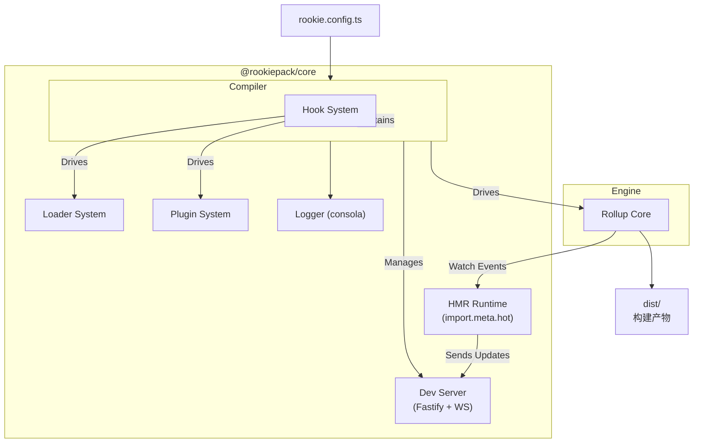

# RookiePack 设计文档

> [!NOTE]
>
> 本设计文档中的所有代码示例、接口定义和命名规范都遵循 [Node.js 项目开发规范](https://narukeu.github.io/articles/frontend-naming-conventions)。关于详细的代码风格、类型命名、注释格式等具体要求，详见该规范文档。

## 1. 项目概述

### 1.1 项目定位

RookiePack 是一个现代化的前端构建工具，采用 Rollup 作为底层引擎，提供 Webpack 风格的 API 和开发体验。
RookiePack 与 Rollup 的关系类似于 **Vite 与 Rollup 的关系** —— 基于 Rollup 提供更高层的抽象和更好的开发体验。

最低运行要求：Node.js 20+

### 1.1.1 兼容性原则：“神似”而非完全兼容

RookiePack 采用“神似”的设计哲学 —— 我们提供 Webpack 风格的 API 和开发体验，但不追求 100% 的兼容性。这意味着：

- **API 设计**：保持 Webpack 核心概念（Entry、Output、Loader、Plugin），但实现细节可能不同
- **配置语法**：大部分 Webpack 配置可以平滑迁移，但某些高级特性可能需要调整
- **生态兼容**：优先构建自己的生态系统，选择性兼容 Webpack 插件
- **迁移成本**：
  - ✅ **常见场景**（约70%）：基础配置、常用 Loader、核心插件等可无缝迁移
  - ⚠️ **高级特性**（约30%）：需要适配或替代方案
    - Pitch Loader → 使用插件系统替代
    - Module Federation → 使用动态导入和 Rollup 手动分包
    - 复杂的 Webpack 魔法注释（如 `/* webpackChunkName */`）→ 使用标准 ES 模块语法
    - Raw Loader 等特殊 Loader → 使用对应的 RookiePack Loader

这种设计让我们能够摆脱历史包袱，专注于提供更好的开发体验。

> **重要提醒**：考虑到已明确不支持 Pitch Loader、Raw Loader 等 Webpack 特性，实际迁移工作可能因项目复杂度而异。例如，对 Pitch 有依赖的 Loader 或利用 Webpack 魔法注释（如 `/* webpackChunkName */`）的代码需要额外调整。**高级特性**（Pitch Loader、Module Federation 等）需重新实现或替代，这可能使迁移比例略高于 30%。我们将在迁移指南中提供这些不兼容特性的替代方案和详细的迁移策略，以避免用户预期与实际情况不符。

### 1.2 核心理念

#### 1.2.1 为什么创建 RookiePack

1. 这个项目起源于我在 React 项目技术选型时的思考。`Vite` 当然是一个非常优秀的项目，但我认为它作为 React 的脚手架并非**最佳选择**，它可能更适合与 `Vue` 等 **“框架”** 配合使用。
2. 我认为 Webpack 这样的设计架构更适合 React 生态。从当前发展趋势来看，React 更像是一个 **“库”** （Library，Next.js 出现了之后我更感觉如此），而 Vue 更像是一个完整的 **“框架”**。对于 React 这种库性质的技术栈，Webpack 的架构理念更加契合。我之前创建的 `narukeu/webpack-react-template` GitHub 仓库正是基于这一思考的实践，虽然整体体验仍有改进空间，也是因为这个仓库让我亲身体会到了 Webpack 迫切需要现代化的时代要求。
3. Webpack 确实背负了十多年前的历史包袱，那个时候的 JavaScript 生态还相当粗糙 —— ES6 规范尚未出现 —— 如今看似理所当然的语法和特性都不存在 —— 回想我初次接触网页开发（那个时候还是前后端不分离的时代，我觉得叫“前端开发”似乎都不合适）的小学和初中时期，IE6 和 IE8 还是主流浏览器，JavaScript 在我印象中更像是一个提供交互效果的简单工具（事实上当年我们老师也是如此说）随着近十年来 ES6+ 的完全普及，JavaScript 已经发展成为一门相当成熟的编程语言，这时候 Webpack 也到了需要现代化的时候。
4. 虽然现在有 Rspack、Turbopack 等基于 Rust 的 Webpack 现代化替代品，但我认为这是一个技术理念的问题。在前端开发中，将构建工具完全使用 Rust 来编写可能并非最佳选择，毕竟前端代码最终还是运行在 JavaScript 环境中。

#### 1.2.2 项目主要特点

1. **统一的构建体验**：基于 Rollup 引擎的双层架构确保开发环境与生产环境的完全一致性，彻底解决 Vite 因使用 esbuild 和 Rollup 混合架构导致的环境差异问题

   **架构权衡说明**：
   - ✅ **一致性优势**：开发和生产环境使用相同的 Rollup 引擎，避免环境差异
   - ⚠️ **性能考量**：Rollup 进行完整打包，开发模式热更新可能不如 Vite 的原生 ESM 快速
   - 🎯 **优化策略**：通过 Rollup 增量编译、持久化缓存和可配置的优化级别来提升性能
   - 🔧 **灵活配置**：提供开发模式性能优化选项（如关闭 Tree-shaking：`treeshake: false`）

   > **设计理念**：我们选择一致性优先于极限速度，认为可预测的构建行为比绝对的构建速度更重要。

2. **"神似"而非完全兼容**：提供 Webpack 风格的熟悉 API，但摆脱历史包袱，采用现代化设计理念。80% 的常见场景可无缝迁移，同时优先考虑性能和开发体验

3. **现代化技术栈**：全面拥抱 ESM 模块系统，TypeScript 作为一等公民，基于 ES2022+ 标准构建，采用严格的类型检查配置（包括 `exactOptionalPropertyTypes`、`noUncheckedIndexedAccess` 等现代化选项），抛弃 CommonJS 等历史包袱。**默认启用完整的 TypeScript 类型检查**，确保代码质量，同时允许开发者根据需要跳过类型检查以提升开发速度

4. **卓越的构建性能**：
   - 基于 Rollup 的优秀 Tree Shaking 和静态分析能力
   - 现代化的钩子系统，简化插件开发
   - 精确的依赖跟踪和增量编译支持

5. **框架深度优化**：专为 React 和 SolidJS 生态量身打造，提供框架特定的 HMR 支持、JSX 优化和开发工具集成。同时保持框架中立性，支持任何 JavaScript 项目

6. **开发者友好**：
   - 统一的 JavaScript/TypeScript 技术栈，前端开发者可直接贡献
   - 现代化 HMR API（`import.meta.hot`），有着与 Vite 相似的体验
   - 完整的 Source Map 链式处理，确保调试体验

#### 1.2.3 与 Rspack/Turbopack 的差异

虽然 Rspack 和 Turbopack 都是优秀的 Webpack 替代品，但 RookiePack 选择了不同的路径：

- **技术栈选择**：我们坚持使用 JavaScript/TypeScript，保持前端工具链的技术栈统一性
- **架构设计**：基于成熟的 Rollup 引擎，而非从零开始用 Rust 重写
- **生态策略**：充分利用 JavaScript 生态（unplugin、Rollup 插件等），而非重新实现所有功能
- **开发体验**：前端开发者可以直接贡献代码、编写插件，无需学习 Rust

#### 1.2.4 核心原则

1. **ESM Only 开发**：RookiePack 自身代码、插件生态全部使用 ESM 模块系统，禁止使用 CommonJS
   - **兼容性解析**：支持解析 npm 生态中的 CommonJS 模块（如 React），无需额外桥接库

2. **配置文件策略**：
   - **推荐使用 ESM 格式**：`.js`、`.mjs` 格式编写配置文件，保持与项目 ESM-Only 原则一致。
   - **TypeScript 支持（未来）**：在项目初期，为保证稳定性，暂时不内置支持 TypeScript 配置文件（如 `rookie.config.ts`）。该功能将在未来版本中作为增强特性引入。
   - **模块解析**：完全依赖 Rollup 的插件化解析机制（如 `@rollup/plugin-node-resolve`），确保解析行为的稳定和可预测性。
3. **TypeScript First**：核心代码必须使用 TypeScript 编写，采用严格的现代化配置（ES2022 目标、bundler 模块解析、完整的类型安全检查）。**构建过程中默认执行完整的 TypeScript 类型检查**，类型错误会阻止构建继续进行，确保代码质量。用户可通过配置选项跳过类型检查以提升开发速度，但不强制用户使用 TypeScript
4. **统一构建管道**：开发和生产环境都使用 Rollup，确保一致性
5. **自身构建简洁**：RookiePack 自身只使用 Rollup + TSC 编译打包

### 1.3 架构决策：双层架构

我们采用 **"Rollup 引擎 + Webpack 风格 Loader 层"** 的双层架构设计：

- **底层（引擎层）**：直接使用 Rollup 作为打包引擎
- **上层（API 层）**：提供 Webpack 风格的 Loader/Plugin API

这种架构让我们既能利用 Rollup 的优秀性能，又能兼容 Webpack 的使用习惯。

#### 1.3.1 双层架构的核心技术选型

为了实现 Webpack 风格 API 与 Rollup 引擎的完美结合，我们采用以下关键技术：

- **unplugin 生态系统**：使用 `unplugin` 作为插件适配层，它提供了统一的插件接口，能够让我们快速适配现有的跨构建工具插件。这是 Vue 团队维护的成熟方案，被 Vite、Nuxt 等项目广泛使用。

- **@rollup/pluginutils**：Rollup 官方工具库，提供文件过滤、路径处理等常用功能，确保我们的 Loader 系统与 Rollup 生态完美契合。

- **Rollup 原生 Source Map 支持**：我们**只**依赖 Rollup 内置的 Source Map 处理能力。当代码经过多次转换（例如 TS -> SWC -> Terser）时，Rollup 会自动将整个链条的 Source Map 正确地合并在一起，生成一个最终指向原始源代码的精确 Source Map。这避免了手动处理多层 Source Map 带来的偏差和复杂性。

- **picomatch**：现代化的 glob 匹配库，支持我们采用的 glob 语法用于 loader test 字段。被 rollup、webpack 等工具广泛使用。

- **magic-string**: 高效的字符串操作库，用于在代码转换过程中进行精确、非破坏性的修改，同时生成高质量的 Source Map。它是 Rollup 生态系统的核心依赖，确保了从源码到最终输出的精确映射。

## 2. 核心概念详解

### 2.1 Entry（入口）

入口是应用程序的起始点。RookiePack 从入口文件开始，递归构建整个依赖图。

- 单入口：适用于 SPA 应用，只有一个入口文件
- 多入口：适用于多页应用，每个页面一个入口

**契约定义**：

```typescript
interface IEntryConfig {
  // 单入口
  entry: string;
  // 或多入口
  entry: {
    [name: string]: string;
  };
}
```

```typescript
// 单入口
export default {
  entry: "./src/index.ts"
};

// 多入口
export default {
  entry: {
    app: "./src/app.ts",
    admin: "./src/admin.ts"
  }
};
```

### 2.2 Output（输出）

定义打包后文件的输出位置和命名规则。

输出配置决定了构建产物放在哪里、叫什么名字。RookiePack 的输出配置与 Webpack 完全兼容，支持所有 Webpack 的占位符。

**代码拆分支持**：
RookiePack 基于 Rollup 的天然代码拆分能力，自动处理动态导入：

```javascript
// 动态导入会自动创建单独的代码块
const LazyComponent = lazy(() => import("./LazyComponent"));
```

Rollup 会自动将动态导入的模块拆分成独立的 chunk 文件，无需额外配置。

**占位符支持**：

- `[name]` - 入口名称
- `[id]` - 模块 ID
- `[hash]` - 基于文件内容计算哈希
- `[ext]` - 文件扩展名
- `[query]` - 查询字符串

**契约定义**：

```typescript
interface IOutputConfig {
  dir: string; // 输出目录，默认 "dist"
  entryFileNames: string; // 入口文件命名，默认 "[name].[hash].js"
  chunkFileNames: string; // chunk文件命名，默认 "chunks/[name].[hash].js"
  assetFileNames: string; // 静态资源命名，默认 "assets/[name].[hash][ext]"
  format: "es" | "umd"; // 输出格式，默认 "es"
  shouldClean: boolean; // 构建前清理目录，默认 true
}
```

### 2.3 Module Resolution（模块解析）

RookiePack 的模块解析完全基于 Rollup 的生态系统，遵循其插件化的解析策略，以确保构建过程的稳定性和一致性。

**核心解析插件**：

- **`@rollup/plugin-node-resolve`**：这是解析 `node_modules` 中第三方模块的核心。它模拟 Node.js 的解析算法，让你可以使用 `import 'some-package'` 的方式导入依赖。
- **`@rollup/plugin-commonjs`**：由于 npm 生态中仍有大量 CommonJS 模块，此插件负责将它们转换为 Rollup 可以理解的 ESM 格式。

**路径别名（Alias）**：
RookiePack 支持路径别名功能，允许你定义更简洁的导入路径，这通过 Rollup 的插件体系实现。

```typescript
// rookie.config.js
export default {
  resolve: {
    alias: {
      "@": "./src" // 将 @ 映射到 src 目录
    }
  }
};
```

**CommonJS 处理策略**：
用户应该始终使用 `import` 语法导入所有模块。RookiePack 会在底层通过 `@rollup/plugin-commonjs` 自动处理 CommonJS 模块的转换，开发者无需关心其内部实现。

```javascript
// 正确：使用 import 导入 CommonJS 模块
import React from "react"; // React 是 CommonJS 格式，会被自动转换

// 错误：RookiePack 是 ESM-Only 项目，不支持 require
const React = require("react"); // ❌ 不支持
```

#### 2.3.1 依赖预构建策略

RookiePack 采用基于 Rollup 的依赖预构建方案来优化开发体验：

**预构建目标**：

- 将 CommonJS 依赖转换为 ESM 格式
- 合并包含多个内部模块的包（如 lodash）
- 缓存依赖构建结果

**与 Vite 的差异**：

- Vite 使用 esbuild 进行依赖预构建，速度更快
- RookiePack 使用 Rollup 进行预构建，保持构建链路一致性
- 通过 Rollup 的 Tree-shaking 能力提供更精确的依赖分析

**实现方案**：

```typescript
// 依赖预构建配置
interface IDependencyPreBuild {
  include?: string[]; // 强制预构建的依赖
  exclude?: string[]; // 排除预构建的依赖
  cacheDir?: string; // 缓存目录，默认 node_modules/.rookiepack
}
```

**缓存策略**：
基于 package.json、pnpm-lock.yaml 等文件的变化检测缓存失效，自动重新预构建依赖。

### 2.4 Loaders（加载器）

> [!NOTE]
>
> Loader 链执行顺序：当同一规则的 use 配置包含多个 Loader 时，按照 Webpack 的惯例，数组最后一个 Loader 最先执行，数组最前面的 Loader 最后执行。这样确保前面的 Loader 可以拿到前置 Loader 处理后的结果。”

Loaders 是文件转换器，负责将非 JavaScript 文件转换为模块。每个 Loader 只做一件事，可以链式调用，在概念上与 Webpack 相似，但在实现上有所简化：

#### 2.4.1 与 Webpack 的差异

#### 2.4.1.1 不支持 pitch 阶段（简化 Loader 开发）

基于 Rollup 的文档和我们的讨论，Pitch 阶段对于 RookiePack 来说不是必要的。
Rollup 的设计理念不同，Rollup 的核心优势在于其强大的 Tree-shaking 能力。它的插件系统是基于钩子（hooks）的，而不是 Webpack 那样的链式 Loader。Rollup 通过静态分析和除屑优化来生成更小的 bundle，这与 Webpack 的 pitch 机制设计初衷不同。

**Pitch 的主要用途可以通过其他方式实现：**
Pitch 阶段的三个主要用途在 RookiePack 中都有替代方案：

- 性能优化/缓存：可以在 Rollup 插件的 load 或 transform 钩子中实现缓存逻辑
- 动态生成内容：Rollup 插件的 resolveId 和 load 钩子组合可以实现虚拟模块
- 短路处理：通过插件的返回值控制是否继续处理

**简化 Loader 开发体验**
不实现 pitch 阶段符合"神似而不完全兼容"原则。这样做的好处：

- 降低学习曲线：开发者不需要理解复杂的双向执行流程
- 减少调试难度：单向的 Loader 链更容易理解和调试
- 提高性能：避免了额外的遍历开销

Rollup 本身提供了多种优化选项，如 treeshake 配置，可以控制除屑优化的程度。当设置 treeshake: false 时，虽然会生成更大的 bundle，但可以提高构建性能。这种权衡机制比 pitch 阶段更直观。

#### 2.4.1.2 不支持 raw loader

Webpack 的 raw loader 可以获取文件的原始 Buffer 内容而非字符串。RookiePack 不支持此特性，但可通过以下方式处理 Buffer 场景：

- **Asset Loader**：对于二进制文件（图片、字体等），使用 `@rookiepack/loader-asset` 处理
- **自定义 Loader**：需要原始 Buffer 的场景，可编写自定义 Loader 在 `transform` 方法中直接读取文件
- **插件方式**：通过 Rollup 插件的 `load` 钩子处理特殊文件格式

#### 2.4.1.3 Loader context API 只实现核心功能，并采用基于 Promise 的现代化异步 API

RookiePack 的 Loader Context API 将采用基于 Promise 的现代化设计（详见 2.4.5 节），废弃 Webpack 中 `this.callback()` 等回调风格的 API，以简化异步操作。

#### 2.4.1.4 仅支持 glob 语法，不再兼容正则表达式

这些简化让 Loader 开发更加直观，同时保持了核心功能的完整性。

#### 2.4.2 Test 字段语法规范

我们仅支持基于 `picomatch` 库的 glob 语法，不再兼容正则表达式：

```typescript
// 支持：glob 语法（picomatch 支持）
{
  test: "**/*.{js,jsx,ts,tsx}",
  use: "@rookiepack/loader-swc"
}

// 支持：函数形式（高级用例）
{
  test: (resourcePath: string) => {
    return resourcePath.includes("components") && resourcePath.endsWith(".tsx");
  },
  use: "@rookiepack/loader-swc"
}
```

**实现基础**：

- 仅使用 `picomatch` 库进行 glob 匹配，与 Rollup 生态保持一致
- 支持 negation patterns (`!pattern`)
- 支持 extglob 语法 (`**/*.{js,ts}`)

#### 2.4.3 Loader 与 Rollup 冲突的问题

一些 loader，比如 `babel-loader` 和 `swc-loader` 本身也是可以处理 `TypeScript` 的，这就导致了和 RookiePack 底层技术产生了冲突。这里以 `rookiepack-loader-swc` 为例，需要定义优先级策略以解决冲突。

##### 2.4.3.1 默认策略：TypeScript 优先

- TypeScript 插件处理 `.ts/.tsx` 文件，**默认执行完整的类型检查**
- SWC Loader 只处理 JSX 语法
- 流程：`.tsx` → TypeScript 转换 (含类型检查) → `.jsx` → SWC 处理 → `.js`

**类型检查策略**：

- **默认模式**：TypeScript 编译阶段执行完整的类型检查，如果类型检查失败则拒绝后续的 SWC 转换操作
- **跳过类型检查**：用户可通过配置选项手动跳过类型检查，仅进行类型剥离和语法转换

##### 2.4.3.2 Override 策略：用户可配置 SWC 完全接管

```typescript
{
  test: "**/*.{ts,tsx}",
  use: {
    loader: "@rookiepack/loader-swc",
    options: {
      override: true  // 强制 SWC 处理所有内容
    }
  }
}
```

##### 2.4.3.3 实现细节

```typescript
// 默认处理流程
class TypeScriptHandler {
  constructor(
    private options: {
      skipTypeCheck?: boolean; // 是否跳过类型检查
      tsconfig?: string;
    } = {}
  ) {}

  async transformAsync(code: string, id: string) {
    if (id.endsWith(".tsx")) {
      // Step 1: TypeScript 转换为 JSX
      const jsxCode = await this.tsPlugin.transform(code, {
        jsx: "preserve", // 保留 JSX 语法
        noEmitOnError: !this.options.skipTypeCheck, // 默认类型检查失败时停止编译
        skipLibCheck: this.options.skipTypeCheck, // 可选：跳过库文件类型检查
        transpileOnly: this.options.skipTypeCheck // 可选：仅转译不检查类型
      });

      // 如果类型检查失败且未跳过检查，则抛出错误
      if (!this.options.skipTypeCheck && jsxCode.diagnostics?.length > 0) {
        throw new Error(
          `TypeScript 类型检查失败: ${jsxCode.diagnostics.map((d) => d.messageText).join(", ")}`
        );
      }

      // Step 2: SWC 处理 JSX
      return await this.swcLoader.transform(jsxCode.outputText, {
        jsx: true
      });
    }
    // 纯 TS 文件直接由 TypeScript 处理
    const result = await this.tsPlugin.transform(code, {
      noEmitOnError: !this.options.skipTypeCheck,
      skipLibCheck: this.options.skipTypeCheck,
      transpileOnly: this.options.skipTypeCheck
    });

    if (!this.options.skipTypeCheck && result.diagnostics?.length > 0) {
      throw new Error(
        `TypeScript 类型检查失败: ${result.diagnostics.map((d) => d.messageText).join(", ")}`
      );
    }

    return result.outputText;
  }
}
```

#### 2.4.4 Loader 中的 HMR 支持

根据 Webpack 的设计理念，HMR（热模块替换）的文件级处理应该在 Loader 层实现，而不是通过独立插件。每个 Loader 负责为其处理的文件类型注入相应的 HMR 代码：

- **CSS Loader**：在开发模式下自动注入样式替换逻辑，当 CSS 文件变化时，无需刷新页面即可更新样式
- **Asset Loader**：处理图片等静态资源的热替换，通过更新 URL 参数触发浏览器重新加载
- **框架相关的 HMR**（如 React Fast Refresh）通过专门的插件实现，因为它需要全局运行时支持

这种设计保持了 Loader 的单一职责原则：Loader 只负责文件转换和相关的 HMR 代码注入，而复杂的 HMR 运行时协调由核心系统管理。

#### 2.4.5 现代化 Loader Context API

**基于 Rollup 插件上下文设计**（而非 webpack/loader-runner）：

RookiePack 的 Loader Context 采用现代化的 API 设计，抛弃 webpack 的历史包袱：

```typescript
interface ILoaderContext {
  // 文件基本信息（对齐 Rollup PluginContext）
  readonly resourcePath: string;
  readonly resourceQuery: string;
  readonly resource: string;

  // 现代化异步支持（Promise-based，而非 callback）
  runAsync<TResult>(fn: () => Promise<TResult>): Promise<TResult>;

  // 依赖管理（简化版）
  addDependency(file: string): void;
  addWatchFile(file: string): void; // 对齐 Rollup 的 addWatchFile

  // 缓存控制
  setCacheable(flag?: boolean): void;

  // 现代化日志系统
  getLogger(name?: string): ILogger;

  // 配置选项（类型安全）
  getOptions<TOptions = Record<string, unknown>>(): TOptions;

  // Rollup 风格的工具方法
  resolveAsync(id: string, importer?: string): Promise<string | null>;
  emitFile(fileOptions: IEmittedFile): string;
}
```

**实现要点**：

- **抛弃 webpack 历史包袱**：不支持 `this.callback()` 等 callback 风格 API
- **基于 Rollup 设计理念**：对齐 Rollup PluginContext 的现代化 API
- 集成 consola 日志系统
- 支持依赖跟踪以实现精确的文件监听

### 2.5 Plugins（插件）

插件可以在构建流程的各个阶段执行自定义逻辑，比 Loader 更强大。插件通过钩子系统与构建流程交互。

开发者现有的 Rollup 插件大多数可直接在 RookiePack 中使用。由于 RookiePack 的插件接口与 Rollup 高度对齐，一个符合 Rollup 插件规范的插件通常可以直接加入 RookiePack 的 plugins 列表。对于需要特殊适配的场景，我们提供 unplugin 存在的适配层来尽量减少迁移工作量。

#### 2.5.1 插件接口契约

```typescript
interface IRookiePackPlugin {
  name?: string;
  enforce?: "pre" | "post"; // 插件执行优先级
  apply(compiler: ICompiler): void;
}

interface ICompiler {
  hooks: ICompilerHooks;
  options: IRookiePackConfig;
  context: string; // 工作目录

  // 编译方法
  runAsync(): Promise<ICompilationResult>;
  watchAsync(): Promise<IRollupWatcher>;
  closeAsync(): Promise<void>;

  // 工具方法
  resolvePlugin(name: string): IRookiePackPlugin | null;
  getLogger(name?: string): ILogger;

  // 通过 Node.js fs 模块检查文件存在。
  fileExists(path: string): boolean;
}

interface ICompilerHooks {
  // 初始化阶段（对应 Rollup 的 buildStart）
  buildStart: AsyncHook<[IInputOptions]>;

  // 解析阶段（对应 Rollup 的 resolveId）
  resolveId: FilterHook<string>;

  // 转换阶段（对应 Rollup 的 transform）
  transform: TransformHook<string, ITransformResult>;

  // 生成阶段（对应 Rollup 的 generateBundle）
  generateBundle: AsyncHook<[IOutputOptions, IBundle]>;

  // 完成阶段（对应 Rollup 的 buildEnd）
  buildEnd: AsyncHook<[Error | undefined]>;
}

// 使用 Rollup 标准的转换结果接口
interface ITransformResult {
  code: string;
  map?: TSourceMapInput | null; // 遵循 Rollup 标准：null 保持现有映射，undefined 无映射
  dependencies?: string[]; // 额外的文件依赖
}

// Source Map 输入类型（完全对齐 Rollup 的 SourceMapInput）
type TSourceMapInput =
  | string
  | { toString(): string }
  | { toJSON(): string }
  | object;
```

#### 2.5.2 插件依赖管理

- 插件可以声明依赖其他插件
- 默认自动调整加载顺序（拓扑排序）
- 用户可通过高级配置手动指定顺序

例如，有 PluginA 和 PluginB 两个插件，若希望 PluginB 在 PluginA 之后执行，可以在 PluginB 中声明 dependencies: ['PluginA']。RookiePack 会据此进行插件的拓扑排序，确保执行顺序。如检测到插件间存在循环依赖，则会发出错误警告以帮助开发者调整配置。

#### 2.5.3 插件与 Loader 的职责分离

在 RookiePack 中，插件（Plugin）和加载器（Loader）有严格的职责划分，这对于维护一个清晰、可预测的构建系统至关重要。

- **Loader 的职责**：**转换（Transform）**。
  - Loader 是一个纯粹的**文件内容转换器**。它的输入是文件内容（字符串或 Buffer），输出是转换后的 JavaScript 代码和 Source Map。
  - 它只关心单个文件的转换，**不关心**文件之间的依赖关系或整个构建流程。
  - **唯一例外**：Loader 可以注入与当前文件相关的 HMR 代码，例如 `css-loader` 注入样式更新代码。

- **Plugin 的职责**：**编排（Orchestrate）**。
  - Plugin 拥有对整个构建生命周期的访问权限，通过钩子（Hooks）在构建的各个阶段执行操作。
  - 它可以修改配置、管理资源、注入全局代码、协调多个 Loader 的工作等。
  - **复杂的 HMR 逻辑**，尤其是需要全局运行时支持的（如 React Fast Refresh），必须由 Plugin 实现。

**简单来说：Loader 负责“做什么”，Plugin 负责“何时做”和“如何做”。**

#### 2.5.4 框架支持插件

RookiePack 通过插件系统支持不同的前端框架。这种设计保持了核心的框架中立性，让用户可以自由选择技术栈。

- **`@rookiepack/plugin-react-refresh`**: 提供 React 完整支持。
  - **设计思路**：此插件严格遵循职责分离原则，其**唯一目标**是实现 **React Fast Refresh**。它不参与 JSX 转换（这是 `@rookiepack/loader-swc` 或类似 Loader 的工作）。
  - **工作原理**：
    1.  在构建启动时（`buildStart` 钩子），它向客户端注入 Fast Refresh 的运行时代码。
    2.  通过 `transform` 钩子，检测由 SWC 或 Babel Loader 转换后的 React 组件代码，并注入 `import.meta.hot.accept` 等 HMR 逻辑，将其与 Fast Refresh 运行时连接起来。
    3.  它与 `@rookiepack/loader-swc` 协同工作，但职责清晰：Loader 负责 JSX 语法转换，Plugin 负责实现热更新逻辑。

- **`@rookiepack/plugin-solid`**: 为 SolidJS 提供类似支持，包括其特有的细粒度响应式优化。

这种“Loader 管转换，Plugin 管刷新”的设计模式，确保了系统的模块化和可维护性，与 Webpack 生态的最佳实践（如 `react-refresh-webpack-plugin`）保持一致。

## 3. 静态资源处理

### 3.1 资源类型定义

```typescript
interface IAssetOptions {
  // 支持的格式
  images: string[]; // 默认: [".png", ".jpg", ".jpeg", ".gif", ".webp", ".svg", ".ico", ".avif"]
  fonts: string[]; // 默认: [".woff", ".woff2", ".ttf", ".otf", ".eot"]
  media: string[]; // 默认: [".mp4", ".webm", ".ogg", ".mp3", ".wav", ".flac", ".aac"]
  others: string[]; // 自定义扩展名，如 [".pdf", ".doc", ".zip"]

  // 内联阈值
  inlineLimit: number; // 默认: ASSET_INLINE_LIMIT (4KB)

  // 输出配置
  output: {
    images: string; // 默认: "assets/images/[name]-[hash][ext]"
    fonts: string; // 默认: "assets/fonts/[name]-[hash][ext]"
    media: string; // 默认: "assets/media/[name]-[hash][ext]"
    others: string; // 默认: "assets/others/[name]-[hash][ext]"
  };

  // 自定义处理
  custom?: Array<{
    test: string; // 仅支持 glob 语法
    handler: (content: Buffer, path: string) => Promise<unknown>;
  }>;
}
```

### 3.2 CSS 处理策略

#### 3.2.1 CSS Modules 支持

通过 `@rookiepack/loader-css` 的配置选项启用：

```typescript
{
  test: "**/*.module.css",
  use: {
    loader: "@rookiepack/loader-css",
    options: {
      modules: true
    }
  }
}
```

#### 3.2.2 PostCSS 集成

PostCSS 通过独立的 loader 提供，可以与 CSS loader 链式使用：

#### 3.2.3 CSS-in-JS

不内置支持，但兼容主流方案（styled-components、emotion 等），它们通过 Babel/SWC 插件工作。

### 3.3 环境变量系统

RookiePack 提供现代化的环境变量支持，与 Vite 体验对齐：

#### 3.3.1 .env 文件支持

- `.env` - 所有环境加载
- `.env.local` - 所有环境加载，但被 git 忽略
- `.env.development` - 开发环境加载
- `.env.production` - 生产环境加载

在构建过程中，RookiePack 内置插件会静态替换源码中出现的 process.env.NODE_ENV 字面量为相应的值，并将 import.meta.env.ROOKIEPACK_xxx 转换为定义好的常量，从而避免运行时查找。

#### 3.3.2 import.meta.env 注入

```typescript
// 开发环境下可用的环境变量
interface IImportMetaEnv {
  readonly MODE: string;
  readonly DEV: boolean;
  readonly PROD: boolean;
  // 用户定义的以 ROOKIEPACK_ 开头的变量
  readonly ROOKIEPACK_API_URL: string;
}

interface IImportMeta {
  readonly env: IImportMetaEnv;
}
```

RookiePack 将自动替换构建代码中的 process.env.NODE_ENV 为当前模式字符串（开发模式下为 "development"，生产模式下为 "production"），以兼容常见库和项目对 process.env.NODE_ENV 的引用。这确保了诸如 React 等库在生产模式下能正确地移除调试代码

#### 3.3.3 安全性

只有以 `ROOKIEPACK_` 开头的变量会被暴露给客户端代码，确保敏感信息不会泄露。

## 4. 配置示例

### 4.1 基础配置

```typescript
// rookie.config.ts
import { defineConfig } from "@rookiepack/core";
import HtmlPlugin from "@rookiepack/plugin-html";

export default defineConfig({
  // 入口配置
  entry: "./src/index.tsx",

  // 输出配置
  output: {
    dir: "dist",
    entryFileNames: "[name].[hash].js",
    chunkFileNames: "chunks/[name].[hash].js", // 动态导入的代码块
    shouldClean: true
  },

  // 解析配置
  resolve: {
    alias: {
      "@": "./src"
    },
    extensions: [".ts", ".tsx", ".js", ".jsx"]
  },

  // 模块规则
  module: {
    rules: [
      {
        test: "**/*.{ts,tsx}", // glob 语法
        use: "@rookiepack/loader-swc"
      },
      {
        test: "**/*.css",
        use: "@rookiepack/loader-css"
      },
      {
        test: "**/*.{png,jpg,gif,svg}",
        use: "@rookiepack/loader-asset"
      }
    ]
  },

  // 插件配置
  plugins: [
    new HtmlPlugin({
      template: "./public/index.html"
    })
  ],

  // 开发服务器
  devServer: {
    port: 3000,
    isHot: true,
    shouldOpen: true
  }
});
```

对于多入口的多页应用，可为每个入口配置单独的 HTML 模板。例如，可在配置中多次使用 HtmlPlugin 或者通过 HtmlPlugin 的选项生成多个 HTML 文件，以对应每个入口页面。

### 4.2 高级配置示例

```typescript
// rookie.config.ts - 带 TypeScript 和 SWC override 的配置
export default defineConfig({
  module: {
    rules: [
      {
        test: "**/*.{ts,tsx}",
        use: [
          {
            loader: "@rookiepack/loader-swc",
            options: {
              override: true, // SWC 完全接管 TS 编译
              jsc: {
                parser: {
                  syntax: "typescript",
                  tsx: true
                },
                transform: {
                  react: {
                    runtime: "automatic"
                  }
                }
              }
            }
          }
        ]
      }
    ]
  },
  plugins: []
});

// 跳过类型检查的配置示例（适用于快速开发）
export const fastDevConfig = defineConfig({
  plugins: [
    createTypeScriptPlugin({
      skipTypeCheck: true, // 跳过类型检查，仅进行类型剥离
      compilerOptions: {
        transpileOnly: true
      }
    })
  ]
});
```

### 4.3 完整配置契约

```typescript
interface IRookiePackConfig {
  entry: string | Record<string, string>;
  output?: IOutputConfig;
  resolve?: IResolveConfig;
  module?: IModuleConfig;
  plugins?: IRookiePackPlugin[];
  devServer?: IDevServerOptions;
  mode?: "development" | "production";
  env?: Record<string, unknown>;
}

interface IResolveConfig {
  alias?: Record<string, string>;
  extensions?: string[];
}

interface IModuleConfig {
  rules: IRule[];
}

interface IRule {
  test: string | string[] | ((resourcePath: string) => boolean);
  use: TUseItem | TUseItem[];
}

type TUseItem =
  | string
  | {
      loader: string;
      options?: Record<string, unknown>;
    };

interface IDevServerOptions {
  port?: number;
  isHot?: boolean;
  shouldOpen?: boolean;
  hmrPort?: number;
  proxy?: Record<string, unknown>;
}
```

## 5. 技术架构

### 5.1 核心包架构 (`@rookiepack/core`)

`@rookiepack/core` 是 RookiePack 的心脏，它整合了构建流程的全部核心逻辑。为了保持内部逻辑的清晰和可维护性，`core` 包内部采用模块化的结构设计：

```
@rookiepack/core/
├── src/
│   ├── compiler/         # 编译器模块
│   │   ├── index.ts      # Compiler 主类，负责编排
│   │   ├── hooks.ts      # 内置的轻量级钩子系统实现
│   │   ├── plugins/      # 内置核心插件（如环境变量、HMR 注入）
│   │   └── loader.ts     # Loader 运行器和上下文实现
│   │
│   ├── dev/              # 开发服务器和 HMR
│   │   ├── server.ts     # 基于 Fastify 的开发服务器
│   │   ├── middleware.ts # 开发中间件
│   │   ├── hmr.ts        # HMR 运行时和 WebSocket 通信逻辑
│   │   └── client.ts     # 注入到客户端的 HMR 客户端代码
│   │
│   ├── config/           # 配置处理模块
│   │   ├── index.ts      # 配置文件加载与解析
│   │   └── schema.ts     # 配置项的类型定义和校验
│   │
│   ├── utils/            # 实用工具函数
│   │   ├── logger.ts     # 基于 consola 的日志系统
│   │   └── fs.ts         # 文件系统相关工具
│   │
│   └── index.ts          # 包主入口，导出核心 API (defineConfig, etc.)
│
├── package.json
└── tsconfig.json
```

**设计解析**：

- **`compiler/`**: 负责将用户的 `rookie.config.ts` 配置转换成 Rollup 可识别的格式，并管理插件和 Loader 的执行流程。其核心是 `hooks.ts`，它定义了整个构建生命周期的钩子，插件系统和 Loader 系统都基于此实现。
- **`dev/`**: 包含所有开发时功能。`server.ts` 使用 `fastify` 启动一个轻量级服务器。它注册了两个关键部分：
  - **开发中间件 (Dev Middleware)**：此逻辑负责处理 HTTP 请求。它会拦截对构建产物（如 `main.js`、`styles.css`）的请求，并从内存中提供由 `compiler` 实时编译生成的文件内容，从而避免了低效的磁盘读写。对于 `public` 目录下的静态文件，它会直接提供服务。
  - **HMR 服务**：集成 `hmr.ts` 提供的 WebSocket 服务。当文件变更时，`compiler` 通知 `hmr` 模块，后者通过 WebSocket 向客户端（`client.ts`）发送更新指令。
- **`config/`**: 专注于配置文件的加载、合并和校验，确保提供给 `compiler` 的配置是合法且类型安全的。
- **`utils/`**: 提供跨模块共享的通用能力，如日志、文件操作等。

这种结构将**构建时**（Compiler）和**运行时**（Dev Server）的逻辑清晰分离，极大地提高了代码的可读性和可维护性。

### 5.2 整体架构图



### 5.3 现代化 HMR 实现

RookiePack 的 HMR（热模块替换）功能是开发体验的核心。我们基于 **Rollup 的监听模式**（其底层使用 `chokidar` 实现文件监听）和 **`fastify-websocket`** 实现了一套高效、现代化的 HMR 架构。

**重要说明**：Rollup 本身不提供 HMR 的运行时逻辑，它只负责在文件变化时重新编译。RookiePack 在此基础上构建了完整的 HMR 体系，其准确性依赖于精确的模块依赖图。当文件更新时，系统会分析依赖关系，智能判断应进行热更新还是回退到页面刷新。

#### 5.3.1 Fastify 与 HMR 的协同工作

我们的开发服务器基于 Fastify 构建，并通过 `fastify-websocket` 插件实现了与客户端的双向通信。

**工作流程**：

1.  **启动与编译**：`rookiepack dev` 命令启动 Fastify 服务器，同时 `compiler` 模块在内存中完成首次构建。
2.  **服务请求 (中间件逻辑)**：当浏览器请求页面（如 `index.html`）或构建产物（如 `main.js`）时，Fastify 服务器内的**开发中间件**会拦截这些请求，并从内存中返回对应的文件内容。
3.  **客户端连接**：浏览器加载的 `main.js` 中包含 HMR 客户端代码，它会主动连接到 Fastify 的 WebSocket 服务，为热更新做准备。
4.  **文件监听与重新编译**：当开发者修改源文件时，Rollup 的 `watch` 模式会检测到变化，并**在内存中**重新编译受影响的模块。当 Rollup 报告构建错误时，DevServer 将通过 WebSocket 向所有客户端发送错误消息（`{ type: 'error', error: {...} }`），通知浏览器显示错误覆盖层。这样开发者可以在页面中直接看到错误详情，修复代码后覆盖层会自动消失。
5.  **HMR 推送**：编译成功后，RookiePack 的 HMR 模块生成更新 `payload`，通过 WebSocket 发送给客户端。
6.  **客户端更新**：客户端接收到 `payload` 后，执行模块热替换或页面刷新。

这种设计将**文件监听与编译**（Rollup）和**实时通信**（Fastify + WebSocket）的职责清晰分离，确保了架构的稳定性和可扩展性。

**实现细节示例**：

以下代码展示了 HMR 插件和开发服务器如何协同工作，其核心理念是利用 Rollup 的插件系统，而非重新实现 `webpack-dev-server` 的复杂架构。

```typescript
// Rollup 插件风格的 HMR 实现
class RookiePackHMRPlugin implements IRollupPlugin {
  name = "rookiepack-hmr";

  buildStart() {
    this._setupFileWatcher();
  }

  handleHotUpdate(file: string) {
    // 基于 Rollup 的模块图进行精确更新
    const moduleGraph = this._getModuleGraph();
    const affectedModules = moduleGraph.getAffectedModules(file);

    this._notifyClient({
      type: "update",
      updates: affectedModules.map((mod) => ({
        path: mod.id,
        timestamp: Date.now()
      }))
    });
  }
}

// 开发服务器（详细的 Rollup + WebSocket 集成）
class DevServer {
  private static readonly DEFAULT_HMR_PORT = 24678;
  private static readonly DEFAULT_BUILD_DELAY = 10;
  private wsServer: WebSocketServer;
  private rollupWatcher: IRollupWatcher;
  private logger = consola.withTag("DevServer");

  constructor(private options: IDevServerOptions) {
    // 1. 初始化 WebSocket 服务器用于客户端通信
    this.wsServer = new WebSocketServer({
      port: options.hmrPort || DevServer.DEFAULT_HMR_PORT
    });

    // 2. 设置 Rollup watcher 配置
    const watchOptions = {
      ...options.rollupConfig,
      watch: {
        buildDelay: DevServer.DEFAULT_BUILD_DELAY,
        chokidar: {
          ignoreInitial: true,
          ignored: ["**/node_modules/**", "**/.git/**"]
        }
      }
    };
    this.rollupWatcher = rollup.watch(watchOptions);
    this._attachWatchEvents();
  }

  private _attachWatchEvents() {
    this.rollupWatcher.on("event", (event) => {
      if (event.code === "BUNDLE_END") {
        this.logger.success("Build successful");
        this.wsServer.clients.forEach((client) => {
          if (client.readyState === WebSocket.OPEN) {
            client.send(JSON.stringify({ type: "reload" }));
          }
        });
      }
    });
  }
}
```

#### 5.3.2 API 设计

RookiePack 使用现代化的 `import.meta.hot` API（有着与 Vite 相似的体验）：

```javascript
// 现代化 HMR API（有着与 Vite 相似的体验）

// import.meta.hot API 需要在构建时注入
if (import.meta.hot) {
  // 这个 API 需要自己实现，不是浏览器原生支持
if (import.meta.hot) {
  import.meta.hot.accept("./math.js", (newModule) => {
    updateMath(newModule);
  });

  import.meta.hot.dispose((data) => {
    data.state = currentState;
  });

  if (import.meta.hot.data) {
    currentState = import.meta.hot.data.state;
  }
}
```

开发环境中，为简化热更新，输出的文件名默认不包含内容哈希。RookiePack 通过在模块请求URL添加 `?t=<timestamp>` 查询参数来强制浏览器获取最新资源，确保 HMR 生效的同时避免频繁更改文件名。

**核心理念**：利用 Rollup 的插件系统，而非重新实现 webpack-dev-server 的复杂架构

```typescript
// Rollup 插件风格的 HMR 实现
class RookiePackHMRPlugin implements IRollupPlugin {
  name = "rookiepack-hmr";

  buildStart() {
    this._setupFileWatcher();
  }

  handleHotUpdate(file: string) {
    // 基于 Rollup 的模块图进行精确更新
    const moduleGraph = this._getModuleGraph();
    const affectedModules = moduleGraph.getAffectedModules(file);

    this._notifyClient({
      type: "update",
      updates: affectedModules.map((mod) => ({
        path: mod.id,
        timestamp: Date.now()
      }))
    });
  }
}

// 开发服务器（详细的 Rollup + WebSocket 集成）
class DevServer {
  private static readonly DEFAULT_HMR_PORT = 24678;
  private static readonly DEFAULT_BUILD_DELAY = 10;
  private wsServer: WebSocketServer;
  private rollupWatcher: IRollupWatcher;
  private logger = consola.withTag("DevServer");

  constructor(private options: IDevServerOptions) {
    // 1. 初始化 WebSocket 服务器用于客户端通信
    this.wsServer = new WebSocketServer({
      port: options.hmrPort || DevServer.DEFAULT_HMR_PORT
    });

    // 2. 设置 Rollup watcher 配置
    const watchOptions = {
      ...options.rollupConfig,
      watch: {
        buildDelay: DevServer.DEFAULT_BUILD_DELAY,
        chokidar: {
          ignoreInitial: true,
          ignored: ["**/node_modules/**", "**/.git/**"]
        }
      }
    };
    this.rollupWatcher = rollup.watch(watchOptions);
    this._attachWatchEvents();
  }

  private _attachWatchEvents() {
    this.rollupWatcher.on("event", (event) => {
      if (event.code === "BUNDLE_END") {
        this.logger.success("Build successful");
        this.wsServer.clients.forEach((client) => {
          if (client.readyState === WebSocket.OPEN) {
            client.send(JSON.stringify({ type: "reload" }));
          }
        });
      } else if (event.code === "ERROR") {
        this.logger.error("Build error:", event.error);
        // 向所有客户端发送错误信息，用于显示错误覆盖层
        this.wsServer.clients.forEach((client) => {
          if (client.readyState === WebSocket.OPEN) {
            client.send(
              JSON.stringify({
                type: "error",
                error: {
                  message: event.error.message,
                  stack: event.error.stack,
                  loc: event.error.loc
                }
              })
            );
          }
        });
      }
    });
  }
}
```

### 5.4 日志系统

RookiePack 使用 `consola` 作为底层日志库，并提供轻量级封装以支持 Webpack 风格的 `getLogger` API：

```typescript
// 正确的导入方式（consola v3.x）
import { consola } from "consola";

// Loader Context 中使用
class LoaderContext {
  getLogger(name?: string) {
    // 返回 consola 实例，添加上下文信息
    return consola.withTag(name || this.resourcePath);
  }
}

// Plugin 中使用
class BasePlugin {
  constructor() {
    this.logger = consola.withTag(this.constructor.name);
  }

  apply(compiler: ICompiler) {
    compiler.hooks.compile.tap(this.constructor.name, () => {
      this.logger.info("Plugin is running");
    });
  }
}
```

#### 5.4.1 Consola 集成说明

文档中正确使用 `consola.withTag` 来创建带上下文的 logger。

**创建带标签的 Logger**：Consola 的 `withTag` 方法会返回一个新实例，其日志输出附带指定 Tag（[参考：Consola 文档](https://github.com/unjs/consola/blob/main/README.md)）。实践中，每个 Loader/Plugin 使用各自的 tag，有助于调试时区分日志来源。

**多级日志功能**：Consola 支持多种日志级别和报告器，**未来可配置日志等级**（例如通过环境变量控制 debug 输出），以提升在不同环境下的调试体验：

```typescript
// 环境变量控制日志级别
const logLevel =
  process.env.ROOKIEPACK_LOG_LEVEL ||
  (process.env.NODE_ENV === "development" ? "debug" : "info");

consola.level = logLevel;
```

#### 5.4.2 日志系统特性

- **继承 consola 的所有功能**：彩色输出、日志级别、格式化等
- **自动添加上下文信息**：loader/plugin 名称、文件路径等
- **开发模式默认 debug 级别**，生产模式默认 info 级别
- **统一的错误报告**：集成到错误覆盖层和编译统计中
- **可扩展性**：支持自定义报告器和日志格式，与 Consola 生态完全兼容

#### 5.4.3 调试体验优化

通过 **Tag 系统**，开发者可以轻松过滤和定位特定组件的日志：

```bash
# 示例输出
[rookiepack:typescript] Processing file: src/index.ts
[rookiepack:css] Injecting style: src/style.css
[rookiepack:hmr] File changed: src/component.tsx
```

### 5.5 动态配置加载策略

#### 5.5.1 TypeScript 配置文件处理

- **专用场景**：TypeScript 配置文件（`rookie.config.ts`、`eslint.config.ts`）的即时编译
- **即时编译**：将 TypeScript 配置文件即时编译为 JavaScript 并执行
- **类型安全**：保持配置文件的完整 TypeScript 支持和类型检查
- **缓存优化**：自动缓存编译结果，提升配置加载速度

#### 5.5.2 模块系统互操作

- **ESM/CJS 双向兼容**：`require()` 可直接加载同步 ESM 模块
- **完整的条件导出**：支持 `package.json` exports 字段的所有特性

### 5.6 钩子系统 (Hook System)

RookiePack 的插件架构核心是一个内置于 `@rookiepack/core` 的轻量级钩子系统。该系统**受 Webpack Tapable 启发**，但经过了现代化改造和简化，并非一个独立的 `@rookiepack/tapable` 包。我们选择将其作为内部实现，旨在降低复杂性、减少依赖，并与基于 Rollup 的构建生命周期更紧密地集成。

#### 5.6.1 设计原则

1.  **内部实现，而非独立包**：钩子系统是 `@rookiepack/core` 的一部分，不作为单独的 npm 包发布。这确保了核心逻辑的内聚性，并避免了额外的包管理开销。
2.  **简化 API**：我们抛弃了 Tapable 中不常用或过于复杂的钩子类型（如 `AsyncParallelBailHook`、`LoopHook` 等），只保留了最核心的几种模式，使插件开发更直观。
3.  **对齐 Rollup 生命周期**：钩子的设计与 Rollup 的核心构建阶段（如 `buildStart`, `resolveId`, `transform`, `generateBundle`）保持一致，确保插件逻辑能精确地介入构建流程。
4.  **类型安全**：所有钩子都提供严格的 TypeScript 类型定义，确保插件开发者在编写钩子回调时能获得完整的类型提示和安全检查。

#### 5.6.2 支持的核心 Hook 类型

为了满足不同的插件需求，RookiePack 实现了一个小而精的钩子集合，足以覆盖绝大多数场景：

- **`AsyncSeriesHook`**: 异步串行钩子。注册的异步任务会按顺序依次执行。
- **`AsyncSeriesWaterfallHook`**: 异步串行瀑布钩子。与 `AsyncSeriesHook` 类似，但前一个任务的返回值会作为后一个任务的输入。这在需要对同一份数据进行连续异步处理的场景中非常有用（例如，代码转换链）。
- **`SyncHook`**: 同步钩子。注册的任务会按顺序同步执行。
- **`SyncWaterfallHook`**: 同步瀑布钩子。同步版本的 `AsyncSeriesWaterfallHook`。

这种简化的设计使得插件开发者无需在十几种 Tapable 钩子中做选择，只需根据“是否异步”和“是否需要传递数据”这两个维度来决定使用哪种钩子。

#### 5.6.3 编译器核心钩子

`Compiler` 对象暴露了一系列核心钩子，允许插件在构建生命周期的关键节点执行操作。这些钩子与 Rollup 的插件钩子在概念上是一一对应的：

```typescript
interface ICompilerHooks {
  /**
   * 构建开始时触发，对应 Rollup 的 `buildStart`。
   * 适合执行初始化操作。
   * 类型：AsyncSeriesHook
   */
  buildStart: AsyncSeriesHook<[IInputOptions]>;

  /**
   * 模块解析时触发，对应 Rollup 的 `resolveId`。
   * 用于自定义模块路径解析逻辑。插件可以返回一个解析路径，或者返回 null/undefined 以交由下一个插件处理。
   * 类型：AsyncSeriesWaterfallHook
   */
  resolveId: AsyncSeriesWaterfallHook<[string, string | undefined]>;

  /**
   * 模块转换时触发，对应 Rollup 的 `transform`。
   * 这是 Loader 和插件对模块内容进行修改的核心钩子。
   * 类型：AsyncSeriesWaterfallHook
   */
  transform: AsyncSeriesWaterfallHook<[string, string]>; // code, id

  /**
   * Bundle 生成阶段触发，对应 Rollup 的 `generateBundle`。
   * 此时可以访问和修改最终生成的代码块（Chunks）。
   * 类型：AsyncSeriesHook
   */
  generateBundle: AsyncSeriesHook<[IOutputOptions, IBundle]>;

  /**
   * 构建结束时触发，对应 Rollup 的 `buildEnd`。
   * 适合执行清理工作或构建后分析。
   * 类型：AsyncSeriesHook
   */
  buildEnd: AsyncSeriesHook<[Error?]>;
}
```

## 6. 契约式编程与接口设计

RookiePack 采用严格的契约式编程思想，通过明确的 TypeScript 接口定义确保各组件间的正确协作。

### 6.1 完整的 Loader 契约

RookiePack 的 Loader 接口设计对齐 Rollup PluginContext，提供两种实现方式以满足不同复杂度的转换需求：

#### 6.1.1 两种实现方式

**简单转换模式（`transform`）**：

- 适用于基础代码转换场景
- 框架自动处理 Source Map 链接
- 在调用下一个 Loader 前自动获取 `this.getCombinedSourcemap()` 来合并映射。
  **高级控制模式（`transformWithMap`）**：

- 需要手工控制 Source Map 的复杂转换
- 开发者自行返回完整的转换结果和 Source Map
- 如果返回 `map` 为 `null` 表示保留前序映射

```typescript
interface ILoaderDefinition {
  name: string;
  // 简单转换（自动处理 Source Map 链）
  transform?(this: ILoaderContext, code: string): string | Promise<string>;
  // 高级转换（需要手动处理 Source Map）
  transformWithMap?(
    this: ILoaderContext,
    code: string,
    map?: TSourceMapInput
  ): ITransformResult | Promise<ITransformResult>;
}

// 转换结果必须包含 Source Map 信息
interface ITransformResult {
  code: string;
  map?: TSourceMapInput | null; // null 表示保持现有映射
  dependencies?: string[]; // 新增的文件依赖
  isCacheable?: boolean; // 是否可缓存
}
```

#### 6.1.2 Loader Context 完整接口

Loader Context 接口已经对齐 Rollup PluginContext，提供了 `addWatchFile`、`emitFile` 等方法。我们检查了常用功能覆盖情况：

```typescript
// Loader Context 的详细定义（完全对齐 Rollup PluginContext）
interface ILoaderContext {
  readonly resourcePath: string;
  readonly resourceQuery: string;
  readonly resource: string;

  // 当前构建模式和环境信息
  readonly mode: "development" | "production"; // Loader 可感知当前模式
  readonly rootContext: string; // 项目根路径，方便 Loader 拼接绝对路径

  // 直接使用 Rollup 的 Source Map API
  getCombinedSourcemap(): SourceMap; // 对齐 Rollup 的 this.getCombinedSourcemap()

  // 异步操作
  runAsync<TResult>(fn: () => Promise<TResult>): Promise<TResult>;

  // 依赖管理（对齐 Rollup PluginContext）
  addDependency(file: string): void;
  addWatchFile(file: string): void; // 直接使用 Rollup 的 addWatchFile
  setCacheable(flag?: boolean): void;

  // 工具方法（对齐 Rollup PluginContext）
  getLogger(name?: string): ILogger;
  getOptions<TOptions = any>(): TOptions;
  resolveAsync(id: string, importer?: string): Promise<string | null>; // 使用 Rollup 的 resolve
  emitFile(fileOptions: IEmittedFile): string; // 使用 Rollup 的 emitFile
}

interface IEmittedFile {
  type: "asset" | "chunk";
  fileName?: string;
  source?: string | Uint8Array;
  name?: string;
}
```

**说明**：

- **当前模式信息**：通过 `this.mode` 让 Loader 感知开发或生产模式，也可通过 `import.meta.env.DEV` 实现
- **项目根路径**：`this.rootContext` 便于 Loader 拼接绝对路径或生成其他文件

### 6.2 插件系统契约扩展

#### 6.2.1 Hook 调用机制详解

各类 Hook 的执行逻辑和先后顺序取材自 Rollup 插件钩子的行为：

**FilterHook 执行逻辑**（如 `resolveId`）：

- **按顺序执行，返回首个非 null 结果则终止后续钩子**（Rollup 中也是 first-return wins 的策略）
- 多个插件并存时，优先级决定执行顺序
- 适用于需要唯一结果的场景

**TransformHook 执行逻辑**（如 `transform`）：

- 类似 **Waterfall 模式**，依次将前一个插件输出代码传递给下一个插件
- 最终产出汇总的 Source Map
- 确保转换链的完整性和 Source Map 准确性

**AsyncHook 执行逻辑**（如 `buildStart/buildEnd`）：

- **并行执行**，不相互阻塞
- 适用于初始化和清理工作
- 各插件可以独立进行耗时操作

#### 6.2.2 插件接口定义

（以下接口定义与 2.5.1 节中所述基本一致，重复之处将不再赘述，仅列出扩展部分）

```typescript
// 扩展插件定义，支持执行顺序控制和依赖声明
interface IRookiePackPlugin {
  name?: string;
  enforce?: "pre" | "post";
  apply(compiler: ICompiler): void;
  dependencies?: string[]; // 新增：插件依赖声明
}

// ICompiler 接口已在 2.5.1 节中定义，这里仅展示新增的 ICompilationResult 相关接口
interface ICompilationResult {
  isSuccess: boolean;
  errors: ICompilationError[];
  warnings: ICompilationWarning[];
  stats: ICompilationStats;
}

interface ICompilationStats {
  duration: number;
  assets: IAssetInfo[];
  chunks: IChunkInfo[];
}
```

### 6.3 开发服务器契约

```typescript
interface IDevServer {
  startAsync(): Promise<void>;
  stopAsync(): Promise<void>;
  reload(): void;

  // HMR 相关
  handleHotUpdate(file: string): Promise<void>;
  sendMessage(message: IHMRMessage): void;
}

interface IHMRMessage {
  type: "connected" | "update" | "full-reload" | "error" | "pong";
  updates?: IHotUpdate[];
  error?: ICompilationError;
}

interface IHotUpdate {
  path: string;
  timestamp: number;
  type: "js-update" | "css-update";
}
```

### 6.4 契约验证与错误处理

所有接口实现都应包含运行时验证：

```typescript
// 配置验证示例
const validateConfig = (config: IRookiePackConfig): IValidationResult => {
  const errors: string[] = [];

  // Entry 验证
  if (!config.entry) {
    errors.push("Entry is required");
  }

  // Output 验证
  if (config.output?.dir && !path.isAbsolute(config.output.dir)) {
    errors.push("Output dir must be absolute path");
  }

  // Module rules 验证
  config.module?.rules?.forEach((rule, index) => {
    if (!rule.test) {
      errors.push(`Rule ${index}: test is required`);
    }
    if (!rule.use) {
      errors.push(`Rule ${index}: use is required`);
    }
  });

  return {
    isValid: errors.length === 0,
    errors
  };
};
```

通过严格的契约定义和验证，RookiePack 能够在开发阶段就发现配置和使用错误，提供更好的开发体验。

### 6.5 Loader 接口使用指南

RookiePack 的 Loader 接口提供两种实现方式，开发者应根据需求选择：

#### 6.5.1 简单转换模式

**适用场景**：基础代码转换，不需要复杂 Source Map 控制

```typescript
// 实现 transform 方法用于基础代码转换
transform(code: string, id: string) {
  const result = someTransform(code);
  return { code: result }; // 框架自动处理 Source Map 链接
}
```

**框架行为**：

- 框架自动调用 `this.getCombinedSourcemap()` 合并前序映射
- 自动处理 Source Map 链式传递
- 简化开发者的实现复杂度

#### 6.5.2 高级控制模式

**适用场景**：需要精确控制 Source Map 生成的复杂转换

```typescript
// 实现 transformWithMap 方法完全控制 Source Map
transformWithMap(code: string, id: string) {
  const { code: transformedCode, map } = someComplexTransform(code);
  return { code: transformedCode, map }; // 完全控制 Source Map
}
```

**开发者责任**：

- 自行生成或处理 Source Map
- 确保 Source Map 的准确性
- 处理 Source Map 的链式合并

### 6.6 异常与错误处理

RookiePack 在以下场景应用契约检查，确保**契约式编程**带来的可靠性提升：

#### 6.6.1 配置阶段验证

- **启动时验证**：对 `IRookiePackConfig` 进行 schema 验证，如入口、输出路径的格式有效性
- **早期错误发现**：在启动时即验证配置，防止错误配置继续执行
- **友好错误提示**：配置错误时提供明确的修改建议

#### 6.6.2 运行时契约检查

- **TypeScript 类型约束**：利用 TypeScript 类型定义强约束（例如 Loader 必须返回 `code`和`map`）
- **运行时检测**：当 Loader 返回不符合 `ITransformResult` 的对象时给出明确错误消息
- **运行时验证示例**：

```typescript
// 验证 Loader 返回结果
function validateLoaderResult(
  result: any,
  loaderName: string
): ITransformResult {
  if (typeof result !== "object" || result === null) {
    throw new Error(
      `Loader "${loaderName}" must return an object with code property`
    );
  }

  if (typeof result.code !== "string") {
    throw new Error(`Loader "${loaderName}" must return { code: string }`);
  }

  return result as ITransformResult;
}
```

#### 6.6.3 错误响应机制

当契约被违反时系统如何响应：

- **构建中止**：契约违反时抛出异常、中止构建
- **HMR 错误覆盖层**：通过 HMR 错误覆盖层提示开发者，显示详细错误信息
- **控制台日志**：详细记录错误上下文、调用栈和修复建议
- **错误恢复**：文件修复后自动重新编译，错误覆盖层自动消失

## 8. 代码规范

### 8.1 命名规范

详见 [Node.js 项目开发规范](/articles/frontend-naming-conventions)，本项目严格遵循以下核心要求：

- **TypeScript 类型命名**：Interface 使用 `I` 前缀，Type 使用 `T` 前缀，Enum 使用 `E` 前缀
- **变量和函数**：使用 camelCase，异步函数以 `Async` 结尾，尽量使用箭头函数。
- **常量**：使用 UPPER_SNAKE_CASE
- **私有方法**：使用 `_` 前缀
- **布尔值**：使用 `is`、`has`、`can`、`should`、`will` 等前缀
- **文件名**：使用 kebab-case

### 8.2 注释规范

所有公共 API 必须包含 TSDoc 注释：

````typescript
/**
 * 编译指定的入口文件
 * @param entry - 入口文件路径
 * @param options - 编译选项
 * @returns Promise<TCompilationResult>
 * @example
 * ```typescript
 * const result = await compileAsync("./src/index.ts", { mode: "production" });
 * ```
 */
export const compileAsync = async (
  entry: string,
  options?: ICompileOptions
): Promise<TCompilationResult> => {
  // 实现
};
````

## 9. 分包策略

基于实际架构需求和维护复杂度考虑，采用适度分包策略：

### 9.1 核心包结构

RookiePack 采用高度集成的分包策略，旨在提供开箱即用的核心功能，同时保持生态系统的可扩展性。

- **`@rookiepack/core`**: 绝对的核心。它包含了编译器（Compiler）、开发服务器（Dev Server）、HMR 运行时、内置的轻量级钩子系统以及开发中间件（Dev Middleware）。我们将这些紧密耦合的功能内聚在一起，是为了提供一个更高效、更一致的开发体验，并简化依赖管理。
- **`@rookiepack/cli`**: 命令行接口。这是一个轻量级的包，负责解析命令行参数，并调用 `@rookiepack/core` 中的相应功能。
- **Loaders 和 Plugins**: 例如 `@rookiepack/loader-swc`、`@rookiepack/plugin-react-refresh` 等。这些是独立发布的可选模块，允许用户根据项目需求按需扩展构建能力。

这种策略的核心优势在于：

- **简化安装**: 用户只需安装 `@rookiepack/core` 和 `@rookiepack/cli` 即可获得完整的开发和构建能力。
- **降低维护成本**: 核心逻辑集中管理，避免了复杂的包间依赖和版本同步问题。
- **清晰的边界**: 核心功能与可扩展功能（Loaders/Plugins）的界限分明。

```
@rookiepack/core           # 核心编译器（包含内置钩子系统、DevServer、HMR、Dev Middleware）
@rookiepack/cli            # 命令行工具

// 官方 Loaders
@rookiepack/loader-swc     # SWC 加载器
@rookiepack/loader-css     # CSS 加载器
@rookiepack/loader-asset   # 资源加载器
@rookiepack/loader-postcss # PostCSS 加载器

// 官方 Plugins
@rookiepack/plugin-react-refresh   # React 支持
@rookiepack/plugin-solid   # SolidJS 支持
@rookiepack/plugin-html    # HTML 插件
```

### 9.2 Monorepo 管理策略

本项目 Monorepo 采用 **集中管理共享配置** 的策略，避免循环依赖并简化维护：

#### 9.2.1 共享配置管理

在仓库根目录设置 `shared/` 文件夹，存放 ESLint、Prettier、TypeScript 等工具的通用配置文件。各子包通过文件路径引用这些配置：

```
shared/
├── tsconfig.base.json     # TypeScript 基础配置
├── .eslintrc.js          # ESLint 共享规则
├── jest.config.js        # Jest 测试配置
└── rollup.config.base.js # Rollup 构建基础配置

packages/
├── core/
│   └── tsconfig.json     # extends: "../../shared/tsconfig.base.json"
├── cli/
│   └── tsconfig.json     # extends: "../../shared/tsconfig.base.json"
└── ...

tsconfig.json             # Workspace root - 项目引用协调器
```

#### 9.2.2 文件引用的优势

- **避免循环依赖**：共享配置不是 npm 包，从根本上杜绝了配置包反过来依赖构建工具的循环引用
- **简化依赖管理**：子包无需声明对共享配置的依赖，统一由 pnpm workspace 管理
- **提升一致性**：保证所有子包遵循相同的编译及代码规范配置，提高协作开发效率
- **简化发布流程**：共享配置不作为包发布，无需管理版本号和发布流程

#### 9.2.3 TypeScript 基础配置详解

RookiePack 采用统一的 TypeScript 配置策略，通过 `shared/tsconfig.base.json` 提供严格的类型检查和现代化的编译选项。

##### 核心配置原则

1. **现代化目标**：采用 ES2022 作为编译目标，充分利用现代 JavaScript 特性
2. **严格类型检查**：启用所有严格模式选项，确保代码质量
3. **模块化优先**：全面拥抱 ESM 模块系统，配合 bundler 模块解析策略
4. **构建工具友好**：针对 Rollup 等现代打包工具进行优化配置

##### `shared/tsconfig.base.json` 核心配置理念

为了确保整个项目代码库的现代化、健壮性和一致性，我们在 `shared/tsconfig.base.json` 中定义了一套严格的基准配置。我们不在此展示完整的 JSON 文件，而是提炼其核心设计理念：

1.  **现代化 JavaScript 基准**
    - **`"target": "ES2022"`**: 代码编译到现代的 JavaScript 版本，以充分利用语言新特性并获得更好的性能。
    - **`"module": "ESNext"`** 和 **`"moduleResolution": "bundler"`**: 全面拥抱 ESM 模块系统，并采用与现代构建工具（如 Vite, Rollup）一致的模块解析策略，确保与生态系统无缝衔接。

2.  **极致的类型安全策略**
    - **`"strict": true`**: 启用所有严格类型检查选项，这是高质量 TypeScript 项目的基石。
    - **`"exactOptionalPropertyTypes": true`**: 更精确地处理可选属性，杜绝 `undefined` 被意外赋值给可选属性的场景。
    - **`"noUncheckedIndexedAccess": true`**: 对数组和对象的索引访问强制进行类型检查，避免因访问不存在的索引而导致的运行时错误。
    - **`"useUnknownInCatchVariables": true`**: 将 `catch` 子句中的错误变量类型视为 `unknown`，强制开发者在处理错误前进行类型收窄，提升了代码的健壮性。

3.  **面向 Monorepo 和库开发**
    - **`"composite": true"`**: 启用项目引用（Project References），这是在 Monorepo 架构下实现增量构建和清晰依赖关系的关键。
    - **`"declaration": true"`** 和 **`"declarationMap": true"`**: 自动生成类型声明文件 (`.d.ts`) 和对应的 Source Map，为下游消费者提供完整的类型信息和源码级别的调试体验。

通过这套配置，RookiePack 从底层确保了其所有代码包都遵循最高的工程化标准。

##### 子包 tsconfig.json 示例

```json
{
  "extends": "../../shared/tsconfig.base.json",
  "compilerOptions": {
    // 覆盖特定于包的设置
    "rootDir": "./src",
    "outDir": "./dist"
  },
  "include": ["src/**/*"],
  "exclude": ["dist", "node_modules", "**/*.test.ts"]
}
```

##### Workspace Root tsconfig.json 设计

在 monorepo 项目的根目录，我们采用项目引用（Project References）的方式来组织整个工作区的 TypeScript 编译：

```json
{
  "files": [],
  "references": [
    { "path": "./packages/core" },
    { "path": "./packages/cli" },
    { "path": "./packages/loaders/swc" },
    { "path": "./packages/loaders/css" },
    { "path": "./packages/loaders/asset" }
    // 以此类推
  ]
}
```

**设计说明**：

1. **空 files 数组**：根目录的 tsconfig.json 不直接编译任何文件，仅作为项目引用的协调器
2. **项目引用**：通过 `references` 字段声明所有子包的依赖关系，支持 TypeScript 的增量编译和并行构建
3. **构建顺序**：TypeScript 会自动分析依赖关系，按正确顺序编译各个子包
4. **IDE 支持**：提供完整的跨包类型检查和导航功能

**优势**：

- **增量编译**：只重新编译发生变化的包及其依赖包
- **并行构建**：无依赖关系的包可以并行编译，提高构建效率
- **类型安全**：跨包引用时提供完整的类型检查
- **开发体验**：IDE 可以正确处理跨包的代码导航和重构

**使用方式**：

```bash
# 编译整个工作区
tsc --build

# 增量编译（仅编译变化的部分）
tsc --build --incremental

# 强制重新编译所有包
tsc --build --force
```

##### 配置特性说明

**现代化特性**：

- `target: "ES2022"`：支持 top-level await、class fields 等现代特性
- `moduleResolution: "bundler"`：专为 Rollup/Vite 等现代构建工具设计
- `verbatimModuleSyntax: true`：确保 import/export 语法的严格性

**类型安全**：

- `exactOptionalPropertyTypes: true`：精确区分 `undefined` 和未定义属性
- `noUncheckedIndexedAccess: true`：索引访问添加 `undefined` 检查
- `useUnknownInCatchVariables: true`：catch 块使用 `unknown` 类型

**构建优化**：

- `importHelpers: true`：使用 tslib 减小输出体积
- `isolatedModules: true`：支持单文件编译，提高构建工具兼容性
- `composite: true`：启用项目引用，支持增量编译

### 9.3 可选兼容层（独立仓库）

对于需要使用 Webpack 特定功能的用户，我们提供可选的兼容层包（不在主 monorepo 中）：

```
@rookiepack/compat-webpack-loader # Webpack Loader 适配器
@rookiepack/compat-webpack-plugin # Webpack Plugin 适配器
```

这些包不是核心功能，仅为特殊迁移场景提供支持。我们鼓励用户使用原生的 RookiePack 生态。

## 10. 术语表

### 核心概念

- **Entry（入口）**：应用程序的起始点，RookiePack 从此开始构建依赖图
- **Loader（加载器）**：文件转换器，将非 JavaScript 文件转换为模块
- **Plugin（插件）**：在构建流程各阶段执行自定义逻辑的扩展机制，通过内置的钩子系统与编译器交互
- **HMR（热模块替换）**：在不刷新页面的情况下更新模块的技术
- **双层架构**：Rollup 引擎作为底层，Webpack 风格 API 作为上层的设计模式
- **ESM Only**：仅使用 ES 模块系统，抛弃 CommonJS 的开发原则
- **Contract-based API**：基于明确接口约定的编程方式
- **Tree Shaking**：移除未使用代码的优化技术
- **SourceMap 链式合并**：多次转换时保持调试信息准确性的技术
- **Unplugin**：跨构建工具的插件适配层，统一插件接口

## 11. 附录

### 11.1 第三方依赖表

#### 第三方库选择标准

RookiePack 采用充分解耦的设计理念，优先使用成熟的第三方库而非重复造轮子。选择第三方库需遵循以下原则：

1. **现代化程度**：库必须足够现代化，支持 ES2024 标准，拥抱最新的 JavaScript/TypeScript 特性
2. **社区采用度**：拥有较大的用户基数和活跃的社区，确保生态支持和问题解答
3. **持续维护**：项目正在活跃开发中，有定期的版本发布和 issue 处理
4. **架构兼容性**：使用该库不会严重违反 RookiePack 的设计原则（ESM Only、TypeScript First 等）
5. **成熟稳定**：已经达到产品级可用状态，成熟度与现代化程度不冲突

下表列出了核心依赖：

| 依赖名称                  | 用途说明                  | 备注/生态 |
| ------------------------- | ------------------------- | --------- |
| rollup                    | 底层打包引擎              | 核心      |
| @rollup/plugin-\*         | 官方插件生态              | 核心      |
| @rollup/plugin-typescript | TypeScript 编译支持       | 核心      |
| typescript                | TypeScript 编译器         | 核心      |
| tslib                     | TypeScript 运行时辅助函数 | 核心      |
| unplugin                  | 跨构建工具插件适配层      | 仅必要时  |
| consola                   | 日志系统                  | unjs      |
| jiti                      | TypeScript 配置加载       |           |
| fastify                   | 现代 Web 框架             |           |
| ws                        | WebSocket 通信            |           |
| picomatch                 | glob 匹配                 |           |
| magic-string              | 字符串操作                |           |
