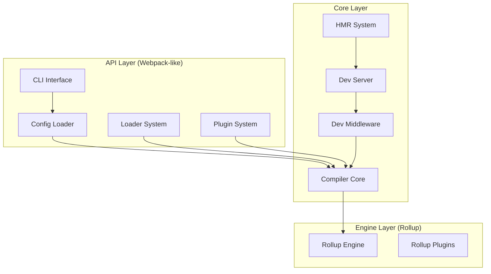

# RookiePack 设计文档

## 一、项目概述

### 1.1 项目定位

RookiePack 是一个现代化的前端构建工具，采用 Rollup 作为底层引擎，提供 Webpack 风格的 API 和开发体验。
RookiePack 与 Rollup 的关系类似于 **Vite 与 Rollup 的关系** —— 基于 Rollup 提供更高层的抽象和更好的开发体验。

### 1.2 核心理念

#### 为什么创建 RookiePack？

1. 设计这个项目来自于我在开发 `React` 项目进行技术选型，我认为 `Vite` 作为 `React` 的脚手架不是**特别适合** —— 当然这里没有批评 `Vite` 的意思 —— `Vite` 当然是一个很优秀的项目 —— 我认为它可能更适合去开发 `Vue` 这类和它更密切的项目。
2. 我认为 `WebPack` 这样的设计架构更适合 `React` —— 因为从目前 `React` 生态圈发展的角度来看，`React` 比 `Vue` 更像一个“库”（Library），而 `Vue` 更完整，更像一个“框架”，对于 `React` 这种“库”，我认为用`WebPack` 更适合。我之前创建了 `narukeu/webpack-react-template` 这个 GitHub 仓库就是我对新 React 技术栈 `+` Webpack 的一种实践，但是总体给我感觉不是特别好。
3. `WebPack` 确实太老了，它具备比较重的历史包袱。它开发自十多年前，那个时候的` JavaScript` 非常粗糙 —— `ES6` 还没有出现。我初次接触前端是在我小学和初中的时候，那个时候 `IE6` 和`IE8` 还是主流，我那个时候对 JS 的初步印象就是个有交互效果的玩具。随着这十年 `ES6` 完全普及，`JavaScript` 也变成了一门比较成熟的编程语言，这个时候 WebPack 就需要现代化了。
4. 现在有 `RsPack`、`TurboPack` 这种 WebPack 现代化的替代品，为什么你不打算用？我觉得是一个观念的问题，我认为在前端开发中把脚手架这种东西完全使用 `Rust` 编写不合适，前端终究还是在 JavaScript 下跑的。

#### 特点

3. **统一的构建体验**：解决 Vite 因使用 esbuild 导致的开发/生产环境不一致问题
4. **Webpack 生态兼容**：允许现有 Webpack 项目平滑迁移
5. **现代化技术栈**：全面拥抱 ESM，TypeScript 作为一等公民
6. **更好的性能**：基于 Rollup 的优秀 Tree Shaking 和打包能力

#### 核心原则

1. **ESM Only 开发**：RookiePack 自身代码、配置文件、插件生态全部使用 ESM 模块系统，禁止使用 CommonJS
2. **CJS 兼容解析**：虽然开发禁用 CommonJS，但支持解析 npm 生态中的 CommonJS 模块（如 React）
3. **TypeScript First**：核心代码必须使用 TypeScript 编写，但不强制用户使用
4. **统一构建管道**：开发和生产环境都使用 Rollup，确保一致性
5. **自身构建简洁**：RookiePack 自身只使用 Rollup + TSC 编译打包

### 1.3 架构决策：双层架构

我们采用 **"Rollup 引擎 + Webpack 风格 Loader 层"** 的双层架构设计：

- **底层（引擎层）**：直接使用 Rollup 作为打包引擎
- **上层（API 层）**：提供 Webpack 风格的 Loader/Plugin API

这种架构让我们既能利用 Rollup 的优秀性能，又能兼容 Webpack 的使用习惯。

## 二、核心概念详解

### 2.1 Entry（入口）

入口是应用程序的起始点。RookiePack 从入口文件开始，递归构建整个依赖图。

- 单入口：适用于 SPA 应用，只有一个入口文件
- 多入口：适用于多页应用，每个页面一个入口

**契约定义**：

```typescript
interface IEntryConfig {
  // 单入口
  entry: string;
  // 或多入口
  entry: {
    [name: string]: string;
  };
}
```

**使用示例**：

```typescript
// 单入口
export default {
  entry: "./src/index.ts"
};

// 多入口
export default {
  entry: {
    app: "./src/app.ts",
    admin: "./src/admin.ts"
  }
};
```

### 2.2 Output（输出）

定义打包后文件的输出位置和命名规则。

输出配置决定了构建产物放在哪里、叫什么名字。RookiePack 的输出配置与 Webpack 完全兼容，支持所有 Webpack 的占位符。

**占位符支持**（与 Webpack 完全兼容）：

- `[name]` - 入口名称
- `[id]` - 模块 ID
- `[hash]` - 构建哈希
- `[chunkhash]` - chunk 哈希
- `[contenthash]` - 内容哈希
- `[ext]` - 文件扩展名
- `[query]` - 查询字符串

**契约定义**：

```typescript
interface IOutputConfig {
  dir: string; // 输出目录，默认 'dist'
  entryFileNames: string; // 入口文件命名，默认 '[name].[hash].js'
  chunkFileNames: string; // chunk文件命名，默认 'chunks/[name].[hash].js'
  assetFileNames: string; // 静态资源命名，默认 'assets/[name].[hash][ext]'
  format: "es" | "cjs" | "umd" | "iife"; // 输出格式，默认 'es'
  clean: boolean; // 构建前清理目录，默认 true
}
```

### 2.3 Module Resolution（模块解析）

RookiePack 的模块解析遵循 Node.js 的解析规则，同时支持路径别名等高级功能。

**CommonJS 处理策略**：
用户应该使用 `import` 语法导入所有模块，包括 CommonJS 模块。RookiePack 使用 `@rollup/plugin-commonjs` 自动转换 CommonJS 为 ESM，我们不自己实现转换逻辑。

```javascript
// 正确：使用 import 导入 CommonJS 模块
import React from "react"; // React 是 CommonJS 格式，自动转换

// 错误：不要使用 require
const React = require("react"); // ❌ 不支持
```

### 2.4 Loaders（加载器）

Loaders 是文件转换器，负责将非 JavaScript 文件转换为模块。每个 Loader 只做一件事，可以链式调用。

**Test 字段语法规范**：
我们官方推荐使用 glob 语法，虽然也支持正则表达式：

```typescript
// 推荐：使用 glob 语法
{
  test: '**/*.{js,jsx,ts,tsx}',
  use: '@rookiepack/loader-swc'
}

// 也支持：正则表达式
{
  test: /\.(js|jsx|ts|tsx)$/,
  use: '@rookiepack/loader-swc'
}
```

### 2.4.1 Loader 与 Rollup 冲突的问题

一些 loader，比如 `babel-loader` 和 `swc-loader` 本身也是可以处理 `TypeScript` 的，这就导致了和 RookiePack 底层技术产生了冲突。这里以 `rookiepack-loader-swc` 为例，需要定义优先级策略以解决冲突。

#### 2.4.1.1 默认策略：TypeScript 优先

- TypeScript 插件处理 `.ts/.tsx` 文件
- SWC Loader 只处理 JSX 语法
- 流程：`.tsx` → TypeScript 转换 → `.jsx` → SWC 处理 → `.js`

#### 2.4.1.2 Override 策略：用户可配置 SWC 完全接管

```typescript
{
  test: '**/*.{ts,tsx}',
  use: {
    loader: '@rookiepack/loader-swc',
    options: {
      override: true  // 强制 SWC 处理所有内容
    }
  }
}
```

#### 2.4.3 实现细节

```typescript
// 默认处理流程
class TypeScriptHandler {
  async transform(code: string, id: string) {
    if (id.endsWith(".tsx")) {
      // Step 1: TypeScript 转换为 JSX
      const jsxCode = await this.tsPlugin.transform(code, {
        jsx: "preserve" // 保留 JSX 语法
      });

      // Step 2: SWC 处理 JSX
      return await this.swcLoader.transform(jsxCode, {
        jsx: true
      });
    }
    // 纯 TS 文件直接由 TypeScript 处理
    return await this.tsPlugin.transform(code);
  }
}
```

### 2.5 Plugins（插件）

插件可以在构建流程的各个阶段执行自定义逻辑，比 Loader 更强大。插件通过钩子系统与构建流程交互。

**插件依赖管理**：

- 插件可以声明依赖其他插件
- 默认自动调整加载顺序（拓扑排序）
- 用户可通过高级配置手动指定顺序

## 三、技术架构

### 3.1 整体架构图



### 3.2 HMR（热模块替换）实现

**API 设计**：
RookiePack 使用现代化的 `import.meta.hot` API，而不是 Webpack 的 `module.hot`：

```javascript
// RookiePack 的现代化 HMR API
if (import.meta.hot) {
  import.meta.hot.accept("./math.js", (newModule) => {
    // 处理更新
    updateMath(newModule);
  });

  // 保存状态
  import.meta.hot.dispose((data) => {
    data.state = currentState;
  });

  // 恢复状态
  if (import.meta.hot.data) {
    currentState = import.meta.hot.data.state;
  }
}
```

**HMR 分层架构**：

```typescript
// 1. 编译层：检测变化
class Compiler {
  watch() {
    this.fileWatcher.on("change", (file) => {
      this.compile(file);
      this.emitUpdate();
    });
  }
}

// 2. 中间件层：管理编译状态
class Middleware {
  handleUpdate(update: Update) {
    this.outputFileSystem.writeUpdate(update);
    this.notifyClients(update);
  }
}

// 3. 服务层：WebSocket 通信
class DevServer {
  setupWebSocket() {
    this.ws.on("connection", (socket) => {
      this.middleware.onUpdate((update) => {
        socket.send(JSON.stringify(update));
      });
    });
  }
}
```

### 3.3 Tapable For Rookie 钩子系统

**实现原则**：
不直接引用 `webpack/tapable` 包，而是参照 Webpack 的 Tapable 设计实现我们自己的版本。在不与"RookiePack 与 Rollup 关系类似 Vite 与 Rollup"原则冲突的前提下，完全复刻 Webpack 的 Hook 类型。

**支持的 Hook 类型**：

```typescript
// 同步钩子
export class SyncHook<T> {}
export class SyncBailHook<T> {}
export class SyncWaterfallHook<T> {}
export class SyncLoopHook<T> {}

// 异步钩子
export class AsyncSeriesHook<T> {}
export class AsyncSeriesBailHook<T> {}
export class AsyncSeriesWaterfallHook<T> {}
export class AsyncParallelHook<T> {}
export class AsyncParallelBailHook<T> {}
```

**编译器钩子**：

```typescript
interface ICompilerHooks {
  // 初始化阶段
  initialize: SyncHook<[]>;
  environment: SyncHook<[]>;
  afterEnvironment: SyncHook<[]>;

  // 编译阶段
  beforeCompile: AsyncSeriesHook<[CompilationParams]>;
  compile: SyncHook<[CompilationParams]>;
  compilation: SyncHook<[Compilation]>;
  make: AsyncParallelHook<[Compilation]>;
  afterCompile: AsyncSeriesHook<[Compilation]>;

  // 输出阶段
  emit: AsyncSeriesHook<[Compilation]>;
  afterEmit: AsyncSeriesHook<[Compilation]>;

  // 完成阶段
  done: AsyncSeriesHook<[Stats]>;
  failed: SyncHook<[Error]>;
}
```

## 四、静态资源处理

### 4.1 资源类型定义

```typescript
interface IAssetOptions {
  // 支持的格式
  images: string[]; // 默认: ['.png', '.jpg', '.jpeg', '.gif', '.webp', '.svg', '.ico', '.avif']
  fonts: string[]; // 默认: ['.woff', '.woff2', '.ttf', '.otf', '.eot']
  media: string[]; // 默认: ['.mp4', '.webm', '.ogg', '.mp3', '.wav', '.flac', '.aac']
  others: string[]; // 自定义扩展名，如 ['.pdf', '.doc', '.zip']

  // 内联阈值
  inlineLimit: number; // 默认: 4096 (4KB)

  // 输出配置
  output: {
    images: string; // 默认: 'assets/images/[name]-[hash][ext]'
    fonts: string; // 默认: 'assets/fonts/[name]-[hash][ext]'
    media: string; // 默认: 'assets/media/[name]-[hash][ext]'
    others: string; // 默认: 'assets/others/[name]-[hash][ext]'
  };

  // 自定义处理
  custom?: Array<{
    test: RegExp | string; // 支持正则或 glob
    handler: (content: Buffer, path: string) => Promise<any>;
  }>;
}
```

## 五、一期功能清单

### 5.1 核心功能（必须完成）

#### 基础构建能力

- ✅ 基于 Rollup 的核心编译引擎
- ✅ TypeScript 原生支持（使用 `@rollup/plugin-typescript`）
- ✅ React/JSX 支持（通过 SWC Loader）
- ✅ ESM 模块系统（内部开发）
- ✅ CommonJS 模块解析（使用 @rollup/plugin-commonjs）
- ✅ 配置文件支持（.ts/.mjs/.js/.cjs）
- ✅ Path alias 路径别名
- ✅ Source Map 生成

#### Chunk 命名支持

一期只支持基础的 chunk 命名功能：

- 默认命名格式：`[name].[hash].js`
- 支持 Webpack 兼容的占位符
- 其他高级特性根据需求逐步添加

### 5.2 Loader 系统

必要的 Loaders：

- `@rookiepack/loader-swc` - TypeScript/JSX 转换
- `@rookiepack/loader-css` - CSS 基础处理
- `@rookiepack/loader-asset` - 静态资源处理
- `@rookiepack/loader-postcss` - PostCSS 支持

### 5.3 开发体验

- ✅ 开发服务器（基于 Fastify）
- ✅ HMR 热更新（import.meta.hot API）
- ✅ 错误覆盖层
- ✅ 构建进度显示

### 5.4 性能优化

- ✅ 依赖预构建（使用 Rollup，不使用 esbuild）
- ✅ 持久化缓存（文件系统级）
- ✅ Tree Shaking（Rollup 内置）
- ✅ 代码分割（动态导入）

### 5.5 环境支持

- ✅ `.env` 文件支持
- ✅ 环境变量优先级：
  1. 命令行参数
  2. `.env.local`
  3. `.env.[mode]`
  4. `.env`
  5. 系统环境变量

## 六、代码规范

### 6.1 文件命名

- 源文件：camelCase（如 `compilerCore.ts`）
- 组件文件：PascalCase（如 `DevServer.ts`）
- 配置文件：kebab-case（如 `rookiepack.config.ts`）

### 6.2 接口命名

- 接口使用 `I` 前缀：`ICompiler`
- 私有方法使用 `_` 前缀：`_handleCompilation()`
- 常量使用 UPPER_CASE：`DEFAULT_PORT`

### 6.2.1 布尔命名建议

- 布尔值建议使用 `is/has/can/should` 等前缀（例如 `isHot`, `shouldOpen`），以提高可读性和语义明确性。

### 6.3 注释规范

所有公共 API 必须包含 TSDoc 注释：

````typescript
/**
 * 编译指定的入口文件
 * @param entry - 入口文件路径
 * @param options - 编译选项
 * @returns Promise<CompilationResult>
 * @example
 * ```typescript
 * const result = await compile('./src/index.ts', { mode: 'production' });
 * ```
 */
export async function compile(
  entry: string,
  options?: ICompileOptions
): Promise<CompilationResult> {
  // 实现
}
````

## 七、分包策略

参考 Webpack 的架构，采用合理的分包策略：

```
@rookiepack/core           # 核心编译器
@rookiepack/cli            # 命令行工具
@rookiepack/middleware     # 开发中间件
@rookiepack/dev-server     # 开发服务器
@rookiepack/tapable        # 钩子系统

# Loaders
@rookiepack/loader-swc     # SWC加载器
@rookiepack/loader-css     # CSS加载器
@rookiepack/loader-asset   # 资源加载器
@rookiepack/loader-postcss # PostCSS加载器

# Plugins
@rookiepack/plugin-html    # HTML插件
@rookiepack/plugin-define  # 定义插件
@rookiepack/plugin-analyze # 分析插件
```

## 八、配置示例

### 8.1 基础配置

```typescript
// rookiepack.config.ts
import { defineConfig } from "@rookiepack/core";
import HtmlPlugin from "@rookiepack/plugin-html";

export default defineConfig({
  // 入口配置
  entry: "./src/index.tsx",

  // 输出配置
  output: {
    dir: "dist",
    entryFileNames: "[name].[hash].js",
    clean: true
  },

  // 解析配置
  resolve: {
    alias: {
      "@": "./src"
    },
    extensions: [".ts", ".tsx", ".js", ".jsx"]
  },

  // 模块规则
  module: {
    rules: [
      {
        test: "**/*.{ts,tsx}", // 推荐的 glob 语法
        use: "@rookiepack/loader-swc"
      },
      {
        test: "**/*.css",
        use: "@rookiepack/loader-css"
      },
      {
        test: "**/*.{png,jpg,gif,svg}",
        use: "@rookiepack/loader-asset"
      }
    ]
  },

  // 插件配置
  plugins: [
    new HtmlPlugin({
      template: "./public/index.html"
    })
  ],

  // 开发服务器
  devServer: {
    port: 3000,
    isHot: true,
    shouldOpen: true
  }
});
```

### 8.2 高级配置示例

```typescript
// rookiepack.config.ts - 带 TypeScript 和 SWC override 的配置
export default defineConfig({
  module: {
    rules: [
      {
        test: "**/*.{ts,tsx}",
        use: [
          {
            loader: "@rookiepack/loader-swc",
            options: {
              override: true, // SWC 完全接管 TS 编译
              jsc: {
                parser: {
                  syntax: "typescript",
                  tsx: true
                },
                transform: {
                  react: {
                    runtime: "automatic"
                  }
                }
              }
            }
          }
        ]
      }
    ]
  }
});
```

## 九、实现计划

### Phase 1：基础架构（第 1-2 周）

- [ ] Monorepo 项目搭建（pnpm workspace）
- [ ] Core 模块基础架构
- [ ] Tapable 系统实现
- [ ] 配置加载系统（支持 .ts/.mjs/.js/.cjs）

### Phase 2：Rollup 集成（第 3-4 周）

- [ ] Rollup 引擎集成
- [ ] @rollup/plugin-typescript 集成
- [ ] @rollup/plugin-commonjs 集成
- [ ] 基础 Loader 系统实现

### Phase 3：核心 Loaders（第 5-6 周）

- [ ] SWC Loader 实现
- [ ] CSS Loader 实现
- [ ] Asset Loader 实现
- [ ] TypeScript 与 SWC 协调机制

### Phase 4：开发体验（第 7-8 周）

- [ ] Middleware 实现
- [ ] Dev Server（Fastify）实现
- [ ] HMR 系统（import.meta.hot）
- [ ] 错误处理和覆盖层

### Phase 5：优化功能（第 9-10 周）

- [ ] 依赖预构建（Rollup 实现）
- [ ] 持久化缓存
- [ ] 环境变量系统
- [ ] 构建优化

### Phase 6：生态完善（第 11-12 周）

- [ ] 插件系统完善
- [ ] 文档编写
- [ ] 测试用例
- [ ] 示例项目

## 十、技术决策记录

1. **使用 Rollup 而非 esbuild**：确保开发/生产环境完全一致，避免 Vite 的痛点
2. **双层架构设计**：Rollup 引擎 + Webpack 风格 Loader 层
3. **自主实现 Tapable**：不依赖 webpack/tapable，确保完全兼容
4. **TypeScript 优先**：默认 TypeScript 处理 TS，SWC 只处理 JSX
5. **ESM Only 开发**：内部全 ESM，但支持解析 CJS 模块
6. **现代化 HMR API**：使用 import.meta.hot 而非 module.hot
7. **Glob 语法推荐**：test 字段推荐 glob 语法，更直观
8. **自身构建简洁**：只用 Rollup + TSC，不引入其他构建工具

## 十一、风险评估与应对

### 11.1 技术风险

- **风险**：Rollup 插件生态不如 Webpack 丰富
- **应对**：提供 Webpack Loader 兼容层，复用生态

### 11.2 性能风险

- **风险**：TypeScript 编译可能较慢
- **应对**：实现增量编译和持久化缓存

### 11.3 兼容性风险

- **风险**：某些 Webpack 特性难以实现
- **应对**：优先实现核心功能，特殊功能提供迁移指南

## 十二、术语表

- **RookiePack**：本项目名称，现代化前端构建工具
- **Loader**：文件转换器，处理非 JS 文件
- **Plugin**：插件，扩展构建流程
- **HMR**：Hot Module Replacement，热模块替换
- **Chunk**：代码块，打包的基本单位
- **Bundle**：打包产物，最终输出文件
- **Entry**：入口，构建的起始点
- **Middleware**：中间件，处理开发服务请求
- **Tapable**：钩子系统，插件机制基础

## 十三、附录

### 13.1 从 Webpack 迁移指南

1. **配置文件迁移**
   - 将 `webpack.config.js` 改为 `rookiepack.config.ts`
   - 调整配置语法（大部分兼容）

2. **Loader 迁移**
   - 使用对应的 RookiePack Loader
   - 或使用兼容层包装现有 Loader

3. **Plugin 迁移**
   - 核心插件有对应实现
   - 自定义插件需要适配 Tapable API

### 13.2 性能对比目标

相比 Webpack 5：

- 冷启动：提升 30%+
- HMR 更新：提升 50%+
- 生产构建：提升 20%+
- 内存占用：降低 25%+
