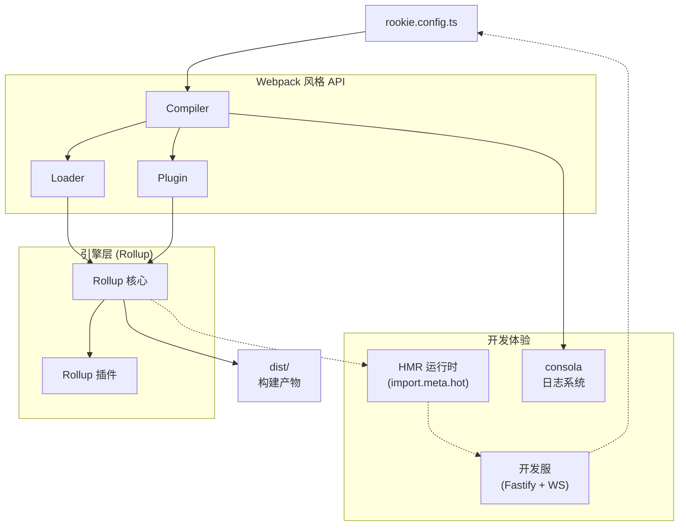

# RookiePack 设计文档

> [!NOTE]
>
> 本设计文档中的所有代码示例、接口定义和命名规范都遵循 [Node.js 项目开发规范](https://narukeu.github.io/articles/frontend-naming-conventions)。关于详细的代码风格、类型命名、注释格式等具体要求，详见该规范文档。

## 1. 项目概述

### 1.1 项目定位

RookiePack 是一个现代化的前端构建工具，采用 Rollup 作为底层引擎，提供 Webpack 风格的 API 和开发体验。
RookiePack 与 Rollup 的关系类似于 **Vite 与 Rollup 的关系** —— 基于 Rollup 提供更高层的抽象和更好的开发体验。

### 1.1.1 兼容性原则：“神似”而非完全兼容

RookiePack 采用“神似”的设计哲学 —— 我们提供 Webpack 风格的 API 和开发体验，但不追求 100% 的兼容性。这意味着：

- **API 设计**：保持 Webpack 核心概念（Entry、Output、Loader、Plugin），但实现细节可能不同
- **配置语法**：大部分 Webpack 配置可以平滑迁移，但某些高级特性可能需要调整
- **生态兼容**：优先构建自己的生态系统，选择性兼容 Webpack 插件
- **迁移成本**：
  - ✅ **常见场景**（约70%）：基础配置、常用 Loader、核心插件等可无缝迁移
  - ⚠️ **高级特性**（约30%）：需要适配或替代方案
    - Pitch Loader → 使用插件系统替代
    - Module Federation → 使用动态导入和 Rollup 手动分包
    - 复杂的 Webpack 魔法注释（如 `/* webpackChunkName */`）→ 使用标准 ES 模块语法
    - Raw Loader 等特殊 Loader → 使用对应的 RookiePack Loader

这种设计让我们能够摆脱历史包袱，专注于提供更好的开发体验。

> **重要提醒**：实际迁移复杂度可能因项目而异。使用了 Webpack 高级特性的大型项目可能需要更多适配工作。我们将在迁移指南中提供详细的替代方案。

### 1.2 核心理念

#### 1.2.1 为什么创建 RookiePack

1. 这个项目起源于我在 React 项目技术选型时的思考。`Vite` 当然是一个非常优秀的项目，但我认为它作为 React 的脚手架并非**最佳选择**，它可能更适合与 `Vue` 等 **“框架”** 配合使用。
2. 我认为 Webpack 这样的设计架构更适合 React 生态。从当前发展趋势来看，React 更像是一个 **“库”** （Library，Next.js 出现了之后我更感觉如此），而 Vue 更像是一个完整的 **“框架”**。对于 React 这种库性质的技术栈，Webpack 的架构理念更加契合。我之前创建的 `narukeu/webpack-react-template` GitHub 仓库正是基于这一思考的实践，虽然整体体验仍有改进空间，也是因为这个仓库让我亲身体会到了 Webpack 迫切需要现代化的时代要求。
3. Webpack 确实背负了十多年前的历史包袱，那个时候的 JavaScript 生态还相当粗糙 —— ES6 规范尚未出现 —— 如今看似理所当然的语法和特性都不存在 —— 回想我初次接触网页开发（那个时候还是前后端不分离的时代，我觉得叫“前端开发”似乎都不合适）的小学和初中时期，IE6 和 IE8 还是主流浏览器，JavaScript 在我印象中更像是一个提供交互效果的简单工具（事实上当年我们老师也是如此说）随着近十年来 ES6+ 的完全普及，JavaScript 已经发展成为一门相当成熟的编程语言，这时候 Webpack 也到了需要现代化的时候。
4. 虽然现在有 Rspack、Turbopack 等基于 Rust 的 Webpack 现代化替代品，但我认为这是一个技术理念的问题。在前端开发中，将构建工具完全使用 Rust 来编写可能并非最佳选择，毕竟前端代码最终还是运行在 JavaScript 环境中。

#### 1.2.2 项目主要特点

1. **统一的构建体验**：基于 Rollup 引擎的双层架构确保开发环境与生产环境的完全一致性，彻底解决 Vite 因使用 esbuild 和 Rollup 混合架构导致的环境差异问题

   **架构权衡说明**：
   - ✅ **一致性优势**：开发和生产环境使用相同的 Rollup 引擎，避免环境差异
   - ⚠️ **性能考量**：Rollup 进行完整打包，开发模式热更新可能不如 Vite 的原生 ESM 快速
   - 🎯 **优化策略**：通过 Rollup 增量编译、持久化缓存和可配置的优化级别来提升性能
   - 🔧 **灵活配置**：提供开发模式性能优化选项（如关闭 Tree-shaking：`treeshake: false`）

   > **设计理念**：我们选择一致性优先于极限速度，认为可预测的构建行为比绝对的构建速度更重要。

2. **"神似"而非完全兼容**：提供 Webpack 风格的熟悉 API，但摆脱历史包袱，采用现代化设计理念。80% 的常见场景可无缝迁移，同时优先考虑性能和开发体验

3. **现代化技术栈**：全面拥抱 ESM 模块系统，TypeScript 作为一等公民，基于 ES2022+ 标准构建，采用严格的类型检查配置（包括 `exactOptionalPropertyTypes`、`noUncheckedIndexedAccess` 等现代化选项），抛弃 CommonJS 等历史包袱

4. **卓越的构建性能**：
   - 基于 Rollup 的优秀 Tree Shaking 和静态分析能力
   - 现代化的钩子系统，简化插件开发
   - 精确的依赖跟踪和增量编译支持

5. **框架深度优化**：专为 React 和 SolidJS 生态量身打造，提供框架特定的 HMR 支持、JSX 优化和开发工具集成。同时保持框架中立性，支持任何 JavaScript 项目

6. **开发者友好**：
   - 统一的 JavaScript/TypeScript 技术栈，前端开发者可直接贡献
   - 现代化 HMR API（`import.meta.hot`），有着与 Vite 相似的体验
   - 完整的 Source Map 链式处理，确保调试体验

#### 1.2.3 与 Rspack/Turbopack 的差异

虽然 Rspack 和 Turbopack 都是优秀的 Webpack 替代品，但 RookiePack 选择了不同的路径：

- **技术栈选择**：我们坚持使用 JavaScript/TypeScript，保持前端工具链的技术栈统一性
- **架构设计**：基于成熟的 Rollup 引擎，而非从零开始用 Rust 重写
- **生态策略**：充分利用 JavaScript 生态（unplugin、Rollup 插件等），而非重新实现所有功能
- **开发体验**：前端开发者可以直接贡献代码、编写插件，无需学习 Rust

#### 1.2.4 核心原则

1. **ESM Only 开发**：RookiePack 自身代码、插件生态全部使用 ESM 模块系统，禁止使用 CommonJS
2. **现代模块系统互操作**：充分利用 Node.js 22+ 的原生能力：
   - **原生 ESM/CJS 互操作**：`require()` 可直接加载同步 ESM 模块，`module.createRequire()` 在 ESM 中创建 require 函数
   - **完整的 package.json exports 支持**：原生支持条件导出和嵌套模式匹配
   - **兼容性解析**：支持解析 npm 生态中的 CommonJS 模块（如 React），无需额外桥接库
3. **配置文件策略**：
   - **推荐使用 ESM 格式**：`.ts`、`.mjs` 等现代格式编写配置文件
   - **TypeScript 配置编译**：`jiti` 专用于 TypeScript 配置文件（如 `rookie.config.ts`、`eslint.config.ts`）的即时编译
   - **可选原生 TypeScript 处理**：支持 Node.js 22+ 的 `module.stripTypeScriptTypes()` 进行类型剥离
   - **模块解析增强**：利用 `import.meta.resolve()` API 进行精确的模块路径解析
4. **TypeScript First**：核心代码必须使用 TypeScript 编写，采用严格的现代化配置（ES2022 目标、bundler 模块解析、完整的类型安全检查），但不强制用户使用
5. **统一构建管道**：开发和生产环境都使用 Rollup，确保一致性
6. **自身构建简洁**：RookiePack 自身只使用 Rollup + TSC 编译打包

### 1.3 架构决策：双层架构

我们采用 **"Rollup 引擎 + Webpack 风格 Loader 层"** 的双层架构设计：

- **底层（引擎层）**：直接使用 Rollup 作为打包引擎
- **上层（API 层）**：提供 Webpack 风格的 Loader/Plugin API

这种架构让我们既能利用 Rollup 的优秀性能，又能兼容 Webpack 的使用习惯。

#### 1.3.1 双层架构的核心技术选型

为了实现 Webpack 风格 API 与 Rollup 引擎的完美结合，我们采用以下关键技术：

- **unplugin 生态系统**：使用 `unplugin` 作为插件适配层，它提供了统一的插件接口，能够让我们快速适配现有的跨构建工具插件。这是 Vue 团队维护的成熟方案，被 Vite、Nuxt 等项目广泛使用。

- **@rollup/pluginutils**：Rollup 官方工具库，提供文件过滤、路径处理等常用功能，确保我们的 Loader 系统与 Rollup 生态完美契合。

- **Rollup 原生 Source Map**：使用 Rollup 内置的 `collapseSourcemap` 和 `getCombinedSourcemap` 等原生能力处理 Source Map 链式合并，确保调试体验不受影响。当代码经过 TypeScript → SWC → 最终输出的多次转换时，依托 Rollup 原生能力准确追踪到原始源码位置。

- **chokidar**：高性能文件监听库，被 webpack、vite 等主流工具使用。提供跨平台的文件系统监听能力，支持 glob 模式和排除规则。

- **picomatch**：现代化的 glob 匹配库，支持我们采用的 glob 语法用于 loader test 字段。被 rollup、webpack 等工具广泛使用。

- **magic-string**：高效的字符串操作库，Rollup 生态核心工具，用于代码转换时的精确修改。

> **技术验证说明**：所有核心技术依赖都已经过实际 API 文档验证，包括：
>
> - Rollup JavaScript API 的 watcher 事件系统和资源清理机制
> - unplugin 的钩子系统和 createUnplugin 工厂函数
> - consola v3.x 的正确导入和 withTag API
> - HMR 实现需要 Rollup watcher + WebSocket 的混合架构

## 2. 核心概念详解

### 2.1 Entry（入口）

入口是应用程序的起始点。RookiePack 从入口文件开始，递归构建整个依赖图。

- 单入口：适用于 SPA 应用，只有一个入口文件
- 多入口：适用于多页应用，每个页面一个入口

**契约定义**：

```typescript
interface IEntryConfig {
  // 单入口
  entry: string;
  // 或多入口
  entry: {
    [name: string]: string;
  };
}
```

```typescript
// 单入口
export default {
  entry: "./src/index.ts"
};

// 多入口
export default {
  entry: {
    app: "./src/app.ts",
    admin: "./src/admin.ts"
  }
};
```

### 2.2 Output（输出）

定义打包后文件的输出位置和命名规则。

输出配置决定了构建产物放在哪里、叫什么名字。RookiePack 的输出配置与 Webpack 完全兼容，支持所有 Webpack 的占位符。

**代码拆分支持**：
RookiePack 基于 Rollup 的天然代码拆分能力，自动处理动态导入：

```javascript
// 动态导入会自动创建单独的代码块
const LazyComponent = lazy(() => import("./LazyComponent"));
```

Rollup 会自动将动态导入的模块拆分成独立的 chunk 文件，无需额外配置。

**占位符支持**（与 Webpack 完全兼容）：

- `[name]` - 入口名称
- `[id]` - 模块 ID
- `[hash]` - 构建哈希
- `[chunkhash]` - chunk 哈希
- `[contenthash]` - 内容哈希
- `[ext]` - 文件扩展名
- `[query]` - 查询字符串

**契约定义**：

```typescript
interface IOutputConfig {
  dir: string; // 输出目录，默认 "dist"
  entryFileNames: string; // 入口文件命名，默认 "[name].[hash].js"
  chunkFileNames: string; // chunk文件命名，默认 "chunks/[name].[hash].js"
  assetFileNames: string; // 静态资源命名，默认 "assets/[name].[hash][ext]"
  format: "es" | "cjs" | "umd" | "iife"; // 输出格式，默认 "es"
  shouldClean: boolean; // 构建前清理目录，默认 true
}
```

### 2.3 Module Resolution（模块解析）

RookiePack 的模块解析遵循 Node.js 的解析规则，同时支持路径别名等高级功能。

**CommonJS 处理策略**：
用户应该使用 `import` 语法导入所有模块，包括 CommonJS 模块。RookiePack 使用 `@rollup/plugin-commonjs` 自动转换 CommonJS 为 ESM，我们不自己实现转换逻辑。

```javascript
// 正确：使用 import 导入 CommonJS 模块
import React from "react"; // React 是 CommonJS 格式，自动转换

// 错误：不要使用 require
const React = require("react"); // ❌ 不支持
```

#### 2.3.1 依赖预构建策略

RookiePack 采用基于 Rollup 的依赖预构建方案来优化开发体验：

**预构建目标**：

- 将 CommonJS 依赖转换为 ESM 格式
- 合并包含多个内部模块的包（如 lodash）
- 缓存依赖构建结果

**与 Vite 的差异**：

- Vite 使用 esbuild 进行依赖预构建，速度更快
- RookiePack 使用 Rollup 进行预构建，保持构建链路一致性
- 通过 Rollup 的 Tree-shaking 能力提供更精确的依赖分析

**实现方案**：

```typescript
// 依赖预构建配置
interface IDependencyPreBuild {
  include?: string[]; // 强制预构建的依赖
  exclude?: string[]; // 排除预构建的依赖
  cacheDir?: string; // 缓存目录，默认 node_modules/.rookiepack
}
```

**缓存策略**：
基于 package.json、pnpm-lock.yaml 等文件的变化检测缓存失效，自动重新预构建依赖。

### 2.4 Loaders（加载器）

Loaders 是文件转换器，负责将非 JavaScript 文件转换为模块。每个 Loader 只做一件事，可以链式调用。

Loaders 是文件转换器，负责将非 JavaScript 文件转换为模块。RookiePack 的 Loader 系统在概念上与 Webpack 相似，但在实现上有所简化：

#### 2.4.1 与 Webpack 的差异

#### 2.4.1.1 不支持 pitch 阶段（简化 Loader 开发）

基于 Rollup 的文档和我们的讨论，Pitch 阶段对于 RookiePack 来说不是必要的。
Rollup 的设计理念不同，Rollup 的核心优势在于其强大的 Tree-shaking 能力。它的插件系统是基于钩子（hooks）的，而不是 Webpack 那样的链式 Loader。Rollup 通过静态分析和除屑优化来生成更小的 bundle，这与 Webpack 的 pitch 机制设计初衷不同。

**Pitch 的主要用途可以通过其他方式实现：**
Pitch 阶段的三个主要用途在 RookiePack 中都有替代方案：

- 性能优化/缓存：可以在 Rollup 插件的 load 或 transform 钩子中实现缓存逻辑
- 动态生成内容：Rollup 插件的 resolveId 和 load 钩子组合可以实现虚拟模块
- 短路处理：通过插件的返回值控制是否继续处理

**简化 Loader 开发体验**
不实现 pitch 阶段符合"神似而不完全兼容"原则。这样做的好处：

- 降低学习曲线：开发者不需要理解复杂的双向执行流程
- 减少调试难度：单向的 Loader 链更容易理解和调试
- 提高性能：避免了额外的遍历开销

Rollup 本身提供了多种优化选项，如 treeshake 配置，可以控制除屑优化的程度。当设置 treeshake: false 时，虽然会生成更大的 bundle，但可以提高构建性能。这种权衡机制比 pitch 阶段更直观。

#### 2.4.1.2 不支持 raw loader

Webpack 的 raw loader 可以获取文件的原始 Buffer 内容而非字符串。RookiePack 不支持此特性，但可通过以下方式处理 Buffer 场景：

- **Asset Loader**：对于二进制文件（图片、字体等），使用 `@rookiepack/loader-asset` 处理
- **自定义 Loader**：需要原始 Buffer 的场景，可编写自定义 Loader 在 `transform` 方法中直接读取文件
- **插件方式**：通过 Rollup 插件的 `load` 钩子处理特殊文件格式

#### 2.4.1.3 Loader context API 只实现核心功能（如 `this.async()`、`this.callback()`）

#### 2.4.1.4 仅支持 glob 语法，不再兼容正则表达式

这些简化让 Loader 开发更加直观，同时保持了核心功能的完整性。

#### 2.4.2 Test 字段语法规范

我们仅支持基于 `picomatch` 库的 glob 语法，不再兼容正则表达式：

```typescript
// 支持：glob 语法（picomatch 支持）
{
  test: "**/*.{js,jsx,ts,tsx}",
  use: "@rookiepack/loader-swc"
}

// 支持：negation 模式
{
  test: ["**/*.js", "!**/*.test.js"],
  use: "@rookiepack/loader-babel"
}

// 支持：函数形式（高级用例）
{
  test: (resourcePath: string) => {
    return resourcePath.includes("components") && resourcePath.endsWith(".tsx");
  },
  use: "@rookiepack/loader-swc"
}
```

**实现基础**：

- 仅使用 `picomatch` 库进行 glob 匹配，与 Rollup 生态保持一致
- 支持 negation patterns (`!pattern`)
- 支持 extglob 语法 (`**/*.{js,ts}`)

#### 2.4.3 Loader 与 Rollup 冲突的问题

一些 loader，比如 `babel-loader` 和 `swc-loader` 本身也是可以处理 `TypeScript` 的，这就导致了和 RookiePack 底层技术产生了冲突。这里以 `rookiepack-loader-swc` 为例，需要定义优先级策略以解决冲突。

##### 2.4.3.1 默认策略：TypeScript 优先

- TypeScript 插件处理 `.ts/.tsx` 文件
- SWC Loader 只处理 JSX 语法
- 流程：`.tsx` → TypeScript 转换 → `.jsx` → SWC 处理 → `.js`

##### 2.4.3.2 Override 策略：用户可配置 SWC 完全接管

```typescript
{
  test: "**/*.{ts,tsx}",
  use: {
    loader: "@rookiepack/loader-swc",
    options: {
      override: true  // 强制 SWC 处理所有内容
    }
  }
}
```

##### 2.4.3.3 实现细节

```typescript
// 默认处理流程
class TypeScriptHandler {
  async transformAsync(code: string, id: string) {
    if (id.endsWith(".tsx")) {
      // Step 1: TypeScript 转换为 JSX
      const jsxCode = await this.tsPlugin.transform(code, {
        jsx: "preserve" // 保留 JSX 语法
      });

      // Step 2: SWC 处理 JSX
      return await this.swcLoader.transform(jsxCode, {
        jsx: true
      });
    }
    // 纯 TS 文件直接由 TypeScript 处理
    return await this.tsPlugin.transform(code);
  }
}
```

#### 2.4.4 Loader 中的 HMR 支持

根据 Webpack 的设计理念，HMR（热模块替换）的文件级处理应该在 Loader 层实现，而不是通过独立插件。每个 Loader 负责为其处理的文件类型注入相应的 HMR 代码：

- **CSS Loader**：在开发模式下自动注入样式替换逻辑，当 CSS 文件变化时，无需刷新页面即可更新样式
- **Asset Loader**：处理图片等静态资源的热替换，通过更新 URL 参数触发浏览器重新加载
- **框架相关的 HMR**（如 React Fast Refresh）通过专门的插件实现，因为它需要全局运行时支持

这种设计保持了 Loader 的单一职责原则：Loader 只负责文件转换和相关的 HMR 代码注入，而复杂的 HMR 运行时协调由核心系统管理。

#### 2.4.5 现代化 Loader Context API

**基于 Rollup 插件上下文设计**（而非 webpack/loader-runner）：

RookiePack 的 Loader Context 采用现代化的 API 设计，抛弃 webpack 的历史包袱：

```typescript
interface ILoaderContext {
  // 文件基本信息（对齐 Rollup PluginContext）
  readonly resourcePath: string;
  readonly resourceQuery: string;
  readonly resource: string;

  // 现代化异步支持（Promise-based，而非 callback）
  runAsync<TResult>(fn: () => Promise<TResult>): Promise<TResult>;

  // 依赖管理（简化版）
  addDependency(file: string): void;
  addWatchFile(file: string): void; // 对齐 Rollup 的 addWatchFile

  // 缓存控制
  setCacheable(flag?: boolean): void;

  // 现代化日志系统
  getLogger(name?: string): ILogger;

  // 配置选项（类型安全）
  getOptions<TOptions = any>(): TOptions;

  // Rollup 风格的工具方法
  resolveAsync(id: string, importer?: string): Promise<string | null>;
  emitFile(fileOptions: IEmittedFile): string;
}
```

**实现要点**：

- **抛弃 webpack 历史包袱**：不支持 `this.callback()` 等 callback 风格 API
- **基于 Rollup 设计理念**：对齐 Rollup PluginContext 的现代化 API
- 集成 consola 日志系统
- 支持依赖跟踪以实现精确的文件监听

### 2.5 Plugins（插件）

插件可以在构建流程的各个阶段执行自定义逻辑，比 Loader 更强大。插件通过钩子系统与构建流程交互。

#### 2.5.1 插件接口契约

```typescript
interface IRookiePackPlugin {
  name?: string;
  enforce?: "pre" | "post"; // 插件执行优先级
  apply(compiler: ICompiler): void;
}

interface ICompiler {
  hooks: ICompilerHooks;
  options: IRookiePackConfig;
  runAsync(): Promise<void>;
  watchAsync(): Promise<IRollupWatcher>;
}

interface ICompilerHooks {
  // 初始化阶段（对应 Rollup 的 buildStart）
  buildStart: AsyncHook<[IInputOptions]>;

  // 解析阶段（对应 Rollup 的 resolveId）
  resolveId: FilterHook<string>;

  // 转换阶段（对应 Rollup 的 transform）
  transform: TransformHook<string, ITransformResult>;

  // 生成阶段（对应 Rollup 的 generateBundle）
  generateBundle: AsyncHook<[IOutputOptions, IBundle]>;

  // 完成阶段（对应 Rollup 的 buildEnd）
  buildEnd: AsyncHook<[Error?]>;
}

// 使用 Rollup 标准的转换结果接口
interface ITransformResult {
  code: string;
  map?: TSourceMapInput | null; // 遵循 Rollup 标准：null 保持现有映射，undefined 无映射
  dependencies?: string[]; // 额外的文件依赖
}

// Source Map 输入类型（完全对齐 Rollup 的 SourceMapInput）
type TSourceMapInput =
  | string
  | { toString(): string }
  | { toJSON(): string }
  | object;
```

### 2.5.2 插件依赖管理

- 插件可以声明依赖其他插件
- 默认自动调整加载顺序（拓扑排序）
- 用户可通过高级配置手动指定顺序

### 2.5.3 框架支持插件

RookiePack 通过插件系统支持不同的前端框架，首要支持 React 和 SolidJS：

- **@rookiepack/plugin-react**：提供 React 完整支持，包括 JSX 转换配置、React Fast Refresh 集成、开发时的错误边界等
- **@rookiepack/plugin-solid**：为 SolidJS 提供类似支持，包括其特有的细粒度响应式优化

这些框架插件负责：

1. 注入框架特定的 HMR 运行时
2. 配置相应的 JSX 转换规则
3. 提供框架特定的优化选项
4. 集成开发工具（如 React DevTools）

选择插件架构而非内置支持，是为了保持核心的框架中立性，让用户可以自由选择技术栈。

#### 2.5.4 插件开发示例：TypeScript 支持插件

以下是一个完整的 TypeScript 支持插件示例，展示了正确的 Source Map 处理：

```typescript
import { createRookiePackPlugin } from "@rookiepack/core";
import { transform } from "@swc/core";

export const createTypeScriptPlugin = (
  options: {
    tsconfig?: string;
    compilerOptions?: any;
  } = {}
) => {
  return createRookiePackPlugin({
    name: "typescript-plugin",
    enforce: "pre", // 在其他插件之前执行

    apply(compiler) {
      compiler.hooks.transform.tap(
        {
          name: "typescript-transform",
          filter: /\.(ts|tsx)$/
        },
        async (code, id, context) => {
          // SWC 转换，必须生成 Source Map
          const result = await transform(code, {
            filename: id,
            sourceMaps: true,
            jsc: {
              parser: {
                syntax: "typescript",
                tsx: id.endsWith(".tsx"),
                decorators: true
              },
              target: "es2020",
              transform: {
                react: {
                  runtime: "automatic",
                  importSource: "react"
                }
              }
            }
          });

          // 返回包含 Source Map 的结果
          return {
            code: result.code,
            map: result.map, // SWC 生成的 Source Map
            dependencies: [] // 可以添加额外的依赖文件
          };
        }
      );

      // 添加 .ts/.tsx 文件的解析支持
      compiler.hooks.resolveId.tap(
        {
          name: "typescript-resolver"
        },
        (id, importer) => {
          // 处理省略扩展名的导入
          if (!id.includes(".") && importer) {
            const candidates = [id + ".ts", id + ".tsx"];
            for (const candidate of candidates) {
              if (compiler.fileExists(candidate)) {
                return candidate;
              }
            }
          }
          return null;
        }
      );
    }
  });
};
```

这个插件示例展示了：

1. **强制 Source Map 生成**：所有转换必须生成 Source Map
2. **正确的钩子使用**：使用适当的钩子进行文件转换和路径解析
3. **错误处理**：SWC 转换错误会自动传播到构建系统
4. **依赖跟踪**：可以通过 dependencies 数组添加额外的文件依赖

## 3. 静态资源处理

### 3.1 资源类型定义

```typescript
interface IAssetOptions {
  // 支持的格式
  images: string[]; // 默认: [".png", ".jpg", ".jpeg", ".gif", ".webp", ".svg", ".ico", ".avif"]
  fonts: string[]; // 默认: [".woff", ".woff2", ".ttf", ".otf", ".eot"]
  media: string[]; // 默认: [".mp4", ".webm", ".ogg", ".mp3", ".wav", ".flac", ".aac"]
  others: string[]; // 自定义扩展名，如 [".pdf", ".doc", ".zip"]

  // 内联阈值
  inlineLimit: number; // 默认: ASSET_INLINE_LIMIT (4KB)

  // 输出配置
  output: {
    images: string; // 默认: "assets/images/[name]-[hash][ext]"
    fonts: string; // 默认: "assets/fonts/[name]-[hash][ext]"
    media: string; // 默认: "assets/media/[name]-[hash][ext]"
    others: string; // 默认: "assets/others/[name]-[hash][ext]"
  };

  // 自定义处理
  custom?: Array<{
    test: string; // 仅支持 glob 语法
    handler: (content: Buffer, path: string) => Promise<any>;
  }>;
}
```

### 3.2 CSS 处理策略

#### 3.2.1 CSS Modules 支持

通过 `@rookiepack/loader-css` 的配置选项启用：

```typescript
{
  test: "**/*.module.css",
  use: {
    loader: "@rookiepack/loader-css",
    options: {
      modules: true
    }
  }
}
```

#### 3.2.2 PostCSS 集成

PostCSS 通过独立的 loader 提供，可以与 CSS loader 链式使用：

#### 3.2.3 CSS-in-JS

不内置支持，但兼容主流方案（styled-components、emotion 等），它们通过 Babel/SWC 插件工作。

### 3.3 环境变量系统

RookiePack 提供现代化的环境变量支持，与 Vite 体验对齐：

#### 3.3.1 .env 文件支持

- `.env` - 所有环境加载
- `.env.local` - 所有环境加载，但被 git 忽略
- `.env.development` - 开发环境加载
- `.env.production` - 生产环境加载

#### 3.3.2 import.meta.env 注入

```typescript
// 开发环境下可用的环境变量
interface IImportMetaEnv {
  readonly MODE: string;
  readonly DEV: boolean;
  readonly PROD: boolean;
  // 用户定义的以 ROOKIEPACK_ 开头的变量
  readonly ROOKIEPACK_API_URL: string;
}

interface IImportMeta {
  readonly env: IImportMetaEnv;
}
```

#### 3.3.3 安全性

只有以 `ROOKIEPACK_` 开头的变量会被暴露给客户端代码，确保敏感信息不会泄露。

## 4. 配置示例

### 4.1 基础配置

```typescript
// rookie.config.ts
import { defineConfig } from "@rookiepack/core";
import HtmlPlugin from "@rookiepack/plugin-html";

export default defineConfig({
  // 入口配置
  entry: "./src/index.tsx",

  // 输出配置
  output: {
    dir: "dist",
    entryFileNames: "[name].[hash].js",
    chunkFileNames: "chunks/[name].[hash].js", // 动态导入的代码块
    shouldClean: true
  },

  // 解析配置
  resolve: {
    alias: {
      "@": "./src"
    },
    extensions: [".ts", ".tsx", ".js", ".jsx"]
  },

  // 模块规则
  module: {
    rules: [
      {
        test: "**/*.{ts,tsx}", // glob 语法
        use: "@rookiepack/loader-swc"
      },
      {
        test: "**/*.css",
        use: "@rookiepack/loader-css"
      },
      {
        test: "**/*.{png,jpg,gif,svg}",
        use: "@rookiepack/loader-asset"
      }
    ]
  },

  // 插件配置
  plugins: [
    new HtmlPlugin({
      template: "./public/index.html"
    })
  ],

  // 开发服务器
  devServer: {
    port: 3000,
    isHot: true,
    shouldOpen: true
  }
});
```

### 4.2 高级配置示例

```typescript
// rookie.config.ts - 带 TypeScript 和 SWC override 的配置
export default defineConfig({
  module: {
    rules: [
      {
        test: "**/*.{ts,tsx}",
        use: [
          {
            loader: "@rookiepack/loader-swc",
            options: {
              override: true, // SWC 完全接管 TS 编译
              jsc: {
                parser: {
                  syntax: "typescript",
                  tsx: true
                },
                transform: {
                  react: {
                    runtime: "automatic"
                  }
                }
              }
            }
          }
        ]
      }
    ]
  }
});
```

### 4.3 完整配置契约

```typescript
interface IRookiePackConfig {
  entry: string | Record<string, string>;
  output?: IOutputConfig;
  resolve?: IResolveConfig;
  module?: IModuleConfig;
  plugins?: IRookiePackPlugin[];
  devServer?: IDevServerOptions;
  mode?: "development" | "production";
  env?: Record<string, any>;
}

interface IResolveConfig {
  alias?: Record<string, string>;
  extensions?: string[];
}

interface IModuleConfig {
  rules: IRule[];
}

interface IRule {
  test: string | string[] | ((resourcePath: string) => boolean);
  use: TUseItem | TUseItem[];
}

type TUseItem =
  | string
  | {
      loader: string;
      options?: any;
    };

interface IDevServerOptions {
  port?: number;
  isHot?: boolean;
  shouldOpen?: boolean;
  hmrPort?: number;
  proxy?: Record<string, any>;
}
```

## 5. 技术架构

### 5.1 整体架构图



### 5.2 现代化 HMR 实现

#### 5.2.1 API 设计

RookiePack 使用现代化的 `import.meta.hot` API（有着与 Vite 相似的体验）：

```javascript
// 现代化 HMR API（有着与 Vite 相似的体验）
if (import.meta.hot) {
  import.meta.hot.accept("./math.js", (newModule) => {
    updateMath(newModule);
  });

  import.meta.hot.dispose((data) => {
    data.state = currentState;
  });

  if (import.meta.hot.data) {
    currentState = import.meta.hot.data.state;
  }
}
```

#### 5.2.2 基于 Rollup 的简化架构

**核心理念**：利用 Rollup 的插件系统，而非重新实现 webpack-dev-server 的复杂架构

```typescript
// Rollup 插件风格的 HMR 实现
class RookiePackHMRPlugin implements IRollupPlugin {
  name = "rookiepack-hmr";

  buildStart() {
    this._setupFileWatcher();
  }

  handleHotUpdate(file: string) {
    // 基于 Rollup 的模块图进行精确更新
    const moduleGraph = this._getModuleGraph();
    const affectedModules = moduleGraph.getAffectedModules(file);

    this._notifyClient({
      type: "update",
      updates: affectedModules.map((mod) => ({
        path: mod.id,
        timestamp: Date.now()
      }))
    });
  }
}

// 开发服务器（详细的 Rollup + WebSocket 集成）
class DevServer {
  private static readonly DEFAULT_HMR_PORT = 24678;
  private static readonly DEFAULT_BUILD_DELAY = 100;
  private wsServer: WebSocketServer;
  private rollupWatcher: IRollupWatcher;
  private logger = consola.withTag("DevServer");

  constructor(private options: IDevServerOptions) {
    // 1. 初始化 WebSocket 服务器用于客户端通信
    this.wsServer = new WebSocketServer({
      port: options.hmrPort || DevServer.DEFAULT_HMR_PORT
    });

    // 2. 设置 Rollup watcher 配置
    const watchOptions = {
      ...options.rollupConfig,
      watch: {
        buildDelay: DevServer.DEFAULT_BUILD_DELAY,
        chokidar: {
          ignored: ["**/node_modules/**", "**/.git/**"]
        }
      }
    };

    // 3. 创建 Rollup watcher 实例
    this.rollupWatcher = rollup.watch(watchOptions);
  }

  async startAsync() {
    // === Rollup Watcher 事件处理 ===
    this.rollupWatcher.on("event", (event) => {
      switch (event.code) {
        case "START":
          this.logger.info("🔄 检测到文件变化，开始重新构建...");
          this._broadcast({ type: "full-reload-start" });
          break;

        case "BUNDLE_START":
          this.logger.info(`📦 开始构建 bundle: ${event.input}`);
          break;

        case "BUNDLE_END":
          // 🔑 关键：编译完成后通过 WebSocket 通知客户端
          this.logger.success(`✅ Bundle 构建完成 (${event.duration}ms)`);

          // 分析哪些模块需要热更新
          const hotUpdateInfo = this._analyzeHotUpdate(event.result);

          if (hotUpdateInfo.shouldFullReload) {
            this._broadcast({ type: "full-reload" });
          } else {
            this._broadcast({
              type: "update",
              updates: hotUpdateInfo.updates
            });
          }

          // 📋 重要：清理 bundle 资源（Rollup 官方要求）
          event.result.close();
          break;

        case "ERROR":
          this.logger.error("❌ 构建失败:", event.error);
          this._broadcast({
            type: "error",
            error: {
              message: event.error.message,
              stack: event.error.stack,
              id: event.error.id,
              loc: event.error.loc
            }
          });

          // 如果有 result，也要清理
          if (event.result) {
            event.result.close();
          }
          break;

        case "END":
          this.logger.info("🎉 所有 bundle 构建完成");
          break;
      }
    });

    // === WebSocket 连接管理 ===
    this.wsServer.on("connection", (ws) => {
      this.logger.info("🔗 新的 HMR 客户端连接");

      // 发送连接成功消息
      ws.send(JSON.stringify({ type: "connected" }));

      // 处理客户端消息
      ws.on("message", (data) => {
        try {
          const message = JSON.parse(data.toString());
          this._handleClientMessage(message, ws);
        } catch (error) {
          this.logger.error("解析客户端消息失败:", error);
        }
      });

      ws.on("close", () => {
        this.logger.info("❌ HMR 客户端断开连接");
      });
    });

    this.logger.success(
      `🚀 HMR 服务器启动成功，WebSocket 端口: ${this.options.hmrPort}`
    );
  }

  // 广播消息给所有连接的客户端
  private _broadcast(message: any) {
    const data = JSON.stringify(message);
    this.wsServer.clients.forEach((client) => {
      if (client.readyState === WebSocket.OPEN) {
        client.send(data);
      }
    });
  }

  // 分析热更新信息
  private _analyzeHotUpdate(bundle: IRollupBundle): IHotUpdateInfo {
    // 实现热更新分析逻辑
    // 确定哪些模块可以热更新，哪些需要全页刷新
    return {
      shouldFullReload: false,
      updates: [
        // 热更新模块列表
      ]
    };
  }

  // 处理客户端消息
  private _handleClientMessage(message: any, ws: WebSocket) {
    switch (message.type) {
      case "ping":
        ws.send(JSON.stringify({ type: "pong" }));
        break;
      case "custom":
        // 处理自定义消息（如框架特定的 HMR 事件）
        this._handleCustomMessage(message);
        break;
    }
  }

  async stopAsync() {
    // 清理资源
    this.rollupWatcher.close();
    this.wsServer.close();
    this.logger.info("🛑 开发服务器已停止");
  }
}
```

#### 5.2.3 客户端 HMR 运行时

客户端需要通过 WebSocket 与开发服务器通信：

```typescript
//` client/hmr-runtime.ts - 注入到浏览器的 HMR 客户端代码
class HMRClient {
  private static readonly DEFAULT_WEBSOCKET_URL = "ws://localhost:24678";
  private ws: WebSocket;
  private logger = console;

  constructor() {
    this._connectToServer();
  }

  private _connectToServer() {
    // 连接到开发服务器的 WebSocket
    this.ws = new WebSocket(HMRClient.DEFAULT_WEBSOCKET_URL);

    this.ws.addEventListener("open", () => {
      this.logger.log("[HMR] 🔗 已连接到开发服务器");
    });

    this.ws.addEventListener("message", (event) => {
      const message = JSON.parse(event.data);
      this._handleServerMessage(message);
    });

    this.ws.addEventListener("close", () => {
      this.logger.log("[HMR] ❌ 与开发服务器断开连接，尝试重连...");
      // 实现重连逻辑
      setTimeout(() => this._connectToServer(), 3000);
    });

    this.ws.addEventListener("error", (error) => {
      this.logger.error("[HMR] WebSocket 连接错误:", error);
    });
  }

  private _handleServerMessage(message: any) {
    switch (message.type) {
      case "connected":
        this.logger.log("[HMR] ✅ 服务器连接成功");
        break;

      case "update":
        this.logger.log("[HMR] 🔄 接收到热更新:", message.updates);
        this._applyHotUpdates(message.updates);
        break;

      case "full-reload":
        this.logger.log("[HMR] 🔄 执行完整页面刷新");
        window.location.reload();
        break;

      case "error":
        this.logger.error("[HMR] ❌ 构建错误:", message.error);
        this._showErrorOverlay(message.error);
        break;

      case "pong":
        // 心跳响应
        break;
    }
  }

  private async _applyHotUpdates(updates: IHotUpdate[]) {
    for (const update of updates) {
      try {
        // 动态导入更新的模块
        const newModule = await import(`${update.path}?t=${Date.now()}`);

        // 触发模块的热更新回调
        const hotContext = (window as any).__ROOKIEPACK_HMR__?.[update.path];
        if (hotContext && typeof hotContext.accept === "function") {
          hotContext.accept(newModule);
        }
      } catch (error) {
        this.logger.error(`[HMR] 应用热更新失败 (${update.path}):`, error);
        // 降级到完整刷新
        window.location.reload();
      }
    }
  }

  // 发送消息到服务器
  send(message: any) {
    if (this.ws.readyState === WebSocket.OPEN) {
      this.ws.send(JSON.stringify(message));
    }
  }
}

// 初始化 HMR 客户端
if (import.meta.env.DEV) {
  new HMRClient();
}
```

#### 5.2.4 完整的数据流

1. **文件变化** → Rollup watcher 检测到
2. **重新编译** → Rollup 执行构建流程
3. **BUNDLE_END 事件** → Rollup watcher 触发
4. **分析更新** → 服务器分析哪些模块需要更新
5. **WebSocket 广播** → 发送更新信息到所有客户端
6. **客户端处理** → 浏览器接收消息并应用热更新

#### 5.2.5 错误处理与覆盖层

RookiePack 提供友好的错误处理体验，通过 Error Overlay 在开发时显示详细错误信息：

**Error Overlay 功能特性**：

- **视觉设计**：红色半透明浮层覆盖整个页面，确保错误信息不会被忽略
- **错误信息**：显示完整的错误消息、堆栈跟踪和源码片段（frame）
- **代码定位**：支持点击跳转到 IDE 对应文件位置（需要编辑器支持协议）
- **自动消失**：当文件修改并成功编译后，覆盖层自动消失并恢复正常开发流程

**支持的错误类型**：

- **语法错误**：JavaScript/TypeScript 语法错误，显示具体行列位置
- **类型错误**：TypeScript 类型检查错误，包含类型信息
- **模块解析错误**：清晰提示哪个文件试图导入不存在的模块
- **Loader 错误**：文件转换过程中的错误，包含 Loader 名称和转换阶段

**实现示例**：

```typescript
interface IErrorMessage {
  type: "error";
  error: {
    message: string;
    stack?: string;
    id?: string; // 出错的文件路径
    loc?: { line: number; column: number }; // 错误位置
    frame?: string; // 错误代码片段
    plugin?: string; // 出错的插件名称
  };
}
```

**用户体验优化**：

- 错误信息支持语法高亮，便于快速定位问题
- 提供"清除错误"按钮，允许手动关闭覆盖层
- 支持键盘快捷键（ESC）快速关闭
- 在控制台同步输出详细错误信息，便于复制分享

**错误恢复机制**：

- 文件保存后自动重新编译
- 编译成功时覆盖层自动消失
- 支持多个错误的堆叠显示
- 错误修复进度的实时反馈

#### 5.2.6 Source Map 链式处理

现代前端项目通常需要经历多个转换阶段：TypeScript → SWC → Rollup → 最终输出。RookiePack 完全使用 Rollup 原生的 Source Map 处理能力，不自行实现任何 Source Map 合并逻辑。

##### 5.2.6.1 基于 Rollup 原生能力

**核心原则**：既然 Rollup 已经有完善的 Source Map 链式处理能力，我们就完全依赖它，不重复实现。

Rollup 在其 `collapseSourcemaps.ts` 中已经实现了复杂的 Source Map 链合并算法：

```typescript
// RookiePack 只需要确保插件正确返回 Source Map
interface TransformResult {
  code: string;
  map?: SourceMapInput | null; // Rollup 标准格式
}
```

##### 5.2.6.2 插件契约：强制 Source Map 生成

所有 RookiePack 插件的 `transform` 钩子必须生成 Source Map：

```typescript
export const createTypeScriptPlugin = (): Plugin => {
  return {
    name: "typescript-plugin",
    transform(code: string, id: string) {
      if (!id.endsWith(".ts") && !id.endsWith(".tsx")) {
        return null; // 不处理
      }

      const result = transformTypeScript(code, {
        sourceMaps: true, // 强制生成
        filename: id
      });

      return {
        code: result.code,
        map: result.map // Rollup 会自动处理链式合并
      };
    }
  };
};
```

##### 5.2.6.3 Loader Context API 对齐 Rollup

RookiePack 的 Loader Context 直接暴露 Rollup 的 Source Map 能力：

```typescript
interface ILoaderContext {
  // 直接使用 Rollup 的 getCombinedSourcemap API
  getCombinedSourcemap(): SourceMap;

  // 其他 Rollup 原生方法
  readonly resourcePath: string;
  addDependency(file: string): void;

  // 不自己实现任何 Source Map 合并逻辑
}
```

##### 5.2.6.4 依赖 Rollup 的 collapseSourcemap 函数

Rollup 已经提供了两个核心函数来处理 Source Map 链：

1. **`collapseSourcemap`** - 用于单个模块的 Source Map 链合并
2. **`collapseSourcemaps`** - 用于整个 bundle 的 Source Map 合并

```typescript
// 来自 Rollup 源码 - 我们直接使用，不重新实现
export function collapseSourcemap(
  id: string,
  originalCode: string,
  originalSourcemap: ExistingDecodedSourceMap | null,
  sourcemapChain: readonly DecodedSourceMapOrMissing[],
  log: LogHandler
): ExistingDecodedSourceMap | null;
```

##### 5.2.6.5 开发环境 Source Map 策略

依然使用 Rollup 的内置选项控制 Source Map 生成：

```typescript
// 开发模式配置
{
  output: {
    sourcemap: "inline"; // Rollup 原生支持内联
  }
}

// 生产模式配置
{
  output: {
    sourcemap: true; // Rollup 原生支持外部文件
  }
}
```

##### 5.2.6.6 调试体验保障

通过完全依赖 Rollup 的成熟 Source Map 处理机制，我们获得：

1. **经过实战验证的算法**：Rollup 的 Source Map 合并算法已在大量项目中验证
2. **性能优化**：利用 Rollup 的缓存和优化策略
3. **兼容性保证**：与整个 Rollup 生态的 Source Map 处理完全一致
4. **维护成本低**：不需要维护复杂的 Source Map 合并逻辑

**架构决策**：RookiePack 不使用 Mozilla `source-map` 库进行 Source Map 合并，完全依赖 Rollup 的原生实现。这样可以避免架构冲突，确保与 Rollup 生态的完全兼容。

**Rollup 原生能力验证**：

- **`this.getCombinedSourcemap()`**：获取所有前序插件合并后的 Source Map，只能在 transform 钩子中使用 ([Rollup 官方文档](https://rollupjs.org/plugin-development/#this-getcombinedsourcemap))
- **Watch 模式缓存**：Rollup 在监听模式下会缓存未改动模块以跳过不必要的重新编译 ([Rollup Watch 文档](https://rollupjs.org/plugin-development/#shouldtransformcachedmodule))
- **增量编译支持**：通过 `shouldTransformCachedModule` Hook 控制模块缓存行为

### 5.3 `Tapable for RookiePack` 钩子系统

#### 5.3.1 命名

`@rookiepack/tapable`

#### 5.3.2 实现原则

基于 Rollup 的插件钩子设计现代化的钩子系统，**不完全兼容** webpack/tapable。采用更简洁的 API 设计，抛弃 webpack 的历史包袱。

#### 5.3.2 支持的 Hook 类型

（基于 Rollup 启发的现代化设计）

```typescript
// 基础钩子（基于 Rollup 插件钩子简化）
export class SyncHook<TArgs extends any[] = []> {}
export class AsyncHook<TArgs extends any[] = []> {}
export class WaterfallHook<TValue> {} // 类似 Rollup 的 transform 链

// Rollup 风格的钩子（更符合 ESM 和现代 JS）
export class FilterHook<TItem> {} // 类似 Rollup 的 resolveId
export class TransformHook<TInput, TOutput> {} // 类似 Rollup 的 transform
```

#### 5.3.3 编译器钩子

（简化版，基于 Rollup 生命周期）

```typescript
interface ICompilerHooks {
  // 初始化阶段（对应 Rollup 的 buildStart）
  buildStart: AsyncHook<[IInputOptions]>;

  // 解析阶段（对应 Rollup 的 resolveId）
  resolveId: FilterHook<string>;

  // 转换阶段（对应 Rollup 的 transform）
  transform: TransformHook<string, string>;

  // 生成阶段（对应 Rollup 的 generateBundle）
  generateBundle: AsyncHook<[IOutputOptions, IBundle]>;

  // 完成阶段（对应 Rollup 的 buildEnd）
  buildEnd: AsyncHook<[Error?>];
}
```

### 5.4 日志系统

RookiePack 使用 `consola` 作为底层日志库，并提供轻量级封装以支持 Webpack 风格的 `getLogger` API：

```typescript
// 正确的导入方式（consola v3.x）
import { consola } from "consola";

// Loader Context 中使用
class LoaderContext {
  getLogger(name?: string) {
    // 返回 consola 实例，添加上下文信息
    return consola.withTag(name || this.resourcePath);
  }
}

// Plugin 中使用
class BasePlugin {
  constructor() {
    this.logger = consola.withTag(this.constructor.name);
  }

  apply(compiler: ICompiler) {
    compiler.hooks.compile.tap(this.constructor.name, () => {
      this.logger.info("Plugin is running");
    });
  }
}
```

#### 5.4.1 日志系统特性

- **继承 consola 的所有功能**：彩色输出、日志级别、格式化等
- **自动添加上下文信息**：loader/plugin 名称、文件路径等
- **开发模式默认 debug 级别**，生产模式默认 info 级别
- **统一的错误报告**：集成到错误覆盖层和编译统计中

### 5.5 动态配置加载策略

RookiePack 采用多层次的配置加载策略，充分利用 Node.js 22+ 的原生能力：

#### 5.5.1 TypeScript 配置文件处理

**jiti 集成（主要方案）**：

- **专用场景**：TypeScript 配置文件（`rookie.config.ts`、`eslint.config.ts`）的即时编译
- **即时编译**：将 TypeScript 配置文件即时编译为 JavaScript 并执行
- **类型安全**：保持配置文件的完整 TypeScript 支持和类型检查
- **缓存优化**：自动缓存编译结果，提升配置加载速度

#### 5.5.2 模块系统互操作

**Node.js 22+ 原生互操作**：

- **ESM/CJS 双向兼容**：`require()` 可直接加载同步 ESM 模块
- **动态 require 创建**：在 ESM 中使用 `module.createRequire()` 访问 CommonJS 模块
- **完整的条件导出**：原生支持 package.json exports 字段的所有特性

```typescript
import jiti from "jiti";

class ConfigLoader {
  async load(configPath: string) {
    const _require = jiti(process.cwd(), {
      cache: true,
      esmResolve: true,
      interopDefault: true
    });

    return _require(configPath);
  }
}
```

## 6. 契约式编程与接口设计

RookiePack 采用严格的契约式编程思想，通过明确的 TypeScript 接口定义确保各组件间的正确协作。

### 6.1 完整的 Loader 契约

```typescript
interface ILoaderDefinition {
  name: string;
  // 简单转换（自动处理 Source Map 链）
  transform?(this: ILoaderContext, code: string): string | Promise<string>;
  // 高级转换（需要手动处理 Source Map）
  transformWithMap?(
    this: ILoaderContext,
    code: string,
    map?: TSourceMapInput
  ): ITransformResult | Promise<ITransformResult>;
}

// 转换结果必须包含 Source Map 信息
interface ITransformResult {
  code: string;
  map?: TSourceMapInput | null; // null 表示保持现有映射
  dependencies?: string[]; // 新增的文件依赖
  isCacheable?: boolean; // 是否可缓存
}

// Loader Context 的详细定义（完全对齐 Rollup PluginContext）
interface ILoaderContext {
  readonly resourcePath: string;
  readonly resourceQuery: string;
  readonly resource: string;

  // 直接使用 Rollup 的 Source Map API
  getCombinedSourcemap(): SourceMap; // 对齐 Rollup 的 this.getCombinedSourcemap()

  // 异步操作
  runAsync<TResult>(fn: () => Promise<TResult>): Promise<TResult>;

  // 依赖管理（对齐 Rollup PluginContext）
  addDependency(file: string): void;
  addWatchFile(file: string): void; // 直接使用 Rollup 的 addWatchFile
  setCacheable(flag?: boolean): void;

  // 工具方法（对齐 Rollup PluginContext）
  getLogger(name?: string): ILogger;
  getOptions<TOptions = any>(): TOptions;
  resolveAsync(id: string, importer?: string): Promise<string | null>; // 使用 Rollup 的 resolve
  emitFile(fileOptions: IEmittedFile): string; // 使用 Rollup 的 emitFile
}

interface IEmittedFile {
  type: "asset" | "chunk";
  fileName?: string;
  source?: string | Uint8Array;
  name?: string;
}
```

### 6.2 插件系统契约扩展

```typescript
// 扩展插件定义，支持执行顺序控制
interface IRookiePackPlugin {
  name?: string;
  enforce?: "pre" | "post"; // 类似 Vite 的插件顺序控制
  apply(compiler: ICompiler): void;
  dependencies?: string[]; // 插件依赖声明
}

// Compiler 完整接口
interface ICompiler {
  hooks: ICompilerHooks;
  options: IRookiePackConfig;
  context: string; // 工作目录

  // 编译方法
  runAsync(): Promise<ICompilationResult>;
  watchAsync(): Promise<IRollupWatcher>;
  closeAsync(): Promise<void>;

  // 工具方法
  resolvePlugin(name: string): IRookiePackPlugin | null;
  getLogger(name?: string): ILogger;
}

interface ICompilationResult {
  isSuccess: boolean;
  errors: ICompilationError[];
  warnings: ICompilationWarning[];
  stats: ICompilationStats;
}

interface ICompilationStats {
  duration: number;
  assets: IAssetInfo[];
  chunks: IChunkInfo[];
}
```

### 6.3 开发服务器契约

```typescript
interface IDevServer {
  startAsync(): Promise<void>;
  stopAsync(): Promise<void>;
  reload(): void;

  // HMR 相关
  handleHotUpdate(file: string): Promise<void>;
  sendMessage(message: IHMRMessage): void;
}

interface IHMRMessage {
  type: "connected" | "update" | "full-reload" | "error" | "pong";
  updates?: IHotUpdate[];
  error?: ICompilationError;
}

interface IHotUpdate {
  path: string;
  timestamp: number;
  type: "js-update" | "css-update";
}
```

### 6.4 契约验证与错误处理

所有接口实现都应包含运行时验证：

```typescript
// 配置验证示例
const validateConfig = (config: IRookiePackConfig): IValidationResult => {
  const errors: string[] = [];

  // Entry 验证
  if (!config.entry) {
    errors.push("Entry is required");
  }

  // Output 验证
  if (config.output?.dir && !path.isAbsolute(config.output.dir)) {
    errors.push("Output dir must be absolute path");
  }

  // Module rules 验证
  config.module?.rules?.forEach((rule, index) => {
    if (!rule.test) {
      errors.push(`Rule ${index}: test is required`);
    }
    if (!rule.use) {
      errors.push(`Rule ${index}: use is required`);
    }
  });

  return {
    isValid: errors.length === 0,
    errors
  };
};
```

通过严格的契约定义和验证，RookiePack 能够在开发阶段就发现配置和使用错误，提供更好的开发体验。

### 6.5 Loader 接口使用指南

RookiePack 的 Loader 接口提供两种实现方式，开发者应根据需求选择：

#### 6.5.1 简单转换模式

**适用场景**：基础代码转换，不需要复杂 Source Map 控制

```typescript
// 实现 transform 方法用于基础代码转换
transform(code: string, id: string) {
  const result = someTransform(code);
  return { code: result }; // 框架自动处理 Source Map 链接
}
```

**框架行为**：

- 框架自动调用 `this.getCombinedSourcemap()` 合并前序映射
- 自动处理 Source Map 链式传递
- 简化开发者的实现复杂度

#### 6.5.2 高级控制模式

**适用场景**：需要精确控制 Source Map 生成的复杂转换

```typescript
// 实现 transformWithMap 方法完全控制 Source Map
transformWithMap(code: string, id: string) {
  const { code: transformedCode, map } = someComplexTransform(code);
  return { code: transformedCode, map }; // 完全控制 Source Map
}
```

**开发者责任**：

- 自行生成或处理 Source Map
- 确保 Source Map 的准确性
- 处理 Source Map 的链式合并

#### 6.5.3 钩子执行机制说明

**FilterHook 执行逻辑**（如 `resolveId`）：

- 多个插件按顺序执行
- **首个非 null 结果终止后续钩子**（first-return wins 策略）
- 类似 Rollup 的钩子行为

**TransformHook 执行逻辑**（如 `transform`）：

- **瀑布式执行**：前一个插件的输出作为下一个插件的输入
- 最终产出汇总的 Source Map
- 确保转换链的完整性

**AsyncHook 执行逻辑**（如 `buildStart/buildEnd`）：

- **并行执行**，不相互阻塞
- 适用于初始化和清理工作

### 6.6 异常与错误处理

RookiePack 在以下场景应用契约检查：

#### 6.6.1 配置阶段验证

- **启动时验证**：对 `IRookiePackConfig` 进行 schema 验证
- **路径有效性**：检查入口、输出路径的格式
- **早期错误发现**：防止错误配置继续执行

#### 6.6.2 运行时契约检查

- **类型约束**：TypeScript 强约束 Loader 返回类型
- **运行时检测**：检测常见错误（如 Loader 返回不符合 `ITransformResult` 的对象）
- **友好错误消息**：契约违反时提供明确的错误信息

#### 6.6.3 错误响应机制

- **构建中止**：契约违反时中止构建过程
- **HMR 错误覆盖**：通过错误覆盖层提示开发者
- **日志记录**：详细记录错误上下文和调用栈

> **契约式编程的价值**：通过明确的接口约定和严格的验证，确保系统的可靠性和可维护性，降低插件和 Loader 开发的门槛。

## 8. 技术决策记录

### 核心架构决策（Rollup-First）

1. **Rollup 优先原则**：所有冲突以 Rollup 生态为准，不迁就 webpack 历史包袱
2. **双层架构设计**：Rollup 引擎 + 简化的 webpack 风格 API 层
3. **现代化钩子系统**：基于 Rollup 插件设计，抛弃 webpack/tapable 复杂性
4. **ESM Only 开发**：内部代码禁用 CommonJS，外部模块自动转换
5. **TypeScript First**：核心代码必须使用 TypeScript，用户可选

### API 设计决策（神似而非兼容）

6. **现代化 HMR API**：使用 `import.meta.hot`，有着与 Vite 相似的体验
7. **简化 Loader Context**：基于 Rollup PluginContext 设计，抛弃 callback 风格
8. **Glob 语法支持**：仅支持 picomatch 兼容的 glob 语法，不再兼容正则表达式
9. **Promise-based API**：全面使用现代异步模式，抛弃 callback 包袱

### 生态选择决策（现代化优先）

10. **优选 Rollup 官方插件**：@rollup/plugin-\* 系列优先
11. **使用 unplugin 适配层**：仅在必要时进行跨工具兼容
12. **选择现代化工具**：consola、fastify、magic-string 等
13. **避免 webpack 专有库**：loader-runner、webpack-merge 等

### 开发体验决策

14. **简化 HMR 架构**：基于 Rollup watcher，避免重复实现
15. **统一日志系统**：使用 consola，集成到所有组件
16. **动态配置加载**：使用 jiti 支持 TypeScript 配置
17. **框架插件化支持**：React/SolidJS 通过插件实现

### Source Map 处理决策

18. **统一 Source Map 处理**：如果 Rollup 原生 Source Map 能力能够很好地处理 Source Map，就使用 Rollup 原生能力；如果不行，则完全使用 `source-map` 库
19. **避免混合模式**：不在同一项目中同时使用 Rollup 原生 Source Map 和 Mozilla source-map 库
20. **插件一致性**：所有插件的 Source Map 处理必须遵循统一的架构选择

## 8. 代码规范

### 8.1 命名规范

详见 [Node.js 项目开发规范](/articles/frontend-naming-conventions)，本项目严格遵循以下核心要求：

- **TypeScript 类型命名**：Interface 使用 `I` 前缀，Type 使用 `T` 前缀，Enum 使用 `E` 前缀
- **变量和函数**：使用 camelCase，异步函数以 `Async` 结尾，尽量使用箭头函数。
- **常量**：使用 UPPER_SNAKE_CASE
- **私有方法**：使用 `_` 前缀
- **布尔值**：使用 `is`、`has`、`can`、`should`、`will` 等前缀
- **文件名**：使用 kebab-case

### 8.2 注释规范

所有公共 API 必须包含 TSDoc 注释：

````typescript
/**
 * 编译指定的入口文件
 * @param entry - 入口文件路径
 * @param options - 编译选项
 * @returns Promise<TCompilationResult>
 * @example
 * ```typescript
 * const result = await compileAsync("./src/index.ts", { mode: "production" });
 * ```
 */
export const compileAsync = async (
  entry: string,
  options?: ICompileOptions
): Promise<TCompilationResult> => {
  // 实现
};
````

## 9. 分包策略

基于实际架构需求和维护复杂度考虑，采用适度分包策略：

### 9.1 核心包结构

```
@rookiepack/core           # 核心编译器（包含 Tapable、DevServer、HMR）
@rookiepack/cli            # 命令行工具

// 官方 Loaders
@rookiepack/loader-swc     # SWC 加载器
@rookiepack/loader-css     # CSS 加载器
@rookiepack/loader-asset   # 资源加载器
@rookiepack/loader-postcss # PostCSS 加载器

// 官方 Plugins
@rookiepack/plugin-react   # React 支持
@rookiepack/plugin-solid   # SolidJS 支持
@rookiepack/plugin-html    # HTML 插件
```

### 9.2 设计决策说明

**合并决策**：

- **Tapable → Core**：作为内部钩子机制，无需单独发布，降低维护复杂度
- **DevServer + HMR → Core**：开发服务器和热更新紧密耦合，统一管理更高效
- **暂缓 Middleware**：专注于集成开发服务器，延后提供独立中间件包

**模块化边界**：

- **Core**：包含所有运行时必需功能（编译器、开发服务器、钩子系统）
- **CLI**：独立的命令行接口，保持轻量
- **Loaders/Plugins**：按功能域独立发布，支持按需安装

**架构优势**：

- 减少包间依赖，避免版本同步问题
- 简化安装过程，核心功能开箱即用
- 降低维护成本，集中管理核心逻辑

### 9.3 Monorepo 管理策略

本项目 Monorepo 采用 **集中管理共享配置** 的策略，避免循环依赖并简化维护：

#### 9.3.1 共享配置管理

在仓库根目录设置 `shared/` 文件夹，存放 ESLint、Prettier、TypeScript 等工具的通用配置文件。各子包通过文件路径引用这些配置：

```
shared/
├── tsconfig.base.json     # TypeScript 基础配置
├── .eslintrc.js          # ESLint 共享规则
├── jest.config.js        # Jest 测试配置
└── rollup.config.base.js # Rollup 构建基础配置

packages/
├── core/
│   └── tsconfig.json     # extends: "../../shared/tsconfig.base.json"
├── cli/
│   └── tsconfig.json     # extends: "../../shared/tsconfig.base.json"
└── ...

tsconfig.json             # Workspace root - 项目引用协调器
```

#### 9.3.2 文件引用的优势

- **避免循环依赖**：共享配置不是 npm 包，从根本上杜绝了配置包反过来依赖构建工具的循环引用
- **简化依赖管理**：子包无需声明对共享配置的依赖，统一由 pnpm workspace 管理
- **提升一致性**：保证所有子包遵循相同的编译及代码规范配置，提高协作开发效率
- **简化发布流程**：共享配置不作为包发布，无需管理版本号和发布流程

#### 9.3.3 TypeScript 基础配置详解

RookiePack 采用统一的 TypeScript 配置策略，通过 `shared/tsconfig.base.json` 提供严格的类型检查和现代化的编译选项。

##### 核心配置原则

1. **现代化目标**：采用 ES2022 作为编译目标，充分利用现代 JavaScript 特性
2. **严格类型检查**：启用所有严格模式选项，确保代码质量
3. **模块化优先**：全面拥抱 ESM 模块系统，配合 bundler 模块解析策略
4. **构建工具友好**：针对 Rollup 等现代打包工具进行优化配置

##### shared/tsconfig.base.json 配置

```json
{
  "$schema": "https://json.schemastore.org/tsconfig",
  "compilerOptions": {
    // ===========================================
    // 语言和环境配置 (Language and Environment)
    // ===========================================

    /**
     * ECMAScript 目标版本
     * ES2022 提供了更好的现代 JavaScript 特性支持，包括 top-level await
     * 适合 Node.js 18+ 和现代浏览器环境
     */
    "target": "ES2022",

    /**
     * 包含的类型库
     * ES2022: 现代 JavaScript 运行时特性
     * DOM: 浏览器环境 API （用于同构支持）
     * DOM.Iterable: DOM 集合的迭代器支持
     * ES2022.Intl: 国际化 API
     */
    "lib": ["ES2022", "DOM", "DOM.Iterable", "ES2022.Intl"],

    /**
     * 模块检测策略
     * auto: 自动检测模块类型，支持 ESM/CommonJS 混合环境
     */
    "moduleDetection": "auto",

    // ===========================================
    // 模块系统配置 (Modules)
    // ===========================================

    /**
     * 模块系统类型
     * ESNext: 使用最新的 ES 模块语法，适合现代构建工具
     */
    "module": "ESNext",

    /**
     * 模块解析策略
     * bundler: 专为打包工具设计，支持 package.json exports/imports
     * 提供更好的 Rollup/Vite 兼容性
     */
    "moduleResolution": "bundler",

    /**
     * 基础 URL，用于非相对模块名称解析
     */
    "baseUrl": "./",

    /**
     * 解析 JSON 模块
     * 允许导入 .json 文件并获得类型推断
     */
    "resolveJsonModule": true,

    /**
     * 支持 package.json exports 字段
     * 现代包管理器和构建工具的标准
     */
    "resolvePackageJsonExports": true,

    /**
     * 支持 package.json imports 字段
     * 用于包内部模块解析
     */
    "resolvePackageJsonImports": true,

    /**
     * 允许从没有默认导出的模块中导入默认值
     * 提高与 CommonJS 模块的互操作性
     */
    "allowSyntheticDefaultImports": true,

    /**
     * Node.js 类型定义
     * 提供 Node.js 内置模块的类型支持
     */
    "types": ["node"],

    // ===========================================
    // 输出配置 (Emit)
    // ===========================================

    /**
     * 输出目录
     */
    "outDir": "./dist",

    /**
     * 生成声明文件 (.d.ts)
     * 为库的使用者提供类型信息
     */
    "declaration": true,

    /**
     * 生成声明文件的 source map
     * 改善类型错误的调试体验
     */
    "declarationMap": true,

    /**
     * 生成源码映射文件
     * 用于调试时映射到原始 TypeScript 源码
     */
    "sourceMap": true,

    /**
     * 移除注释
     * 减小输出文件体积，生产环境推荐
     */
    "removeComments": true,

    /**
     * 导入辅助函数
     * 从 tslib 导入辅助函数而不是内联，减小输出体积
     */
    "importHelpers": true,

    /**
     * 下级迭代
     * 为旧版本 JavaScript 提供更准确的迭代器支持
     */
    "downlevelIteration": true,

    // ===========================================
    // 互操作约束 (Interop Constraints)
    // ===========================================

    /**
     * ES 模块互操作
     * 改善 ES 模块和 CommonJS 模块之间的互操作性
     * 推荐用于现代项目
     */
    "esModuleInterop": true,

    /**
     * 强制文件名大小写一致性
     * 避免不同操作系统间的文件系统差异问题
     */
    "forceConsistentCasingInFileNames": true,

    /**
     * 隔离模块
     * 确保每个文件可以独立编译，提高构建工具兼容性
     */
    "isolatedModules": true,

    /**
     * 逐字模块语法
     * 确保导入/导出语法的一致性，避免模块系统混淆
     */
    "verbatimModuleSyntax": true,

    // ===========================================
    // 类型检查配置 (Type Checking)
    // ===========================================

    /**
     * 启用所有严格类型检查选项
     * 包括 noImplicitAny、strictNullChecks 等
     */
    "strict": true,

    /**
     * 精确的可选属性类型
     * 区分 undefined 和未定义的属性，提供更准确的类型检查
     */
    "exactOptionalPropertyTypes": true,

    /**
     * 检查函数中的所有代码路径是否都有返回值
     */
    "noImplicitReturns": true,

    /**
     * 检查 switch 语句中是否有 fallthrough 情况
     */
    "noFallthroughCasesInSwitch": true,

    /**
     * 检查未使用的局部变量
     * 帮助发现代码中的潜在问题
     */
    "noUnusedLocals": true,

    /**
     * 检查未使用的参数
     * 提高代码质量
     */
    "noUnusedParameters": true,

    /**
     * 要求 override 关键字
     * 明确标识覆盖的类成员，避免意外覆盖
     */
    "noImplicitOverride": true,

    /**
     * 检查未经检查的索引访问
     * 为索引签名访问添加 undefined 检查，提高类型安全性
     */
    "noUncheckedIndexedAccess": true,

    /**
     * 在 catch 子句中使用 unknown 类型
     * 现代错误处理的最佳实践
     */
    "useUnknownInCatchVariables": true,

    // ===========================================
    // 项目配置 (Projects)
    // ===========================================

    /**
     * 复合项目
     * 启用项目引用功能
     */
    "composite": true,

    // ===========================================
    // 完整性检查 (Completeness)
    // ===========================================

    /**
     * 跳过库文件的类型检查
     * 提高编译性能，推荐用于生产环境
     */
    "skipLibCheck": true,

    // ===========================================
    // 编译器诊断 (Compiler Diagnostics)
    // ===========================================

    /**
     * 不截断错误信息
     * 显示完整的类型错误信息，便于调试
     */
    "noErrorTruncation": true
  }
}
```

##### 子包 tsconfig.json 示例

```json
{
  "extends": "../../shared/tsconfig.base.json",
  "compilerOptions": {
    // 覆盖特定于包的设置
    "rootDir": "./src",
    "outDir": "./dist"
  },
  "include": ["src/**/*"],
  "exclude": ["dist", "node_modules", "**/*.test.ts"]
}
```

##### Workspace Root tsconfig.json 设计

在 monorepo 项目的根目录，我们采用项目引用（Project References）的方式来组织整个工作区的 TypeScript 编译：

```json
{
  "files": [],
  "references": [
    { "path": "./packages/core" },
    { "path": "./packages/cli" },
    { "path": "./packages/loaders/swc" },
    { "path": "./packages/loaders/css" },
    { "path": "./packages/loaders/asset" }
    // 以此类推
  ]
}
```

**设计说明**：

1. **空 files 数组**：根目录的 tsconfig.json 不直接编译任何文件，仅作为项目引用的协调器
2. **项目引用**：通过 `references` 字段声明所有子包的依赖关系，支持 TypeScript 的增量编译和并行构建
3. **构建顺序**：TypeScript 会自动分析依赖关系，按正确顺序编译各个子包
4. **IDE 支持**：提供完整的跨包类型检查和导航功能

**优势**：

- **增量编译**：只重新编译发生变化的包及其依赖包
- **并行构建**：无依赖关系的包可以并行编译，提高构建效率
- **类型安全**：跨包引用时提供完整的类型检查
- **开发体验**：IDE 可以正确处理跨包的代码导航和重构

**使用方式**：

```bash
# 编译整个工作区
tsc --build

# 增量编译（仅编译变化的部分）
tsc --build --incremental

# 强制重新编译所有包
tsc --build --force
```

##### 配置特性说明

**现代化特性**：

- `target: "ES2022"`：支持 top-level await、class fields 等现代特性
- `moduleResolution: "bundler"`：专为 Rollup/Vite 等现代构建工具设计
- `verbatimModuleSyntax: true`：确保 import/export 语法的严格性

**类型安全**：

- `exactOptionalPropertyTypes: true`：精确区分 `undefined` 和未定义属性
- `noUncheckedIndexedAccess: true`：索引访问添加 `undefined` 检查
- `useUnknownInCatchVariables: true`：catch 块使用 `unknown` 类型

**构建优化**：

- `importHelpers: true`：使用 tslib 减小输出体积
- `isolatedModules: true`：支持单文件编译，提高构建工具兼容性
- `composite: true`：启用项目引用，支持增量编译

### 9.4 可选兼容层（独立仓库）

对于需要使用 Webpack 特定功能的用户，我们提供可选的兼容层包（不在主 monorepo 中）：

```
@rookiepack/compat-webpack-loader # Webpack Loader 适配器
@rookiepack/compat-webpack-plugin # Webpack Plugin 适配器
```

这些包不是核心功能，仅为特殊迁移场景提供支持。我们鼓励用户使用原生的 RookiePack 生态。

## 11. 实现计划

### Phase 1：基础架构（第 1-2 周）

- [ ] Monorepo 项目搭建（pnpm workspace）
- [ ] 建立 TypeScript 共享配置体系（tsconfig.base.json + workspace root 项目引用）
- [ ] Core 模块基础架构
- [ ] Tapable 系统实现
- [ ] 配置加载系统（支持 .ts/.mjs/.js/.cjs）
- [ ] 集成 unplugin 和 @rollup/pluginutils
- [ ] 配置 source-map 处理链
- [ ] 集成统一日志系统 consola
- [ ] 集成 jiti 进行配置加载

### Phase 2：Rollup 集成（第 3-4 周）

- [ ] Rollup 引擎集成
- [ ] @rollup/plugin-typescript 集成
- [ ] @rollup/plugin-commonjs 集成
- [ ] @rollup/plugin-json 等官方插件集成（决策10：优选 Rollup 官方插件）
- [ ] 基础 Loader 系统实现

### Phase 3：核心 Loaders（第 5-6 周）

- [ ] SWC Loader 实现
- [ ] CSS Loader 实现
- [ ] Asset Loader 实现
- [ ] TypeScript 与 SWC 协调机制

### Phase 4：开发体验（第 7-8 周）

- [ ] Middleware 实现
- [ ] Dev Server（Fastify）实现
- [ ] HMR 系统（import.meta.hot）
- [ ] 实现 Rollup Watcher 驱动的 HMR 模块图解析（决策14：简化 HMR 架构）
- [ ] 错误处理和覆盖层
- [ ] 统一日志系统集成（决策15：统一日志系统）

### Phase 5：优化功能（第 9-10 周）

- [ ] 依赖预构建（Rollup 实现）
- [ ] 持久化缓存
- [ ] 环境变量系统（.env 文件支持，import.meta.env 注入）
- [ ] 构建优化

### Phase 6：生态完善（第 11-12 周）

- [ ] 插件系统完善
- [ ] 文档编写
- [ ] 测试用例
- [ ] 示例项目

## 12. 术语表

### 核心概念

- **Entry（入口）**：应用程序的起始点，RookiePack 从此开始构建依赖图
- **Loader（加载器）**：文件转换器，将非 JavaScript 文件转换为模块
- **Plugin（插件）**：在构建流程各阶段执行自定义逻辑的扩展机制
- **HMR（热模块替换）**：在不刷新页面的情况下更新模块的技术
- **双层架构**：Rollup 引擎作为底层，Webpack 风格 API 作为上层的设计模式
- **ESM Only**：仅使用 ES 模块系统，抛弃 CommonJS 的开发原则
- **Contract-based API**：基于明确接口约定的编程方式
- **Tree Shaking**：移除未使用代码的优化技术
- **SourceMap 链式合并**：多次转换时保持调试信息准确性的技术
- **Unplugin**：跨构建工具的插件适配层，统一插件接口

## 12. 风险评估与应对

### 12.1 技术风险

#### 风险

Rollup 插件生态不如 Webpack 丰富

#### 应对

提供 Webpack Loader 兼容层，复用生态

### 12.2 性能风险

#### 风险

TypeScript 编译可能较慢

#### 应对

TypeScript 编译性能问题已有明确解决方案：

1. **官方性能提升**：微软已于 2025 年 3 月正式发布 TypeScript Native 版本（基于 Go 重写），实现了 10x 性能提升。该版本现已进入 Preview 阶段，可通过 npm 获取预览版本。

2. **当前优化方案**：在 TypeScript Native 版本全面普及前，坚持 **Rollup + TSC** 的简洁架构，通过以下方式优化性能：
   - Rollup 增量编译和持久化缓存机制
   - TypeScript Project References 支持并行编译
   - 智能的 include/exclude 配置减少编译范围
   - Rollup Watch 模式的模块缓存优化

3. **架构一致性**：RookiePack 核心坚持使用 Rollup + TSC 构建，保持工具链的简洁性。SWC 仅作为可选的用户态 Loader（`@rookiepack/loader-swc`）提供，不影响核心架构的纯净性。

4. **长期展望**：随着 TypeScript Native 的普及，编译性能将不再是瓶颈，RookiePack 的 TypeScript First 策略将更加优势明显。

> 参考资料：[TypeScript Native Previews](https://devblogs.microsoft.com/typescript/announcing-typescript-native-previews/) | [A 10x Faster TypeScript](https://devblogs.microsoft.com/typescript/typescript-native-port/)

### 12.3 兼容性风险

#### 风险

某些 Webpack 特性难以实现

#### 应对

明确“神似而不完全兼容”原则，在文档中清晰标注支持和不支持的特性，为不支持的特性提供替代方案或迁移指南

## 14. 附录

### 13.1 第三方依赖表

#### 第三方库选择标准

RookiePack 采用充分解耦的设计理念，优先使用成熟的第三方库而非重复造轮子。选择第三方库需遵循以下原则：

1. **现代化程度**：库必须足够现代化，支持 ES2024 标准，拥抱最新的 JavaScript/TypeScript 特性
2. **社区采用度**：拥有较大的用户基数和活跃的社区，确保生态支持和问题解答
3. **持续维护**：项目正在活跃开发中，有定期的版本发布和 issue 处理
4. **架构兼容性**：使用该库不会严重违反 RookiePack 的设计原则（ESM Only、TypeScript First 等）
5. **成熟稳定**：已经达到产品级可用状态，成熟度与现代化程度不冲突

下表列出了核心依赖：

| 依赖名称                  | 用途说明                  | 备注/生态 |
| ------------------------- | ------------------------- | --------- |
| rollup                    | 底层打包引擎              | 核心      |
| @rollup/plugin-\*         | 官方插件生态              | 核心      |
| @rollup/plugin-typescript | TypeScript 编译支持       | 核心      |
| typescript                | TypeScript 编译器         | 核心      |
| tslib                     | TypeScript 运行时辅助函数 | 核心      |
| unplugin                  | 跨构建工具插件适配层      | 仅必要时  |
| consola                   | 日志系统                  | unjs      |
| jiti                      | TypeScript 配置加载       |           |
| chokidar                  | 文件监听                  |           |
| source-map                | Source Map 处理           |           |
| fastify                   | 现代 Web 框架             |           |
| ws                        | WebSocket 通信            |           |
| picomatch                 | glob 匹配                 |           |
| magic-string              | 字符串操作                |           |

**避免使用的库**：

- webpack 专有库（如 loader-runner、webpack-merge 等）
- 过度兼容的适配器库
- memfs（主要为 webpack-dev-middleware 设计）

### 13.2 从 Webpack 迁移指南

1. **配置文件迁移**
   - 将 `webpack.config.js` 改为 `rookie.config.ts`
   - 调整配置语法（大部分兼容）

2. **Loader 迁移**
   - 使用对应的 RookiePack Loader
   - 或使用兼容层包装现有 Loader
   - **重要**：test 字段语法调整 - Webpack 配置中基于正则的 `test` 规则需改为 picomatch 支持的 glob 字符串。如 `/\.(tsx?)$/` 改为 `"**/*.ts?(x)"`

3. **Plugin 迁移**
   - 核心插件有对应实现
   - 自定义插件需要适配 Tapable API

#### 13.2.1 兼容性清单

**完全支持的特性**（无需修改）：

- 基础配置结构（entry、output、module.rules）
- 常用 Loader 概念（test、use、options）
- 插件系统基础架构
- 环境变量和 mode

**需要调整的特性**：

- Loader 的 pitch 功能 → 使用插件替代
- Module Federation → 使用动态导入
- 某些 resolve 配置 → 简化的别名系统

**不支持的特性**：

- webpack 特有的魔法注释（如 `/* webpackChunkName */`）
- 复杂的 webpack optimization 配置
- webpack 内部 API（如 `__webpack_require__`）

### 13.3 性能对比目标

相比 Webpack 5：

- 冷启动：提升 30%+
- HMR 更新：提升 50%+
- 生产构建：提升 20%+
- 内存占用：降低 25%+

相比 Rspack（预期）：

- 构建速度：达到 60-70% 的性能
- 开发体验：更好的插件开发体验（JavaScript 原生）
- 生态兼容：更好的 Rollup 插件兼容性
